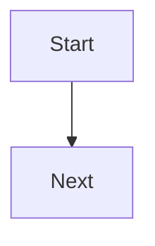
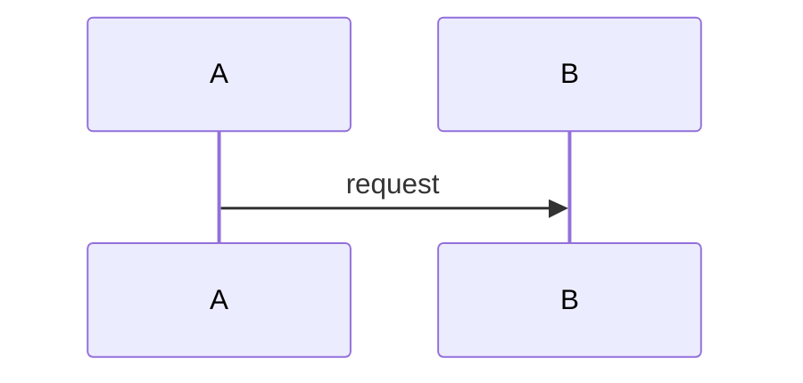

## What Problem Are We Solving?

<!-- The production situation where the naive approach breaks. A problem, not a
     definition. Close with the plain-English callout. ≤240 words, no code. -->

> **🗣️ In plain English:** …

## Meet the Moving Parts

<!-- The actors and who does what, bulleted. Say where people get confused.
     ≤240 words, no code. -->

## How It Works, Step by Step

<!-- Numbered walkthrough in real primitives (stop_reason, tool_result blocks,
     the Task tool, PreToolUse JSON, session_id). One flowchart TD.
     ≤400 words. -->



## Minimal Working Implementation

<!-- One line on what to run and what you'll see, then the smallest thing that
     actually runs. No elisions - this must work as pasted. ≤88 chars/line,
     ≤45 lines. -->

```python
```

## Production Implementation

<!-- The hardening delta: turn/token caps, retries, idempotency, structured
     logging, permission gating, timeouts. Elisions allowed as `# ...`.
     Follow with a bullet list of what changed and why. ≤300 words. -->

```python
```

**What changed, and why:**

-

## In Production: <Named Scenario>

<!-- A specific named system, not "imagine a company". Turn-by-turn with real
     numbers - turns, tokens, latency, concurrency, cost. One sequenceDiagram.
     ≤450 words. -->



> **🌍 Real-world example:** …

## Where This Applies — and Where It Doesn't

| Situation | Use this | Use instead |
|---|---|---|
|  |  |  |

<!-- Then the explicit anti-patterns. ≤300 words, no code. -->

## Failure Modes Seen in the Wild

<!-- 3-4 NAMED failure modes as Symptom → Cause → Fix. At least one as a
     Watch out callout. ≤350 words. -->

### 1.

**Symptom.**
**Cause.**
**Fix.**

> **⚠️ Watch out:** …

## Exam Lens & Key Takeaway

> **📝 Exam focus:** …

> **🔑 Key takeaway:** …
