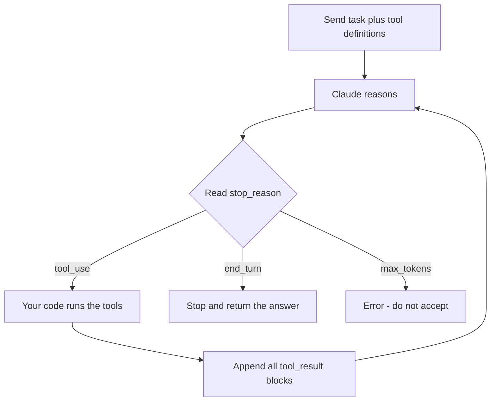

## What Problem Are We Solving?

Your CI pipeline goes red at 02:00. A test in `payment_test.py` fails. Someone has to read the
test, run it, see the actual error, change one line, and re-run to confirm. That's four or five
distinct acts of looking-then-deciding, and nobody knows in advance that it's five rather than two
or twenty — it depends on what the error turns out to be.

A single model call cannot do this. You send a prompt, you get text back, and the model never got
to *look* at anything. It can only guess what's wrong with a test it has never read.

The agentic loop lets the model stop mid-answer, ask your code to go do something in the real
world, receive what actually happened, and carry on reasoning with that new fact in hand. Every
other pattern in this domain — subagents, hooks, decomposition, session forking — is this loop
with something bolted on.

The design rests on one decision your code makes every pass: **call the model again, or finish?**
Take that decision from the wrong signal and the agent stops before the fix is verified, or spins
until you run out of money. The API gives you the right signal explicitly, and the most common
production bug here is not using it.

> **🗣️ In plain English:** A chatbot answers from memory. An agent is allowed to go check first — and the loop is what lets it check more than once.

## Meet the Moving Parts

Three participants, and confusing their jobs is where most beginners go wrong.

- **Claude** does the reasoning. It decides *what* should happen next and with what arguments. It
  never touches a file, a database, or an API.
- **Your application code** is the hands. It executes what Claude asked for — actually runs the
  test suite, actually writes the file — and reports back the real result. It also owns the loop,
  the retry policy, and the stop decision.
- **Tools** are the menu: a name, a description, and a JSON Schema for the input. Claude picks from
  the menu; your code cooks.

Two things follow that matter later:

**Claude never executes anything.** It emits a `tool_use` block — a request. There is always a
layer of your own code between "Claude asked" and "it happened." That gap is exactly where hooks
(1.5) and programmatic enforcement (1.4) live.

**The API is stateless.** Nothing is remembered server-side between calls. The "conversation" is
just the `messages` list you resend, growing by two entries per turn: the assistant's response,
then your tool results. The loop is you rebuilding and resending that list.

> **💡 Tip:** The `tool_use_id` on a result must match the `id` of the `tool_use` block it answers. That pairing is how Claude knows which request a result belongs to when several ran at once.

## How It Works, Step by Step

1. **You send** the task plus `tools` — names, descriptions, input schemas.
2. **Claude reasons** and returns a response whose `stop_reason` tells your code what to do next.
3. **Your code branches on `stop_reason`.** This field is the control variable, not decoration.
4. On `tool_use`: append the assistant's `content` to `messages`, execute every `tool_use` block in
   it, then append **one** user message containing all the `tool_result` blocks. Loop.
5. On `end_turn`: stop. Return the final text.

There are six values you can see, and only one of them means "finished":

| `stop_reason` | Meaning | What your code does |
|---|---|---|
| `tool_use` | Needs a tool before continuing | Run it, return results, loop |
| `end_turn` | Done — this is the answer | Stop the loop |
| `max_tokens` | Output was cut off mid-thought | **Error.** Never accept as final |
| `stop_sequence` | Hit a stop word you configured | Stop, per your own config |
| `pause_turn` | A long server-side tool turn paused | Re-send to resume |
| `refusal` | Safety decline; see `stop_details` | Surface it; optionally fall back |

Parallel calls matter here: one assistant message can contain several `tool_use` blocks. Run them
concurrently, then return **all** results in a single user message. Splitting them across several
messages quietly teaches Claude to stop calling tools in parallel.



## Minimal Working Implementation

Save this as `loop.py`, set `ANTHROPIC_API_KEY`, and run `python loop.py`. It prints one
`stop_reason` per pass — you'll see `tool_use`, then `end_turn`.

```python
import anthropic

client = anthropic.Anthropic()

TOOLS = [{
    "name": "read_file",
    "description": "Read a UTF-8 text file. Call before answering about file contents.",
    "input_schema": {"type": "object", "required": ["path"],
                     "properties": {"path": {"type": "string"}}},
}]


def read_file(path: str) -> str:
    with open(path, encoding="utf-8") as fh:
        return fh.read()[:4000]


messages = [{"role": "user", "content": "How many imports does loop.py have?"}]

while True:
    response = client.messages.create(
        model="claude-opus-5",
        max_tokens=16000,
        tools=TOOLS,
        messages=messages,
    )
    print("stop_reason:", response.stop_reason)
    if response.stop_reason == "end_turn":
        break
    if response.stop_reason != "tool_use":
        raise RuntimeError(f"unexpected stop: {response.stop_reason}")
    messages.append({"role": "assistant", "content": response.content})
    results = []
    for block in response.content:
        if block.type == "tool_use":
            results.append({
                "type": "tool_result",
                "tool_use_id": block.id,
                "content": read_file(block.input["path"]),
            })
    messages.append({"role": "user", "content": results})

print(next(b.text for b in response.content if b.type == "text"))
```

## Production Implementation

The shape above is correct and still unsafe to deploy. It has no ceiling, no error path for a tool
that raises, and no record of what happened.

```python
import json
import logging

MAX_TURNS = 25

log = logging.getLogger("agent")


def run_agent(client, messages, tools, handlers):
    for turn in range(MAX_TURNS):
        response = client.messages.create(
            model="claude-opus-5",
            max_tokens=16000,
            tools=tools,
            messages=messages,
        )
        log.info(json.dumps({
            "turn": turn,
            "stop_reason": response.stop_reason,
            "out_tokens": response.usage.output_tokens,
        }))

        if response.stop_reason == "end_turn":
            return response
        if response.stop_reason == "refusal":
            raise RefusalError(response.stop_details)
        if response.stop_reason == "max_tokens":
            raise TruncatedError("raise max_tokens or ask for a shorter answer")
        if response.stop_reason == "pause_turn":
            messages.append({"role": "assistant", "content": response.content})
            continue

        messages.append({"role": "assistant", "content": response.content})
        messages.append({"role": "user", "content": [
            dispatch(handlers, b) for b in response.content if b.type == "tool_use"
        ]})

    raise TurnLimitError(f"no end_turn within {MAX_TURNS} turns")
```

A tool that raises must still produce a result, or Claude is left with a dangling `tool_use`:

```python
def dispatch(handlers, block):
    result = {"type": "tool_result", "tool_use_id": block.id}
    try:
        result["content"] = str(handlers[block.name](**block.input))
    except Exception as exc:            # surfaced to Claude, not swallowed
        log.warning("tool %s failed: %s", block.name, exc)
        result["content"] = f"Error: {exc}"
        result["is_error"] = True
    return result
```

**What changed, and why:**

- **`MAX_TURNS` as a circuit breaker, not a stop condition.** Hitting it raises. It exists so a
  pathological run can't bill forever — it is never the normal way the loop ends.
- **Every non-`end_turn` reason is handled explicitly.** `max_tokens` and `refusal` are failures
  with distinct recovery paths; `pause_turn` resumes by re-sending.
- **Tool failures return `is_error: True`** instead of throwing. Claude can then re-plan — often
  correcting its own bad argument on the next pass.
- **One structured log line per turn**, keyed on `stop_reason` and token spend. Without it, "the
  agent got stuck" is unfalsifiable.
- **Results are batched into one user message** so parallel tool calls keep working.

## In Production: The Nightly Red-Build Fixer at a Payments Team

A payments team runs an agent as the last stage of CI. When the suite fails on `main`, the agent
gets the failing test name and a checkout, and opens a PR with a candidate fix.

```mermaid
sequenceDiagram
    participant CI as CI runner
    participant Loop as Agent loop
    participant C as Claude
    CI->>Loop: test failed - payment_test.py
    Loop->>C: task plus 4 tools
    C-->>Loop: tool_use - read the test
    Loop->>C: tool_result - file text
    C-->>Loop: tool_use - run the suite
    Loop->>C: tool_result - assertion output
    C-->>Loop: tool_use - edit then re-run
    Loop->>C: tool_result - tests pass
    C-->>Loop: end_turn plus summary
    Loop->>CI: open PR
```

**The numbers that shaped the design.** Median run: 5 turns, ~34K input tokens (history resent
every turn), ~2.8K output, about 40 seconds of which 30 is the test suite. The 95th percentile is
14 turns, because a fix that breaks a second test starts a new investigation. `MAX_TURNS = 25` was
set from that distribution, not guessed — it sits well clear of p95 and still bounds a runaway.

Three decisions came straight from the loop's mechanics:

- **Tool results are truncated to 8K characters.** Full `pytest -v` output on a 900-test suite is
  enormous, and every turn resends the whole history. Uncapped results were the single largest
  cost line before they were trimmed to the failure section.
- **`edit_file` is idempotent and diff-based.** A retried loop must not apply the same patch twice.
- **The agent proposes; it never pushes.** It opens a PR. The loop is bounded by turns, but the
  blast radius is bounded by permissions — a separate concern, covered in 1.4 and 1.5.

> **🌍 Real-world example:** The first version stopped after three tool calls, on the theory that a test fix is a small job. It shipped "fixes" that had never been re-run — the loop was cut off between the edit and the verification. Reading `stop_reason` instead, and letting the loop end on `end_turn`, fixed it without any change to the prompt.

## Where This Applies — and Where It Doesn't

| Situation | Use this | Use instead |
|---|---|---|
| Steps unknown until earlier results come back | The agentic loop | — |
| Model needs real system state to be correct | The agentic loop | — |
| Fixed pipeline: extract → validate → store | — | Your own code calling the model per stage |
| Classification, summarizing, extraction | — | One `messages.create`, no tools |
| Known sequence, just needs writing out | — | A workflow; the loop adds cost, not capability |
| Bulk work, latency irrelevant | — | Batches API at 50% cost |

If you can draw the flowchart in advance, you want a workflow, not an agent. The loop earns its
extra cost and latency only when the next step genuinely depends on what the last one returned.

Anti-patterns worth naming: wrapping a single tool call in a loop that can only run once; giving
the loop 40 tools "just in case" (see 1.3 — it degrades tool selection); and building a loop with
no turn ceiling because "it always finishes."

## Failure Modes Seen in the Wild

### 1. Truncation accepted as an answer

**Symptom.** The agent reports success; the file is half-written.
**Cause.** `max_tokens` was treated as a normal exit alongside `end_turn`.
**Fix.** Branch on it separately and raise. Truncation is a failure, not a short answer.

### 2. The dangling tool_use

**Symptom.** A 400 on the next call, or Claude re-requesting the same tool forever.
**Cause.** The tool threw, the exception propagated, and no `tool_result` was appended — every
`tool_use` block must be answered, including failures.
**Fix.** Always emit a result; use `is_error: True` for failures.

### 3. Parallel calls that silently stop being parallel

**Symptom.** Latency creeps up; the agent that used to fan out now goes one tool at a time.
**Cause.** Results were appended as several user messages instead of one.
**Fix.** One user message containing every `tool_result` for that turn.

### 4. Context blowout from fat tool results

**Symptom.** Cost per run climbs turn over turn; long runs eventually fail.
**Cause.** History is resent in full every turn, so a 200KB tool result is paid for on every
subsequent pass, not once.
**Fix.** Cap and summarize results at the boundary. See 1.6, and Domain 5 on context management.

> **⚠️ Watch out:** Inventing a stop condition is the classic trap. "Stop after 10 iterations," "stop when the text says 'done'," "stop as soon as there's any text" — all three fail, the last because Claude can write an explanation *and* request a tool in the same turn. A turn cap is a circuit breaker; it is not a stop condition.

## Exam Lens & Key Takeaway

> **📝 Exam focus:** Any answer choice that ends the loop by counting iterations, scanning text for "done"/"finished", or checking whether assistant text exists is wrong. The correct condition is always `stop_reason`. Expect at least one item where a hardcoded iteration cap looks prudent — it isn't; the fix wasn't verified yet. Also know who executes: Claude *requests*, your application *runs*. The exam guide teaches four `stop_reason` values (`tool_use`, `end_turn`, `stop_sequence`, `max_tokens`); the current API also returns `pause_turn` and `refusal`, so production code handles six even though the exam tests four.

> **🔑 Key takeaway:** End the loop when, and only when, `stop_reason == "end_turn"`. `max_tokens` and `refusal` are errors with their own recovery, `pause_turn` means resume, and a turn cap is a circuit breaker you never expect to hit.
