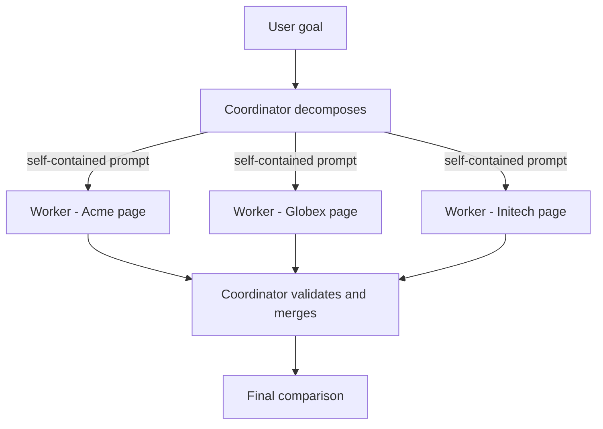
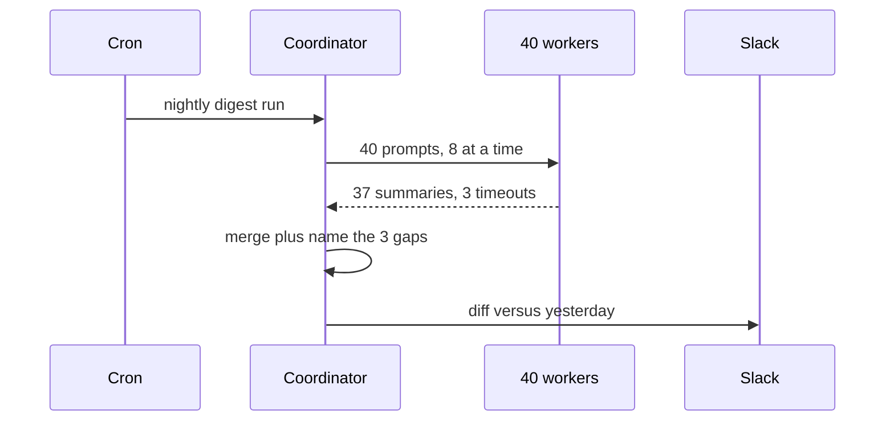

## What Problem Are We Solving?

A sales team asks: "compare how Acme, Globex and Initech price their product." One agentic loop can
do this. It fetches page one, reads it, fetches page two, reads it, fetches page three, reads it,
then writes the comparison — with all three pages sitting in a single context window, each one
resent on every subsequent turn.

Three problems show up immediately. It's serial, so latency is the sum of the parts rather than the
slowest part. It's expensive, because page one is paid for again on every turn after it was read.
And quality degrades: by the time the model writes the comparison, the useful facts are buried in
tens of thousands of tokens of raw HTML it no longer needs.

Splitting the work fixes all three at once. Three cheap workers each read one page and return a
tight summary. A coordinator reads three summaries — a few hundred tokens instead of tens of
thousands — and writes the comparison. Latency becomes the slowest page, not the sum.

The cost of that split is a new failure surface, and it has one dominant shape: **a subagent knows
only what you put in its prompt.** Nothing is inherited. Most multi-agent bugs in production are
not model failures; they are briefing failures.

> **🗣️ In plain English:** One Claude reading everything doesn't scale. Several Claudes each reading a slice does — but every slice has to be handed over in writing.

## Meet the Moving Parts

- **The coordinator** owns the goal. It decides what the pieces are, who gets which piece, what
  each worker is told, whether a result is usable, and how the results merge. It is the only
  participant that ever sees the whole picture.
- **Subagents (workers)** each get one narrow task and a fresh, empty context. They return a
  result and are gone. A worker cannot ask a follow-up question, cannot see its siblings, and
  cannot see the user's original request unless the coordinator wrote it down.
- **The task prompt** is the entire communication channel from coordinator to worker. There is no
  second channel.

The coordinator does real orchestration: scoping the pieces, choosing which workers this request
actually needs, handling a worker that errors or returns something unusable, and merging results
that may conflict or come back in inconsistent formats.

Three canonical shapes:

| Pattern | Structure | Use when |
|---|---|---|
| **Hub-and-spoke** | One coordinator, independent specialists | Genuinely different kinds of work — research, analysis, writing |
| **Pipeline** | Each agent's output is the next one's input | Fixed sequence where each stage builds on the last |
| **Peer-to-peer** | Agents talk directly, no central coordinator | Collaborative refinement between equals, e.g. writer and critic |

Hub-and-spoke dominates production because responsibility stays in one place. When something is
missing from the final answer, there is exactly one component to interrogate.

> **⚠️ Watch out:** A subagent that appears to "just know" something the coordinator never told it is impossible. When a worker's output is missing a constraint, the bug is in the briefing, not the worker.

## How It Works, Step by Step

1. **The coordinator decomposes** the goal into pieces that are independent enough to run at the
   same time. Overlapping pieces waste tokens; missing pieces silently vanish from the answer.
2. **It writes one self-contained prompt per worker** — the task, the input, the output shape, and
   every constraint the worker needs. Assume the worker has amnesia, because it does.
3. **Workers run concurrently**, each as its own `messages.create` call with its own context. A
   worker may itself run a small agentic loop if it needs tools.
4. **Each result comes back as text** the coordinator must validate. A worker that failed or
   drifted off-task is the coordinator's problem to retry, reassign, or drop.
5. **The coordinator merges.** This is where conflicts get resolved and inconsistent formats get
   normalised — real reasoning work, not concatenation.



Note what does *not* appear on that diagram: any arrow between workers, and any arrow from the user
straight to a worker.

## Minimal Working Implementation

Save as `crew.py` and run `python crew.py`. Three workers summarise in parallel on Haiku; the
coordinator merges on Opus. The page text is inlined so it runs with no network access.

```python
import asyncio
import anthropic

client = anthropic.AsyncAnthropic()

PAGES = {
    "Acme": "Starter $19/mo. Team $49/user/mo. Enterprise: contact sales.",
    "Globex": "Free tier. Pro EUR 25/mo. Business EUR 80/mo, 5 seats min.",
    "Initech": "Basic $15/mo billed yearly. Plus $60/mo. No free tier.",
}

WORKER = (
    "Summarise one vendor's pricing page. List every tier with its price "
    "AND its currency. You have only this vendor - do not compare.\n\n"
    "Vendor: {vendor}\nPage:\n{text}"
)


def text_of(response) -> str:
    return next(b.text for b in response.content if b.type == "text")


async def worker(vendor: str, text: str) -> str:
    response = await client.messages.create(
        model="claude-haiku-4-5",
        max_tokens=1000,
        messages=[{"role": "user",
                   "content": WORKER.format(vendor=vendor, text=text)}],
    )
    return f"### {vendor}\n{text_of(response)}"


async def main() -> None:
    summaries = await asyncio.gather(*(worker(v, t) for v, t in PAGES.items()))
    merged = await client.messages.create(
        model="claude-opus-5",
        max_tokens=16000,
        messages=[{"role": "user", "content":
                   "Compare these summaries in one table. Flag differing "
                   "currencies.\n\n" + "\n\n".join(summaries)}],
    )
    print(text_of(merged))


asyncio.run(main())
```

`text_of` matters: on Opus 5 adaptive thinking is on by default, so `content[0]` may be a thinking
block. Reaching for `content[0].text` is a crash waiting for a slow day.

## Production Implementation

The version above assumes every worker succeeds, returns something usable, and finishes promptly.
None of those is true at scale.

```python
import asyncio

WORKER_TIMEOUT = 60
MAX_CONCURRENCY = 8


async def guarded_worker(sem, vendor, text):
    async with sem:
        try:
            return await asyncio.wait_for(
                worker(vendor, text), timeout=WORKER_TIMEOUT
            )
        except asyncio.TimeoutError:
            return None
        except anthropic.APIStatusError as exc:
            log.warning("worker %s failed: %s", vendor, exc.status_code)
            return None


async def fan_out(pages: dict[str, str]) -> tuple[list[str], list[str]]:
    sem = asyncio.Semaphore(MAX_CONCURRENCY)
    results = await asyncio.gather(
        *(guarded_worker(sem, v, t) for v, t in pages.items())
    )
    ok = [r for r in results if r]
    missing = [v for v, r in zip(pages, results) if not r]
    return ok, missing
```

The coordinator then has to *say* what is missing rather than quietly produce a shorter table:

```python
async def compare(pages):
    summaries, missing = await fan_out(pages)
    if not summaries:
        raise RuntimeError("every worker failed - nothing to merge")
    caveat = ""
    if missing:
        caveat = ("\n\nThese vendors could not be retrieved; say so "
                  "explicitly in your answer: " + ", ".join(missing))
    merged = await client.messages.create(
        model="claude-opus-5",
        max_tokens=16000,
        messages=[{"role": "user", "content":
                   MERGE_PROMPT + "\n\n".join(summaries) + caveat}],
    )
    return text_of(merged)
```

**What changed, and why:**

- **A per-worker timeout.** One hung worker must not hold the whole fan-out. `asyncio.gather`
  waits for the slowest member, so an unbounded worker is an unbounded request.
- **A concurrency semaphore.** Fanning out 200 workers at once earns 429s, and rate-limit errors
  look exactly like model failures in the logs.
- **Partial failure is a first-class outcome.** Workers return `None` rather than raising, and the
  set of missing pieces is passed *into* the merge prompt. Silently merging 2 of 3 summaries into
  a confident table is the worst available behaviour.
- **Model split by role.** Workers are read-and-compress jobs — Haiku 4.5 handles them at a
  fraction of the cost. The merge is the reasoning step, so it gets Opus.

## In Production: A Competitive Pricing Digest at a B2B SaaS Vendor

A product-marketing team runs this nightly across 40 competitor pricing pages and posts a diff to
Slack when anything moves.



**The numbers.** Each page is 8K–60K tokens of HTML. A worker reads one page and returns roughly
150 tokens. So the coordinator merges ~6K tokens instead of the ~900K it would have to hold if one
loop read all 40 — which does not fit any context window worth paying for. Wall-clock is about 90
seconds at a concurrency of 8, against an estimated 20+ minutes serially. Worker cost dominates
volume; coordinator cost dominates nothing, because it only ever sees summaries.

Two design decisions came from operating it:

- **Currency is in the worker prompt, not the merge prompt.** The first version asked the
  coordinator to normalise currencies, but the workers had already dropped the symbol — the
  information was gone before the merge could ask for it. Anything a worker must *notice* has to
  be in that worker's own prompt.
- **Each worker gets the output schema, not just the task.** "List tiers with price and currency"
  produces mergeable text. "Summarise this page" produces 40 differently-shaped answers and a
  merge step that spends its budget reformatting.

> **🌍 Real-world example:** For two weeks the digest silently under-reported. Three pages timed out most nights, the coordinator merged the 37 it had, and the table looked complete because nothing said otherwise. The fix was not retries — it was passing the missing-vendor list into the merge prompt so the answer names its own gaps.

## Where This Applies — and Where It Doesn't

| Situation | Use this | Use instead |
|---|---|---|
| Many similar items, each needing deep reading | Hub-and-spoke fan-out | — |
| Pieces are independent and parallelisable | Hub-and-spoke fan-out | — |
| Distinct expertise per stage, fixed order | Pipeline | — |
| Draft-then-critique refinement | Peer-to-peer | — |
| Each step depends on the previous result | — | One agentic loop (1.1) |
| Work fits comfortably in one context window | — | One loop; coordination adds cost, not capability |
| Pieces need to negotiate with each other | — | Rethink the decomposition (1.6) |

The anti-patterns are consistent. Splitting work that has to stay together forces the coordinator
to reassemble reasoning it shouldn't have broken. Spawning a worker per trivial step pays a fresh
context and a fresh round trip for something a tool call would have done. And expecting workers to
coordinate among themselves in hub-and-spoke is expecting a channel that doesn't exist.

## Failure Modes Seen in the Wild

### 1. The unbriefed worker

**Symptom.** Output is competent but omits a constraint everyone assumed was obvious.
**Cause.** The constraint lived in the coordinator's context and never made it into the prompt.
**Fix.** Write worker prompts against the amnesia test: would this still be right if the worker had
never seen anything else?

### 2. Silent partial merge

**Symptom.** A confident, complete-looking answer built from a subset of the work.
**Cause.** Failed workers were filtered out before the merge, so the coordinator never knew.
**Fix.** Pass the missing set into the merge prompt and require the answer to name its gaps.

### 3. Unmergeable results

**Symptom.** The merge step burns most of its tokens reformatting rather than comparing.
**Cause.** Workers were given a task but no output shape.
**Fix.** Specify the schema in every worker prompt.

### 4. Fan-out that DDoSes your own quota

**Symptom.** Intermittent 429s that look like random model failures.
**Cause.** Unbounded `asyncio.gather` over hundreds of workers.
**Fix.** A semaphore, and retry on `RateLimitError` specifically — not on everything.

> **⚠️ Watch out:** When a multi-agent result is *missing* something, look at the decomposition and the briefing before you look at the workers. A worker that was never told about a topic did its job correctly; the piece was lost upstream.

## Exam Lens & Key Takeaway

> **📝 Exam focus:** The heavily tested fact is subagent isolation: a subagent begins with an empty context and receives only what the coordinator writes into its task prompt. Any option describing a subagent that inherits the conversation, sees a sibling's findings, or "remembers" prior state is wrong. When a scenario says a multi-agent result is incomplete, the intended diagnosis is a coordinator-side failure — bad decomposition or an incomplete prompt — not a subagent malfunction. Know the three patterns by name and be ready to pick hub-and-spoke as the default for centralized control.

> **🔑 Key takeaway:** The coordinator owns decomposition, briefing, failure handling and merging; workers own one narrow task with no memory of anything else. Every fact a worker needs must be in its prompt, and every piece a worker failed to deliver must reach the merge step as an explicit gap.
