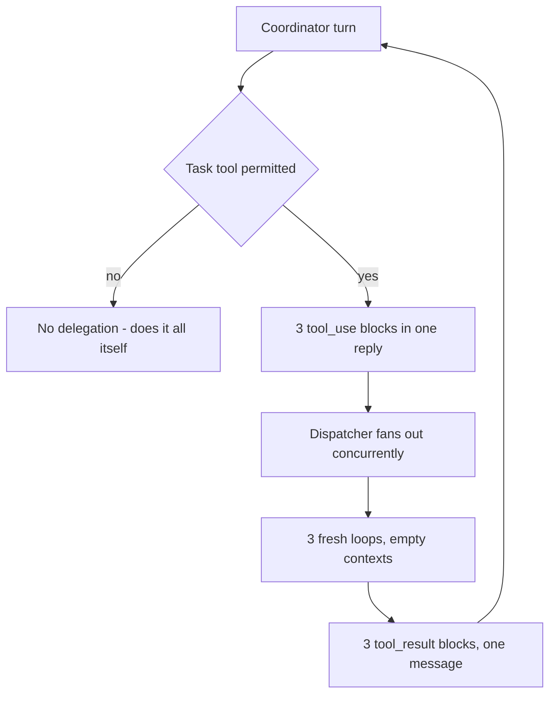
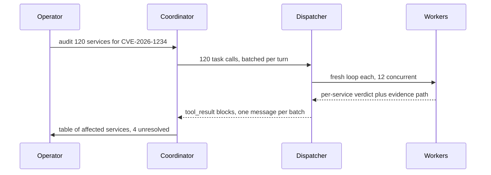

## What Problem Are We Solving?

The previous topic gave you the roles: a coordinator, some workers, and a briefing that has to be
written down. This one is about the wiring. How does a coordinator *actually* create a worker at
runtime, and how does the result get back?

The answer is deliberately unexciting: **spawning a subagent is a tool call.** There is no special
delegation channel and no separate API. The coordinator emits a `tool_use` block for a task tool,
your orchestration code sees that request, starts a fresh agent loop with an empty context, runs it
to completion, and hands the final text back as that call's `tool_result`.

Two consequences fall out of that, and both are where real systems break.

**Delegation is gated like any other tool.** If the task tool isn't in the coordinator's tool list,
the coordinator cannot delegate. It won't error — it will quietly do all the work itself, in one
context, and look like a design that simply didn't need subagents. A system that was *supposed* to
fan out but never does is very often just missing that one entry.

**Parallelism comes from one turn, not many.** Several `tool_use` blocks in a *single* coordinator
response run concurrently. One block per turn, waiting for each result, is serial — even when the
tasks were completely independent. Same tool, same prompts, three times the wall clock.

> **🗣️ In plain English:** Delegating is just calling a tool whose implementation happens to be "run another Claude." If the tool isn't on the menu, there is no delegating.

## Meet the Moving Parts

- **The task tool definition.** A name, a description, and a schema whose main field is the
  worker's brief. In Claude Code this is the built-in `Task` tool; over the Messages API you define
  the equivalent yourself. Either way it is an ordinary tool from Claude's point of view.
- **The tool list / permission gate.** The coordinator can only call what it was given. In Claude
  Code that means `Task` must be permitted; over the API it means the tool must appear in `tools`.
- **Your dispatcher.** The code that receives the `tool_use` block, starts a fresh loop, enforces
  timeouts and depth limits, and truncates what comes back. This is yours, not the model's.
- **The brief.** The worker's entire world. Everything from 1.2 applies: no inheritance, no
  sibling visibility, no follow-up questions.

A brief needs three things, and the third is the one people get wrong:

- **Prior findings, pasted in full.** If worker B builds on worker A's result, the coordinator
  copies A's actual findings into B's brief. B cannot ask A.
- **Sources.** URLs, file paths, page numbers. Provenance that isn't carried forward becomes an
  unsourced claim by the time it reaches the final answer.
- **Goals and quality bars, not a script.** Say what a good result looks like and why. A rigid
  step-by-step brief removes the worker's ability to adapt when it finds something unexpected —
  which is the entire reason you spawned an agent instead of writing a function.

> **💡 Tip:** The amnesia test: if this worker had never seen any part of this conversation, would this brief alone be enough? If not, the gap is in the brief, not in the worker.

## How It Works, Step by Step

1. **The coordinator's tool list includes the task tool.** Without this, nothing below happens.
2. **The coordinator emits one or more `tool_use` blocks** for it in a single response — one per
   independent piece of work.
3. **Your dispatcher fans them out concurrently**, each as a brand-new loop with its own empty
   context and its own tool set (usually narrower than the coordinator's).
4. **Each worker loop runs to `end_turn`.** A worker is an agent in its own right; it may make many
   tool calls of its own before returning.
5. **Every worker's final text becomes a `tool_result`**, matched by `tool_use_id`, and all of them
   go back in **one** user message so the coordinator keeps fanning out on later turns.



## Minimal Working Implementation

Save as `spawn.py` and run it. Watch the printed count: the coordinator emits several task calls in
one reply, and they run together.

```python
import asyncio
import anthropic

client = anthropic.AsyncAnthropic()

TASK_TOOL = [{
    "name": "spawn_worker",
    "description": ("Delegate one self-contained task to a fresh worker with "
                    "no memory of this conversation. Emit one call per "
                    "independent task, all in the same reply."),
    "input_schema": {"type": "object", "required": ["brief"],
                     "properties": {"brief": {"type": "string"}}},
}]

def text_of(r):
    return next(b.text for b in r.content if b.type == "text")

async def run_worker(brief: str) -> str:
    r = await client.messages.create(
        model="claude-haiku-4-5", max_tokens=1000,
        messages=[{"role": "user", "content": brief}],
    )
    return text_of(r)

async def main() -> None:
    messages = [{"role": "user", "content":
                 "Compare rail, sea and air freight on CO2 per ton-mile. "
                 "Delegate one worker per mode, then compare the results."}]
    while True:
        r = await client.messages.create(
            model="claude-opus-5", max_tokens=16000,
            tools=TASK_TOOL, messages=messages,
        )
        if r.stop_reason != "tool_use":
            break
        calls = [b for b in r.content if b.type == "tool_use"]
        print(f"spawning {len(calls)} worker(s) in one turn")
        outs = await asyncio.gather(*(run_worker(c.input["brief"]) for c in calls))
        messages.append({"role": "assistant", "content": r.content})
        messages.append({"role": "user", "content": [
            {"type": "tool_result", "tool_use_id": c.id, "content": o}
            for c, o in zip(calls, outs)]})
    print(text_of(r))

asyncio.run(main())
```

## Production Implementation

Three things are missing above, and each has bitten someone: a worker can spawn workers, a worker
can run forever, and a worker can return more text than the coordinator can afford to hold.

```python
MAX_DEPTH = 1          # workers may not spawn workers
WORKER_TIMEOUT = 120
RESULT_CHARS = 6000


async def dispatch(call, depth: int) -> dict:
    result = {"type": "tool_result", "tool_use_id": call.id}
    if depth >= MAX_DEPTH:
        result["content"] = "Error: delegation depth exceeded; do this inline."
        result["is_error"] = True
        return result
    try:
        out = await asyncio.wait_for(
            run_worker(call.input["brief"], depth + 1),
            timeout=WORKER_TIMEOUT,
        )
    except asyncio.TimeoutError:
        result["content"] = f"Error: worker exceeded {WORKER_TIMEOUT}s."
        result["is_error"] = True
        return result
    if len(out) > RESULT_CHARS:
        out = out[:RESULT_CHARS] + "\n[truncated - ask for a narrower slice]"
    result["content"] = out
    return result
```

The permission gate is configuration, not code. In Claude Code it is the difference between an
agent that delegates and one that silently doesn't:

```json
{
  "permissions": {
    "allow": ["Task", "Read(**)", "Grep", "Glob"],
    "deny": ["Bash(rm *)"]
  }
}
```

**What changed, and why:**

- **A depth limit.** Without it, a worker holding the same task tool can spawn its own workers, and
  a three-way fan-out becomes exponential. `MAX_DEPTH = 1` is the common production setting; the
  refusal is returned *to the model* as an error result so it adapts rather than stalls.
- **A per-worker timeout.** `asyncio.gather` waits for the slowest member, so one stuck worker
  stalls the whole turn.
- **A result cap.** The coordinator resends every worker result on every later turn. An uncapped
  worker output is a recurring bill, not a one-off.
- **A narrower tool set for workers.** Workers get what their job needs and nothing else — usually
  read-only, and usually without the task tool itself.

## In Production: A Repo-Wide Dependency Audit at a Fintech

A platform team audits ~120 services for a vulnerable transitive dependency before a compliance
deadline. One loop reading 120 lockfiles is not an option — the lockfiles alone are millions of
tokens.



**The numbers.** Each worker reads one lockfile (30K–400K tokens), greps the dependency tree, and
returns about 120 tokens: affected yes/no, the version found, and the file and line it came from.
At a concurrency of 12 the run takes roughly 9 minutes; the coordinator itself only ever handles
~15K tokens of verdicts. Workers run on Haiku 4.5 because the job is search-and-report, not
judgement, and that choice is most of the cost difference.

Two things the team learned the hard way:

- **The brief demands the evidence path.** The first version asked "is this service affected?" and
  got a clean yes/no table that nobody could act on, because no one could tell where each verdict
  came from. Adding "quote the file and line you concluded from" to the brief made the output
  auditable — provenance has to be requested in the brief, because the coordinator never sees the
  worker's own conversation.
- **Batching, because 120 in one turn is not better than 12.** The coordinator emits calls in
  batches sized to the concurrency limit. One turn of 120 calls just queues 108 of them while
  holding the whole turn open.

> **🌍 Real-world example:** The audit's first run produced no delegation at all — every service read serially in one context until the run died on context length. The coordinator prompt was fine. `Task` was missing from its permitted tools, so the delegation instruction had nothing to call, and the model did the only thing left to it.

## Where This Applies — and Where It Doesn't

| Situation | Use this | Use instead |
|---|---|---|
| N independent items, each needing real reading | Task calls, batched and fanned out | — |
| A slice would flood the coordinator's context | Delegate; return a summary | — |
| A sub-job needs its own multi-turn tool loop | Delegate — a worker is a full agent | — |
| One deterministic lookup or transform | — | An ordinary tool call |
| The sub-job needs the whole conversation | — | Keep it inline; briefing it costs more than doing it |
| Step B needs step A's result | — | Sequential calls, or one loop (1.1) |

Anti-patterns: spawning a worker for something a function call would do (you pay a fresh context
and a round trip for nothing); giving workers the task tool with no depth limit; and treating
delegation as free — every worker is a full agent loop with its own token bill.

## Failure Modes Seen in the Wild

### 1. The ungranted task tool

**Symptom.** A "multi-agent" system that never spawns anything and eventually dies on context.
**Cause.** The task tool isn't in the coordinator's permitted tools.
**Fix.** Check the tool list before you touch the prompt. This is a configuration bug that reads
like a prompting bug.

### 2. Accidental serialisation

**Symptom.** Correct results, latency equal to the sum of the parts.
**Cause.** One task call per turn instead of several in one reply.
**Fix.** Ask for the fan-out explicitly in the tool description and the coordinator prompt, and log
how many calls arrive per turn so you can see it happening.

### 3. Runaway delegation depth

**Symptom.** Token spend explodes; hundreds of loops for a handful of tasks.
**Cause.** Workers inherited the task tool and delegated further.
**Fix.** A depth counter, enforced in the dispatcher, and workers without the task tool.

### 4. Unsourced findings

**Symptom.** A confident final answer nobody can verify.
**Cause.** The brief asked for a conclusion but not its evidence, and the coordinator never sees
the worker's own conversation.
**Fix.** Require the source in the brief's output shape.

> **⚠️ Watch out:** Every worker result is resent on every subsequent coordinator turn. Truncating worker output isn't cosmetic — it's the difference between paying for a result once and paying for it for the rest of the run.

## Exam Lens & Key Takeaway

> **📝 Exam focus:** Two mechanics are tested repeatedly. First, `Task` must be in the coordinator's `allowedTools` — a scenario where a system "should" use subagents but doesn't is a permissions gap, not a prompt problem. Second, parallelism comes from multiple Task calls in a *single* response; one call per turn is sequential no matter how independent the tasks were. On brief-writing, the right answer gives the subagent prior findings, sources, and goals with quality criteria — and deliberately does *not* prescribe exact steps, because over-scripting removes the subagent's ability to adapt.

> **🔑 Key takeaway:** Spawning a subagent is an ordinary tool call, so it needs the tool granted and it obeys ordinary tool rules — several calls in one reply run concurrently, and each result comes back as a `tool_result` matched by `tool_use_id`. Your dispatcher, not the model, owns depth limits, timeouts and result caps.
