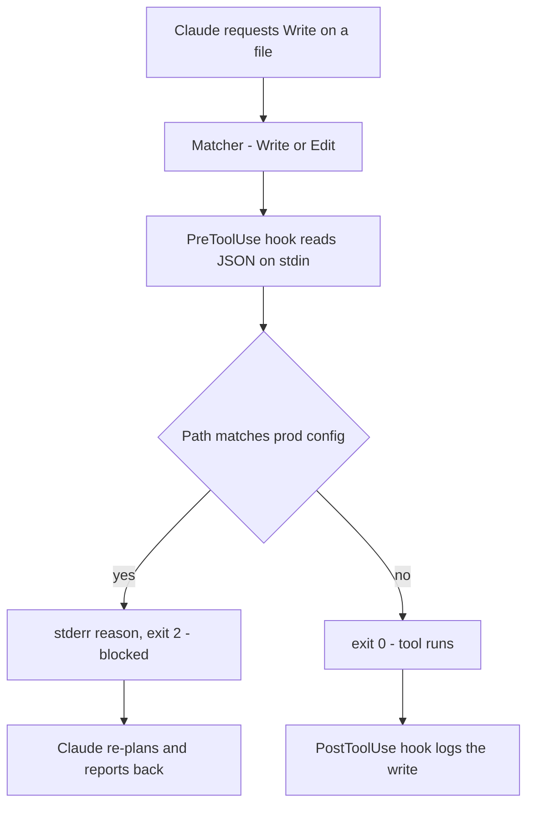
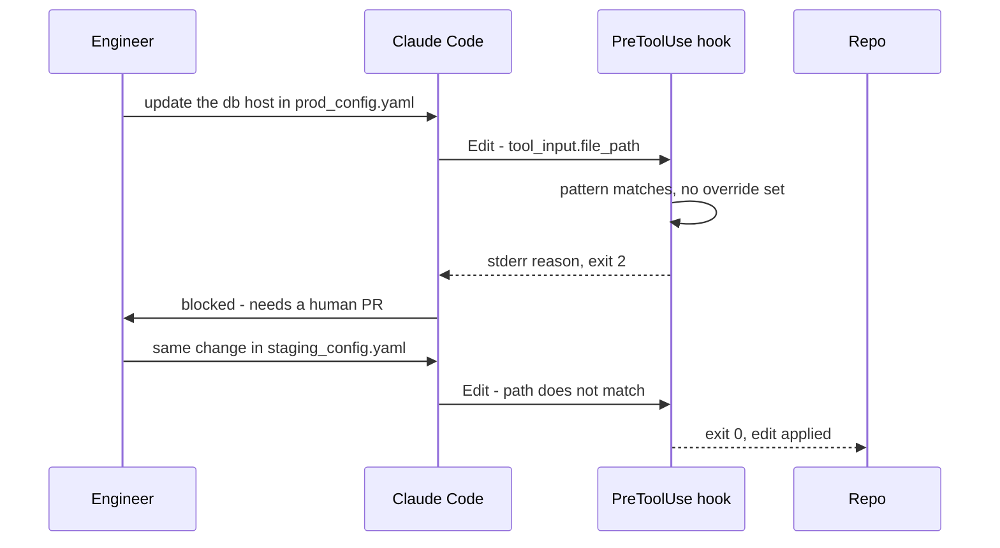

## What Problem Are We Solving?

The previous topic established that some rules have to live in code. This one is about where that
code goes when the rule spans *many* tools, or has to be provable to someone who doesn't read your
tool implementations.

Put a cap check inside `issue_refund` and it protects refunds. Now add `issue_credit`,
`adjust_invoice`, and `void_charge`. The rule is "no unapproved movement of money over $500" — one
policy, four implementations, four chances to forget. Six months later, someone adds a fifth tool.

A hook moves the check *out* of the tools and *in front of* them. It's code your system runs on
every matching tool call, automatically, before the call proceeds — driven by the event, not by
Claude's cooperation and not by whether a particular tool author remembered.

That last point is what makes hooks provable. When a compliance reviewer asks "what stops the agent
from writing to production config?", the answer is one file, at one path, that fires on every
matching call and logs each decision. Not "every tool that touches config validates its input, and
here are the eleven of them."

> **🗣️ In plain English:** A hook is a doorway with a guard. Claude doesn't decide whether to walk past the guard, and the guard doesn't have to be installed in every room.

## Meet the Moving Parts

- **The event.** A tool is about to run, or has just run. Hooks are wired to events, not to
  prompts, so the model has no say in whether one fires.
- **The matcher.** Which tools this hook applies to — in Claude Code, a pattern like `Write|Edit`
  in `.claude/settings.json`. This is why one hook can cover a whole family of tools.
- **The hook itself.** A command that receives the tool call as JSON on stdin. It inspects the
  arguments and signals its verdict through its **exit code**: `0` allows, `2` blocks. Anything it
  writes to stderr goes back to Claude as the reason.
- **The audit log.** Optional in theory, mandatory in practice — see the failure modes.

Two types, and the difference is entirely about timing relative to the action:

| Type | Fires | Can it stop the action? | For |
|---|---|---|---|
| `PreToolUse` | Before the tool runs | **Yes** | Blocking, permission checks, required ordering |
| `PostToolUse` | After the tool ran | **No** | Reformatting results, logging, audit trails |

That table contains the single most tested fact in this topic. If a rule needs to *prevent*
something, it must be `PreToolUse`. A `PostToolUse` hook checking the same condition is not a
weaker version of the same control — it is a report about money that has already left.

`PostToolUse` earns its place elsewhere: guaranteed logging (Claude can't forget), and normalising
raw tool output — turning a Unix timestamp into a date, or trimming a huge response — before it
enters the conversation and starts being resent every turn.

> **⚠️ Watch out:** A `PreToolUse` hook can enforce *ordering*, which no prompt can guarantee: refuse `issue_refund` unless identity was already verified for that order. The hook sees the attempt and says "not yet."

## How It Works, Step by Step

1. **Claude emits a `tool_use` block.** Ordinary agentic loop, as in 1.1.
2. **The runtime matches the tool name** against each configured hook's matcher.
3. **Every matching `PreToolUse` hook runs**, receiving the tool call envelope as JSON on stdin.
4. **The hook decides via exit code.** `0` proceeds. `2` blocks the call; whatever the hook wrote
   to stderr is handed to Claude as the explanation.
5. **On a block, the tool never runs.** Claude sees the reason and re-plans — usually escalating or
   asking the user, which is what the policy wanted.
6. **On success, `PostToolUse` hooks run** on the result: logging, reshaping, redacting.

The envelope is the important detail. The hook doesn't guess what Claude meant; it reads the actual
arguments:

```bash
INPUT=$(cat)                    # the whole tool call, as JSON, on stdin
TARGET=$(echo "$INPUT" | jq -r '.tool_input.file_path // empty')
```



## Minimal Working Implementation

Two files. Make the script executable, start Claude Code in that directory, and ask it to edit a
`prod_*.yaml` file — the edit is refused before it happens.

```bash
# .claude/hooks/block-prod-writes.sh   (chmod +x this)
#!/usr/bin/env bash
set -u
INPUT=$(cat)                            # tool call envelope, JSON on stdin
TARGET=$(echo "$INPUT" | jq -r '.tool_input.file_path // empty')

if echo "$TARGET" | grep -qE '(^|/)prod_[^/]*\.(yml|yaml)$'; then
  cat >&2 <<EOF
BLOCKED by block-prod-writes.sh
  File:   $TARGET
  Reason: production config changes need a human PR, not an agent edit.
EOF
  exit 2                                # 2 = block the call
fi
exit 0                                  # 0 = allow it through
```

The matcher lives in settings, which is what makes one script cover a family of tools:

```json
{
  "hooks": {
    "PreToolUse": [
      {
        "matcher": "Write|Edit",
        "hooks": [
          { "type": "command", "command": ".claude/hooks/block-prod-writes.sh" }
        ]
      }
    ]
  }
}
```

## Production Implementation

The script above blocks correctly and tells you nothing. Three additions turn it into something
you can operate and defend in a review.

```bash
#!/usr/bin/env bash
set -u
LOG="$(dirname "$0")/../hook-debug.log"
INPUT=$(cat)

# 1. Log every check, allow or block. A hook you can't see is a hook you
#    can't prove ran - and silent failure is the main hook failure mode.
echo "[$(date -u +%FT%TZ)] check input=$INPUT" >> "$LOG" 2>/dev/null

# 2. Degrade, don't vanish: if jq is missing, fall back rather than
#    exiting 0 and silently allowing everything.
if command -v jq >/dev/null 2>&1; then
  TARGET=$(echo "$INPUT" | jq -r '.tool_input.file_path // empty')
else
  TARGET=$(echo "$INPUT" | grep -oE '"file_path"[^,]+' | cut -d'"' -f4)
fi

if echo "$TARGET" | grep -qE '(^|/)prod_[^/]*\.(yml|yaml)$'; then
  # 3. An audited escape hatch beats an unofficial one. Without a way
  #    through, someone eventually deletes the hook.
  if [ "${PROD_OVERRIDE:-0}" = "1" ]; then
    echo "[$(date -u +%FT%TZ)] OVERRIDE allowed $TARGET" >> "$LOG"
    exit 0
  fi
  cat >&2 <<EOF
BLOCKED: $TARGET matches prod_*.yaml.
Reason:  production config requires human PR review.
Override: rerun with  PROD_OVERRIDE=1 claude
EOF
  exit 2
fi
exit 0
```

**What changed, and why:**

- **Every invocation is logged, not just the blocks.** Otherwise "the hook didn't fire" and "the
  hook fired and allowed it" look identical, and you'll spend an afternoon on which.
- **A fallback when `jq` is absent.** A hook that crashes on a missing dependency is a hook that
  isn't enforcing anything, and it fails in exactly the environment you didn't test.
- **The block message says what and why and how to proceed.** It goes to Claude, so it's a prompt
  as much as a log line: name the rule and the legitimate path forward.
- **An audited override.** Rules with no escape hatch get deleted by the first person the rule
  inconveniences at 2am. `PROD_OVERRIDE=1` is deliberate, visible, and logged.
- **`set -u`, and no `set -e`.** An unset variable is a bug worth failing on; a non-zero grep is
  not — under `set -e` an ordinary "no match" would exit the script mid-check.

## In Production: Protecting Production Config in a Platform Team's Repo

A platform team lets engineers run Claude Code against the infrastructure repo. Everything is
fair game except the production config files, which are change-controlled.



**What operating it taught them.** The hook fires on every `Write` and `Edit` in the repo —
thousands a week — and adds a few milliseconds. Roughly a dozen blocks a month, nearly all
legitimate: an agent asked to "update the database host" reasonably reaches for the production file
first. `PROD_OVERRIDE` is used two or three times a quarter, always deliberately, always logged.

Three things they'd tell you:

- **The log is the feature.** The first week produced one "the hook is broken" report. It wasn't —
  the file was `production.yaml`, which the pattern didn't cover. Only the log made that a
  five-minute answer instead of a debugging session.
- **The pattern is the whole security boundary.** `prod_*.yaml` doesn't match `prod/config.yaml`,
  and nobody notices until the day it matters. Test the matcher against the paths you actually
  have, not the one in the example.
- **Blocking is a prompt, not just a veto.** The original message read "operation not permitted",
  and Claude apologised to the engineer and stopped. Naming the override path turned the block into
  a useful next step.

> **🌍 Real-world example:** The reason this is a hook and not a check inside an `edit_file` tool is that Claude Code's `Write`, `Edit` and `MultiEdit` are built-in tools nobody on the team can modify. There is no tool implementation to put the rule in. A `PreToolUse` matcher is the only place the guarantee can exist.

## Where This Applies — and Where It Doesn't

| Situation | Use this | Use instead |
|---|---|---|
| Must block an action before it happens | `PreToolUse` | — |
| One rule across many tools | `PreToolUse` with a matcher | — |
| Required ordering — verify, then act | `PreToolUse` | — |
| The tool is built-in and unmodifiable | `PreToolUse` — the only option | — |
| Guaranteed audit logging | `PostToolUse` | — |
| Reshaping or trimming tool output | `PostToolUse` | — |
| Style, tone, formatting preferences | — | Prompt instruction (1.4) |
| Business logic for one bespoke tool | — | Validation inside that tool |

Anti-patterns worth naming: using `PostToolUse` for anything that needs to say no; hooks that shell
out to a network service on every call (you've put a latency and availability dependency in the
path of every tool use); and matchers so broad the hook fires on reads it has no opinion about.

## Failure Modes Seen in the Wild

### 1. The silently disabled hook

**Symptom.** The rule stops being enforced and nothing announces it.
**Cause.** A missing dependency, a non-executable file, or a bad path — the hook errors, and the
call proceeds.
**Fix.** Log every invocation, and alert on the *absence* of hook activity. This is the failure
mode that makes logging non-negotiable.

### 2. PostToolUse used as a gate

**Symptom.** Violations are detected and recorded, after the fact.
**Cause.** The rule was wired to the wrong event.
**Fix.** Anything that must prevent has to be `PreToolUse`.

### 3. The pattern that didn't quite match

**Symptom.** A protected file gets edited; the hook was working fine.
**Cause.** The matcher or the path regex didn't cover the real filename —
`production.yaml` versus `prod_*.yaml`.
**Fix.** Test the pattern against the actual paths in the repo, including the near misses.

### 4. The hook nobody can get past

**Symptom.** The hook has been commented out in someone's local settings.
**Cause.** A legitimate need with no sanctioned path through it.
**Fix.** An explicit, audited override. A rule people can follow survives; a rule they must
circumvent doesn't.

> **⚠️ Watch out:** Hooks are infrastructure, so they need the same treatment: version control, review, and a test that proves a blocked call is still blocked. An untested hook is an assumption.

## Exam Lens & Key Takeaway

> **📝 Exam focus:** The decisive question is always timing. "Must never happen", "block", "prevent", "require X before Y" → `PreToolUse`. "Log", "audit", "normalise the output", "record every action" → `PostToolUse`. A `PostToolUse` hook offered as a way to stop something is a distractor, and so is any "clearer prompt" option (see 1.4). Trigger phrases — "no exceptions", "must always", "compliance requirement", "financial rule", "guaranteed to happen" — all point at a hook. Also remember hooks fire on the event, not on Claude's cooperation: that's the whole basis of the guarantee.

> **🔑 Key takeaway:** Hooks are event-driven code in the path of a tool call: `PreToolUse` can veto before the action, `PostToolUse` can only shape or record after it. A hook decides by exit code — `0` allows, `2` blocks and returns its stderr to Claude — and one matcher can cover a whole family of tools, including built-ins you can't modify.
