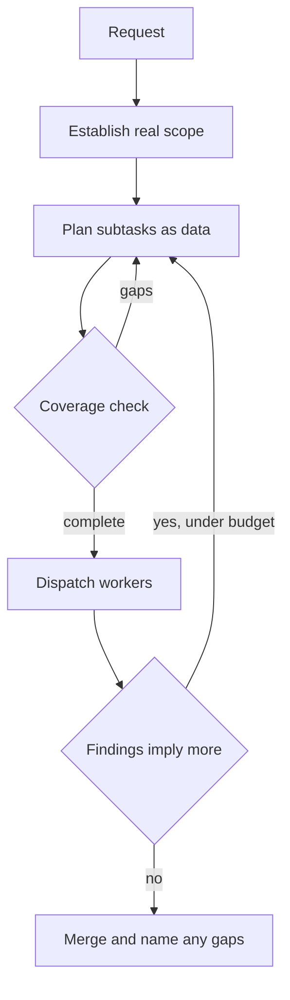
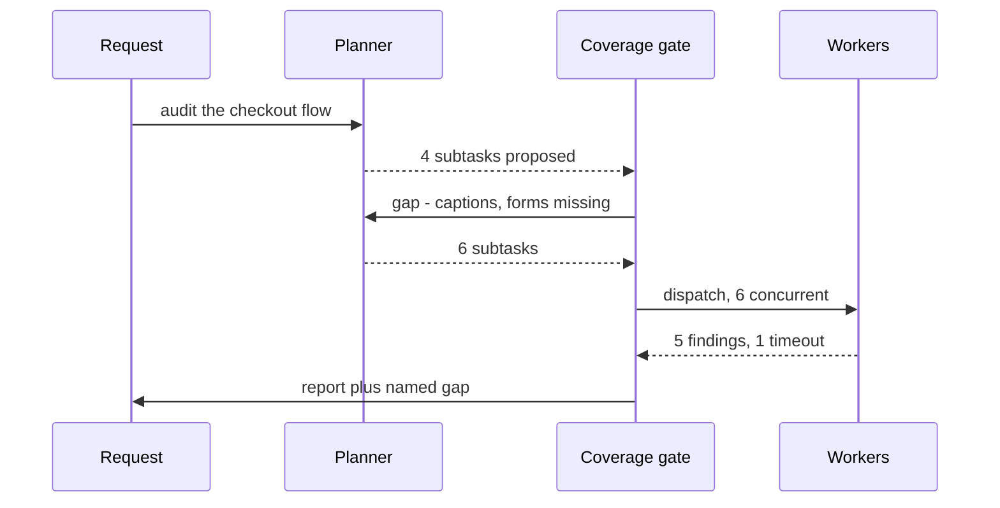

## What Problem Are We Solving?

"Produce an accessibility audit of our product." The coordinator splits that into colour-contrast,
keyboard navigation, and screen-reader compatibility. Three workers run. Each does excellent work.
The report ships.

Nobody notices for a month that it says nothing about video captions or form-error announcements —
because no worker was ever asked. Every component behaved perfectly, and the deliverable was
incomplete anyway.

This is the failure mode that makes decomposition the highest-leverage decision in a multi-agent
system. Recall from 1.2 that a worker only does what its brief says. That means the decomposition
step doesn't merely *organise* the work — it **defines the entire scope of what the system will
ever consider**. Anything outside it is invisible: not done badly, just never attempted.

It's a nasty class of bug because it produces no error. There's no failed worker, no timeout, no
exception. Coverage failures look like success, which is why they're found by a customer rather
than by a test.

The second decision is nearly as consequential: whether you can list the subtasks up front at all.
Sometimes you can, and completeness becomes checkable. Sometimes the next question depends on the
last answer, and you're navigating rather than executing.

> **🗣️ In plain English:** A perfect plan that leaves something out produces an incomplete answer, and everything will look like it worked. What you split into is what the system can ever see.

## Meet the Moving Parts

- **The scope.** What the request actually covers — usually broader than the phrase it arrived in.
  "The arts" is not "visual art". "Accessibility" is not "the three checks I know about".
- **The decomposition.** The list of subtasks. This is the scope, operationally. Whatever isn't
  here does not exist as far as the system is concerned.
- **The coverage check.** Something — code, a checklist, or an explicit model pass — that asks
  whether the pieces add up to the whole. Without it, coverage is an assumption.
- **The dispatch and merge.** Covered in 1.2 and 1.3; this topic is about what gets dispatched.

Two patterns, and choosing between them is the design decision:

| Pattern | Use when | Example |
|---|---|---|
| **Fixed sequential** (prompt chaining) | The steps are the same regardless of input | Review each file, then one cross-file consistency pass |
| **Dynamic adaptive** | The next step depends on what the last one found | Diagnosing a metric drop in an unfamiliar system |

**Fixed sequential** is easier to build and — the real advantage — easy to verify. The subtask list
is knowable in advance, so completeness is a checkable property: compare the plan against a
reference list of categories before spending a single token.

**Dynamic adaptive** is more capable and structurally harder to guarantee. The coordinator cannot
pre-list the subtasks, because they depend on intermediate findings. Completeness becomes a
judgement made repeatedly during the run rather than a check made once at the start.

> **💡 Tip:** Most real systems are hybrids: a fixed skeleton of phases, with dynamic expansion inside a phase. You get a checkable outer list and adaptive depth where it's needed.

## How It Works, Step by Step

1. **Establish the real scope**, not the wording of the request. For a known domain, this is a
   reference list. For an open investigation, it's a set of hypotheses.
2. **Plan the subtasks explicitly, as data.** A plan you can read is a plan you can check. A plan
   that exists only inside a prompt is one you have to trust.
3. **Check coverage against the scope before dispatching.** Cheapest possible moment to catch a
   gap: before any worker has run.
4. **Dispatch** — fan out, per 1.3 — with a self-contained brief for each subtask.
5. **After results return, ask what the findings imply.** In fixed mode, nothing: the list was the
   list. In adaptive mode, this is where new subtasks appear, under a depth or budget limit.
6. **Report the gaps.** Any category with no subtask, or a subtask with no usable result, has to
   reach the final answer as an explicit gap rather than a silent omission.



## Minimal Working Implementation

Save as `plan.py` and run it. The planner emits its decomposition as structured data via a forced
tool call, so your code can check coverage *before* spending anything on workers — the whole point
of planning as data rather than as prose.

```python
import anthropic

client = anthropic.Anthropic()

# The reference scope. Fixed-sequential decomposition is checkable exactly
# because this list exists independently of what the model proposes.
REQUIRED = {"contrast", "keyboard", "screen_reader", "captions", "forms"}

PLAN_TOOL = [{
    "name": "submit_plan",
    "description": "Submit the decomposition of the audit into subtasks.",
    "input_schema": {
        "type": "object", "required": ["subtasks"],
        "properties": {"subtasks": {"type": "array", "items": {
            "type": "object", "required": ["category", "brief"],
            "properties": {
                "category": {"type": "string", "enum": sorted(REQUIRED)},
                "brief": {"type": "string"}}}}}},
}]

response = client.messages.create(
    model="claude-opus-5",
    max_tokens=16000,
    tools=PLAN_TOOL,
    tool_choice={"type": "tool", "name": "submit_plan"},
    messages=[{"role": "user", "content":
               "Decompose 'produce an accessibility audit of our checkout "
               "flow' into independent subtasks, one per category. Each "
               "brief must be self-contained."}],
)

plan = next(b.input for b in response.content if b.type == "tool_use")
covered = {t["category"] for t in plan["subtasks"]}

print(f"{len(plan['subtasks'])} subtasks: {sorted(covered)}")
missing = REQUIRED - covered
if missing:
    raise SystemExit(f"coverage gap - nothing planned for: {sorted(missing)}")
print("coverage complete - safe to dispatch")
```

## Production Implementation

The gate above fails the run on a gap. In production you want it to *close* the gap, and you want
adaptive expansion to be bounded rather than open-ended.

```python
MAX_EXPANSIONS = 2          # how many adaptive rounds are allowed
MAX_SUBTASKS = 24           # hard ceiling on total work


def repair_plan(plan: dict, required: set) -> dict:
    """Ask for the gaps specifically, rather than re-planning wholesale."""
    missing = required - {t["category"] for t in plan["subtasks"]}
    if not missing:
        return plan
    patch = client.messages.create(
        model="claude-opus-5", max_tokens=4000, tools=PLAN_TOOL,
        tool_choice={"type": "tool", "name": "submit_plan"},
        messages=[{"role": "user", "content":
                   "Add subtasks for ONLY these missing categories, keeping "
                   f"the same brief style: {sorted(missing)}"}],
    )
    extra = next(b.input for b in patch.content if b.type == "tool_use")
    plan["subtasks"] += extra["subtasks"]
    return plan
```

Adaptive rounds need a budget, and the outer categories still need to be checkable:

```python
def run_audit(request: str, required: set) -> dict:
    plan = repair_plan(initial_plan(request), required)
    findings, gaps = [], []
    for round_no in range(MAX_EXPANSIONS + 1):
        batch = plan["subtasks"][:MAX_SUBTASKS - len(findings)]
        done, failed = dispatch_all(batch)      # 1.3 fan-out
        findings += done
        gaps += failed
        follow_ups = propose_follow_ups(findings) if round_no < MAX_EXPANSIONS else []
        if not follow_ups or len(findings) >= MAX_SUBTASKS:
            break
        plan["subtasks"] = follow_ups
    return {"findings": findings, "gaps": gaps}
```

**What changed, and why:**

- **Gaps are repaired, not fatal.** Asking for *only* the missing categories is cheaper than
  re-planning and doesn't disturb the subtasks that were already fine.
- **A closed enum on `category`.** The schema restricts categories to the reference set, so the
  coverage check compares like with like instead of fuzzy-matching model-invented labels.
- **Expansion rounds and a subtask ceiling.** Dynamic adaptive decomposition without a budget is
  how an investigation becomes an unbounded bill. Both limits are explicit.
- **`gaps` is a first-class return value.** Failed and unplanned pieces travel with the findings,
  so the merge step can name them (1.2's silent-partial-merge failure).
- **`tool_choice` forces the plan tool**, so the planner returns structured data every time instead
  of occasionally returning prose your code then has to parse.

## In Production: An Accessibility Audit Service at a Design Systems Team

A design systems team audits ~15 product surfaces a quarter. The outer decomposition is fixed —
WCAG categories don't change between audits — and expansion inside a category is adaptive.



**The numbers.** The planner call costs about 900 input and 600 output tokens — under a cent, and
it runs before any worker. Workers cost roughly 40× that in aggregate. So the coverage gate is
effectively free insurance against the expensive failure: a re-run of the whole audit.

Over a quarter the gate caught proposed plans short of the reference list about **a third of the
time**, and the omission was almost always the same shape — the less famous categories. Video
captions and form-error announcements are genuinely less top-of-mind than colour contrast, for
models and humans alike.

Two hard-won details:

- **The reference list is owned by humans, in version control.** It started as "whatever the model
  proposes", which is exactly the assumption that produced the original incomplete report. The
  scope has to come from outside the system that's being checked.
- **Adaptive expansion is capped at two rounds.** An early version let each finding propose
  follow-ups freely. One audit of a data-table component generated 60 subtasks about ARIA
  attributes and cost more than the previous four audits combined.

> **🌍 Real-world example:** The original incomplete report wasn't a model failure at all. The coordinator prompt said "decompose this audit into subtasks", the model produced three sensible ones, and every worker did good work. Nothing in the system had an opinion about what a complete audit contained — so nothing could notice that it wasn't.

## Where This Applies — and Where It Doesn't

| Situation | Use this | Use instead |
|---|---|---|
| Known domain with a stable category list | Fixed sequential, plus a coverage gate | — |
| Compliance or audit work where gaps matter | Fixed sequential, gate in code | — |
| Investigation where the next step depends on findings | Dynamic adaptive, with a round budget | — |
| Known outer phases, unknown depth inside | Hybrid — fixed skeleton, adaptive within | — |
| Work that fits one context and one pass | — | A single agentic loop (1.1) |
| Pieces that constantly need each other's state | — | Don't split; the coupling is the work |

Anti-patterns: decomposing by what's *easy to split* rather than what the request covers;
letting the model define its own scope and then checking coverage against that same scope (a
tautology); unbounded adaptive expansion; and splitting so finely that merge cost exceeds the
saving.

## Failure Modes Seen in the Wild

### 1. The coverage gap

**Symptom.** A confident, complete-looking deliverable that omits part of the request. No errors.
**Cause.** No subtask covered that part.
**Fix.** An externally-owned reference scope and a gate that runs before dispatch.

### 2. Scope defined by the planner

**Symptom.** Coverage checks always pass; gaps still ship.
**Cause.** The check compares the plan against the plan's own notion of scope.
**Fix.** The reference list lives outside the model's output, in version control.

### 3. Runaway adaptive expansion

**Symptom.** One request costs many multiples of a normal run.
**Cause.** Findings propose follow-ups with no round or subtask budget.
**Fix.** `MAX_EXPANSIONS` and a total ceiling, both enforced in code.

### 4. Overlapping subtasks

**Symptom.** Duplicated findings and a merge step that spends its budget de-duplicating.
**Cause.** Pieces were split along convenient lines rather than disjoint ones.
**Fix.** Make the categories mutually exclusive — a closed enum helps enforce it.

> **⚠️ Watch out:** When a multi-agent output is missing something, check the decomposition before you check the workers. A worker that was never asked about captions did its job correctly; the piece was lost before any worker existed.

## Exam Lens & Key Takeaway

> **📝 Exam focus:** The canonical scenario describes a multi-agent output missing part of the request while every subagent performed well — the intended diagnosis is a decomposition/coverage failure, not subagent execution. Options blaming a subagent, or proposing better subagent prompts, are distractors. Know the two patterns by name and their selection rule: **fixed sequential** when the steps are the same regardless of input (and therefore verifiable up front), **dynamic adaptive** when the next step depends on what was just found. "Explore an unfamiliar codebase" or "investigate why a metric dropped" signals adaptive; "review each file, then check consistency" signals fixed.

> **🔑 Key takeaway:** The decomposition defines the entire scope the system can ever address, so a missing subtask is a missing answer that raises no error. Check coverage against an externally-owned reference list before dispatching, and give adaptive expansion an explicit budget.
