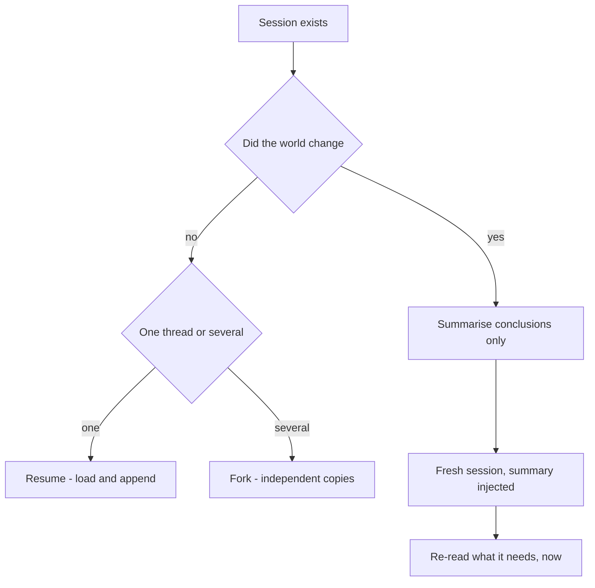
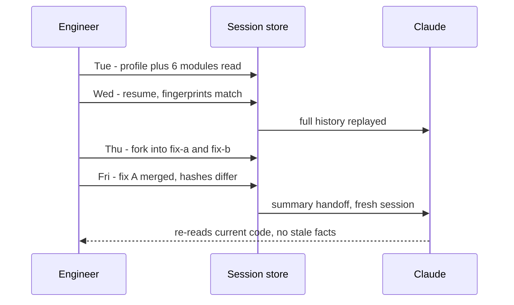

## What Problem Are We Solving?

An engineer spends Tuesday afternoon investigating a latency regression: profiling output, six
modules read, a working theory. Wednesday morning they pick it back up. Nothing changed overnight,
so continuing the same thread is exactly right — all that gathered context is still true.

By Thursday there are two plausible fixes. They want to try both from the same starting point,
without one branch's edits and test runs polluting the other's view of the code.

By Friday, fix A is merged. A teammate picks up the cleanup and continues Tuesday's session —
and gets confidently wrong answers. The session's stored tool results still contain Tuesday's file
contents and Tuesday's test output. To the model those aren't memories, they're **facts in the
conversation**. It reasons from a version of the codebase that no longer exists and has no way to
know.

That's the whole topic. Three mechanisms, and choosing between them turns on one question: is the
stored context still *true*?

The trap is that resuming always looks like the efficient choice. It preserves everything. But
preserving stale tool results is not a saving — it's importing wrong facts, stated with the
authority of something the model observed itself.

> **🗣️ In plain English:** Old context isn't a memory the model can second-guess — it's evidence. If the world moved on, resuming hands it evidence that's quietly false.

## Meet the Moving Parts

- **The session** is the accumulated `messages` list: user turns, assistant turns, and every
  `tool_result` block. The API is stateless (1.1), so whoever holds that list holds the session —
  Claude Code on your behalf, or your own store when you build on the API.
- **Tool results are the perishable part.** File contents, command output, search results: all
  true at capture time, all potentially false later. Reasoning and conclusions age far better.
- **A summary** is a deliberate, written recap of conclusions — not raw prior output. It's how you
  carry knowledge forward without carrying stale evidence.

The three mechanisms:

| Mechanism | What it does | Choose when |
|---|---|---|
| **Resume** (`--resume <name>`) | Continues a named session exactly where it stopped | Prior context is still accurate and you want one continuing thread |
| **Fork** (`fork_session`) | Independent copy of the session as it stands | You want several directions from the same starting point, not interfering |
| **Fresh + summary** | New session with a written recap injected | The old tool results are stale — the code, data or environment moved |

Each answers a different question:

- **Resume** — "is the old context still true, and do I want one thread?"
- **Fork** — "is it still true, and do I want to branch without cross-contamination?"
- **Fresh + summary** — "is the old context actively *untrustworthy* now?"

Forking is neither continuing nor starting over — it's "keep everything to here, then let it
split." The value is comparing outcomes: two approaches from the same research, where branch A's
edits and test runs must not appear in branch B's context.

> **💡 Tip:** The deciding question: has anything changed in the code, data or environment since the last session's tool calls ran? No → resume. Yes, but you want the knowledge → fresh session with a hand-written summary.

## How It Works, Step by Step

1. **The session is persisted** as an ordered message list. Resuming means loading it and
   appending; there is no server-side state to reattach to.
2. **Forking copies the list.** From that moment the two lists are independent — anything either
   branch appends is invisible to the other. A shallow copy is the classic bug here.
3. **Before resuming, ask whether the evidence still holds.** Not "is this session old?" but "did
   anything it observed change?" Age is a proxy; change is the actual criterion.
4. **If it's stale, don't resume.** Generate a summary of conclusions — findings, decisions, open
   questions, with sources — and start a fresh session with that summary as the opening context.
5. **Never carry stale tool results forward** into the fresh session. The summary replaces them
   precisely so the model re-reads what it needs at current-state.



## Minimal Working Implementation

Save as `sessions.py` and run it. It shows all three mechanics on a real store: the second turn
resumes, `fork` produces two branches, and the last line proves branch A can't see branch B.

```python
import json
import pathlib
import anthropic

client = anthropic.Anthropic()
STORE = pathlib.Path("sessions")
STORE.mkdir(exist_ok=True)


def load(name: str) -> list:
    path = STORE / f"{name}.json"
    return json.loads(path.read_text()) if path.exists() else []


def save(name: str, messages: list) -> None:
    (STORE / f"{name}.json").write_text(json.dumps(messages, indent=1))


def fork(src: str, dst: str) -> None:
    save(dst, load(src))          # a real copy - branches cannot interfere


def turn(name: str, text: str) -> str:
    messages = load(name)         # resuming is just loading the list
    messages.append({"role": "user", "content": text})
    response = client.messages.create(
        model="claude-opus-5", max_tokens=16000, messages=messages,
    )
    reply = next(b.text for b in response.content if b.type == "text")
    messages.append({"role": "assistant", "content": reply})
    save(name, messages)
    return reply


print(turn("probe", "Remember: the slow endpoint is /checkout."))
print(turn("probe", "Which endpoint did I say was slow?"))   # resumed
fork("probe", "fix-a")
fork("probe", "fix-b")
print(turn("fix-a", "Propose caching as the fix, in one sentence."))
print(turn("fix-b", "Propose an index as the fix, in one sentence."))
print(turn("fix-a", "What fix did you propose? One line."))  # branch A only
```

## Production Implementation

The store above will happily resume a session whose evidence expired last week. Make staleness
computable rather than a judgement call: fingerprint whatever a tool result captured, and re-check
those fingerprints at resume time.

```python
import hashlib

def fingerprint(path: str) -> str:
    return hashlib.sha256(pathlib.Path(path).read_bytes()).hexdigest()[:16]


def record_read(session: dict, path: str) -> None:
    """Call whenever a file's contents enter the context."""
    session["evidence"][path] = fingerprint(path)


def stale_paths(session: dict) -> list[str]:
    changed = []
    for path, seen in session["evidence"].items():
        try:
            if fingerprint(path) != seen:
                changed.append(path)
        except FileNotFoundError:
            changed.append(path)      # deleted counts as changed
    return changed
```

When anything is stale, the correct move is a summary handoff — conclusions, not captured output:

```python
SUMMARY_ASK = (
    "Summarise this investigation for a fresh session. Include: findings "
    "with their sources, decisions taken, and open questions. Do NOT "
    "restate file contents or command output - they are out of date."
)


def handoff(session: dict) -> list:
    recap = client.messages.create(
        model="claude-opus-5", max_tokens=4000,
        messages=session["messages"] + [{"role": "user",
                                         "content": SUMMARY_ASK}],
    )
    text = next(b.text for b in recap.content if b.type == "text")
    return [{"role": "user", "content":
             "Prior investigation summary. Re-read any file you need; the "
             f"code has changed since these notes.\n\n{text}"}]


def open_session(session: dict) -> list:
    changed = stale_paths(session)
    if not changed:
        return session["messages"]           # safe to resume
    log.info("stale evidence, handing off: %s", changed)
    return handoff(session)                  # fresh session instead
```

**What changed, and why:**

- **Staleness is computed, not guessed.** Hashing what entered the context turns "has anything
  changed?" into an answer. Nobody reliably remembers what Tuesday's session read.
- **A deleted file counts as changed.** The `FileNotFoundError` branch matters: absence is the most
  misleading kind of stale evidence.
- **The summary prompt forbids restating captured output.** Without that instruction, summaries
  faithfully reproduce the stale file contents you were trying to shed.
- **The handoff says the code has changed.** The fresh session is told to re-read rather than trust
  the notes, so the summary is treated as orientation, not as fact.
- **Persist `response.content`, not just text, once tools are involved.** The minimal version keeps
  plain strings, which is fine for chat; a session with tool use must store the real content blocks
  so `tool_use`/`tool_result` pairs survive a reload.

## In Production: A Week-Long Latency Investigation at a Streaming Service

A platform engineer chases p99 latency on a playback service across a working week.



**The numbers.** By Wednesday the session held ~180K tokens, most of it captured file contents.
Resuming replays all of it on every turn, so continuing was costing roughly 30× a fresh question —
worth it while the evidence was good, indefensible once it wasn't. The Friday summary came to about
900 tokens and carried every conclusion that mattered.

What the week actually taught them:

- **Forking was the surprise win.** The first attempt at comparing fixes used one session for both:
  branch A's edits and failed test runs sat in context while evaluating branch B, and the model
  kept referring to changes that only existed in the other approach. Two forks made the comparison
  clean.
- **The stale resume produced its own kind of bug.** The teammate who resumed on Friday got a
  confident explanation referring to a function that had been deleted in the merge. Nothing looked
  wrong — the model was reading its own notes correctly. Fingerprints turned that from an incident
  into a log line.
- **Summaries need sources.** The first recap listed conclusions without saying which module each
  came from, so the fresh session couldn't verify anything and re-derived the investigation. "With
  their sources" in the summary prompt fixed it.

> **🌍 Real-world example:** The stale-resume failure is hard to catch precisely because it isn't a malfunction. Old `tool_result` blocks aren't hedged, aren't timestamped, and don't read as recollections — they read as observations. Given a stale one, the model has no signal that anything is wrong, so it answers with full confidence about code that no longer exists.

## Where This Applies — and Where It Doesn't

| Situation | Use this | Use instead |
|---|---|---|
| Multi-day work, nothing changed underneath | Resume | — |
| Compare two approaches from shared research | Fork | — |
| Parallel what-ifs that must not cross-contaminate | Fork | — |
| Code, data or environment changed since capture | Fresh + summary | — |
| Handing work to a teammate later | Fresh + summary | — |
| Context is huge and most of it is now irrelevant | Fresh + summary | — |
| A new, unrelated question | — | New session; resuming just pays for old context |

Anti-patterns: resuming because the context is expensive to rebuild (the cost of wrong facts is
higher); forking and then editing shared state anyway (the branches were never really independent);
and "summarising" by pasting the old transcript, which reintroduces exactly the stale evidence the
handoff exists to drop.

## Failure Modes Seen in the Wild

### 1. The stale resume

**Symptom.** Confident, detailed answers about code that has changed or no longer exists.
**Cause.** Stored `tool_result` blocks are facts in the conversation, not aging memories.
**Fix.** Fingerprint what entered the context; hand off via summary when anything differs.

### 2. The fork that wasn't

**Symptom.** Branch B's reasoning references branch A's edits.
**Cause.** A shallow copy of the message list, or shared external state (the same working tree).
**Fix.** Deep-copy the history, and give each branch its own workspace.

### 3. The summary that smuggles stale data

**Symptom.** A fresh session repeats the errors of the old one.
**Cause.** The summary reproduced captured file contents and command output.
**Fix.** Instruct explicitly: conclusions and sources, never raw output.

### 4. The unbounded session

**Symptom.** Cost per turn climbs all week; eventually a context-length failure.
**Cause.** Resuming forever because the context "might be needed".
**Fix.** Treat a summary handoff as routine hygiene, not a last resort. See Domain 5.

> **⚠️ Watch out:** Resume looks like the thrifty option — it preserves everything you paid for. It's the wrong call the moment the underlying world has moved, and it fails silently rather than loudly.

## Exam Lens & Key Takeaway

> **📝 Exam focus:** Scenarios turn on one discriminator: did the underlying code, data, or environment change since the previous session's tool calls ran? If yes, the answer is a **fresh session with an injected structured summary** — and "resume to preserve context" is the intended trap, because it looks efficient while importing stale tool results as current fact. If nothing changed and the work is one continuing thread, resume. If nothing changed but you need several non-interfering directions from the same starting point, fork. Watch for the word "explore two approaches" (fork) versus "pick up where I left off" (resume) versus "the codebase has since changed" (fresh + summary).

> **🔑 Key takeaway:** A session's stored tool results are evidence, not memory — resuming after the world changed feeds the model confidently wrong facts. Resume when the context is still true, fork to branch without cross-contamination, and hand off via a written summary of conclusions when it isn't.
