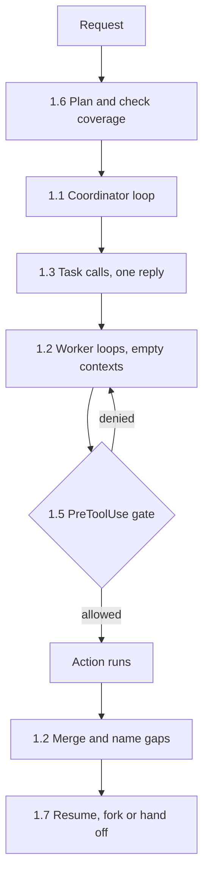
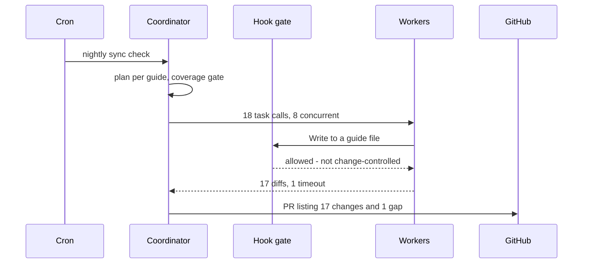

## What Problem Are We Solving?

This is the largest and hardest domain on the exam: 27% of questions, around 16 items. It's hard
for a specific reason, and it isn't the volume of facts.

Every other domain tests things that fail loudly. A malformed tool schema errors. A bad prompt
returns something visibly wrong. The failures in *this* domain are silent. Every component reports
success and the deliverable is still incomplete — a report missing a section nobody asked for, a
test "fixed" but never re-run, a refund that shouldn't have gone out.

That's because agentic architecture is about the parts of the system that *aren't* the model: the
loop that decides when to stop, the code that decides what a subagent is told, the gate that
decides whether an action is permitted at all. When those are wrong, the model does exactly what
it was asked and the outcome is still wrong.

So the exam doesn't mostly ask you to recall definitions. It hands you production evidence — logs,
failure rates, a description of what shipped — and asks you to trace the failure to its true
source. The seven subtopics are the seven places a failure can originate, and the skill being
tested is telling them apart.

> **🗣️ In plain English:** This domain is about everything around the model. When an agent gets it wrong, the bug is usually in the scaffolding, not the reasoning.

## Meet the Moving Parts

The seven subtopics aren't a list of features — they're the layers of one system, each one built on
the one before:

- **1.1 The agentic loop.** The engine. Your code calls the model, reads `stop_reason`, runs
  requested tools, and calls again. Everything else in this domain is this loop plus something.
- **1.2 Multi-agent systems.** One loop becomes several when the work is too broad for one context.
  Introduces the coordinator, and the rule that dominates: a worker knows only what its prompt says.
- **1.3 Spawning subagents.** The mechanism for 1.2 — delegation is an ordinary tool call, so it
  must be permitted, and several calls in one reply is what makes it parallel.
- **1.4 Programmatic enforcement.** Rules that must hold every time can't live in the prompt,
  because a prompt is a request to a probabilistic system.
- **1.5 Hooks.** The mechanism for 1.4 — event-driven code in front of the tool call, which can
  veto before the action or record after it.
- **1.6 Task decomposition.** How the coordinator splits work, which silently defines everything
  the system can ever consider.
- **1.7 Session state.** What happens when work spans days: resume, fork, or start fresh with a
  summary, decided by whether the stored evidence is still true.

Read as a stack: 1.1 is the engine, 1.2 and 1.3 scale it out, 1.4 and 1.5 constrain it, 1.6
scopes it, 1.7 persists it.

> **💡 Tip:** The pairs are the shortcut. 1.2 is the concept and 1.3 the mechanism; 1.4 is the concept and 1.5 the mechanism. Exam questions usually name a symptom from the concept and expect the mechanism as the answer.

## How It Works, Step by Step

One request through a complete production agent, touching every subtopic in order:

1. **A request arrives** and the coordinator's loop starts (1.1).
2. **The coordinator plans** — decomposing the work and checking that the pieces cover the actual
   scope before spending anything (1.6).
3. **It delegates**, emitting several task calls in one reply so workers run concurrently — which
   requires the task tool to be permitted (1.3).
4. **Each worker is a loop of its own** with an empty context and a self-contained brief (1.2).
5. **Any worker action is gated.** A `PreToolUse` hook can refuse before it happens, and the
   denial comes back as a tool result the worker can act on (1.4, 1.5).
6. **The coordinator merges**, naming whatever is missing rather than quietly shipping less (1.2).
7. **If the work continues tomorrow**, the session is resumed, forked, or handed off by summary
   depending on whether its stored evidence still holds (1.7).



## Minimal Working Implementation

The skeleton those seven pieces reduce to — every layer present, nothing else. Save both blocks as
`agent.py` and run it; the gate denies the blocked path and the loop still ends on `end_turn`.

```python
import anthropic

client = anthropic.Anthropic()
MAX_TURNS = 25                                     # 1.1 circuit breaker
REQUIRED = {"pricing", "features"}                 # 1.6 reference scope
BLOCKED = {"prod_config.yaml"}                     # 1.5 gate

def gate(name: str, args: dict) -> None:           # 1.5 PreToolUse
    if args.get("path") in BLOCKED:
        raise PermissionError(f"{args['path']} is change-controlled")

def worker(brief: str) -> str:                     # 1.2 / 1.3 subagent
    reply = client.messages.create(                # fresh, empty context
        model="claude-haiku-4-5", max_tokens=1000,
        messages=[{"role": "user", "content": brief}],
    )
    return next(b.text for b in reply.content if b.type == "text")

def check_coverage(plan: set) -> None:             # 1.6 before spending
    missing = REQUIRED - plan
    if missing:
        raise SystemExit(f"coverage gap: {sorted(missing)}")

def run(messages, tools, handlers):                # 1.1 the loop
    for _ in range(MAX_TURNS):
        r = client.messages.create(
            model="claude-opus-5", max_tokens=16000,
            tools=tools, messages=messages,
        )
        if r.stop_reason == "end_turn":            # the ONLY stop condition
            return next(b.text for b in r.content if b.type == "text")
        if r.stop_reason != "tool_use":
            raise RuntimeError(f"unexpected stop: {r.stop_reason}")
        messages.append({"role": "assistant", "content": r.content})
        results = []
        for b in (x for x in r.content if x.type == "tool_use"):
            try:
                gate(b.name, b.input)
                out, failed = str(handlers[b.name](**b.input)), False
            except (PermissionError, KeyError) as exc:
                out, failed = f"Denied: {exc}", True
            results.append({"type": "tool_result", "tool_use_id": b.id,
                            "content": out, "is_error": failed})
        messages.append({"role": "user", "content": results})
    raise RuntimeError("no end_turn within MAX_TURNS")
```

Wire it to one tool and one blocked path, and it runs end to end:

```python
TOOLS = [{"name": "read", "description": "Read a config file by path.",
          "input_schema": {"type": "object", "required": ["path"],
                           "properties": {"path": {"type": "string"}}}}]

check_coverage({"pricing", "features"})            # 1.6 gate, before spend
print(run([{"role": "user", "content": "Read prod_config.yaml, then tell "
            "me what happened."}], TOOLS, {"read": lambda path: "ok"}))
```

## Production Implementation

Everything above is the happy path. What separates a demo from a system you can operate is that
each layer records what it decided, and each has a ceiling.

```python
import json
import logging

log = logging.getLogger("agent")


def trace(layer: str, **fields) -> None:
    """One structured line per decision, keyed by which layer made it."""
    log.info(json.dumps({"layer": layer, **fields}))


# Every layer gets a ceiling. None of these is a stop condition - each one
# is a circuit breaker that should never fire in a healthy run.
LIMITS = {
    "turns": 25,          # 1.1  loop iterations
    "depth": 1,           # 1.3  workers may not spawn workers
    "expansions": 2,      # 1.6  adaptive planning rounds
    "result_chars": 6000, # 1.2  per worker result, resent every turn
    "concurrency": 8,     # 1.3  parallel workers
}
```

The traces are what make a silent failure diagnosable after the fact:

```python
trace("loop", turn=turn, stop_reason=r.stop_reason,
      out_tokens=r.usage.output_tokens)
trace("plan", subtasks=len(plan), missing=sorted(REQUIRED - covered))
trace("dispatch", workers=len(calls), depth=depth)
trace("gate", tool=b.name, outcome="denied", rule="prod.config")
trace("merge", used=len(findings), gaps=gaps)
trace("session", action="handoff", stale=stale_paths(session))
```

**What changed, and why:**

- **A ceiling per layer, and none of them is a stop condition.** Loop turns, delegation depth,
  planning rounds, result size, concurrency. Each exists so a pathological run is bounded; a
  healthy run never touches one.
- **One trace line per decision, tagged by layer.** This is the direct answer to the domain's
  defining problem. When the deliverable is incomplete and nothing errored, `plan` tells you
  whether the piece was ever scoped, `dispatch` whether a worker was asked, `merge` whether its
  result arrived. Without the tags, "it looked like it worked" is unfalsifiable.
- **Denials are traced with a rule name.** "Denied by prod.config" is answerable months later.
- **Gaps are counted at merge**, so shipping a partial answer is visible in metrics rather than
  discovered by a reader.

## In Production: One Agent, All Seven Layers

A documentation team runs an agent that keeps integration guides in sync with the API. It reads the
OpenAPI spec, checks each guide against it, and opens PRs for whatever drifted.



**Where each subtopic shows up.** The loop stops on `end_turn` and is capped at 25 turns (1.1).
Eighteen guides means eighteen workers, each briefed with the spec section it needs, because none
of them can see the others (1.2, 1.3). A `PreToolUse` hook refuses writes outside `docs/`, so an
agent that decides the real fix is in the API source is stopped by construction (1.4, 1.5). The
plan is checked against the list of guides in the repo, not against what the model proposed (1.6).
And because the run is nightly and the spec changes daily, every run starts fresh — resuming
yesterday's session would reason about yesterday's spec (1.7).

**The numbers.** About 6 minutes wall clock, ~2.1M worker tokens on Haiku, ~40K coordinator tokens
on Opus. Roughly 1 worker in 20 times out on the largest guides.

> **🌍 Real-world example:** The one production incident wasn't a model failure. A guide was renamed, the plan was built from the model's own list of "guides it knew about", the renamed file was never assigned to a worker, and it silently drifted for three weeks. Every worker succeeded. Every run reported success. Building the plan from `ls docs/` instead — an externally-owned scope, per 1.6 — made a coverage gap impossible rather than unlikely.

## Where This Applies — and Where It Doesn't

| Symptom you're given | Layer at fault | Subtopic |
|---|---|---|
| Stopped before the work was verified | Loop stop condition | 1.1 |
| Truncated output accepted as final | `max_tokens` treated as done | 1.1 |
| A worker missed a constraint everyone assumed | Briefing | 1.2 |
| "Multi-agent" system that never delegates | Task tool not permitted | 1.3 |
| Correct results, latency = sum of parts | One task call per turn | 1.3 |
| A rule is followed 99.9% of the time | Rule lives in the prompt | 1.4 |
| Violation logged after it happened | `PostToolUse` used as a gate | 1.5 |
| Output missing a whole topic, no errors | Decomposition coverage | 1.6 |
| Confident answers about code that changed | Stale resume | 1.7 |

That table is the domain. Note that none of these symptoms is "the model reasoned badly" — which is
also the most common wrong answer. If an option blames model quality, or proposes a
better-worded prompt for a rule that must hold every time, it's a distractor.

## Failure Modes Seen in the Wild

### 1. Success reported, work incomplete

**Symptom.** Every component logged success; the deliverable is missing something.
**Cause.** Almost always upstream — decomposition (1.6) or briefing (1.2).
**Fix.** An externally-owned scope, a coverage gate before dispatch, and gaps named in the output.

### 2. The invented stop condition

**Symptom.** Work that stops early, or never stops.
**Cause.** Iteration counts or text matching instead of `stop_reason` (1.1).
**Fix.** Stop on `end_turn`; keep the turn cap as a circuit breaker only.

### 3. The rule that was only a request

**Symptom.** A policy that holds almost always, until the expensive exception.
**Cause.** An absolute requirement expressed as prompt wording (1.4).
**Fix.** Move it to a `PreToolUse` gate; keep the prompt line for steering (1.5).

### 4. Context that was never true

**Symptom.** Detailed, confident, wrong — about a system that has moved on.
**Cause.** A resumed session's stored tool results (1.7).
**Fix.** Fingerprint captured evidence; hand off by summary when it changed.

> **⚠️ Watch out:** Every failure above is silent by default. What makes them diagnosable is per-layer tracing — which is why the production skeleton logs the plan, the dispatch, the gate and the merge separately, not just the final outcome.

## Exam Lens & Key Takeaway

> **📝 Exam focus:** 27% of the exam, ~16 questions, and mostly scenario-based rather than recall. You're handed evidence and asked for the root cause, so learn the symptom → layer mapping in the table above. The four highest-value facts: stop only on `stop_reason == "end_turn"`; a subagent knows only what its prompt says; absolute rules need a hook, never better wording; and a resumed session's stale tool results are the trap that looks efficient. Two recurring distractor shapes: blaming a subagent for an omission that decomposition caused, and offering a stronger prompt where code enforcement is required.

> **🔑 Key takeaway:** This domain is the scaffolding around the model — loop control, delegation, enforcement, decomposition, and session continuity — and its failures are silent, because every component can succeed while the outcome is still wrong. Trace a symptom to the layer that owns it, and remember that concept subtopics (1.2, 1.4) pair with mechanism subtopics (1.3, 1.5).
