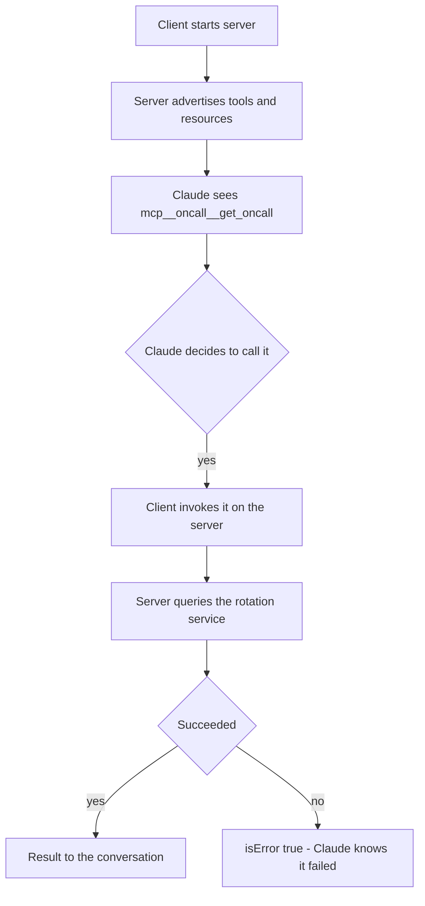
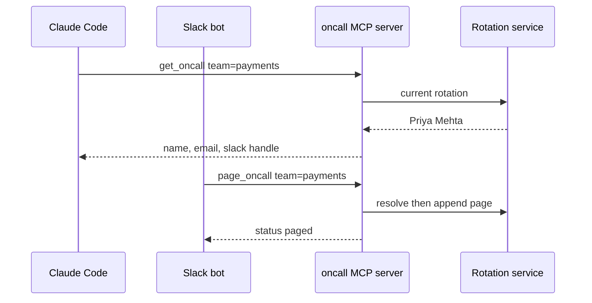

## What Problem Are We Solving?

Your company has an on-call rotation service. You want Claude Code to read it, and you also want it
in a Slack bot, and next quarter in an internal web console.

Without a standard, that's three integrations. Each one re-declares the same tool schemas,
re-implements the same auth, and invents its own way of signalling that the lookup failed. When the
rotation service adds a field, you change it in three places. When one of those integrations
silently returns an error string instead of a failure flag, the assistant reports a stale on-call
engineer to whoever is holding the pager.

Multiply that by every internal system — tickets, deploys, billing, feature flags — and the glue
code becomes the actual project.

MCP (Model Context Protocol) fixes this by standardising the *shape* of the connection rather than
the connection itself. You wrap the rotation service once as an MCP **server**. Any MCP-compatible
**client** — Claude Code, your Slack bot, the console you haven't built yet — connects to it and
discovers its capabilities without a line of bespoke integration code.

The USB-C comparison is the right one, and it's worth being precise about what it buys you: not
fewer systems, but one connector shape, so the number of integrations stops multiplying.

> **🗣️ In plain English:** Write the integration once, as a server that describes itself. Every AI client can then use it without knowing anything about your internals.

## Meet the Moving Parts

- **The MCP server** wraps one system and exposes its capabilities. It's an ordinary process — a
  Python script is enough — speaking the protocol over stdio or HTTP.
- **The MCP client** is the AI application: Claude Code, or your own app. It connects, asks the
  server what it offers, and surfaces those capabilities to the model.
- **The transport** is stdio for a local server the client launches itself, or HTTP for a remote
  one. Same protocol either way.

A server can expose three kinds of thing, and telling them apart is heavily tested:

| Primitive | What it is | Claude's relationship to it |
|---|---|---|
| **Tool** | An action with a name, description and input schema — `get_oncall`, `page_oncall` | Claude *invokes* it |
| **Resource** | Read-only context — a policy doc, a database schema, an issue summary | Claude *reads* it |
| **Prompt** | A reusable prompt template the server offers | Claude (or the user) *fills it in* |

The dividing line is not "does it read data" — plenty of tools only read. It's whether Claude has
to **decide to act**. `get_invoice(id)` is a tool because Claude chooses the argument and asks for
it to run; the refund policy document is a resource, just context to be pulled in.

One more part that carries more weight than its size suggests: **`isError`** on a tool result. It's
the flag that separates "the query failed" from "here is your answer." Without it, error text is
just text, and Claude will happily read a stack trace as if it were customer data.

> **⚠️ Watch out:** A server that returns `{"error": "..."}` in a normal success payload has not signalled failure. Claude sees a successful call whose content happens to mention an error — and may well summarise it as fact.

## How It Works, Step by Step

1. **The client launches or connects to the server** — for stdio, it literally starts the process.
2. **The server advertises its capabilities** during initialisation: every tool with its name,
   description and JSON Schema, plus any resources and prompts.
3. **The client surfaces those tools to the model**, namespaced by server. In Claude Code they
   appear as `mcp__<server>__<tool>` — so this server's tools are `mcp__oncall__get_oncall` and
   `mcp__oncall__page_oncall`.
4. **Claude decides whether to call one**, using only the advertised description and schema. This
   is why 2.2 exists: the description *is* the interface.
5. **The client executes the call** against the server, which does the real work and returns a
   result — with `isError: true` if it failed.
6. **The result goes back into the conversation** as a `tool_result`, and the agentic loop from
   1.1 continues.



## Minimal Working Implementation

A complete MCP server. `pip install mcp`, save as `oncall_server.py`, then register it — after
which `/mcp` in Claude Code lists both tools and Claude can call them.

```python
import json
from datetime import datetime, timezone
from pathlib import Path

from mcp.server.fastmcp import FastMCP

HERE = Path(__file__).parent
DATA = HERE / "oncall.json"          # {"payments": {"name": ..., ...}, ...}
PAGES_LOG = HERE / "pages.log"

mcp = FastMCP("oncall")

@mcp.tool()
def get_oncall(team: str) -> dict:
    """Return who is currently on call for the given team.

    Teams: payments, search, platform, mobile.
    Returns {name, email, slack_handle, until_iso} or {error}.
    """
    rotation = json.loads(DATA.read_text()).get(team)
    if not rotation:
        return {"error": f"Unknown team '{team}'."}
    return rotation

@mcp.tool()
def page_oncall(team: str, message: str) -> dict:
    """Page the current on-call engineer for the given team.

    Appends a page record to pages.log and returns confirmation.
    Use sparingly - pages wake people up.
    """
    if len(message) < 5:
        return {"error": "Message must be at least 5 characters."}
    rotation = json.loads(DATA.read_text()).get(team)
    if not rotation:
        return {"error": f"Unknown team '{team}'."}
    record = {"ts": datetime.now(timezone.utc).isoformat(), "team": team,
              "paged": rotation["name"], "message": message}
    with PAGES_LOG.open("a") as fh:
        fh.write(json.dumps(record) + "\n")
    return {"status": "paged", "who": rotation["name"]}

if __name__ == "__main__":
    mcp.run()
```

Note what you did *not* write: no schemas, no protocol handling. `@mcp.tool()` derives the input
schema from the type hints and the description from the docstring.

```bash
claude mcp add oncall /path/to/.venv/bin/python /path/to/oncall_server.py
claude mcp list          # expect: oncall: ... - ✓ Connected
```

## Production Implementation

Two things separate that server from one you'd put in front of a paging system: it can't signal
failure properly, and it has no identity.

```python
from mcp.server.fastmcp import FastMCP
from mcp.server.fastmcp.exceptions import ToolError

mcp = FastMCP("oncall")


@mcp.tool()
def get_oncall(team: str) -> dict:
    """Return who is currently on call for the given team.

    Args:
        team: Team slug. One of: payments, search, platform, mobile.
    """
    try:
        rotation = rotation_service.current(team, timeout=5)
    except TimeoutError as exc:
        # Raising marks the result isError, instead of returning a dict
        # whose text merely mentions a problem.
        raise ToolError(f"rotation service timed out: {exc}") from exc
    if rotation is None:
        raise ToolError(f"unknown team '{team}'; known: {rotation_service.teams()}")
    return rotation
```

The other half is client-side. Connecting Claude to a *remote* MCP server over the API takes both
halves of the config — the server list and a matching toolset entry:

```python
response = client.beta.messages.create(
    model="claude-opus-5",
    max_tokens=16000,
    betas=["mcp-client-2025-11-20"],
    mcp_servers=[{"type": "url", "url": "https://mcp.internal/oncall",
                  "name": "oncall"}],
    tools=[{"type": "mcp_toolset", "mcp_server_name": "oncall"}],
    messages=[{"role": "user", "content": "Who is on call for payments?"}],
)
```

**What changed, and why:**

- **Failures raise instead of returning.** A returned `{"error": ...}` is a *successful* call whose
  content happens to describe a failure. Raising is what sets `isError`, and that flag is the only
  thing that tells Claude not to treat the payload as an answer.
- **Per-parameter documentation in the docstring.** FastMCP derives the schema from type hints, so
  `team: str` alone produces `{"title": "Team", "type": "string"}` — no description at all. An
  `Args:` section is what gives Claude something to reason about (straight into 2.2).
- **A timeout on the upstream call.** An MCP server with no timeout hangs the whole tool call, and
  from the client's side that's indistinguishable from a slow model.
- **`mcp_servers` and `mcp_toolset` together.** Declaring the server without the matching toolset
  entry is rejected as a validation error — a very common first-attempt mistake.

## In Production: One On-Call Server, Three Surfaces

A platform team at an infrastructure company wrapped their rotation service as a single MCP server.
It now backs Claude Code for engineers, an incident Slack bot, and a status console.



**The numbers.** The server is about 60 lines. Adding the Slack bot as a second client took an
afternoon and no changes to the server. The tool advertisement costs roughly 300 tokens of context
per session — the price of self-description, and the reason 2.4 cares about how many servers you
attach at once. Each `get_oncall` call is ~40 tokens in and ~60 out.

Three things they learned:

- **`page_oncall` needed a confirmation gate, and MCP is not where that lives.** The tool's
  description says "use sparingly", which is a request, not a control. The actual guard is a
  permission prompt on the client side — exactly the 1.4 distinction, arriving here as a tool
  design question.
- **The rotation service's own error strings leaked as answers.** The first version returned
  `{"error": "..."}`, and on a bad day Claude relayed "Unknown team 'payment'" to a user as though
  the team didn't exist, rather than retrying with the correct slug. Raising instead fixed it.
- **Resources turned out to be the underused half.** The escalation policy started as a
  `get_escalation_policy` tool, which Claude had to remember to call. As a resource it's just
  available, and answers stopped omitting the policy.

> **🌍 Real-world example:** The 60-line server in this workshop's `day1_advanced/mcp/` is exactly this pattern, and it's live in this session — `mcp__oncall__get_oncall(team="payments")` returns Priya Mehta, `@priya`. Worth calling it and then looking at the generated schema: `{"title": "Team", "type": "string"}`. No description, because the code never gave one.

## Where This Applies — and Where It Doesn't

| Situation | Use this | Use instead |
|---|---|---|
| A system several AI clients will need | An MCP server | — |
| Wrapping an internal API for reuse | An MCP server | — |
| Read-only context Claude should always have | An MCP **resource** | — |
| An action Claude must choose to take | An MCP **tool** | — |
| One tool, one app, no reuse planned | — | A plain tool definition in `tools` |
| Logic that belongs to your app, not the model | — | Ordinary code; don't expose it as a tool |
| Enforcing a rule that must always hold | — | A hook (1.5); a tool description can't enforce |

Anti-patterns: exposing every function of a system because you can (2.4 explains what that costs);
using a tool for something that should be a resource, so Claude has to remember to fetch its own
context; and returning errors as ordinary content, which is the one failure mode that quietly turns
into wrong answers rather than visible breakage.

## Failure Modes Seen in the Wild

### 1. The error that looked like an answer

**Symptom.** Claude confidently reports something false that resembles a system message.
**Cause.** The server returned an error payload as a successful result; `isError` was never set.
**Fix.** Raise (or set the error flag) on failure, so the client marks the result as an error.

### 2. The schema with no descriptions

**Symptom.** Claude calls the right tool with the wrong argument shape — a team name instead of a
slug, a date instead of a range.
**Cause.** The schema was derived from type hints alone, so parameters have types but no meaning.
**Fix.** Document each parameter in the docstring's `Args:` section.

### 3. The server that hangs

**Symptom.** The whole turn stalls with no error.
**Cause.** No timeout on the upstream call inside the tool.
**Fix.** Bound every outbound call in the server and convert the timeout into an error result.

### 4. Half a client configuration

**Symptom.** A validation error when calling the API with a remote MCP server.
**Cause.** `mcp_servers` was declared without the matching `mcp_toolset` entry in `tools`.
**Fix.** Both halves, with the same server name.

> **⚠️ Watch out:** Every connected server's tool advertisements are context, paid for on every turn of the conversation. Attaching servers "just in case" costs tokens *and* degrades tool selection — see 2.4.

## Exam Lens & Key Takeaway

> **📝 Exam focus:** The most-tested distinction is tool versus resource: a **tool** is an action Claude actively invokes with arguments it chooses; a **resource** is passive read-only context it reads. Expect a described capability and a question about which it should be — "the refund policy document" is a resource, "look up this invoice" is a tool. Also know that `isError` is what tells Claude a call failed rather than succeeded with odd content, and that MCP's value proposition is standardisation: one server, many clients, versus N bespoke integrations that all need updating when the API changes.

> **🔑 Key takeaway:** MCP standardises the connection shape so one self-describing server serves every MCP client. Tools are invoked, resources are read, and `isError` is the difference between Claude knowing a call failed and Claude reporting the error text as an answer.
