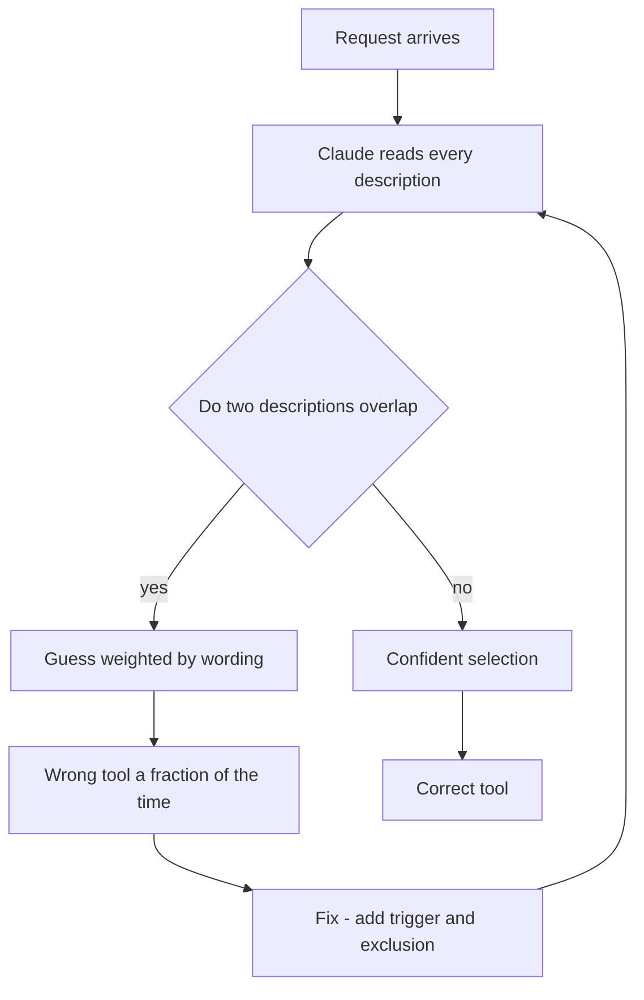
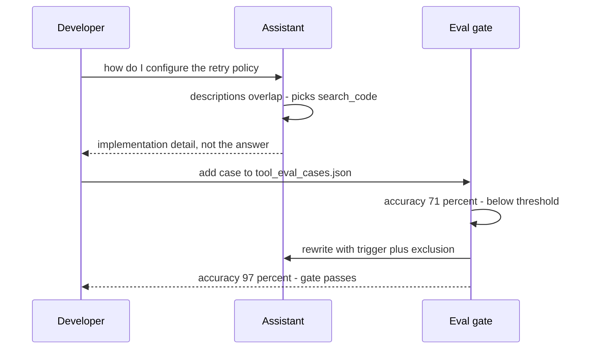

## What Problem Are We Solving?

A coding agent has two tools: `search_code` ("Searches the codebase") and `search_docs`
("Searches documentation"). Developers start complaining that asking "how do I configure the retry
policy?" makes it grep source files and come back with an implementation detail instead of the
setup guide.

Nothing is broken. Both descriptions are accurate. The problem is that neither one says *when to
prefer it over the other*, and a configuration question is plausibly about both code and docs. With
no disambiguating language, Claude pattern-matches on surface wording — and gets it wrong a
meaningful fraction of the time.

Here's the thing that makes this the highest-leverage topic in the domain: Claude cannot see your
source code, your naming conventions, or your team's shared understanding of what these tools are
for. At the moment of choosing, it has **only the name, the description, and the input schema**.
That text isn't documentation about the interface. It *is* the interface.

Which means most "Claude used the wrong tool" bugs aren't model failures or prompt failures — they
are interface failures, in a string you own. That's also why they're the cheapest class of bug in
this domain to fix: no code changes, no router, no classifier. Rewrite the description.

> **🗣️ In plain English:** The description is the whole spec Claude gets. If it doesn't say when *not* to use the tool, Claude has to guess.

## Meet the Moving Parts

Three fields, and that is genuinely all:

- **The name.** A strong signal, and often the only thing skimmed. `search_code` vs `search_docs`
  already carries information; `query_service_a` carries none.
- **The description.** Where the decision actually gets made. Everything Claude needs about
  applicability lives here.
- **The input schema.** Types *and* per-parameter descriptions. A parameter typed `str` with no
  description tells Claude the shape but not the meaning — is `team` a display name or a slug?

A strong description is a mini-spec written for a very literal reader who has never seen your
system. Five things belong in it:

| Element | What it does | Example |
|---|---|---|
| **Purpose** | One sentence on what you get back | "Returns order history, status and line items." |
| **Trigger** | The requests that should land here | "Use when the question is about what they BOUGHT or ORDER STATUS." |
| **Input** | The expected shape, not just the type | "Input: order number, e.g. ORD-4471." |
| **Exclusion** | When *not* to use it | "Not for questions about who the customer is." |
| **Differentiation** | The neighbouring tool it's confused with | "For customer identity, use get_customer instead." |

The last two are the ones people skip, and they're the ones that do the work. A description that
only says what a tool does leaves overlap unresolved; a description that says what it is *not* for
carves out mutually exclusive territory.

> **💡 Tip:** Be prescriptive about *when* to call it, not just what it does. On recent models, which reach for tools more conservatively, explicit trigger conditions measurably raise the should-call rate.

## How It Works, Step by Step

1. **Every tool's name, description and schema are serialised into the request.** They're context,
   paid for on every turn.
2. **Claude compares the request against each description** and picks the best match — or none, if
   nothing applies. That "or none" matters: a description that never says what's out of scope makes
   declining harder.
3. **Overlap forces a guess.** When two descriptions both plausibly cover a request, selection
   becomes a coin flip weighted by surface wording.
4. **The argument comes from the schema.** Wrong-shaped arguments — a name where a slug was wanted
   — are almost always a missing parameter description, not a model error.
5. **Measure, don't assume.** Selection accuracy is testable: labelled queries, expected tool,
   count the hits. Descriptions are prompt-like, so treat them like prompts and evaluate them.

The rewrite that fixes the opening example:

| | Before | After |
|---|---|---|
| `search_code` | "Searches the codebase" | "Searches source files (.ts, .py, .go) for definitions and usages. Use for 'where is X implemented' questions. Not for setup or configuration guidance." |
| `search_docs` | "Searches documentation" | "Searches markdown docs for setup guides, configuration options and how-to content. Use for 'how do I configure/set up X' questions." |



## Minimal Working Implementation

A selection eval. Save as `eval_tools.py` and run it: the same queries, the same tool *names*, only
the descriptions differ — and the accuracy gap is the entire lesson.

```python
import anthropic

client = anthropic.Anthropic()
SCHEMA = {"type": "object", "required": ["q"],
          "properties": {"q": {"type": "string", "description": "Search text"}}}

VAGUE = [
    {"name": "search_code", "description": "Searches the codebase.",
     "input_schema": SCHEMA},
    {"name": "search_docs", "description": "Searches documentation.",
     "input_schema": SCHEMA},
]

PRECISE = [
    {"name": "search_code", "input_schema": SCHEMA, "description":
     "Searches source files (.ts, .py, .go) for definitions and usages. "
     "Use for 'where is X implemented' or 'what calls X'. NOT for setup "
     "or configuration guidance - use search_docs for those."},
    {"name": "search_docs", "input_schema": SCHEMA, "description":
     "Searches markdown docs for setup guides, configuration options and "
     "how-to content. Use for 'how do I configure/set up X'. NOT for "
     "finding implementations - use search_code for those."},
]

CASES = [
    ("how do I configure the retry policy?", "search_docs"),
    ("where is formatDate implemented?", "search_code"),
    ("what does onboarding say about env vars?", "search_docs"),
    ("which files call validateToken?", "search_code"),
    ("show me the retry backoff implementation", "search_code"),
]


def picked(tools: list, query: str) -> str:
    reply = client.messages.create(
        model="claude-opus-5", max_tokens=1000, tools=tools,
        tool_choice={"type": "any"},          # force a choice, no prose
        messages=[{"role": "user", "content": query}],
    )
    return next(b.name for b in reply.content if b.type == "tool_use")


for label, tools in (("vague  ", VAGUE), ("precise", PRECISE)):
    hits = sum(picked(tools, q) == want for q, want in CASES)
    print(f"{label}: {hits}/{len(CASES)} correct")
```

## Production Implementation

A one-off script proves the point. What keeps descriptions good is making that eval a gate, so a
well-meaning edit to a description can't quietly regress routing.

```python
import json
import pathlib

CASES = json.loads(pathlib.Path("tool_eval_cases.json").read_text())
THRESHOLD = 0.95
TRIALS = 3          # selection is not deterministic; sample it


def selection_accuracy(tools: list) -> tuple[float, list]:
    misses = []
    for case in CASES:
        for _ in range(TRIALS):
            got = picked(tools, case["query"])
            if got != case["expect"]:
                misses.append({"query": case["query"],
                               "expected": case["expect"], "got": got})
    total = len(CASES) * TRIALS
    return 1 - len(misses) / total, misses


def main() -> int:
    accuracy, misses = selection_accuracy(load_tools())
    print(f"selection accuracy {accuracy:.1%} over {len(CASES)} cases")
    for miss in misses[:10]:
        print(f"  {miss['query']!r}: wanted {miss['expected']}, got {miss['got']}")
    return 0 if accuracy >= THRESHOLD else 1     # fails the build
```

The descriptions themselves are worth linting too — the elements people omit are mechanical:

```python
REQUIRED_CUES = ("Use when", "Use for", "NOT for", "Input:")


def weak_descriptions(tools: list) -> list[str]:
    weak = []
    for tool in tools:
        text = tool["description"]
        if len(text) < 80 or not any(cue in text for cue in REQUIRED_CUES):
            weak.append(f"{tool['name']}: no trigger/exclusion guidance")
        for name, spec in tool["input_schema"]["properties"].items():
            if not spec.get("description"):
                weak.append(f"{tool['name']}.{name}: parameter has no description")
    return weak
```

**What changed, and why:**

- **The eval is a build gate, not a script.** Descriptions drift the way prompts drift. A
  threshold in CI is what stops "small clarification" from costing five points of accuracy.
- **Repeated trials per case.** Selection isn't deterministic, so a single pass over six cases
  can't distinguish 95% from 80%. Sampling makes the number mean something.
- **Misses are printed with what was chosen instead.** "Wanted `search_docs`, got `search_code`"
  points straight at the overlapping pair to rewrite.
- **A structural lint for the description itself.** It can't judge quality, but it reliably catches
  the two omissions that cause most misrouting: no exclusion clause, and undocumented parameters.

## In Production: Search Routing in an Internal Coding Assistant

An engineering team runs a Claude-based assistant over a large monorepo. It has `search_code`,
`search_docs`, `search_tickets` and `search_runbooks` — four tools whose territory overlaps far
more than the names suggest.



**The numbers.** Their eval covers 40 labelled queries at 3 trials each. The original descriptions
scored 71%. Adding trigger and exclusion clauses to all four took an hour and moved it to 97% — no
code changed, no prompt changed, no router added. The four tool definitions cost about 500 tokens
of context per request either way, so the improvement was free at runtime.

What the misses actually looked like:

- **"Runbook" and "docs" were the worst pair**, not code-versus-docs. Both were "searches
  written material." The fix was territory, not eloquence: runbooks are "operational procedures for
  incidents and on-call"; docs are "setup, configuration and how-to".
- **`search_tickets` was over-selected for anything containing "issue".** Its description said
  "Searches issues and tickets", so the word "issue" in a query dragged it in. Adding "NOT for
  questions about how the software works" fixed a whole class of misses.
- **One miss was a schema problem, not a description problem.** `search_tickets` took a `project`
  parameter with no description, and Claude passed a human-readable project name where a key was
  needed. Every call succeeded and returned nothing — the worst failure shape, since it looks like
  an empty result rather than an error.

> **🌍 Real-world example:** The live MCP server in this workshop shows the schema half of this in one line. `mcp__oncall__get_oncall` advertises `{"team": {"title": "Team", "type": "string"}}` — a type, no description. The docstring says teams are payments, search, platform and mobile, so the *tool* is well described while the *parameter* is not. Ask "who's on call for the payment team?" and there is nothing telling Claude the argument is a fixed slug rather than prose.

## Where This Applies — and Where It Doesn't

| Situation | Use this | Use instead |
|---|---|---|
| Claude picks the wrong tool | Rewrite descriptions — trigger + exclusion | — |
| Two tools have overlapping territory | Cross-reference them in both descriptions | — |
| Right tool, wrong argument shape | Add per-parameter descriptions | — |
| You need to know if a rewrite helped | A selection eval with labelled cases | — |
| Claude must always call some tool | — | `tool_choice` (2.4) |
| A tool must never run in some case | — | A hook (1.5); a description can't enforce |
| 18 tools and confusion across all of them | — | Scope the toolset per role first (2.4) |

Anti-patterns, in the order teams usually reach for them: adding a routing classifier in front of
the tools; adding system-prompt instructions about which tool to use for what (the description is
where the model looks); and making descriptions longer without making them *more exclusive* — three
paragraphs of prose that still don't say what the tool isn't for.

## Failure Modes Seen in the Wild

### 1. Accurate descriptions with overlapping territory

**Symptom.** Consistent misrouting between a specific pair of tools.
**Cause.** Both descriptions say what the tool does; neither says what it isn't for.
**Fix.** Name the neighbour explicitly in both, with an exclusion clause.

### 2. The undocumented parameter

**Symptom.** Calls succeed and return nothing.
**Cause.** The parameter had a type but no description, so Claude guessed the format.
**Fix.** Describe every parameter, with an example value.

### 3. The over-triggered tool

**Symptom.** One tool gets pulled in whenever a particular common word appears.
**Cause.** A generic term in its description that collides with everyday phrasing.
**Fix.** Add the exclusion that carves that phrasing out.

### 4. Silent regression after a "clarification"

**Symptom.** Routing quality drops after an unrelated-looking edit.
**Cause.** Descriptions are prompts, and nothing was measuring them.
**Fix.** The eval gate; a threshold in CI.

> **⚠️ Watch out:** A tool that never says when it does *not* apply makes it harder for Claude to answer without calling anything. Missing exclusion clauses cause spurious calls, not just wrong ones.

## Exam Lens & Key Takeaway

> **📝 Exam focus:** When a scenario describes Claude picking the wrong tool, the expected answer is almost always **improve the tool descriptions** — not add a classifier, a router, or more system-prompt instructions. Fix the root cause before adding orchestration. Know the elements of a strong description: purpose, trigger examples ("use when..."), input format, exclusions, and differentiation from similar tools. Remember that Claude sees only name, description and schema — options implying it can infer intent from your code or naming conventions are wrong. If the scenario is instead a *large* toolset causing broad confusion, the answer shifts to reducing tools per role (2.4).

> **🔑 Key takeaway:** The description is the interface — name, description and schema are all Claude gets. The clauses that fix misrouting are the ones teams skip: when *not* to use the tool, and how it differs from its neighbour. Treat descriptions as prompts and measure them with a labelled selection eval.
