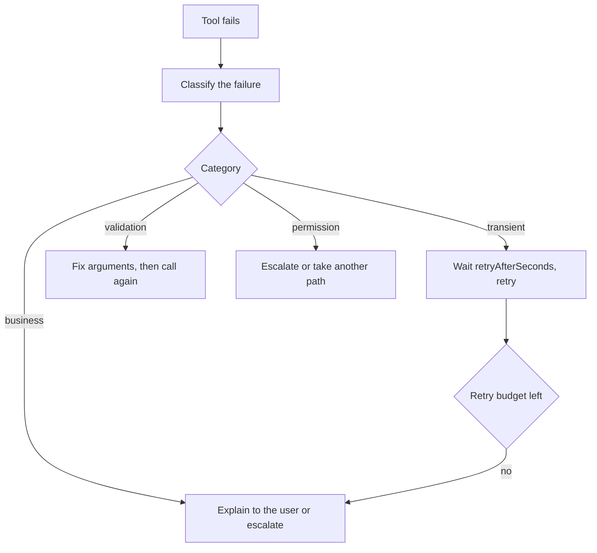
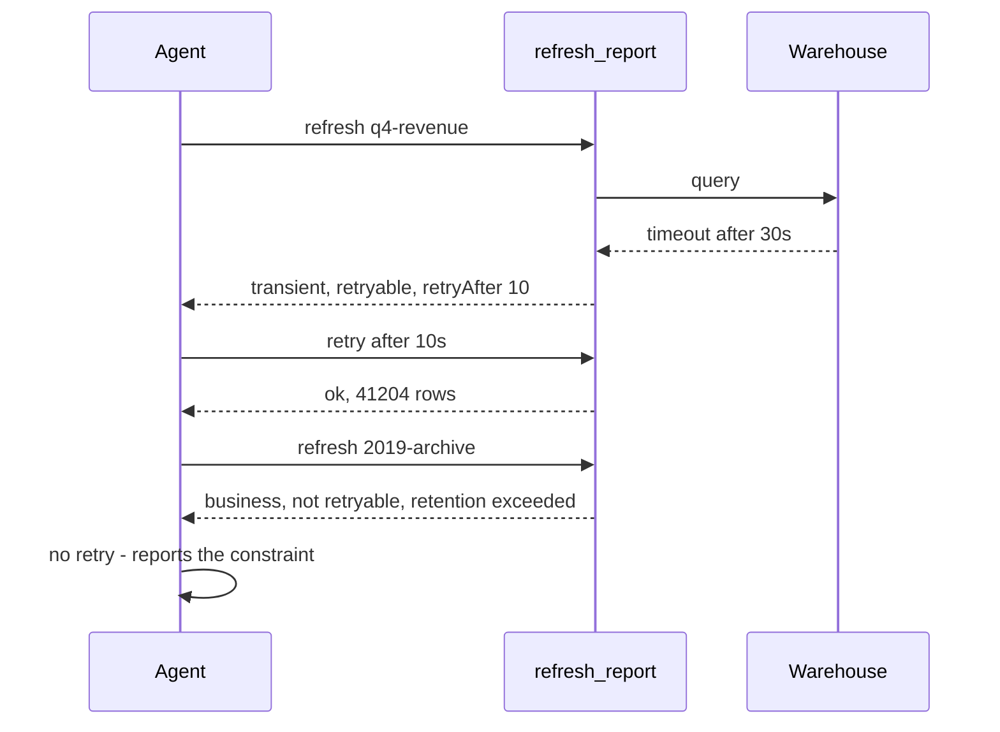

## What Problem Are We Solving?

A data pipeline agent calls `refresh_report`. The warehouse query times out. Your tool returns
`{"status": "failed"}`.

Now Claude has a decision to make and nothing to make it with. Should it retry — the warehouse
might be fine in five seconds? Should it fix its arguments — maybe the date range was wrong?
Should it stop and tell the user? All three are plausible responses to "failed", and Claude will
pick one on vibes.

Watch what each wrong guess costs. Retrying a *validation* error hammers the same doomed call in a
loop. Not retrying a *transient* error turns a five-second blip into a failed job and a needless
page. And with no real signal at all, the most common outcome is the worst one: Claude writes a
plausible explanation of what went wrong, because it has to say something, and invents a cause.

Tools fail — that isn't the design problem. The design problem is **what the tool hands back when
they do**. A structured error replaces guesswork with three explicit facts: what kind of failure
this is, whether retrying can possibly help, and what to do instead if it can't.

> **🗣️ In plain English:** "It failed" makes Claude guess what to do next. Say what kind of failure it was, and the right next action becomes obvious.

## Meet the Moving Parts

- **The error flag** (`isError` on an MCP result, `is_error` on a `tool_result`). The binary
  signal: this is a failure, not an answer. Without it, error text is just content — see 2.1.
- **The category.** Which of four kinds of failure this is. Determines the *shape* of the recovery.
- **The retryable flag.** Whether repeating the same call could ever succeed. Derived from the
  category, but stated explicitly so nothing has to infer it.
- **The message.** Human-readable, and read by the model — so it should say what to do, not just
  what broke.
- **Timing guidance** (`retryAfterSeconds`). Turns "retry with backoff" from a guess into a number.

The four categories, and why each maps to exactly one response:

| Category | Meaning | Retryable | Claude's move |
|---|---|---|---|
| **Transient** | Timeout, blip, upstream hiccup | **Yes** | Retry with backoff |
| **Validation** | Malformed or incomplete input | No | Fix the arguments, then retry |
| **Business** | A policy forbids it | No | Explain to the user, or escalate |
| **Permission** | Not authorised for this action | No | Escalate, or take a different path |

Only one of the four is retryable as-is, and that's the whole reason the taxonomy exists. Validation
is retryable only *after* the input changes — which is a different action, not a repeat. Business
and permission failures are not technical failures at all: nothing is broken, the system is working
correctly and declining.

> **⚠️ Watch out:** Marking a validation error retryable is worse than returning no category, because Claude will confidently repeat an identical call that cannot ever succeed. An inaccurate category is a bug with a blast radius.

## How It Works, Step by Step

1. **The tool catches its own failure** and classifies it before returning. Classification happens
   where the knowledge is — the tool knows a timeout from a policy refusal.
2. **It returns the error envelope** with the flag set, so the client marks the result as an error.
3. **Claude reads the category and the retryable flag**, not the prose. Those two fields decide the
   branch.
4. **Retryable and transient:** wait `retryAfterSeconds` and repeat. Your loop, not Claude, should
   also cap how many times that can happen.
5. **Not retryable:** the message determines the path. Validation means new arguments; business
   means explain or escalate; permission means escalate.
6. **Nothing loops forever**, because the only category that permits a repeat is the one where a
   repeat can work — and even that one has a ceiling in your code.

The two payloads side by side, which is the entire topic in twelve lines:

```json
{
  "isError": true,
  "errorCategory": "transient",
  "isRetryable": true,
  "message": "Database timeout after 30s",
  "retryAfterSeconds": 5
}
```

Against `{ "status": "failed" }` — technically true, operationally useless.



## Minimal Working Implementation

Save as `errors.py` and run it. `refresh_report` fails three different ways, and the loop's
response differs for each — retry, re-argue, stop — driven only by the category.

```python
import json
import anthropic

client = anthropic.Anthropic()
CALLS = {"n": 0}
TOOLS = [{
    "name": "refresh_report",
    "description": "Refresh a report. window is an ISO range, 2026-01-01/2026-01-31.",
    "input_schema": {"type": "object", "required": ["report_id", "window"],
                     "properties": {"report_id": {"type": "string"},
                                    "window": {"type": "string"}}},
}]
def err(category: str, message: str, **extra) -> dict:
    return {"isError": True, "errorCategory": category, "message": message,
            "isRetryable": category == "transient", **extra}

def refresh_report(report_id: str, window: str) -> dict:
    CALLS["n"] += 1
    if "/" not in window:                 # bad input: never retryable
        return err("validation", "window must be like 2026-01-01/2026-01-31")
    if window.startswith("2019"):         # policy: a retry cannot help
        return err("business", "window exceeds 3-year retention; use a later one")
    if CALLS["n"] < 3:                    # blip: a retry can succeed
        return err("transient", "warehouse timeout after 30s", retryAfterSeconds=1)
    return {"status": "ok", "rows": 41_204, "report_id": report_id}

messages = [{"role": "user", "content": "Refresh report q4-revenue for "
             "January 2026. Follow each error's guidance."}]

for _ in range(8):
    r = client.messages.create(model="claude-opus-5", max_tokens=16000,
                               tools=TOOLS, messages=messages)
    if r.stop_reason != "tool_use":
        break
    messages.append({"role": "assistant", "content": r.content})
    out = []
    for b in (x for x in r.content if x.type == "tool_use"):
        res = refresh_report(**b.input)
        out.append({"type": "tool_result", "tool_use_id": b.id,
                    "content": json.dumps(res),
                    "is_error": bool(res.get("isError"))})
    messages.append({"role": "user", "content": out})

print("calls made:", CALLS["n"])
print(next(b.text for b in r.content if b.type == "text"))
```

## Production Implementation

Classification is the part worth centralising. Written per-tool, it drifts, and a mis-categorised
error is worse than an uncategorised one.

```python
from dataclasses import dataclass, asdict

@dataclass
class ToolError:
    errorCategory: str          # transient | validation | business | permission
    message: str
    retryAfterSeconds: int | None = None
    isError: bool = True

    @property
    def isRetryable(self) -> bool:
        # Derived, never hand-set: only transient failures can succeed on a
        # repeat of the identical call.
        return self.errorCategory == "transient"

    def payload(self) -> dict:
        data = asdict(self) | {"isRetryable": self.isRetryable}
        return {k: v for k, v in data.items() if v is not None}


def classify(exc: Exception) -> ToolError:
    if isinstance(exc, (TimeoutError, ConnectionError)):
        return ToolError("transient", f"upstream unavailable: {exc}", 5)
    if isinstance(exc, ValueError):
        return ToolError("validation", f"bad input: {exc}")
    if isinstance(exc, PermissionError):
        return ToolError("permission", f"not authorised: {exc}")
    if isinstance(exc, PolicyViolation):
        return ToolError("business", str(exc))
    # Unknown failures are NOT transient - guessing retryable invents a loop.
    return ToolError("validation", f"unhandled tool failure: {exc}")
```

The retry ceiling belongs in your loop, because a cooperative model is not a budget:

```python
MAX_RETRIES = 3


def dispatch(call, handlers, attempts: dict) -> dict:
    result = {"type": "tool_result", "tool_use_id": call.id}
    try:
        result["content"] = json.dumps(handlers[call.name](**call.input))
        return result
    except Exception as exc:
        err = classify(exc)
        key = (call.name, json.dumps(call.input, sort_keys=True))
        attempts[key] = attempts.get(key, 0) + 1
        if err.isRetryable and attempts[key] > MAX_RETRIES:
            err = ToolError("business",
                            f"{err.message} (gave up after {MAX_RETRIES} retries)")
        log.warning("tool %s failed: %s", call.name, err.errorCategory)
        result["content"] = json.dumps(err.payload())
        result["is_error"] = True
        return result
```

**What changed, and why:**

- **`isRetryable` is derived, not authored.** The single most damaging bug in this area is a
  validation error flagged retryable. Computing it from the category makes that unrepresentable.
- **Unknown exceptions are not classified transient.** A default of "retryable" turns every
  unhandled bug into a retry loop. Defaulting to non-retryable fails loudly instead.
- **A per-call retry budget, keyed on name plus arguments.** Identical repeated calls are counted;
  when the budget runs out the category is *rewritten* to business, so Claude stops trying and
  explains rather than being cut off mid-loop.
- **The category is logged, not the stack trace.** "How often is this tool returning transient
  errors?" is the operational question, and it needs a countable field.

## In Production: The Nightly Report Refresh at an Analytics Team

An analytics team runs an agent that refreshes ~30 warehouse reports each night and posts failures
to Slack.



**The numbers.** Roughly 8% of the nightly calls hit a transient warehouse timeout; almost all
succeed on the first retry, which is why the agent finishes unattended most nights. About 1% are
business errors — a requested window past the retention policy — and those must not be retried at
all, because each attempt costs a full warehouse scan before failing.

Before the taxonomy, every failure returned `{"status": "failed"}`. Two things happened nightly:

- **Retention errors were retried three times each**, burning warehouse capacity on queries that
  were refused by policy every time, and the run eventually gave up with no usable explanation.
- **Slack got fabricated causes.** With nothing to reason from, the summary would confidently
  attribute failures to "a schema change in the source table" — plausible, and wrong. The message
  field is what removed the invention; there was finally something true to report.

The third lesson was about wording. The first version's business message read "policy violation:
retention". Claude relayed that verbatim, which meant nothing to the analyst reading Slack.
Rewriting it to "window exceeds 3-year retention; use a later range" changed the output from a
complaint into an instruction — the message is read by the model, so it should say what to do.

> **🌍 Real-world example:** The failure that justified the whole change was a *permission* error mis-returned as a generic failure. A rotated credential meant the agent lost warehouse access at 02:00. It retried everything, all night, and reported "the warehouse appears to be having issues". The correct output — escalate, credentials are invalid — was one category field away.

## Where This Applies — and Where It Doesn't

| Situation | Use this | Use instead |
|---|---|---|
| Any tool that can fail (all of them) | The error envelope with a category | — |
| Upstream timeouts and blips | `transient` + `retryAfterSeconds` | — |
| Bad or incomplete arguments | `validation`, not retryable | — |
| A policy declines the action | `business`, with an actionable message | — |
| Auth or authorisation failure | `permission`, escalate | — |
| A rule that must never be bypassed | — | A hook (1.5); an error is advisory |
| Errors Claude should never see | — | Handle them in your code; don't surface them |

Anti-patterns: `{"status": "failed"}`; returning an error as ordinary content so the flag is never
set (2.1); a default category of transient for unknown failures; and relying on the model to
respect a retry limit that lives only in the prompt.

## Failure Modes Seen in the Wild

### 1. The retry loop on an impossible call

**Symptom.** The same failing call, repeated identically, until something else gives out.
**Cause.** A validation or business error marked retryable — or an unknown error defaulted to it.
**Fix.** Derive `isRetryable` from the category; default unknowns to non-retryable.

### 2. The invented cause

**Symptom.** A confident, wrong explanation of why something failed.
**Cause.** No message to reason from, so the model supplied one.
**Fix.** Always include a true, specific message — it's read by the model, not just logged.

### 3. The error that wasn't an error

**Symptom.** Failure text summarised as a result.
**Cause.** The flag was never set; the payload was a successful call describing a problem.
**Fix.** Set `isError` / `is_error`. See 2.1.

### 4. The unactionable message

**Symptom.** Claude relays an internal error string to a user who can't act on it.
**Cause.** The message was written for a log, not for a reader.
**Fix.** Say what to do instead: "use a later range", not "retention policy violation".

> **⚠️ Watch out:** Business and permission failures are not bugs. The system worked and declined. Treating them as technical faults produces retries, escalating alerts, and an agent that argues with policy instead of explaining it.

## Exam Lens & Key Takeaway

> **📝 Exam focus:** Know the four categories and — the actual discriminator — which is retryable. **Transient is the only one retryable as-is** (retry with backoff); validation needs the input fixed first; business and permission need explanation or escalation, never a repeat. Expect a scenario with a failing tool and a question about the right response, or a payload to critique: `{"status": "failed"}` is the wrong answer's shape, and the right one carries `isError`, a category, `isRetryable`, and a message. A validation error flagged retryable is a deliberate trap — it causes an identical-call loop.

> **🔑 Key takeaway:** A tool's failure response is part of its interface. Return the error flag, the category, an accurate `isRetryable` derived from that category, and a message that says what to do — and keep the retry ceiling in your own loop, since only transient failures can succeed on a repeat.
