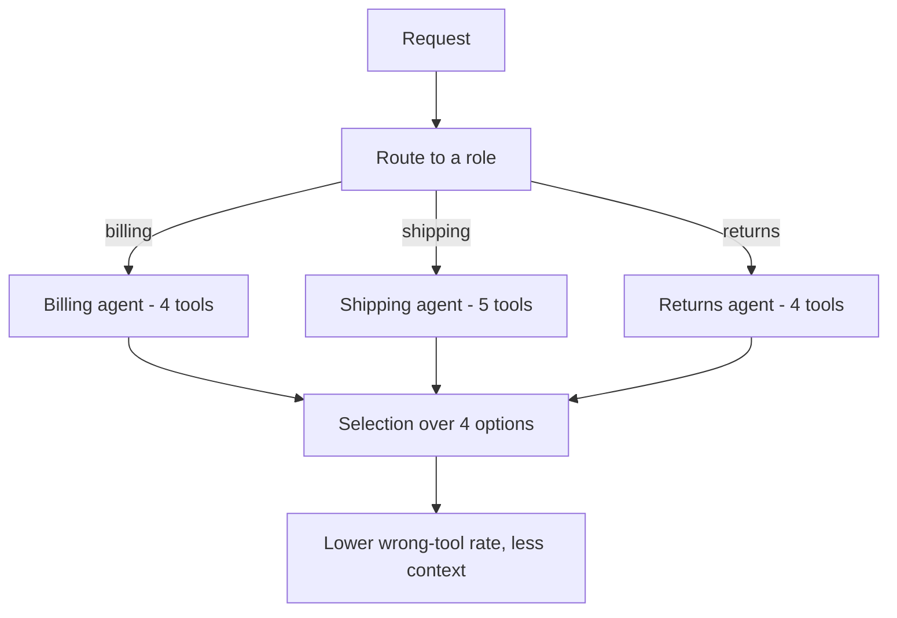
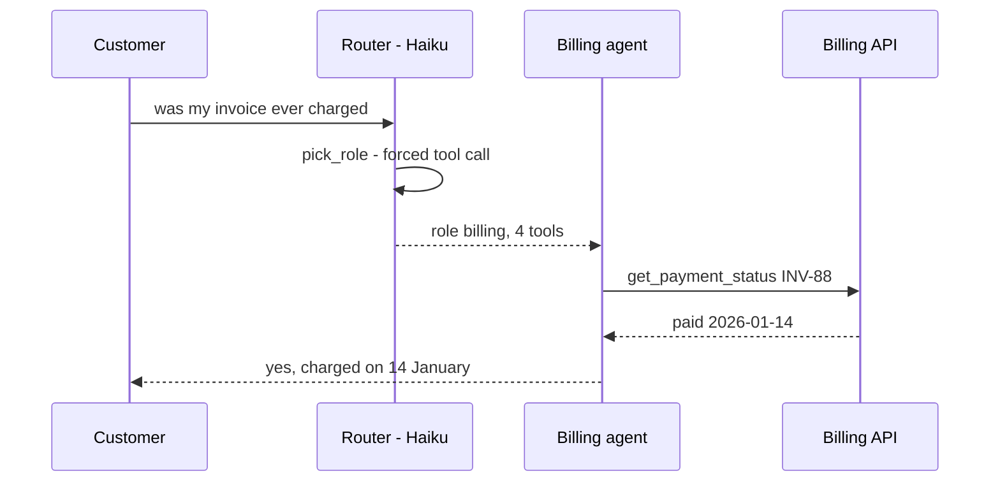

## What Problem Are We Solving?

A support platform gives one agent all twenty of the company's internal tools — billing, shipping,
returns, account management, fraud, inventory — so it can "handle anything."

Then someone looks at the logs. The agent calls `check_shipping_status` on pure billing questions.
Not often, but often enough to matter. Nothing is misconfigured, and every individual description
is fine.

The cause is the size of the menu. Tool selection is a decision over the whole set, made on every
request. Each additional tool is one more option to weigh against every other option — so twenty
tools makes the easy 90% of decisions harder in exchange for marginal help on the rare 10%. It's
the restaurant menu effect: four items is a quick decision, two hundred is a slow one with a worse
outcome.

There's a second cost that's easy to miss. Every tool's name, description and schema is serialised
into **every** request. Twenty tools is a few thousand tokens of context you pay for on every turn
of every conversation, whether or not any of them get used.

And the fix is not a better selection algorithm or a longer prompt. It's giving each agent only the
tools its actual job needs.

> **🗣️ In plain English:** Irrelevant tools are noise, and noise raises the error rate on every choice. Hand each agent the four tools it needs, not the twenty the company owns.

## Meet the Moving Parts

- **The tool set** — what's in `tools` for this request. The unit of scoping, and the thing to
  shrink.
- **The role or subagent boundary** — where scoping naturally lives. A refund agent gets refund and
  order tools; a research agent gets search and fetch. From 1.2, each subagent already has its own
  context, so it can have its own tool set for free.
- **`tool_choice`** — control over *whether and how* a tool gets used, independent of which tools
  exist.
- **The router** — whatever decides which subagent handles a request. Usually a small model call or
  plain classification, and it is the thing that makes narrow tool sets possible.

`tool_choice` has three forms, and they answer different questions:

| Value | Meaning | Use when |
|---|---|---|
| `"auto"` | Claude decides whether to call a tool at all | Default; tool use is optional |
| `"any"` | Must call *some* tool, but picks which | Structured output required, prose unacceptable |
| `{"type": "tool", "name": "X"}` | Must call this exact tool | Enforcing a required first step |

Scoping and `tool_choice` are complementary, not alternatives. Scoping decides what's on the menu;
`tool_choice` decides whether ordering is optional. Neither one is a substitute for a good
description (2.2) — a small set of vague tools still misroutes, just among fewer options.

> **💡 Tip:** MCP servers make this easy to get wrong. Attaching five servers gives you every tool from all five, on every request. Attach what the session needs.

## How It Works, Step by Step

1. **Group the work by role**, not by system. "Billing questions" is a role; "the billing API" is
   a system. Roles are what requests arrive as.
2. **Give each role only its own tools** — typically four to six. If a role needs twelve, it's
   probably two roles.
3. **Route the request to a role first.** A cheap classification step, or a coordinator that
   delegates per 1.3.
4. **Set `tool_choice` per call site.** `"auto"` for conversation; `"any"` when you need structured
   output; a named tool to force a required first step, such as extracting metadata before
   enrichment can mean anything.
5. **Measure selection accuracy per role** (2.2's eval, scoped). The number that matters is
   wrong-tool rate *within* a role, and it should improve as the sets narrow.



## Minimal Working Implementation

Save as `menu.py` and run it. Same four relevant tools, same questions — the only difference is
ten irrelevant tools sitting alongside them, making a menu of fourteen.

```python
import anthropic

client = anthropic.Anthropic()
S = {"type": "object", "required": ["q"],
     "properties": {"q": {"type": "string", "description": "The request"}}}


def tool(name: str, desc: str) -> dict:
    return {"name": name, "description": desc, "input_schema": S}


CORE = [
    tool("get_invoice", "Fetch one invoice: amount, due date, line items."),
    tool("get_payment_status", "Whether an invoice was paid, and when."),
    tool("open_refund", "Start a refund against a paid invoice."),
    tool("get_customer", "Customer profile: name, tier, contact details."),
]

NOISE = [tool(n, d) for n, d in [
    ("check_shipping_status", "Where a parcel currently is."),
    ("book_courier", "Schedule a courier pickup."),
    ("update_address", "Change a shipping address."),
    ("forecast_inventory", "Projected stock levels by SKU."),
    ("adjust_stock", "Correct a warehouse stock count."),
    ("create_ticket", "Open a support ticket."),
    ("search_kb", "Search the help centre articles."),
    ("send_email", "Email a customer."),
    ("check_fraud_score", "Risk score for an order."),
    ("export_report", "Export a CSV report."),
]]

CASES = [("was invoice INV-88 ever paid?", "get_payment_status"),
         ("refund invoice INV-88", "open_refund"),
         ("what tier is this customer on?", "get_customer"),
         ("what's on invoice INV-88?", "get_invoice")]

for label, tools in (("4 tools ", CORE), ("14 tools", CORE + NOISE)):
    hits = 0
    for query, want in CASES:
        r = client.messages.create(
            model="claude-opus-5", max_tokens=1000, tools=tools,
            tool_choice={"type": "any"},
            messages=[{"role": "user", "content": query}])
        hits += next(b.name for b in r.content if b.type == "tool_use") == want
    print(f"{label}: {hits}/{len(CASES)} correct, {len(tools)} on the menu")
```

## Production Implementation

Scoping only holds if it's structural. A registry keyed by role, with the router picking the role,
makes "give it everything" the awkward option rather than the easy one.

```python
ROLES = {
    "billing": ["get_invoice", "get_payment_status", "open_refund",
                "get_customer"],
    "shipping": ["check_shipping_status", "book_courier", "update_address",
                 "get_customer"],
    "returns": ["open_refund", "get_invoice", "create_ticket", "get_customer"],
}

MAX_TOOLS_PER_ROLE = 6          # a role needing more is probably two roles


def tools_for(role: str) -> list[dict]:
    names = ROLES[role]
    if len(names) > MAX_TOOLS_PER_ROLE:
        raise ValueError(f"role {role} has {len(names)} tools; split it")
    return [REGISTRY[n] for n in names]


def route(question: str) -> str:
    """Cheap classification - a small model, not the expensive one."""
    reply = client.messages.create(
        model="claude-haiku-4-5", max_tokens=200,
        tool_choice={"type": "tool", "name": "pick_role"},   # must answer
        tools=[{"name": "pick_role", "description": "Choose the handling team.",
                "input_schema": {"type": "object", "required": ["role"],
                                 "properties": {"role": {"type": "string",
                                                "enum": sorted(ROLES)}}}}],
        messages=[{"role": "user", "content": question}])
    return next(b.input["role"] for b in reply.content if b.type == "tool_use")
```

Forcing a required first step is the other half of `tool_choice` in production:

```python
def enrich(document: str) -> dict:
    # Metadata extraction must happen before enrichment can mean anything,
    # so the first call is forced rather than requested in the prompt.
    first = client.messages.create(
        model="claude-opus-5", max_tokens=4000, tools=tools_for("ingest"),
        tool_choice={"type": "tool", "name": "extract_metadata"},
        messages=[{"role": "user", "content": document}])
    # ...subsequent turns go back to auto so Claude can choose or finish.
    return first
```

**What changed, and why:**

- **Roles are declared data, not an implicit convention.** A registry keyed by role means adding a
  tool to a role is a visible, reviewable change rather than an append to one growing list.
- **A ceiling per role, enforced at build time.** `MAX_TOOLS_PER_ROLE` turns "this agent is getting
  broad" from a code-review opinion into a failing call.
- **The router runs on Haiku with a forced tool.** Classification doesn't need the expensive model,
  and `tool_choice` with a named tool plus an `enum` guarantees a parseable answer instead of prose
  you then have to interpret.
- **`get_customer` deliberately appears in three roles.** Scoping is about relevance per role, not
  about each tool having exactly one home.
- **A forced first call for required ordering.** "Always extract metadata first" in a prompt is a
  request (1.4); `tool_choice` with a name is a guarantee for that one call.

## In Production: Splitting a Twenty-Tool Support Agent

A retailer's support platform started as one agent with every internal tool, and was split into
three role agents behind a router.



**The numbers.** Twenty tool definitions cost about 2,600 tokens per request. The billing agent's
four cost roughly 520 — so the split cut context on every turn as well as narrowing the choice. The
router adds one Haiku call, around 300 tokens and 400ms, which the saving pays for several times
over.

Wrong-tool calls dropped sharply after the split, and no prompt changed. What the team found
interesting was *which* errors disappeared:

- **Cross-domain misroutes vanished entirely**, because they became structurally impossible. The
  billing agent cannot call `check_shipping_status` — it isn't on its menu. That's the difference
  between an unlikely mistake and an unavailable one.
- **Within-role confusion stayed** and had to be fixed the other way. `get_invoice` versus
  `get_payment_status` still overlapped, and only a 2.2-style description rewrite fixed it. Scoping
  removes the far-away wrong answers; descriptions fix the near ones.
- **The router became the new failure point.** An ambiguous "I was charged twice for a returned
  item" is genuinely billing *and* returns. They gave the router a fourth role that holds a small
  shared tool set, rather than pretending the boundary is always crisp.

> **🌍 Real-world example:** The original agent's worst habit was calling `check_shipping_status` for billing questions — both descriptions mentioned "order", and with twenty options that overlap was enough. After the split it stopped, not because the model got better at choosing, but because the wrong option was no longer in the room.

## Where This Applies — and Where It Doesn't

| Situation | Use this | Use instead |
|---|---|---|
| One agent, broad tool set, wrong-tool errors | Split by role; scope tools per role | — |
| Requests fall into clear categories | Router plus role agents | — |
| Structured output required every time | `tool_choice: "any"` | — |
| A step must happen first | `tool_choice` with a named tool | — |
| Confusion between two *similar* tools | — | Rewrite descriptions (2.2) |
| Four tools, still misrouting | — | Descriptions again; the set is already small |
| A tool that must never run in some case | — | A hook (1.5) |

Anti-patterns: adding prompt instructions about which tool to use when the real problem is menu
size; attaching every MCP server you have because it's one line of config each; and splitting so
finely that the router becomes the hard part and every request needs two hops.

## Failure Modes Seen in the Wild

### 1. Cross-domain misrouting

**Symptom.** A billing question triggers a shipping tool.
**Cause.** Both tools were on the same menu, and their descriptions shared a word.
**Fix.** Scope by role so the wrong tool isn't available at all.

### 2. Context paid for on every turn

**Symptom.** Token cost per turn is high before any work happens.
**Cause.** Twenty definitions serialised into every request, used or not.
**Fix.** Scope per role; attach only the MCP servers the session needs.

### 3. The role that grew back

**Symptom.** Six months on, one agent has fifteen tools again.
**Cause.** Adding a tool to an existing role is the path of least resistance.
**Fix.** A per-role ceiling enforced in code, so growth has to be a decision.

### 4. Prose where a tool call was needed

**Symptom.** A pipeline expecting structured output gets a paragraph.
**Cause.** `tool_choice` left at `"auto"` where a call was mandatory.
**Fix.** `"any"`, or a named tool when the specific call is required.

> **⚠️ Watch out:** Scoping and descriptions fix different errors. Narrowing the set removes far-apart mistakes; only better descriptions fix confusion between two genuinely similar tools. Doing one and expecting the other's benefit is the common wasted afternoon here.

## Exam Lens & Key Takeaway

> **📝 Exam focus:** A single agent with a large, broad tool set making frequent wrong-tool errors → **reduce the tool set per subagent or role**. Options adding prompt instructions, a bigger system prompt, or a smarter selection strategy are distractors. Know the three `tool_choice` values cold: `"auto"` (Claude decides whether to use a tool), `"any"` (must call some tool, picks which), `{"type":"tool","name":"X"}` (must call that exact one — the answer when a scenario requires a specific first step). And keep 2.2 straight from this one: *two similar tools* being confused is a description problem; *many tools* causing broad confusion is a scoping problem.

> **🔑 Key takeaway:** Selection quality degrades as the menu grows, and every tool definition is context paid for on every turn — so scope tools per role, four to six each, and route requests to the role first. `tool_choice` then controls whether calling something is optional, mandatory, or a specific required step.
