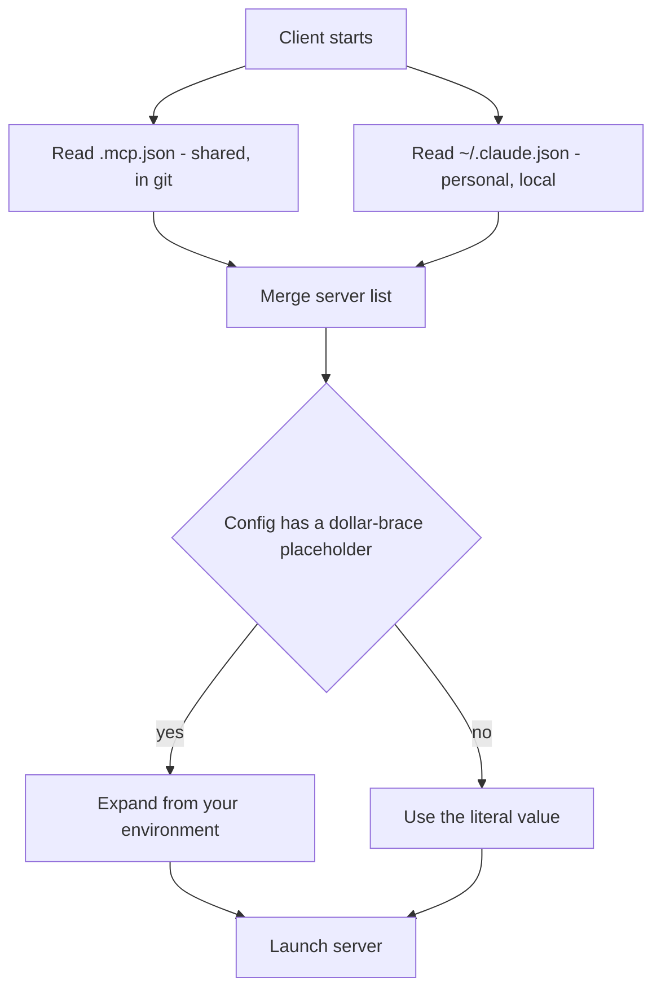
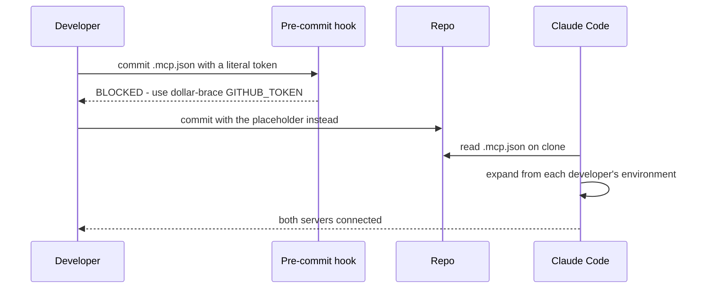

## What Problem Are We Solving?

You've written an MCP server (2.1). Now: where does the declaration that connects to it live?

That sounds like a filing question. It's actually two decisions with real consequences.

**The first is audience.** A shared internal API wrapper should be configured once so every
teammate gets it on clone — nobody should have to be told to set it up, and nobody should be
debugging a missing server for an afternoon. But your experimental connector to your own notes app
has no business appearing in a colleague's session.

**The second is secrets, and it's the one that bites.** A shared config file lives in git. Anything
written into it is visible to everyone with repo access — and to everyone who ever clones the repo,
forever, because git keeps history. Write `"token": "ghp_abc123..."` into a shared config and
you haven't configured a server; you've committed a credential. Deleting it in a later commit does
not remove it.

So you need two locations — one shared, one private — and a way for the shared one to describe
*which* secret to use without containing it.

> **🗣️ In plain English:** Team tools go in the project file so everyone gets them; personal tools stay in your home file. Secrets go in neither — the shared file names the environment variable instead.

## Meet the Moving Parts

- **`.mcp.json`**, in the project root, committed to git. Everyone who clones gets exactly these
  servers. The home for tools the whole team needs.
- **`~/.claude.json`**, in your home directory, never committed and never seen by teammates. The
  home for personal or experimental servers.
- **Environment variable substitution** — `"${GITHUB_TOKEN}"` in the config, with the real value
  supplied by each developer's own environment. The pattern is shared; the value is not.
- **`mcpServers`** — the key both files use, mapping a server name to how to start it (`command`,
  `args`, and often `env`).

| Location | Who sees it | In git? | Use for |
|---|---|---|---|
| `.mcp.json` (project) | The whole team | **Yes** | Servers everyone needs |
| `~/.claude.json` (home) | Only you | No | Personal or experimental servers |

The distinction is about *audience*, not importance. A critical server that only you use still
belongs in your home file; a trivial one the team shares belongs in the project file.

One subtlety worth internalising: because `.mcp.json` is shared, its contents are effectively
public within your organisation. Treat every value you put there as though it will be read by
someone you didn't anticipate — because it will be.

> **⚠️ Watch out:** A secret committed and then removed is still in git history. The fix after a leak is rotation, not deletion — which is why `${VAR}` substitution is a default, not a precaution for the values you *think* are sensitive.

## How It Works, Step by Step

1. **The client reads both files** and merges them, so you see team servers and your personal ones
   together.
2. **`mcpServers` maps a name to a launch spec** — the command to run, its arguments, and any
   environment it needs.
3. **`${VAR}` placeholders are expanded from your environment** when the server starts. The file
   says which variable; your shell says what it contains.
4. **A missing variable fails at connection time**, not silently — which is why a teammate whose
   `GITHUB_TOKEN` isn't set sees a server that won't connect rather than one that misbehaves.
5. **Server names namespace the tools** — `mcp__github__create_issue`. Two servers can expose
   `search` without colliding.

The shape of a shared config, with the secret named but not present:

```json
{
  "mcpServers": {
    "deploy-status": {
      "command": "python",
      "args": ["./tools/deploy_status_server.py"]
    },
    "github": {
      "command": "npx",
      "args": ["-y", "@modelcontextprotocol/server-github"],
      "env": { "GITHUB_PERSONAL_ACCESS_TOKEN": "${GITHUB_TOKEN}" }
    }
  }
}
```



## Minimal Working Implementation

Two files: a shared config that names its secret, and a check that stops a real one being
committed. Save the script as `check_mcp_secrets.py` and run it — it exits non-zero on a hardcoded
credential.

```json
{
  "mcpServers": {
    "oncall": {
      "command": "python",
      "args": ["./tools/oncall_server.py"]
    },
    "github": {
      "command": "npx",
      "args": ["-y", "@modelcontextprotocol/server-github"],
      "env": { "GITHUB_PERSONAL_ACCESS_TOKEN": "${GITHUB_TOKEN}" }
    }
  }
}
```

```python
import json
import pathlib
import re
import sys

PLACEHOLDER = re.compile(r"^\$\{[A-Z0-9_]+\}$")
SECRET_KEY = re.compile(r"token|secret|key|password|credential", re.I)


def offenders(path: pathlib.Path) -> list[str]:
    config = json.loads(path.read_text(encoding="utf-8"))
    bad = []
    for name, server in config.get("mcpServers", {}).items():
        for key, value in (server.get("env") or {}).items():
            if not SECRET_KEY.search(key):
                continue
            if not PLACEHOLDER.match(str(value)):
                bad.append(f"{name}.env.{key} is a literal, not ${{VAR}}")
    return bad


if __name__ == "__main__":
    problems = offenders(pathlib.Path(".mcp.json"))
    for problem in problems:
        print(f"BLOCKED: {problem}", file=sys.stderr)
    print("no hardcoded secrets in .mcp.json" if not problems else "")
    sys.exit(1 if problems else 0)
```

## Production Implementation

The check above is only useful if it runs before the commit lands. Wire it as a pre-commit hook, so
a literal secret can't reach history in the first place.

```yaml
# .pre-commit-config.yaml
repos:
  - repo: local
    hooks:
      - id: mcp-secrets
        name: no hardcoded secrets in .mcp.json
        entry: python tools/check_mcp_secrets.py
        language: system
        files: '^\.mcp\.json$'
        pass_filenames: false
```

Missing variables are the other half — a teammate with an unset token should get a clear message,
not a mysteriously absent server:

```python
import os

REQUIRED_ENV = {"github": ["GITHUB_TOKEN"], "deploy-status": ["DEPLOY_API_KEY"]}


def missing_env(config: dict) -> dict[str, list[str]]:
    """Report which servers cannot start, and why, before Claude Code does."""
    gaps = {}
    for name, server in config.get("mcpServers", {}).items():
        absent = [var for var in REQUIRED_ENV.get(name, [])
                  if not os.environ.get(var)]
        if absent:
            gaps[name] = absent
    return gaps


def doctor() -> None:
    config = json.loads(pathlib.Path(".mcp.json").read_text(encoding="utf-8"))
    for name, absent in missing_env(config).items():
        print(f"! {name} will not connect - set: {', '.join(absent)}")
```

**What changed, and why:**

- **The check is a pre-commit hook, not a script someone remembers.** A leak is unrecoverable by
  editing — the value has to be rotated — so the control has to sit before the commit, exactly the
  1.4 argument arriving as a config problem.
- **It keys on the *name* of the field, not the shape of the value.** Secret formats change and
  detectors miss new ones; a field called `token` holding a literal is suspicious regardless of
  what the literal looks like.
- **A `doctor` command for missing variables.** "The server isn't there" is the single most common
  onboarding complaint, and it's almost always an unset variable. Say so explicitly.
- **`REQUIRED_ENV` is declared.** It doubles as onboarding documentation: this is what you need in
  your environment to work on this repo.

## In Production: A Five-Person Team's Shared Monorepo

A small engineering team keeps `.mcp.json` at the monorepo root, wiring an internal
deployment-status server and the GitHub MCP server.



**How it plays out.** Each engineer's own personal access token is used locally; no shared
credential exists, so nobody has to rotate anything when someone leaves the team. One engineer also
keeps a `~/.claude.json` entry for a server that summarises their personal calendar — useful to
them, and invisible to everyone else, which is exactly right.

Three things worth copying:

- **The hook has caught a real literal token twice in a year.** Both times it was someone testing
  quickly and intending to swap it before committing. Intending to is not a control.
- **`REQUIRED_ENV` became the onboarding doc.** New joiners run the doctor command, see which
  variables they're missing, and set them. Before that, "MCP isn't working for me" was a recurring
  half-hour of someone else's time.
- **One server moved from personal to project.** An engineer's experimental changelog server turned
  out to be broadly useful; promoting it was a two-line change to `.mcp.json`. The two-location
  split gives you a natural path from experiment to team tool — try it in your home file, promote
  it when it earns a place.

> **🌍 Real-world example:** The workshop's own `day1_advanced/mcp` module registers its server with `claude mcp add`, which writes the same `mcpServers` shape into local config. Worth reading the generated entry: it uses absolute paths to a `.venv` python, which is fine for a personal file and a bad idea in a shared one — absolute paths from one machine are the other way a shared config breaks for everyone but its author.

## Where This Applies — and Where It Doesn't

| Situation | Use this | Use instead |
|---|---|---|
| A server the whole team needs | `.mcp.json`, committed | — |
| Anything with a token or key | `${VAR}` substitution | — |
| Your personal or experimental server | `~/.claude.json` | — |
| Trying something before proposing it | `~/.claude.json`, promote later | — |
| A machine-specific absolute path | — | Personal config, or a relative path |
| Per-developer differing values | — | `${VAR}`, so the file stays identical |
| A rule about what a server may do | — | A hook (1.5); config declares, it doesn't enforce |

Anti-patterns: committing a literal token "temporarily"; sharing one team-wide service token
instead of per-developer tokens (nobody can tell who did what, and rotation hits everyone);
absolute paths in shared config; and putting a personal experiment in the project file so
teammates inherit a server they never asked for.

## Failure Modes Seen in the Wild

### 1. The committed credential

**Symptom.** A token in git history; a rotation and an incident write-up.
**Cause.** A literal value in a shared config, often meant to be temporary.
**Fix.** `${VAR}` by default, enforced pre-commit. After a leak, rotate — deleting doesn't help.

### 2. The server that only works on one laptop

**Symptom.** "Connected" for the author, missing for everyone else.
**Cause.** An absolute path, or a variable only that person has set.
**Fix.** Relative paths in shared config, plus a declared `REQUIRED_ENV`.

### 3. The silent onboarding failure

**Symptom.** A new joiner's Claude just doesn't have the tools, with no obvious reason.
**Cause.** An unset environment variable; the server fails to start.
**Fix.** A doctor command that names the missing variables.

### 4. Personal config in the project file

**Symptom.** Teammates carrying a server they don't use, and its tokens' worth of context.
**Cause.** Convenience — the project file was already open.
**Fix.** Home file for personal servers; promote deliberately. And recall 2.4: every attached
server's tools are context on every request.

> **⚠️ Watch out:** Shared config is effectively public inside your organisation, and permanent once in history. Default to `${VAR}` even for values you're confident aren't sensitive — it costs nothing when you're right and saves a rotation when you're wrong.

## Exam Lens & Key Takeaway

> **📝 Exam focus:** Know the two locations and what each is for: **`.mcp.json`** in the project, version-controlled, for team-wide servers; **`~/.claude.json`** in the home directory, local and private, for personal or experimental ones. The secrets question is the other reliable item: a token in a shared config is wrong, and the right answer is environment variable substitution (`"${GITHUB_TOKEN}"`) so the file describes which variable to use without containing the value. Watch for scenarios where a config "works for one developer but not the team" — that's either a personal-file entry that should be shared, or a machine-specific path or variable.

> **🔑 Key takeaway:** `.mcp.json` is shared through git for team servers; `~/.claude.json` is local for personal ones. Because the shared file is permanent and visible to everyone, secrets belong in `${VAR}` placeholders expanded from each developer's own environment — and that should be the default, not a judgement call per value.
