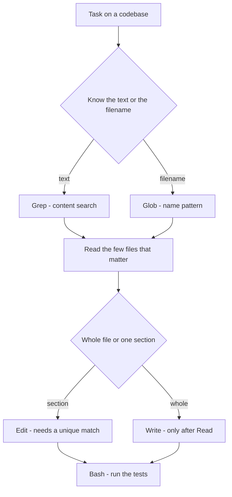
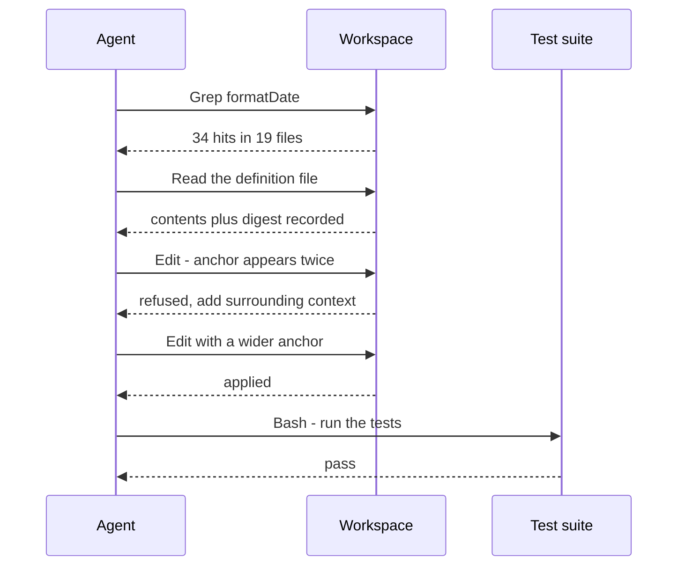

## What Problem Are We Solving?

An agent is asked to rename `formatDate` to `formatDateTime` across a large repository and fix one
buggy line in it.

There are six built-in tools available and several routes through the task. One of them is
efficient: `Grep` to find every reference, `Read` the definition file, `Edit` the one line, `Bash`
to run the tests. Another is expensive and dangerous: `Read` every file in the repo to find
references (blowing out the context, per 1.1), then `Write` whole files back out — which silently
discards anything in them the agent didn't know about.

Same tools, same task, wildly different cost and risk. The tools themselves are unremarkable — they
map to what a developer does by hand — but *which one you reach for* is a real design decision, and
two of them are sharp.

The first sharp edge: **`Write` on an existing file replaces all of it.** If the agent hasn't read
the file, it cannot know what it's throwing away, and nothing will tell it afterwards.

The second: **`Edit` requires its match to be unique.** That isn't a limitation to work around —
it's the safety property that stops a targeted change from landing in the wrong place. Understanding
why it fails is how you stop treating the failure as an obstacle.

> **🗣️ In plain English:** Search by content with `Grep`, by filename with `Glob`. Change part of a file with `Edit`, and only reach for `Write` on a file you've actually read.

## Meet the Moving Parts

Six tools, three natural pairs:

| Tool | What it does | Reach for it when |
|---|---|---|
| `Read` | Loads a file's full contents | You need to see the whole file |
| `Write` | Creates a file, or **replaces** one entirely | Creating something new, or a genuine full rewrite |
| `Edit` | Changes one specific part, leaving the rest alone | Only a section changes — the usual case |
| `Bash` | Runs a shell command | Executing: tests, builds, scripts |
| `Grep` | Searches file *contents* for a pattern | You know the text, not the file |
| `Glob` | Finds files by *name* pattern | You know the filename shape, not the contents |

The pairs are the fast way to remember it: **Grep/Glob** is content versus filename.
**Edit/Write** is part versus whole. **Read/Bash** is looking versus doing.

Two properties deserve more than a table row.

**`Edit`'s uniqueness requirement.** The text you're matching must appear exactly once in the file.
If it appears twice, or not at all, the edit fails rather than guessing. That's deliberate: a
targeted change that silently picks one of three matches is a worse outcome than an error. When it
fails, the fallback is to include more surrounding context so the match becomes unique — or `Read`
the file and `Write` the corrected version.

**`Write`'s destructiveness.** It doesn't merge, and it doesn't warn. On a file the agent hasn't
read, it's an unbounded delete.

> **⚠️ Watch out:** `Grep` and `Glob` exist so an agent doesn't have to `Read` its way to an answer. Reading twenty files to find one function is a context problem (Domain 5) that a single search would have avoided.

## How It Works, Step by Step

1. **Locate first, with the cheapest tool that can do it.** Known text → `Grep`. Known filename
   shape → `Glob`. Neither costs you the file contents.
2. **`Read` only what you'll actually work on.** Every file read is context, resent on every
   subsequent turn.
3. **Prefer `Edit`.** It changes a section and leaves the rest untouched, which is both cheaper and
   safer than rewriting.
4. **If `Edit` fails, widen the match**, don't reach for `Write`. A failure means the anchor text
   wasn't unique — add surrounding lines until it is.
5. **`Write` only for new files, or after a `Read`.** On an existing file, reading first is what
   makes a full rewrite an informed decision instead of a gamble.
6. **`Bash` to verify.** The edit isn't done until something confirms it — running the tests is
   part of the task, not a follow-up (see 1.1's loop).



## Minimal Working Implementation

`Edit`'s uniqueness rule is the part worth having in your hands. This is that semantic, in twenty
lines — save as `edit_tool.py` and run it: the ambiguous edit is refused, the anchored one succeeds.

```python
import pathlib


class EditFailed(Exception):
    """Raised when the anchor is absent or ambiguous - never guess which."""


def edit_unique(path: str, old: str, new: str) -> None:
    text = pathlib.Path(path).read_text(encoding="utf-8")
    hits = text.count(old)
    if hits == 0:
        raise EditFailed(f"anchor not found: {old!r}")
    if hits > 1:
        raise EditFailed(f"anchor appears {hits} times; add surrounding context")
    pathlib.Path(path).write_text(text.replace(old, new), encoding="utf-8")


demo = pathlib.Path("demo.py")
demo.write_text("x = compute(1)\ny = compute(2)\n", encoding="utf-8")

try:
    edit_unique("demo.py", "compute(", "compute_v2(")     # 2 matches
except EditFailed as exc:
    print("refused:", exc)

edit_unique("demo.py", "y = compute(2)", "y = compute_v2(2)")  # unique
print(demo.read_text(encoding="utf-8"))
```

Which tools an agent may use at all is configuration, not prompting:

```json
{
  "permissions": {
    "allow": ["Read(**)", "Grep", "Glob", "Edit(src/**)"],
    "deny": ["Bash(rm *)", "Write(**)"]
  }
}
```

## Production Implementation

Two things make this safe at scale: `Write` on an existing file must prove the file was read, and
the tool set should be scoped to the job (2.4) rather than handed over wholesale.

```python
import hashlib


class ToolDenied(Exception):
    pass


class Workspace:
    """Tracks what was read, so a full overwrite can't be a blind one."""

    def __init__(self, root: pathlib.Path):
        self.root = root.resolve()
        self.read_digests: dict[str, str] = {}

    def _resolve(self, path: str) -> pathlib.Path:
        target = (self.root / path).resolve()
        if not target.is_relative_to(self.root):     # no ../.. escapes
            raise ToolDenied(f"path outside workspace: {path}")
        return target

    def read(self, path: str) -> str:
        text = self._resolve(path).read_text(encoding="utf-8")
        self.read_digests[path] = hashlib.sha256(text.encode()).hexdigest()
        return text

    def write(self, path: str, content: str) -> str:
        target = self._resolve(path)
        if target.exists() and path not in self.read_digests:
            raise ToolDenied(
                f"{path} exists and was never read - Read it first, or use Edit")
        target.write_text(content, encoding="utf-8")
        return f"wrote {len(content)} chars to {path}"
```

Scoping by job keeps a read-only task read-only:

```python
TOOLSETS = {
    "audit": ["Read", "Grep", "Glob"],                    # cannot mutate
    "fix": ["Read", "Grep", "Glob", "Edit", "Bash"],      # no Write at all
    "scaffold": ["Read", "Write", "Glob"],                # new files expected
}


def tools_for(job: str) -> list[dict]:
    return [BUILTIN[name] for name in TOOLSETS[job]]
```

**What changed, and why:**

- **`Write` on an existing file requires a prior `Read`.** This converts the one genuinely
  destructive operation from a judgement call into a precondition — the 1.4 pattern again: the rule
  is in code, and the denial message tells Claude what to do instead.
- **Path resolution is confined to the workspace.** `Edit` and `Read` take paths from the model, and
  `../../` is a legitimate-looking relative path.
- **Digests recorded on read.** They also give you the option of refusing a write when the file
  changed underneath you — the 1.7 staleness problem, at file granularity.
- **Tool sets per job, with `audit` having no mutating tools.** A read-only task should be
  structurally read-only, not merely instructed to be.

## In Production: A Repo-Wide Rename at a Platform Team

An agent renames a widely-used helper across a monorepo and fixes one bug in its implementation.



**The numbers.** `Grep` returned 34 matches across 19 files for about 900 tokens. Reading those 19
files would have been roughly 140,000 tokens — and every one of them resent on every subsequent
turn (1.1). The whole task ran in 11 turns. `Write` was never used, because no file needed a full
rewrite, and `Glob` was never used, because the search was for a symbol rather than a filename
shape.

Three things the team learned:

- **The refused `Edit` was the system working.** `formatDate(` appeared twice in the definition
  file — once in the export, once in an internal call. Guessing would have edited the wrong one and
  passed the tests, leaving a subtle bug. The retry with three lines of surrounding context was the
  correct path.
- **The `Write`-requires-`Read` rule fired once, usefully.** Asked to "clean up" a config file, the
  agent proposed writing a tidy version from scratch. The file had eleven lines of comments
  explaining non-obvious values. The denial turned a silent deletion into a `Read` and a targeted
  `Edit`.
- **The `audit` toolset became the default for exploration.** Most requests start as "find out
  whether…", and running those with no mutating tools at all removed a whole category of worry.

> **🌍 Real-world example:** The most expensive mistake here isn't a wrong edit — it's `Read`-ing your way around a repository. An agent given only `Read` will use it: twenty files to answer one question, then all twenty resent every turn until the run dies on context length. `Grep` and `Glob` exist to make that unnecessary, and an agent's tool set should always include them.

## Where This Applies — and Where It Doesn't

| Situation | Use this | Use instead |
|---|---|---|
| Find every call site of a function | `Grep` — content search | — |
| Find all test files | `Glob` — name pattern | — |
| Change one section of a file | `Edit` | — |
| Create a new file | `Write` | — |
| Run tests, build, or a script | `Bash` | — |
| `Edit` failed on a non-unique match | Widen the anchor | Not `Write` — you'd rewrite blind |
| Full rewrite of an existing file | — | `Read` first, then `Write` |
| Locating a symbol in a big repo | — | `Grep`, not `Read` on each file |

Anti-patterns: `Write` on a file that was never read; `Read`-ing many files where one `Grep` would
answer the question; using `Glob` when you want content or `Grep` when you want filenames; and
handing a read-only task the full mutating tool set.

## Failure Modes Seen in the Wild

### 1. The blind overwrite

**Symptom.** Content disappears — comments, config, an unrelated function.
**Cause.** `Write` on an existing file the agent never read.
**Fix.** Require a prior `Read`; prefer `Edit`.

### 2. Fighting the uniqueness rule

**Symptom.** Repeated `Edit` failures, then a full-file `Write` as a workaround.
**Cause.** Treating "match not unique" as an obstacle rather than a warning.
**Fix.** Widen the anchor with surrounding lines. The rule is protecting you.

### 3. Reading the repository

**Symptom.** Context fills up, cost per turn climbs, long runs fail.
**Cause.** `Read` used for search.
**Fix.** `Grep` for content, `Glob` for names; `Read` only the files you'll change.

### 4. The unverified change

**Symptom.** A "fixed" bug that was never run.
**Cause.** No `Bash` step, or a loop that stopped after the edit.
**Fix.** Verification belongs inside the task — and the loop ends on `end_turn` (1.1), not after
the edit.

> **⚠️ Watch out:** `Write` is the only built-in that destroys information, and it does so without a diff or a warning. Every other mistake here is recoverable from the repository; this one may not be.

## Exam Lens & Key Takeaway

> **📝 Exam focus:** The reliable discriminators are the pairs. **`Grep` searches contents, `Glob` matches filenames** — a question about finding "every call site" or "where an error message appears" is `Grep`; "all test files" or "all config files" is `Glob`. **`Edit` for part of a file, `Write` for a new file or a full replacement** — and `Edit` requires a *unique* match, with the documented fallback being `Read` then `Write` when no unique anchor exists. `Bash` is for execution. Expect a scenario where `Write` is proposed on a file that hasn't been read: that's the wrong answer, because it silently discards content.

> **🔑 Key takeaway:** Content versus filename is `Grep` versus `Glob`; part versus whole is `Edit` versus `Write`. `Edit`'s unique-match requirement is a safety property, not an obstacle — widen the anchor rather than rewriting — and `Write` on an existing file is only safe after you've read it.
