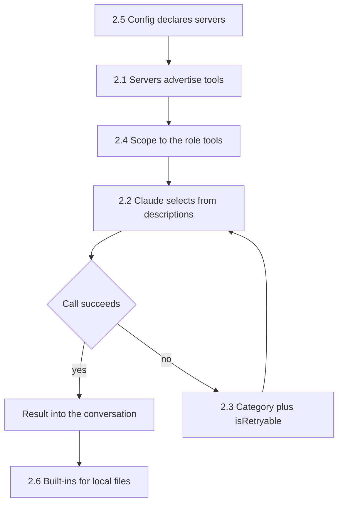
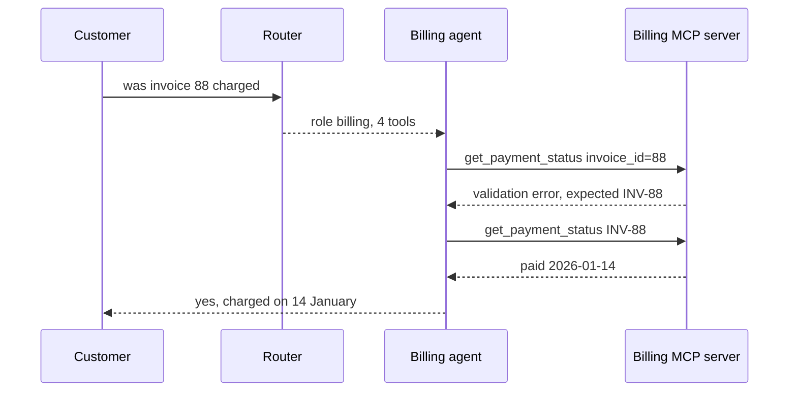

## What Problem Are We Solving?

Domain 1 was the machinery around the model — the loop, delegation, enforcement. This domain is the
**interface** between Claude and everything outside it: the tools you expose, how you describe
them, what they return when they fail, and how the servers that provide them are configured.

It's 18% of the exam, about 11 questions, and it has a distinctive character. Almost every failure
in this domain traces back to a **string you wrote**. Not code, not architecture — a description, a
parameter's documentation, an error message. Claude cannot see your source, your naming
conventions, or your team's shared understanding. At the moment of choosing a tool it has the name,
the description, and the schema, and nothing else.

That makes this the cheapest domain to fix and the easiest to neglect. A misrouting bug that looks
like it needs a router usually needs two sentences added to a description. An agent that reports
false information often has one tool returning its errors as ordinary content.

The exam leans hard on one judgement in particular: when something goes wrong at the interface,
fix the interface. Not the prompt, not the orchestration.

> **🗣️ In plain English:** Tools are Claude's whole view of your systems. Most bugs here are in the text describing them, which is also the cheapest thing you own to fix.

## Meet the Moving Parts

The six subtopics are three layers plus the plumbing:

- **2.1 What is MCP?** The protocol. One self-describing server, many clients, instead of N bespoke
  integrations. Introduces the three primitives — tools are invoked, resources are read, prompts
  are templates — and `isError`, which is what tells Claude a call failed rather than returned
  something odd.
- **2.2 Tool descriptions.** The highest-leverage thing in the domain. Name, description and schema
  are the entire interface, and the clauses that fix misrouting are the ones people skip: when
  *not* to use a tool, and how it differs from its neighbour.
- **2.3 Structured errors.** What a tool hands back when it fails. Four categories, and only
  transient is retryable as-is.
- **2.4 Too many tools.** Selection degrades as the menu grows, and every definition is context on
  every turn. Scope per role; use `tool_choice` to control whether calling is optional.
- **2.5 MCP configuration.** Where servers are declared — `.mcp.json` shared through git,
  `~/.claude.json` local — and why secrets belong in `${VAR}` placeholders.
- **2.6 Built-in tools.** Claude Code's own six: content versus filename search, part versus whole
  file editing, and the two sharp edges — `Edit` needs a unique match, `Write` replaces everything.

Read as layers: 2.1 and 2.5 are how capabilities arrive; 2.2 and 2.3 are how they're described and
how they report failure; 2.4 is how many of them Claude should face at once; 2.6 is the built-in
set you get for free.

> **💡 Tip:** 2.2 and 2.4 look similar and are tested as opposites. *Two similar tools* confused with each other is a description problem. *Many tools* causing broad confusion is a scoping problem.

## How It Works, Step by Step

One request through the interface layer, touching every subtopic:

1. **Servers are declared** in `.mcp.json` for the team or `~/.claude.json` for you, with secrets
   as `${VAR}` placeholders (2.5).
2. **The client connects and each server advertises itself** — tools with schemas, resources,
   prompts (2.1).
3. **Only the tools this role needs are in the request** — four to six, not everything the company
   owns (2.4).
4. **Claude picks a tool from the descriptions alone**, which is why triggers and exclusions decide
   whether it picks the right one (2.2).
5. **The tool runs**, or fails and returns a category and an accurate retryable flag so the next
   move is determined rather than guessed (2.3).
6. **On a local codebase, the built-ins do the work** — `Grep` to locate, `Edit` to change, `Bash`
   to verify (2.6).



## Minimal Working Implementation

The interface layer in one file — a scoped tool set, descriptions with exclusions, and a
categorised error. Save as `interface.py` and run it.

```python
import json
import anthropic

client = anthropic.Anthropic()

# 2.2: purpose, trigger, input, exclusion, differentiation.
TOOLS = [{
    "name": "get_invoice",
    "description": ("Returns one invoice: amount, due date, line items. Use "
                    "for questions about WHAT WAS BILLED. NOT for whether it "
                    "was paid - use get_payment_status for that."),
    "input_schema": {"type": "object", "required": ["invoice_id"],
                     "properties": {"invoice_id": {
                         "type": "string",
                         "description": "Invoice key, e.g. INV-88"}}},
}, {
    "name": "get_payment_status",
    "description": ("Returns whether an invoice was paid and when. Use for "
                    "'did it pay' questions. NOT for line items - use "
                    "get_invoice for those."),
    "input_schema": {"type": "object", "required": ["invoice_id"],
                     "properties": {"invoice_id": {
                         "type": "string",
                         "description": "Invoice key, e.g. INV-88"}}},
}]                      # 2.4: two tools, scoped to one role
```

The handler returns a *categorised* failure, and the loop sets `is_error` from it:

```python
def get_payment_status(invoice_id: str) -> dict:
    if not invoice_id.startswith("INV-"):        # 2.3: validation
        return {"isError": True, "errorCategory": "validation",
                "isRetryable": False,
                "message": "invoice_id must look like INV-88"}
    return {"paid": True, "paid_at": "2026-01-14"}


HANDLERS = {"get_payment_status": get_payment_status,
            "get_invoice": lambda invoice_id: {"amount": 4210, "lines": 3}}

messages = [{"role": "user", "content": "Was invoice 88 ever charged?"}]
for _ in range(6):
    r = client.messages.create(model="claude-opus-5", max_tokens=16000,
                               tools=TOOLS, messages=messages)
    if r.stop_reason != "tool_use":
        break
    messages.append({"role": "assistant", "content": r.content})
    out = []
    for b in (x for x in r.content if x.type == "tool_use"):
        res = HANDLERS[b.name](**b.input)
        out.append({"type": "tool_result", "tool_use_id": b.id,
                    "content": json.dumps(res),
                    "is_error": bool(res.get("isError"))})
    messages.append({"role": "user", "content": out})

print(next(b.text for b in r.content if b.type == "text"))
```

Note the shape of the first exchange: "invoice 88" isn't `INV-88`, so the first call returns a
validation error, and Claude corrects the argument rather than retrying it.

## Production Implementation

What makes an interface layer maintainable is that its qualities are checkable. Descriptions,
error categories and tool-set size are all measurable — so measure them.

```python
REQUIRED_CUES = ("Use when", "Use for", "NOT for")
CATEGORIES = {"transient", "validation", "business", "permission"}
MAX_TOOLS_PER_ROLE = 6


def audit_tools(tools: list[dict]) -> list[str]:
    """Runs in CI. Catches the omissions that cause most interface bugs."""
    problems = []
    if len(tools) > MAX_TOOLS_PER_ROLE:
        problems.append(f"{len(tools)} tools in one role; scope it (2.4)")
    for tool in tools:
        text = tool["description"]
        if not any(cue in text for cue in REQUIRED_CUES):
            problems.append(f"{tool['name']}: no trigger/exclusion clause (2.2)")
        schema = tool["input_schema"]
        for param, spec in schema.get("properties", {}).items():
            if not spec.get("description"):
                problems.append(f"{tool['name']}.{param}: undocumented (2.2)")
    return problems
```

The error contract is worth asserting too, because a mis-categorised failure is worse than an
uncategorised one:

```python
def assert_error_contract(payload: dict) -> None:
    if not payload.get("isError"):
        return
    category = payload.get("errorCategory")
    if category not in CATEGORIES:
        raise AssertionError(f"unknown errorCategory {category!r} (2.3)")
    # Derived, never authored: only transient can succeed on a repeat.
    if payload.get("isRetryable") != (category == "transient"):
        raise AssertionError(f"{category} must not be marked retryable (2.3)")
    if not payload.get("message"):
        raise AssertionError("error with no message invites an invented cause")
```

**What changed, and why:**

- **Description quality is a CI check.** It can't judge writing, but it reliably catches the two
  omissions behind most misrouting: no exclusion clause, and undocumented parameters.
- **Tool-set size is enforced, not reviewed.** A role that grows past six fails the build, so
  scope creep has to be an explicit decision (2.4).
- **`isRetryable` is asserted against the category.** This is the one error-contract bug with a
  loop attached, so it gets a test rather than a convention.
- **An error with no message fails the contract.** No message is what produces confidently invented
  causes — the failure mode that reaches users as false information.

## In Production: The Interface Layer of a Support Platform

A retailer's support agent talks to four internal systems through MCP, split into three roles
behind a router.



**The numbers that shaped it.** Twenty tools cost ~2,600 tokens per request; the billing role's
four cost ~520. A description-quality pass moved within-role selection accuracy from 71% to 97%
with no code change. Roughly 8% of calls hit a transient upstream error, and nearly all succeed on
one retry — which only works because the category says so.

The three decisions they'd defend:

- **Descriptions are reviewed like code.** They're prompts, and they drift like prompts. A
  labelled selection eval in CI is what stopped "small clarification" from costing five points of
  routing accuracy.
- **Every MCP server raises rather than returning error dicts.** The one incident that reached
  customers was a server returning `{"error": ...}` as a successful result; the agent relayed it as
  fact. `isError` is a one-field difference between a handled failure and a false answer.
- **Nobody attaches all the servers.** Sessions attach what they need. Five servers means every
  tool from all five, on every turn — cost *and* selection quality, both worse.

> **🌍 Real-world example:** The pattern is visible in this workshop's own `day1_advanced/mcp` server, live in this session. `mcp__oncall__get_oncall` has a good docstring — teams are listed — but its generated schema is `{"team": {"title": "Team", "type": "string"}}`, with no parameter description. The tool is well described; the parameter isn't. That's the 2.2 gap in a real server, in one line.

## Where This Applies — and Where It Doesn't

| Symptom you're given | Layer at fault | Subtopic |
|---|---|---|
| Wrong tool chosen between two similar ones | Descriptions — no exclusion clause | 2.2 |
| Right tool, wrong argument format | Undocumented parameter | 2.2 |
| Broad confusion across a large tool set | Scoping | 2.4 |
| Prose returned where a call was required | `tool_choice` | 2.4 |
| Retry loop on an impossible call | Error category / retryable | 2.3 |
| Failure text reported as a real answer | `isError` never set | 2.1, 2.3 |
| Capability should be passive context | Should be a resource, not a tool | 2.1 |
| Token committed to a shared config | Config location and `${VAR}` | 2.5 |
| Content silently lost from a file | `Write` without `Read` | 2.6 |
| Context exhausted locating a symbol | `Read` used instead of `Grep` | 2.6 |

Nothing in that table is "the model reasoned badly", and that's the point. If an option blames
model quality, or proposes a classifier, a router, or extra prompt instructions where a description
or a category would do, it's a distractor.

## Failure Modes Seen in the Wild

### 1. The error that became an answer

**Symptom.** Confident false information relayed to a user.
**Cause.** A tool returned its error as ordinary content, so `isError` was never set.
**Fix.** Raise, or set the flag. This is the failure mode that reaches customers (2.1, 2.3).

### 2. Accurate descriptions, overlapping territory

**Symptom.** Consistent misrouting between one specific pair.
**Cause.** Both say what they do; neither says what it isn't for.
**Fix.** Trigger and exclusion clauses, cross-referencing each other (2.2).

### 3. The menu that kept growing

**Symptom.** Rising cost per turn and cross-domain misroutes.
**Cause.** Tools added to one agent because it was the easy place.
**Fix.** Roles with a ceiling, enforced in code (2.4).

### 4. The retry that could never work

**Symptom.** An identical failing call, repeated.
**Cause.** A validation or business error marked retryable, or an unknown error defaulted to it.
**Fix.** Derive `isRetryable` from the category; default unknowns to non-retryable (2.3).

> **⚠️ Watch out:** Every tool definition and every connected server's advertisement is context, paid for on every turn. The interface layer has a running cost even when nothing gets called.

## Exam Lens & Key Takeaway

> **📝 Exam focus:** 18% of the exam, ~11 questions, and the single most repeated judgement is: when Claude picks the wrong tool, **improve the description** — not a router, not a classifier, not more prompt instructions. Keep the pairs straight: tool (invoked) vs resource (read); description problem (two similar tools) vs scoping problem (many tools); transient (retryable) vs validation/business/permission (not); `Grep` (contents) vs `Glob` (filenames); `Edit` (part, unique match) vs `Write` (whole, destructive); `.mcp.json` (team, in git) vs `~/.claude.json` (personal). And know the three `tool_choice` values, since "must call this specific tool first" is a recurring scenario.

> **🔑 Key takeaway:** This domain is the interface layer, and nearly every failure in it lives in text you wrote — a description missing its exclusion clause, a parameter with no documentation, an error with no category. Fix the interface before adding orchestration, and remember every tool definition is context you pay for on every turn.
