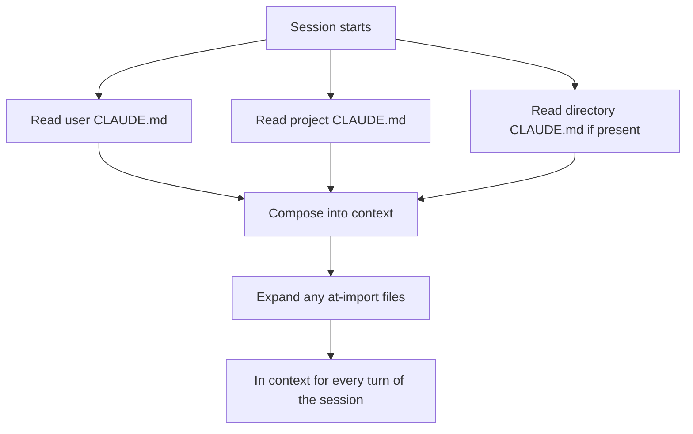
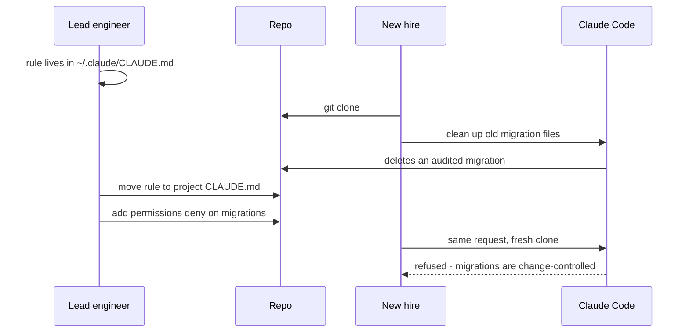

## What Problem Are We Solving?

A lead engineer at a fintech has a rule she cares about: never touch `/migrations` without
explicit confirmation. She writes it into her personal `~/.claude/CLAUDE.md`. It works. Every
session, every project, for months.

Three months later a new backend engineer clones the repo and asks Claude Code to "clean up some
old migration files." Claude has never heard of the rule — it was never in the repository — and
deletes a historical migration the audit trail depended on.

Nothing malfunctioned. The guardrail simply wasn't there, because it lived on one laptop.

This is the domain's defining mistake, and it's worth being precise about why it's so easy to make:
**a rule in your personal config is indistinguishable, from your seat, from a rule the team has.**
It works for you every day. The gap only becomes visible when someone else's session behaves
differently — usually a new hire, usually at the worst moment.

CLAUDE.md is how you close the gap. It's a plain markdown file Claude reads at the start of every
session — a standing briefing, the onboarding notes you'd hand a new contractor. Write "we use
pnpm, not npm" once and stop retyping it. But *which* CLAUDE.md you write it in decides whether
it's a team standard or a personal habit.

> **🗣️ In plain English:** CLAUDE.md is what Claude knows before you say anything. If a rule matters to the team, it has to live in the repo — not on your machine.

## Meet the Moving Parts

Three levels, and choosing between them is the skill:

| Level | Location | Scope | For |
|---|---|---|---|
| **User** | `~/.claude/CLAUDE.md` | You, every project | Personal preferences — verbosity, your own commit trailer |
| **Project** | `./CLAUDE.md` or `.claude/CLAUDE.md` | Everyone who clones | Team standards, guardrails, conventions |
| **Directory** | `CLAUDE.md` in a subfolder | Work inside that folder | Rules specific to `backend/` vs `frontend/` |

The golden rule: **team rules belong at project level.** The user level is for things that are
about *you*, not about the codebase. If a teammate would be worse off without the rule, it isn't a
preference — it's a standard, and it belongs in git.

Two mechanisms keep a growing file manageable:

- **`@import path/to/file.md`** pulls another file's content in, so standards can be split by topic
  rather than piled into one document.
- **`.claude/rules/`** holds separate rule files, optionally scoped to file patterns so they only
  load when relevant. That's 3.2, and it's the answer once the root file passes a few hundred lines.

The principle underneath both is **context hygiene**. Everything in CLAUDE.md is in context for
every session, whether or not it applies. React styling rules are pure noise while Claude debugs a
Python job — and noise costs tokens on every turn and degrades attention to the rules that do
apply.

> **⚠️ Watch out:** "It works on my machine" is the symptom. If a guardrail is doing real work, test it by asking what a fresh clone gets — because that is what your next teammate will have.

## How It Works, Step by Step

1. **A session starts** and Claude reads the applicable CLAUDE.md files — user level, then project,
   then any directory-level file for where it's working.
2. **They compose rather than replace.** A directory file adds to the project file; it doesn't
   override it wholesale.
3. **`@import` is expanded inline**, so an imported file's content is context exactly as if it had
   been pasted in — including its length.
4. **All of it is context on every turn**, which is why size matters. A 600-line CLAUDE.md is paid
   for on every request in the session.
5. **Nothing enforces any of it.** CLAUDE.md is instruction, not enforcement — the 1.4 distinction.
   A rule that must hold every time needs a hook (1.5) or a permission deny rule.



## Minimal Working Implementation

CLAUDE.md is a file, so the interesting code is the check that keeps it honest. Save as
`claude_md_lint.py` and run it in a repo — it fails on the three things that actually go wrong.

```python
import pathlib
import re
import sys

MAX_LINES = 400
PERSONAL_SMELLS = re.compile(
    r"\b(I prefer|my personal|for me\b|I like|my github|my handle)\b", re.I)


def lint(root: pathlib.Path) -> list[str]:
    path = root / "CLAUDE.md"
    if not path.exists():
        path = root / ".claude" / "CLAUDE.md"
    if not path.exists():
        return ["no project CLAUDE.md - team rules have nowhere to live"]

    text = path.read_text(encoding="utf-8")
    problems = []

    lines = text.count("\n") + 1
    if lines > MAX_LINES:
        problems.append(f"{lines} lines (max {MAX_LINES}); split via .claude/rules/")

    for match in PERSONAL_SMELLS.finditer(text):
        problems.append(f"personal preference in a team file: {match.group(0)!r}")

    for target in re.findall(r"^@import\s+(\S+)", text, re.M):
        if not (root / target).exists():
            problems.append(f"@import target missing: {target}")

    return problems


if __name__ == "__main__":
    found = lint(pathlib.Path("."))
    for problem in found:
        print(f"CLAUDE.md: {problem}", file=sys.stderr)
    print("CLAUDE.md looks healthy" if not found else "")
    sys.exit(1 if found else 0)
```

## Production Implementation

The linter catches shape problems. It cannot catch the actual failure from the opening story — a
rule that exists only in someone's home directory. That needs a different check, run by each
developer against their own machine.

```python
import pathlib

HOME_CONFIG = pathlib.Path.home() / ".claude" / "CLAUDE.md"

# Words that mark a rule as a guardrail rather than a preference. A guardrail
# in a personal file is the "works on my machine" bug waiting to happen.
GUARDRAIL = ("never", "must not", "always", "do not", "forbidden", "required")


def personal_rules_that_should_be_shared() -> list[str]:
    if not HOME_CONFIG.exists():
        return []
    project = pathlib.Path("CLAUDE.md")
    shared = project.read_text(encoding="utf-8").lower() if project.exists() else ""
    leaked = []
    for line in HOME_CONFIG.read_text(encoding="utf-8").splitlines():
        stripped = line.strip()
        if not stripped or stripped.startswith("#"):
            continue
        if any(word in stripped.lower() for word in GUARDRAIL):
            if stripped.lower() not in shared:
                leaked.append(stripped)
    return leaked
```

Enforcement is the other half — CLAUDE.md asks, settings enforce:

```json
{
  "permissions": {
    "deny": ["Write(migrations/**)", "Edit(migrations/**)", "Bash(rm -rf *)"]
  }
}
```

**What changed, and why:**

- **A separate check for guardrails hiding in personal config.** This is the failure the linter
  can't see, because from inside the repo the rule simply doesn't exist. It has to be run from the
  developer's side, and it's worth doing when someone joins or leaves a project.
- **A line budget with a stated remedy.** "Too long" is unhelpful; "split via `.claude/rules/`"
  points at 3.2, which also makes the rules load conditionally rather than always.
- **`@import` targets are resolved.** A broken import fails silently — the content simply isn't
  there — which is the same invisible-absence problem as the personal-config rule.
- **The genuinely non-negotiable rule moved into `permissions.deny`.** "Never touch `/migrations`"
  in CLAUDE.md is a request; a deny rule is a guarantee. Keep the prose *and* the deny rule: one
  steers, the other enforces (1.4).

## In Production: A Fintech's Migration Guardrail

The team from the opening, after the incident.



**What the review turned up.** The personal config held eleven rules. Four were genuine
preferences. **Seven were team standards** that had been silently absent for every other engineer
for months — including the migrations guardrail, a "run `pnpm`, never `npm`" convention that
explained a recurring lockfile conflict, and a rule about not editing generated clients that
explained a different recurring diff.

None of the other six had caused an incident yet. That's the part worth sitting with: the config
had been quietly wrong for months, and the only signal was a class of small friction nobody had
connected to a cause.

Three changes stuck:

- **The project CLAUDE.md got a line budget and a linter in CI.** It had drifted to 240 lines
  before anyone looked; topic files under `.claude/rules/` took it back to 90.
- **Guardrails were duplicated into `permissions.deny`.** The prose explains *why* migrations are
  protected, which makes Claude's refusal useful rather than baffling; the deny rule makes the
  refusal certain.
- **The personal-config audit became part of offboarding.** When someone leaves, their laptop's
  rules leave with them — so the question "what's in your `~/.claude/CLAUDE.md` that the rest of us
  don't have?" is now asked before the laptop goes back.

> **🌍 Real-world example:** This workshop ships both halves of the contrast. `day1_fundamentals/context/before_CLAUDE.md` is a real bad one — pasted out of a doc, escaped markdown and all — and `sandbox_repo/CLAUDE.md` is the rewrite: why the repo is the way it is, who owns what, which decisions are settled. The difference isn't length. It's that the second answers questions a newcomer would actually ask.

## Where This Applies — and Where It Doesn't

| Situation | Use this | Use instead |
|---|---|---|
| A convention the whole team follows | Project CLAUDE.md, in git | — |
| Your own verbosity or style preference | User CLAUDE.md | — |
| Rules that differ between `backend/` and `frontend/` | Directory-level CLAUDE.md | — |
| Rules for a file *type* scattered everywhere | — | `.claude/rules/` with globs (3.2) |
| The root file has passed a few hundred lines | — | Split via `@import` or `.claude/rules/` |
| A rule that must hold every single time | — | `permissions.deny` or a hook (1.4, 1.5) |
| A secret or token | — | Never here; this file is committed |

Anti-patterns: team rules in personal config (the big one); a CLAUDE.md that has become a
changelog of everything anyone ever wanted; and relying on prose for a guardrail that needs to be
enforced. Length matters more than people expect — every line is context on every turn, and a rule
buried on line 380 competes with everything above it.

## Failure Modes Seen in the Wild

### 1. The rule that only one person has

**Symptom.** Claude behaves differently for a new teammate; a guardrail doesn't fire.
**Cause.** The rule lives in `~/.claude/CLAUDE.md`.
**Fix.** Move it to the project file. Audit personal configs when people join or leave.

### 2. The file nobody reads any more

**Symptom.** Rules are ignored, and adding emphasis doesn't help.
**Cause.** Hundreds of lines, most irrelevant to any given task.
**Fix.** Split by topic; scope by path (3.2). Context hygiene is the point.

### 3. The silent broken import

**Symptom.** A documented standard has no effect.
**Cause.** An `@import` target was moved or renamed; the content simply isn't there.
**Fix.** Resolve import targets in CI.

### 4. The guardrail that was only a request

**Symptom.** The rule is in the project file and still gets violated occasionally.
**Cause.** CLAUDE.md is instruction, not enforcement.
**Fix.** Add a deny rule or a hook. Keep the prose for the explanation.

> **⚠️ Watch out:** A rule's presence in *your* context is not evidence it's in anyone else's. The only test that means anything is what a fresh clone gets.

## Exam Lens & Key Takeaway

> **📝 Exam focus:** Know the three levels and their locations: **user** (`~/.claude/CLAUDE.md`, personal, never shared), **project** (`./CLAUDE.md` or `.claude/CLAUDE.md`, committed, team-wide), **directory** (a `CLAUDE.md` in a subfolder, applies while working there). The most-tested judgement is placement, and the classic scenario is a rule that "works for one engineer but not a new hire" — that's a team rule sitting in personal config, and the fix is moving it to the project level. Also know `@import` for splitting a long file and `.claude/rules/` for path-scoped rules, both motivated by context hygiene: rules that don't apply are noise.

> **🔑 Key takeaway:** CLAUDE.md is the standing briefing Claude reads every session, and the level you put a rule at decides who gets it. Team rules belong in the repo, personal preferences in your home directory — and because everything in it is context on every turn, split and scope it rather than letting it grow.
