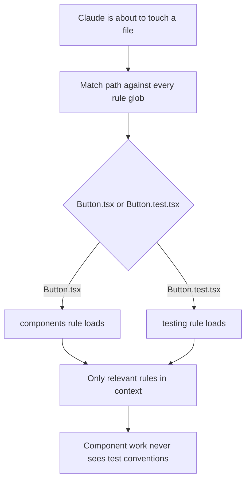
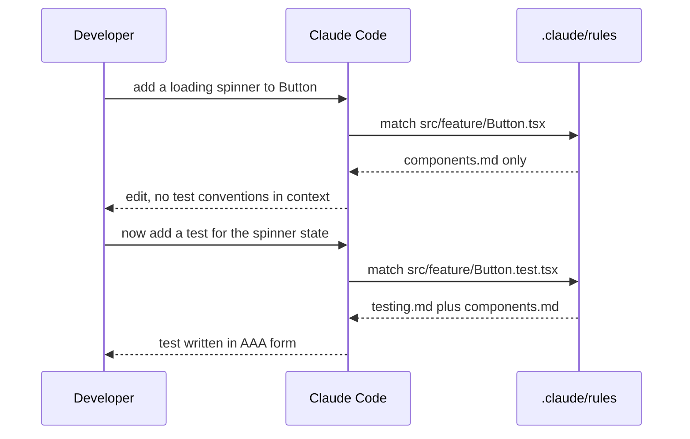

## What Problem Are We Solving?

A SaaS team colocates tests with source: `Button.tsx` sits next to `Button.test.tsx`, across forty
feature folders. They want every test file to follow the AAA pattern and hit a coverage bar.

Put that in the root CLAUDE.md and it's in context always — while Claude edits a component, a
config file, a database migration. Twenty lines of testing conventions, permanently irrelevant to
most of the work, permanently occupying attention and tokens.

Put it in a directory-level CLAUDE.md and you hit a worse problem: there's no directory to put it
in. The tests aren't in a `tests/` folder — they're scattered across forty folders, each one
containing components the rule must *not* apply to. You'd need forty directory files, each one
lying slightly, because it would also apply to the components sitting beside the tests.

The mismatch is that directory-level scoping is by **location**, and what you want to scope by is
**pattern**. `**/*.test.tsx` is not a place.

Path-specific rules close that gap. A rule file declares which files it applies to, and loads only
when Claude touches a matching one.

> **🗣️ In plain English:** Some rules belong to a *kind* of file, not a folder. Scope those by glob so they show up exactly when they're relevant and stay out of the way otherwise.

## Meet the Moving Parts

- **`.claude/rules/`** — a folder of separate markdown rule files, one per topic.
- **The `paths` frontmatter field** — an array of glob patterns declaring what a rule applies to.
- **The glob itself** — `**/*.test.tsx` means "any file in any nested folder ending `.test.tsx`".
  The `**` is what makes it reach across the tree.
- **The conditional load** — Claude checks which rule files match the file it's about to work on,
  and pulls in only those.

A rule file is just markdown with that frontmatter on top: the `paths` array, then the guidance
itself. Several rules can match the same file, in which case they all load and compose — which is
convenient until two of them disagree, a case worth handling deliberately rather than discovering.

The distinction against directory-level CLAUDE.md is worth holding precisely:

| Approach | Scoped by | Best for |
|---|---|---|
| Directory `CLAUDE.md` | Location in the folder tree | Everything under `backend/` — where the files genuinely live together |
| `.claude/rules/` with `paths` | Filename pattern, any folder | A file *type* scattered across the codebase |

Neither is better. They answer different questions. If you can point at a folder and say "these
rules apply to everything in here", that's a directory file. If you find yourself saying "any file
ending in X, wherever it lives", that's a glob.

> **💡 Tip:** The tell is the sentence you'd write. "Rules for the backend" → directory. "Rules for test files" → glob. The second one names a kind of file, not a place.

## How It Works, Step by Step

A rule file, whole — frontmatter declaring what it applies to, then the guidance:

```text
# .claude/rules/testing.md
---
paths: ["**/*.test.tsx", "**/*.spec.ts"]
---

All tests follow AAA: Arrange, Act, Assert.
Every exported function needs at least one unit test.
Use describe() for groups and it() for individual cases.
```

1. **Rules live as files under `.claude/rules/`**, each with `paths` frontmatter. Committed to git,
   so the whole team gets them.
2. **Claude is about to work on a file** — read, edit, whatever.
3. **It matches that path against every rule's globs.** More than one can match; they compose.
4. **Matching rules load into context.** Non-matching ones stay dormant and cost nothing.
5. **Context shrinks back** when work moves to a file that doesn't match.
6. **A rule with no `paths` behaves like an always-on rule** — which is fine, but at that point ask
   whether it belongs in CLAUDE.md instead.

The effect on a single session is the whole point: editing `Button.tsx` loads the component rules;
editing `Button.test.tsx` in the same folder loads the testing rules instead.



## Minimal Working Implementation

Glob matching is the whole mechanism, and it's worth having in your hands — mismatches here are
silent. Save as `rules_for.py` and run it: the same folder, two files, different rules.

```python
import fnmatch
import pathlib
import re

RULES_DIR = pathlib.Path(".claude/rules")
FRONT = re.compile(r"^---\n(.*?)\n---\n", re.S)


def rule_paths(text: str) -> list[str]:
    """Read the paths: ["a", "b"] array out of a rule's frontmatter."""
    block = FRONT.match(text)
    if not block:
        return []
    line = re.search(r"^paths:\s*\[(.*)\]", block.group(1), re.M)
    return re.findall(r'"([^"]+)"', line.group(1)) if line else []


def rules_for(target: str) -> list[str]:
    matched = []
    for rule in sorted(RULES_DIR.glob("*.md")):
        globs = rule_paths(rule.read_text(encoding="utf-8"))
        # No paths declared means the rule is unconditional.
        if not globs or any(fnmatch.fnmatch(target, g) for g in globs):
            matched.append(rule.name)
    return matched


RULES_DIR.mkdir(parents=True, exist_ok=True)
(RULES_DIR / "testing.md").write_text(
    '---\npaths: ["**/*.test.tsx", "**/*.spec.ts"]\n---\nAAA pattern.\n',
    encoding="utf-8")
(RULES_DIR / "components.md").write_text(
    '---\npaths: ["src/**/*.tsx"]\n---\nProps interfaces are exported.\n',
    encoding="utf-8")

for target in ("src/feature/Button.tsx", "src/feature/Button.test.tsx",
               "scripts/build.py"):
    print(f"{target:34} -> {rules_for(target) or ['(none)']}")
```

Run it and note the second line: `Button.test.tsx` matches *both* globs, because `src/**/*.tsx`
also matches a `.test.tsx` file. Overlap is the failure mode this topic hides.

## Production Implementation

Two things bite in practice. Globs that look right but don't match, and globs that match more than
intended — the overlap above.

```python
import fnmatch
import pathlib


def audit_globs(rules: dict[str, list[str]], sample: list[str]) -> list[str]:
    """Check every rule's globs against a real sample of repo paths."""
    problems = []
    for name, globs in rules.items():
        hits = {p for p in sample
                for g in globs if fnmatch.fnmatch(p, g)}
        if not hits:
            problems.append(f"{name}: matches nothing in the repo - dead rule")
            continue
        # A "test files" rule that also pulls in sources is the classic bug.
        if name.startswith("testing") and any(
                ".test." not in p and ".spec." not in p for p in hits):
            leaked = sorted(p for p in hits if ".test." not in p)[:3]
            problems.append(f"{name}: also matches non-tests, e.g. {leaked}")
    return problems


def repo_sample(root: pathlib.Path, limit: int = 2000) -> list[str]:
    return [str(p.relative_to(root)).replace("\\", "/")
            for p in list(root.rglob("*"))[:limit] if p.is_file()]
```

Ordering matters when rules overlap, so make precedence explicit rather than alphabetical:

```text
# .claude/rules/testing.md
---
paths: ["**/*.test.tsx", "**/*.spec.ts"]
priority: 10          # higher wins where guidance conflicts
---

Tests follow AAA. Do NOT export props interfaces from a test file -
that rule applies to components only.
```

**What changed, and why:**

- **Globs are audited against real repo paths, not read carefully.** A pattern that matches nothing
  is a rule that silently never loads — the same invisible-absence failure as 3.1's broken import.
- **Overlap is checked, not assumed away.** `src/**/*.tsx` catching `.test.tsx` files is easy to
  miss because both rules are individually correct.
- **Conflicts are resolved in the rule, not left to load order.** When two rules match, they
  compose — so if their guidance disagrees, say which wins and carve out the exception explicitly.
- **A dead rule is reported as a problem.** Rules outlive the file layouts they were written for; a
  rename to `.spec.tsx` quietly retires every `.test.tsx` rule you have.

## In Production: Colocated Tests Across Forty Feature Folders

The SaaS team from the opening, after moving testing conventions out of the root file.



**The numbers.** The root CLAUDE.md was 310 lines; about 90 of those were testing and story
conventions relevant to a minority of files. Moving them to two scoped rule files took the
always-on context to 220 lines, and a component edit now loads roughly 40 lines of rules instead of
310. The saving is per-turn, for the length of the session.

Three things they hit:

- **The first glob was wrong and nothing said so.** They wrote `paths: ["*.test.tsx"]` without the
  `**`, which matches only test files at the repo root — of which there were none. The rule loaded
  for exactly zero files for two weeks, and the only symptom was tests quietly not following AAA.
- **The overlap was real.** `src/**/*.tsx` matched test files too, so component rules loaded during
  test writing and told Claude to export props interfaces from test files. The fix was an explicit
  carve-out in the testing rule rather than a cleverer glob.
- **One rule genuinely wanted a directory, not a glob.** Everything under `infra/` follows
  different conventions regardless of file type — that's a location, so it stayed a directory-level
  CLAUDE.md. Not every rule wants to be a glob.

> **🌍 Real-world example:** The dead-glob failure is the one to watch for, because it presents as "Claude ignores our conventions." Nothing errors, nothing warns, and the rule file sits in the repo looking correct. A single `**` is the difference between a rule that governs four hundred files and one that governs none.

## Where This Applies — and Where It Doesn't

| Situation | Use this | Use instead |
|---|---|---|
| Conventions for test files, wherever they live | `.claude/rules/` with a glob | — |
| Rules for a file extension or naming pattern | `.claude/rules/` with a glob | — |
| Generated files that must not be hand-edited | `.claude/rules/` with a glob | — |
| Everything under one folder, all file types | — | Directory-level CLAUDE.md (3.1) |
| A rule that genuinely applies to everything | — | Project CLAUDE.md |
| A rule that must be enforced, not followed | — | A hook or a deny rule (1.4, 1.5) |

Anti-patterns: forgetting `**` and silently matching nothing; writing globs so broad they're
effectively always-on (at which point the file belongs in CLAUDE.md); creating dozens of
directory-level files to approximate a pattern; and letting two overlapping rules give conflicting
guidance without saying which wins.

## Failure Modes Seen in the Wild

### 1. The glob that matches nothing

**Symptom.** A documented convention is ignored, consistently.
**Cause.** A missing `**`, or a pattern written for a layout that has since changed.
**Fix.** Audit globs against a real sample of repo paths in CI.

### 2. The glob that matches too much

**Symptom.** Guidance from the wrong rule shows up during unrelated work.
**Cause.** `src/**/*.tsx` also matches `.test.tsx`.
**Fix.** Check overlap explicitly; carve out the exception in the more specific rule.

### 3. The rule that outlived its layout

**Symptom.** Conventions stop applying after a rename or restructure.
**Cause.** Patterns are coupled to file naming, and naming changed.
**Fix.** Treat a dead rule as a build failure, not a curiosity.

### 4. Everything scoped, nothing shared

**Symptom.** Basic project conventions get missed in files no rule happens to match.
**Cause.** Over-correcting — scoping rules that should be always-on.
**Fix.** Genuinely universal rules stay in CLAUDE.md. Scope the ones that are conditional.

> **⚠️ Watch out:** Every failure here is silent. A rule that doesn't load produces no error — just work that doesn't follow a convention you believe is configured.

## Exam Lens & Key Takeaway

> **📝 Exam focus:** The discriminator is **pattern versus location**. `.claude/rules/` with a `paths` glob scopes by filename pattern and reaches across the whole tree; a directory-level `CLAUDE.md` scopes by folder. The canonical scenario is colocated test files scattered across many folders — a directory file can't target them without also catching the sources beside them, so the answer is a glob-scoped rule. Know the frontmatter shape (`paths: ["**/*.test.tsx"]`) and the motivation: context hygiene, so rules that don't apply don't take up context. If the scenario says "everything under `backend/`", that's a location and the answer is a directory-level file instead.

> **🔑 Key takeaway:** Scope by glob when the rule belongs to a kind of file, by directory when it belongs to a place. A `paths` array in `.claude/rules/` loads the rule only for matching files — and the failure mode is silence, so audit that your globs actually match something.
