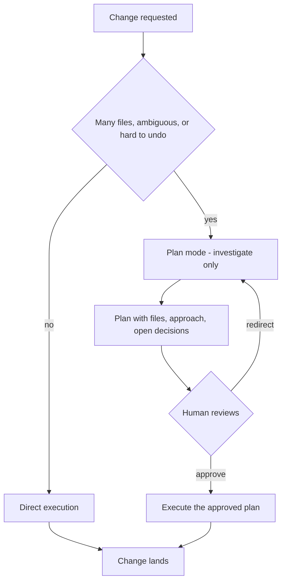
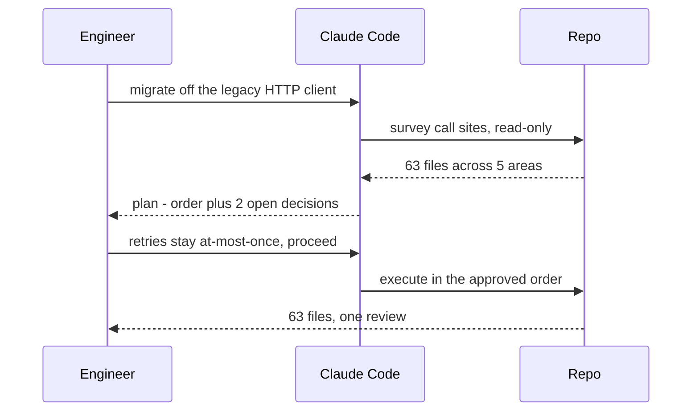

## What Problem Are We Solving?

Two requests arrive the same morning. One: fix a broken date-format string in a validation
function. Two: migrate the REST layer off a legacy HTTP client across sixty-odd files.

Both are "ask Claude to change code." Treating them the same way is wrong in either direction.
Demand a written plan for the date string and you've added ceremony to a five-minute job. Let the
migration charge ahead file by file and you find out on file forty-one that the two libraries
handle retries differently — after forty files were already changed on the old assumption.

Claude Code gives you two modes for exactly this. In **plan mode**, Claude surveys, proposes an
approach, and waits for your approval before touching anything. In **direct execution**, it just
does the work.

The contractor analogy holds well: blueprints before you knock a wall down, no blueprints to fix a
dripping tap.

What makes this a real skill rather than a preference is that the deciding signal is not "is this a
code change" — both modes change code. It's **scope, ambiguity, and reversibility**. A change is
plan-worthy when it's large, when several defensible approaches exist, or when getting it wrong is
expensive to undo. Those three are what you're actually assessing, and they're assessable before
any work starts.

> **🗣️ In plain English:** Plan first when the change is big, when there's more than one right answer, or when undoing it would hurt. Otherwise just do it.

## Meet the Moving Parts

- **Plan mode** — Claude investigates, produces a plan naming the files and the approach, and
  stops. Nothing is modified until you approve.
- **Direct execution** — the normal loop from 1.1, acting as it goes.
- **`--permission-mode plan`** — the flag that starts a session in plan mode, which is what makes
  this enforceable rather than a habit.
- **The decision itself** — three signals, and any one of them is enough:

| Signal | Plan mode | Direct execution |
|---|---|---|
| **Scale** | Many files, cross-cutting | One file, one function |
| **Ambiguity** | Several valid approaches | One obvious correct fix |
| **Reversibility** | Migrations, architecture, restructuring | Trivially revertable |

The right column of the exam's own table is instructive: a single-file bug fix, adding a date
validation check, renaming a variable, fixing a typo. Small blast radius, one obvious answer,
cheap to undo. The left: 45+ file changes, architectural decisions, library migrations,
microservice restructuring.

The value of plan mode isn't the plan document. It's the **decision point before the work** — the
moment a bad assumption is cheap to correct. In the migration above, the retry-handling difference
is worth finding at the survey stage, not on file forty-one.

> **⚠️ Watch out:** The most expensive mistakes aren't the ones you approve — they're the ones nobody was asked about. A plan surfaces the questions; direct execution answers them silently and moves on.

## How It Works, Step by Step

1. **Assess before starting.** How many files, how many defensible approaches, how bad is undoing
   it. Any one of the three tipping high means plan.
2. **Start in plan mode** — `--permission-mode plan`, or switch into it.
3. **Claude investigates without modifying.** It reads, greps, surveys — building the picture that
   makes a plan worth anything.
4. **It presents the plan**: the files, the approach, the ordering, and — most valuably — the
   decisions it can't make for you.
5. **You approve, redirect, or reject.** The redirect is the point. Correcting an assumption here
   costs one message.
6. **Execution follows the approved plan**, and the loop from 1.1 takes over.

For a small change, skip straight to step 6. That is the correct behaviour, not a shortcut.



## Minimal Working Implementation

The judgement is assessable from the changeset, so it can be scored rather than felt. Save as
`plan_or_not.py` and run it in a repo with uncommitted work.

```python
import subprocess
import sys

# Paths where a mistake is expensive to undo.
IRREVERSIBLE = ("migrations/", "infra/", "terraform/", ".github/workflows/",
                "schema.prisma", "Dockerfile")
MANY_FILES = 8


def changed_files(base: str = "HEAD") -> list[str]:
    out = subprocess.run(["git", "diff", "--name-only", base],
                         capture_output=True, text=True, check=True)
    return [line for line in out.stdout.splitlines() if line]


def assess(files: list[str]) -> tuple[bool, list[str]]:
    reasons = []
    if len(files) >= MANY_FILES:
        reasons.append(f"scale: {len(files)} files changed")
    risky = [f for f in files if any(marker in f for marker in IRREVERSIBLE)]
    if risky:
        reasons.append(f"reversibility: touches {', '.join(risky[:3])}")
    # Cross-cutting work is a decent proxy for "more than one right answer".
    roots = {f.split("/")[0] for f in files}
    if len(roots) >= 4:
        reasons.append(f"ambiguity: spans {len(roots)} top-level areas")
    return bool(reasons), reasons


if __name__ == "__main__":
    files = changed_files(sys.argv[1] if len(sys.argv) > 1 else "HEAD")
    needs_plan, reasons = assess(files)
    for reason in reasons:
        print(f"  - {reason}")
    print("PLAN MODE" if needs_plan else "direct execution is fine")
    sys.exit(1 if needs_plan else 0)
```

## Production Implementation

Scoring a changeset after the fact is the wrong end. In production you want the assessment *before*
the work, and you want plan mode to be the default where it matters.

```python
import subprocess

# Estimate the blast radius from the request, before anything is changed.
def survey(target_glob: str) -> tuple[int, int]:
    out = subprocess.run(["git", "ls-files", target_glob],
                         capture_output=True, text=True, check=True)
    files = [f for f in out.stdout.splitlines() if f]
    roots = {f.split("/")[0] for f in files}
    return len(files), len(roots)


def launch(prompt: str, target_glob: str) -> list[str]:
    """Build the claude invocation, choosing the mode from the blast radius."""
    count, roots = survey(target_glob)
    argv = ["claude"]
    if count >= MANY_FILES or roots >= 4:
        # Plan mode is a flag, so this is a guarantee rather than a habit.
        argv += ["--permission-mode", "plan"]
    return argv + [prompt]
```

For unattended runs the same judgement becomes a hard boundary — a CI agent gets no approver, so it
gets no ability to make plan-worthy changes at all:

```json
{
  "permissions": {
    "deny": [
      "Edit(migrations/**)",
      "Edit(infra/**)",
      "Edit(.github/workflows/**)"
    ]
  }
}
```

**What changed, and why:**

- **The survey runs before the work, not after.** Counting files you've already changed tells you
  what you should have done. Counting files you're *about to* change is the actual decision.
- **`--permission-mode plan` rather than asking nicely.** "Please plan first" in a prompt is a
  request (1.4). The flag is the mechanism, and it's what makes plan mode enforceable in a script
  or a team convention.
- **Unattended runs deny the irreversible paths outright.** Plan mode's value is a human at the
  decision point. With no human, the honest configuration isn't "plan carefully" — it's "cannot
  touch migrations", and escalate to a person.
- **Thresholds are named constants.** `MANY_FILES = 8` is a judgement worth arguing about in review
  rather than burying in a condition.

## In Production: A Sixty-File HTTP Client Migration

The migration from the opening, run in plan mode.



**What the plan actually bought.** Claude surveyed the call sites and proposed an order — utilities
first, then feature modules, then tests — and flagged two places where the old and new libraries
differ on retry semantics. That second part is the whole return on the exercise: a decision the
engineer had to make, surfaced before sixty files were written on a guess.

The survey cost about four minutes and roughly 30K tokens. The migration took an afternoon. Had the
retry difference surfaced at file forty-one, the redo would have cost most of a day — and the
version that got it wrong would still have passed the tests, because no test covered a retried
request.

Two more things from the same team:

- **A teammate skipped plan mode the same day, correctly.** One broken date-format string, one
  obvious fix. Insisting on a plan there would have been process for its own sake — which is how a
  useful practice becomes something people route around.
- **The threshold got tuned down.** They started at "20+ files" and moved to 8 after a six-file
  change to auth middleware went sideways. File count alone was the wrong signal; *which* files
  mattered more, which is why the production version weighs paths as well as counts.

> **🌍 Real-world example:** The failure plan mode prevents is specific and easy to underrate. It isn't Claude doing something reckless — it's Claude doing something *reasonable* under an assumption nobody checked. In the migration, "translate each call site faithfully" was a perfectly sensible default. It was also wrong for two of them, and nothing in the code would have said so.

## Where This Applies — and Where It Doesn't

| Situation | Use this | Use instead |
|---|---|---|
| Change spans many files | Plan mode | — |
| Several defensible approaches | Plan mode | — |
| Migrations, infra, architecture | Plan mode | — |
| Unfamiliar area of the codebase | Plan mode — the survey is the value | — |
| One-line fix with an obvious answer | — | Direct execution |
| Renaming a variable, fixing a typo | — | Direct execution |
| Adding one validation check | — | Direct execution |
| Unattended CI, no approver | — | Deny the risky paths (plan mode needs a human) |

Anti-patterns: always planning, which trains people to approve without reading; never planning,
which discovers the decisions during the work; and — the subtle one — using plan mode with no
intention of scrutinising the plan, which costs the survey and buys nothing.

## Failure Modes Seen in the Wild

### 1. The unasked question

**Symptom.** A large change lands looking correct and is wrong in a way tests don't catch.
**Cause.** A decision was made silently mid-execution.
**Fix.** Plan mode, specifically for the "open decisions" section.

### 2. Rubber-stamped plans

**Symptom.** Plans are always approved, immediately.
**Cause.** Plan mode applied to everything, so reviewing became a formality.
**Fix.** Reserve it for changes that clear the threshold; that's what keeps the review real.

### 3. File count as the only signal

**Symptom.** A six-file change to something load-bearing goes wrong.
**Cause.** The threshold looked at scale but not at which paths were touched.
**Fix.** Weigh irreversibility too — auth, migrations and infra are plan-worthy at any size.

### 4. Plan mode in an unattended run

**Symptom.** A CI job hangs, or the plan is auto-approved and the mode was theatre.
**Cause.** Plan mode assumes a human at the decision point.
**Fix.** In CI, restrict what the agent can touch instead (3.6).

> **⚠️ Watch out:** Plan mode is not a safety control. It's a review opportunity, and its whole value is a person actually reading the plan. If nobody reads it, you have the cost and none of the benefit.

## Exam Lens & Key Takeaway

> **📝 Exam focus:** The discriminator is **scope and ambiguity, not "is it a code change"** — both modes change code. Plan mode for large-scale changes (the exam's examples: 45+ files, architectural decisions, library migrations, microservice restructuring) and wherever multiple valid approaches exist. Direct execution for a single-file bug fix, adding a validation check, renaming a variable, fixing a typo. Expect a scenario pairing a big migration with a trivial fix and asking which gets which — and watch for the distractor that says every code change deserves a plan. The recurring cue for plan mode is a decision the model shouldn't make alone.

> **🔑 Key takeaway:** Plan first when the change is large, ambiguous, or hard to undo — any one of the three is enough. The value isn't the document, it's the decision point before the work, where a wrong assumption costs one message instead of forty files.
