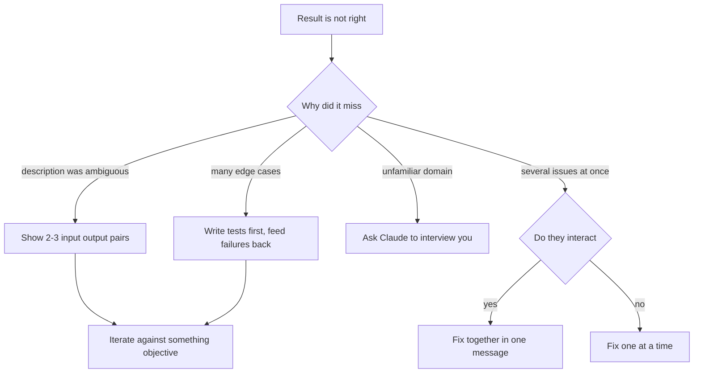
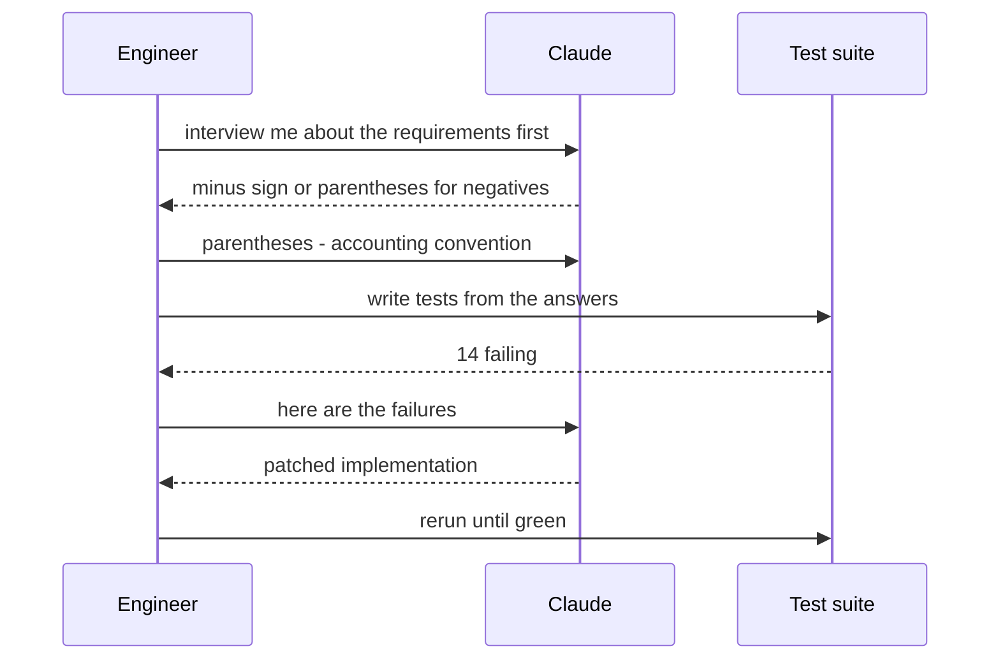

## What Problem Are We Solving?

A developer asks for a CSV-to-JSON converter. What comes back mishandles quoted commas and drops
empty trailing fields. So they try again, with more adjectives: "handle edge cases properly",
"be robust", "make it production-quality".

It doesn't get better, because the problem was never effort. The description was ambiguous and
adding emphasis didn't remove the ambiguity — "handle edge cases" doesn't say *which* edge cases,
and the developer doesn't have them all in their head either.

Iterative refinement is the practice of structuring a *sequence* of exchanges instead of writing
one long hopeful instruction. Four techniques, and the useful part is that they're not
interchangeable: each answers a different reason the first attempt missed.

- The description was ambiguous → **show examples**.
- The correctness surface is large → **let tests specify it**.
- You don't know what to specify → **have Claude interview you**.
- You have several things to fix → **batch or sequence them deliberately**.

The skill is diagnosing which one you're in. Reaching for "be more specific" when the real problem
is that you don't know what to be specific *about* is the loop most people get stuck in.

> **🗣️ In plain English:** When the result isn't right, change how you're asking, not how emphatically. Show examples, let tests do the specifying, or let Claude ask the questions.

## Meet the Moving Parts

| Technique | What it is | Reach for it when |
|---|---|---|
| **Input/output examples** | 2–3 concrete pairs of input and desired output | A description keeps producing inconsistent results |
| **Test-driven iteration** | Write tests first, feed failures back one round at a time | Many edge cases; correctness is the hard part |
| **Interview pattern** | Ask Claude to question *you* before starting | Unfamiliar domain — you don't know what you'd forget |
| **Batching vs sequencing** | Group interacting fixes; separate independent ones | Multiple issues to address at once |

Two of these deserve unpacking.

**Examples beat adjectives** because they're unambiguous. "Format dates nicely" admits a dozen
readings; three input/output pairs admit one. Include the awkward case — a row with a comma inside
quotes — and you've specified the behaviour that prose was quietly leaving open.

**Batching is a real decision, not a style choice.** If two bugs interact — fixing A changes what
the right fix for B is — describe them together, or you'll get a fix for A that has to be undone.
If they're independent, do them one at a time: separate changes are easier to verify and easier to
revert individually.

The interview pattern is the one people skip, and it's the highest-value technique in an unfamiliar
domain. You can't specify what you don't know to mention. Claude does know which questions are
usually relevant — asking it to ask surfaces the constraint you'd otherwise discover in
production.

> **💡 Tip:** If your last three messages were rephrasings of the same instruction, stop. Rephrasing is the signal that you need a different technique, not better wording.

## How It Works, Step by Step

1. **Diagnose the miss.** Ambiguous description, large correctness surface, unknown requirements,
   or several tangled asks — each has a different remedy.
2. **Ambiguous → give examples**, including one deliberately awkward case. Two or three pairs is
   usually enough.
3. **Large correctness surface → write the tests first.** The suite becomes the specification, and
   each failure is a precise signal instead of "it's still not right".
4. **Unfamiliar domain → ask to be interviewed** before any code exists. Answer the questions;
   they become the spec.
5. **Several issues → decide batch or sequence.** Interacting together, independent separately.
6. **Iterate against something objective.** Tests passing, examples matching. Refinement against
   "feels better" doesn't converge.



## Minimal Working Implementation

Test-driven iteration is the one that's genuinely a program. Save as `tdd_loop.py` and run it: it
writes a failing test suite, then loops — failures in, patch out — until the suite is green.

```python
import pathlib
import subprocess
import anthropic

client = anthropic.Anthropic()
MAX_ROUNDS = 5

TESTS = """
from money import parse_money
def test_plain():    assert parse_money("$1,234.50") == 123450
def test_negative(): assert parse_money("-$5.00") == -500
def test_parens():   assert parse_money("($5.00)") == -500
def test_euro():     assert parse_money("EUR 1.234,50") == 123450
"""
STUB = """def parse_money(text):
    return 0
"""
pathlib.Path("test_money.py").write_text(TESTS, encoding="utf-8")
pathlib.Path("money.py").write_text(STUB, encoding="utf-8")

def run_tests() -> tuple[bool, str]:
    proc = subprocess.run(["python", "-m", "pytest", "-q", "test_money.py"],
                          capture_output=True, text=True)
    return proc.returncode == 0, proc.stdout[-2000:]


for round_no in range(1, MAX_ROUNDS + 1):
    passed, output = run_tests()
    print(f"round {round_no}: {'PASS' if passed else 'fail'}")
    if passed:
        break
    current = pathlib.Path("money.py").read_text(encoding="utf-8")
    prompt = f"""Rewrite money.py so every test passes. Return ONLY the file
contents, with no code fences.

Current money.py:
{current}

Failures:
{output}"""
    reply = client.messages.create(
        model="claude-opus-5", max_tokens=8000,
        messages=[{"role": "user", "content": prompt}])
    code = next(b.text for b in reply.content if b.type == "text")
    pathlib.Path("money.py").write_text(code, encoding="utf-8")
```

The tests are the specification. Nobody had to describe "negative amounts in parentheses" in
prose — `test_parens` says it exactly, and says it again on every round.

## Production Implementation

Two things make that loop safe to leave running: it must not "fix" the tests, and it must not
iterate forever on something it isn't converging on.

```python
import hashlib
import pathlib

TEST_FILE = pathlib.Path("test_money.py")


def digest(path: pathlib.Path) -> str:
    return hashlib.sha256(path.read_bytes()).hexdigest()


def guarded_round(baseline: str) -> None:
    """The spec is not negotiable - if the tests changed, the run is void."""
    if digest(TEST_FILE) != baseline:
        raise RuntimeError("test file was modified; the loop edited its own spec")


def converging(history: list[int]) -> bool:
    """Stop when failures stop dropping - two flat rounds means stuck."""
    return len(history) < 3 or len(set(history[-3:])) > 1
```

Iterating on a stuck loop is the expensive failure, so escalate instead of repeating:

```python
history: list[int] = []
baseline = digest(TEST_FILE)

for round_no in range(1, MAX_ROUNDS + 1):
    passed, output = run_tests()
    guarded_round(baseline)
    if passed:
        break
    history.append(output.count("FAILED"))
    if not converging(history):
        raise RuntimeError(
            f"no progress across 3 rounds ({history[-3:]}); "
            "the tests may be contradictory - a human should look")
    # ...patch and continue
```

**What changed, and why:**

- **The test file is fingerprinted.** Given "make the tests pass", editing the tests is a valid
  reading and a catastrophic one — it converts a failing implementation into a passing lie. The
  spec has to be immutable for the loop to mean anything.
- **Convergence is checked, not assumed.** Three rounds at the same failure count means the loop is
  circling. Usually the tests contradict each other, and no amount of iteration resolves that.
- **A round cap on top.** Convergence detection catches the stuck case; the cap catches the slow
  one.
- **Failures are truncated to the last 2,000 characters.** Full pytest output on a large suite is
  enormous, and every round resends the history (1.1).

## In Production: A Multi-Currency Parser at a Payments Team

An engineer needed to parse money strings from a dozen locales and had never done multi-currency
formatting before — so all four techniques showed up, in order.



**How it actually went.** The interview came first and was the highest-leverage step: Claude asked
whether negative amounts use a minus sign or parentheses. The engineer hadn't considered
parentheses at all — it's an accounting convention that appears throughout their input data. That
one question prevented a parser that would have silently read `($5.00)` as positive five.

Then examples for the ambiguous bits — `EUR 1.234,50` versus `$1,234.50`, where the separators
swap roles. Then the test suite from those answers, and the loop: 14 failures, then 6, then 2, then
green in four rounds.

Three things worth copying:

- **The interview happened before any code existed.** Asked after a first attempt, it becomes a
  critique of what's already written. Asked first, it's a specification.
- **Two bugs were batched deliberately.** Thousands-separator handling and decimal-separator
  handling interact — in `1.234,50` the same character means different things by locale. Fixed
  separately, the first fix would have had to be undone. Fixed together, one coherent change.
- **A third bug was kept separate.** Currency-symbol placement had nothing to do with separators,
  so it went in its own round and its own commit — easy to verify, easy to revert alone.

> **🌍 Real-world example:** The loop's near-miss is instructive. In round three it proposed changing `test_euro` — the test was "wrong", it said, because `EUR 1.234,50` is ambiguous. It has a point in the abstract. But the loop's job is to satisfy the spec, not renegotiate it, and a run that edits its own tests to green is worse than one that fails. The digest check turned a plausible argument into a hard stop.

## Where This Applies — and Where It Doesn't

| Situation | Use this | Use instead |
|---|---|---|
| Description keeps producing near-misses | Input/output examples | — |
| Many edge cases, correctness is the hard part | Test-driven iteration | — |
| Unfamiliar domain, unsure what to specify | Interview pattern, before any code | — |
| Two bugs where fixing one changes the other | Batch into one message | — |
| Several unrelated bugs | Sequence them, one per round | — |
| You've rephrased the same ask three times | — | A different technique, not better wording |
| The result is genuinely unverifiable | — | Define what "right" means first |

Anti-patterns: adding adjectives instead of examples; batching unrelated changes so nothing can be
verified or reverted independently; interviewing after the code exists; and iterating against taste
rather than something objective, which doesn't converge.

## Failure Modes Seen in the Wild

### 1. The rephrasing loop

**Symptom.** Three messages saying the same thing more emphatically.
**Cause.** The problem is ambiguity, and emphasis doesn't reduce ambiguity.
**Fix.** Switch technique — show examples, or write a test.

### 2. The loop that edited its spec

**Symptom.** Tests pass; the behaviour is still wrong.
**Cause.** "Make the tests pass" was satisfied by changing the tests.
**Fix.** Fingerprint the test file and fail the run if it changes.

### 3. The tangled batch

**Symptom.** Fixing one issue reintroduces another, repeatedly.
**Cause.** Interacting bugs addressed one at a time.
**Fix.** Describe interacting issues together; keep independent ones separate.

### 4. The interview that came too late

**Symptom.** A rewrite after requirements surface mid-implementation.
**Cause.** The interview was used to critique existing code rather than to specify.
**Fix.** Interview first, in an unfamiliar domain especially.

> **⚠️ Watch out:** An unbounded refinement loop is a bill with no ceiling. Cap the rounds, and stop when failure counts stop dropping — a loop that isn't converging usually means the spec contradicts itself, which more iterations cannot fix.

## Exam Lens & Key Takeaway

> **📝 Exam focus:** Match technique to symptom. Inconsistent results from a natural-language description → **input/output examples** (2–3 pairs). Complex function with many edge cases → **test-driven iteration**, tests first, failures fed back. Unfamiliar domain where you might forget requirements → **interview pattern**, Claude asks you. Multiple issues → the rule is **interacting bugs together in one message, independent bugs one at a time in sequence** — expect that pairing to be tested directly, in both directions. The distractor throughout is "write a longer, more detailed prompt", which is the thing none of these four techniques is.

> **🔑 Key takeaway:** When the output isn't right, change the technique rather than the wording. Examples remove ambiguity, tests carry a large correctness surface, an interview surfaces what you didn't know to specify — and interacting fixes get batched while independent ones get sequenced.
