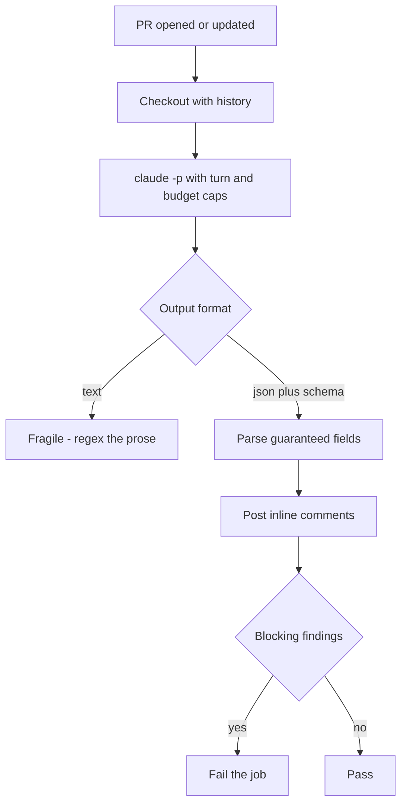
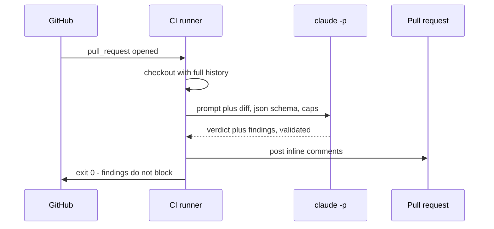

## What Problem Are We Solving?

You want Claude to review every pull request. So you put `claude "review this diff"` in a GitHub
Actions step.

The job hangs. Not fails — hangs. Claude Code starts an interactive session, waits for input, and
there is nobody at the other end. The runner sits there until the job timeout kills it, with every
other job queued behind it.

That's the first problem, and the flag that fixes it is one character. The second problem is
subtler and survives the fix: **a pipeline step is a program, and programs need parseable output.**
Getting back three paragraphs of prose and regex-hunting for "looks good" to decide pass or fail is
a build that breaks whenever the phrasing shifts.

The third has nothing to do with flags. If the same session that wrote the code also reviews it,
you have a reviewer with a memory of *why* every choice was made — and the same blind spot as an
author proofreading their own writing. It will tend to agree with itself.

So: run non-interactively, get structured output, and make the reviewer independent.

> **🗣️ In plain English:** Headless mode so the job doesn't hang, JSON so the next step can read the answer, and a fresh instance so the review isn't the author marking its own homework.

## Meet the Moving Parts

- **`-p` / `--print`** — non-interactive. Runs the task, prints, exits. Without it, a pipeline job
  waits forever for a prompt nobody will type.
- **`--output-format`** — `text` (default), `json` (one result envelope), or `stream-json`.
  Machines parse JSON reliably; prose they do not.
- **`--json-schema`** — goes further: enforces a *specific* shape, so the step that posts PR
  comments can rely on fields existing rather than hoping.
- **`--max-turns`** — a ceiling on the agentic loop (1.1), so a confused run can't bill forever.
- **`--max-budget-usd`** — a dollar cap, also `--print`-only. The one that lets you sleep.
- **`--permission-mode` / `--allowed-tools`** — what the unattended agent may do. There's no human
  to approve anything, so this is the real safety boundary.

| Flag | What it does | Why CI needs it |
|---|---|---|
| `-p` / `--print` | Run and exit, no interactive loop | Otherwise the job hangs indefinitely |
| `--output-format json` | Structured result instead of prose | Next step can parse it reliably |
| `--json-schema <schema>` | Enforces the output's shape | Fields are guaranteed, not hoped for |
| `--max-turns N` | Caps loop iterations | Bounds a runaway |
| `--max-budget-usd N` | Caps spend | Bounds the bill |

The independence rule isn't a flag. It's an architectural choice: the review step is a **separate
invocation** with no memory of the branch, so it reads the diff cold.

> **⚠️ Watch out:** An unattended agent has no approver. Whatever it's permitted to do, it can do unsupervised — so grant the minimum, and prefer commenting over pushing.

## How It Works, Step by Step

1. **The pipeline triggers** — a PR opened or updated.
2. **The repo is checked out** with enough history for a diff (`fetch-depth: 0` if you need the
   merge base).
3. **Claude runs headless** with `-p`, a prompt, and caps on turns and spend.
4. **Output comes back as JSON** — the envelope carries the result in `.result`.
5. **The next step parses it** and acts: post comments, set a status, fail the build.
6. **Exit codes decide the gate.** A non-zero exit fails the job; findings alone shouldn't
   necessarily block a merge unless you decide they do.

The one-shot shape, verbatim in structure from a working demo:

```bash
claude -p "$PROMPT" \
  --max-turns 4 \
  --output-format json \
  > result.json

jq -r '.result' result.json          # the assistant's answer
```



## Minimal Working Implementation

A headless triage step: pipe a failing test log in, get structured JSON back. Save as
`triage.sh`, make it executable, and run it against any test output.

```bash
#!/usr/bin/env bash
# Headless one-shot: failing test output in, structured triage out.
set -euo pipefail

INPUT=$(cat "${1:-sample_test_failure.txt}")

claude -p "$(cat <<PROMPT
You are a CI assistant called on a failing test. The test output is below.

Return ONLY a JSON object with these keys, no preamble:
  failing_test:     string - fully qualified name of the failing test
  hypothesis:       string - one paragraph on the likely root cause
  files_to_inspect: array of string - paths a human should open

If you cannot determine the failing test, return {"error": "<reason>"}.

--- TEST OUTPUT ---
$INPUT
--- END ---
PROMPT
)" \
  --max-turns 4 \
  --output-format json \
  --max-budget-usd 0.50 \
  > result.json

jq -r '.result' result.json
```

Wired into GitHub Actions, using the official action rather than installing the CLI yourself:

```yaml
name: claude-pr-review
on:
  pull_request:
    types: [opened, synchronize]

permissions:
  contents: read
  pull-requests: write      # comment only - the agent never pushes

jobs:
  review:
    runs-on: ubuntu-latest
    timeout-minutes: 10
    steps:
      - uses: actions/checkout@v4
        with: { fetch-depth: 0 }
      - uses: anthropics/claude-code-action@v1
        with:
          anthropic_api_key: ${{ secrets.ANTHROPIC_API_KEY }}
          prompt: |
            Review this pull request diff for correctness bugs, security
            issues, and missing tests for changed behaviour. Post findings
            as inline review comments: file, line, failure scenario. If the
            PR is clean, say so in one comment - do not invent nitpicks.
          claude_args: "--max-turns 20"
```

## Production Implementation

Three things separate that from something you'd leave running on every PR: the output shape must be
guaranteed, the reviewer must be independent, and the failure has to be legible when it comes.

```python
import json
import subprocess

SCHEMA = json.dumps({
    "type": "object",
    "required": ["verdict", "findings"],
    "properties": {
        "verdict": {"type": "string", "enum": ["pass", "concerns", "block"]},
        "findings": {"type": "array", "items": {
            "type": "object",
            "required": ["file", "line", "severity", "summary"],
            "properties": {
                "file": {"type": "string"},
                "line": {"type": "integer"},
                "severity": {"type": "string",
                             "enum": ["low", "medium", "high"]},
                "summary": {"type": "string"}}}}},
})


def review(diff: str) -> dict:
    proc = subprocess.run(
        ["claude", "-p", REVIEW_PROMPT + diff,
         "--output-format", "json",
         "--json-schema", SCHEMA,        # shape guaranteed, not hoped for
         "--max-turns", "20",
         "--max-budget-usd", "2.00",
         "--allowed-tools", "Read", "Grep", "Glob"],   # cannot modify
        capture_output=True, text=True, timeout=600)
    if proc.returncode != 0:
        raise RuntimeError(f"review failed ({proc.returncode}): {proc.stderr[-500:]}")
    return json.loads(json.loads(proc.stdout)["result"])
```

Independence is a property of how you invoke it, not something you ask for:

```python
def gate(pr_number: int) -> int:
    # A FRESH invocation. No memory of the session that wrote the code, so
    # it has no attachment to the reasoning behind any of these choices.
    result = review(fetch_diff(pr_number))
    blocking = [f for f in result["findings"] if f["severity"] == "high"]
    for finding in result["findings"]:
        post_inline_comment(pr_number, finding)
    return 1 if result["verdict"] == "block" or blocking else 0
```

**What changed, and why:**

- **`--json-schema` rather than just `json`.** "Give me JSON" gets you JSON of *some* shape; the
  schema means `verdict` and `findings[].severity` exist every time, so the posting step needs no
  defensive parsing.
- **A fresh invocation for review.** The author-reviews-own-work problem isn't solved by a better
  prompt. A separate process with no history is what makes the review real.
- **Read-only tools and comment-only permissions.** The workflow grants `pull-requests: write` and
  nothing else — the agent comments, it never pushes. With no human approver, that boundary is the
  only thing standing between a bad turn and your main branch.
- **Turn cap, budget cap, and a wall-clock timeout.** Three different runaways, three different
  ceilings. The `timeout=600` catches the case where the process hangs rather than loops.
- **A non-zero exit is a real failure, distinguished from findings.** "The tool broke" and "the
  code has problems" are different signals and shouldn't share an exit code.

## In Production: PR Review on Every Pull Request

A team runs review on every PR, plus headless triage when the nightly suite goes red.



**The numbers.** A typical review runs 6–9 turns, about 90 seconds, and costs well under a dollar —
comfortably inside the $2 cap, which exists for the pathological run rather than the normal one.
The 10-minute job timeout has fired twice in a year, both times on a 400-file dependency bump where
the right answer was to skip review entirely.

Three decisions that came out of running it:

- **Findings don't block; the verdict does.** Every finding posts as a comment, but only
  `verdict: "block"` or a high-severity finding fails the job. An early version failed on any
  finding, and within a week people were merging past a red check on principle — which is worse
  than no check.
- **The independence rule got tested honestly.** They tried having the same session that generated
  a fix also review it, to save a call. It approved its own work every time, including a wrong
  retry-count calculation an independent instance caught immediately. The saving was real and the
  review was worthless.
- **`--json-schema` removed a whole class of flakiness.** Before it, roughly one run in twenty
  returned JSON with a slightly different shape — `severity` missing, or findings as a string —
  and the posting step crashed. Not often enough to prioritise, often enough to erode trust.

> **🌍 Real-world example:** The hang is worth experiencing once. Without `-p`, the Actions log shows the banner and then nothing, for ten minutes, until the timeout. No error, no output, no clue — because from Claude Code's side nothing is wrong: it's waiting for a human, politely, forever.

## Where This Applies — and Where It Doesn't

| Situation | Use this | Use instead |
|---|---|---|
| Any non-interactive run | `-p` / `--print` | — |
| Output consumed by another step | `--output-format json` | — |
| Fields must exist reliably | `--json-schema` | — |
| Automated PR review | A **fresh** invocation, read-only tools | — |
| Bounding cost and runtime | `--max-turns`, `--max-budget-usd`, job timeout | — |
| Reviewing code the same session wrote | — | A separate instance; self-review agrees with itself |
| A change needing human judgement | — | Plan mode with a person (3.4); CI has no approver |
| Anything needing write access to main | — | Comment and let a human merge |

Anti-patterns: interactive mode in CI; regex-parsing prose to decide pass/fail; the same session
generating and reviewing; unbounded turns or spend on a trigger that fires on every push; and
granting an unattended agent write access to the branch it's reviewing.

## Failure Modes Seen in the Wild

### 1. The hanging job

**Symptom.** The step produces no output and dies at the timeout.
**Cause.** Interactive mode — no `-p`.
**Fix.** `-p`, always, for anything unattended.

### 2. The brittle text parse

**Symptom.** The gate breaks after an unrelated prompt tweak.
**Cause.** Pass/fail decided by matching phrases in prose.
**Fix.** `--output-format json`, and `--json-schema` when other steps depend on the shape.

### 3. The self-approving reviewer

**Symptom.** Review always passes; real bugs reach main.
**Cause.** The reviewing session wrote the code and remembers why.
**Fix.** A separate invocation with no history.

### 4. The runaway on a hot branch

**Symptom.** A surprising bill after a day of rapid pushes.
**Cause.** Review on every `synchronize` with no caps, on a branch pushed thirty times.
**Fix.** `--max-turns` and `--max-budget-usd`; consider debouncing the trigger.

> **⚠️ Watch out:** `--max-budget-usd` and `--max-turns` only apply with `--print`. An interactive session ignores them — which is another reason unattended runs must be headless.

## Exam Lens & Key Takeaway

> **📝 Exam focus:** Three flags carry most of the weight. **`-p` / `--print`** is the critical one — without it a pipeline job hangs waiting for input that never comes. **`--output-format json`** gives structured output so downstream steps can parse reliably instead of regexing prose. **`--json-schema`** goes further by enforcing a specific structure, so consumers can depend on fields existing. The fourth idea isn't a flag: use a **separate, independent Claude Code instance** for review rather than the session that wrote the code, because a session that remembers its own reasoning tends to rubber-stamp it. Expect a scenario about a hanging job (missing `-p`) or about self-review (needs independence).

> **🔑 Key takeaway:** Headless CI needs `-p` so the job doesn't hang, JSON output so the next step can read the result, and a schema when other steps depend on the shape. Review must come from a fresh instance — and since nobody is there to approve anything, cap the turns, cap the spend, and let the agent comment rather than push.
