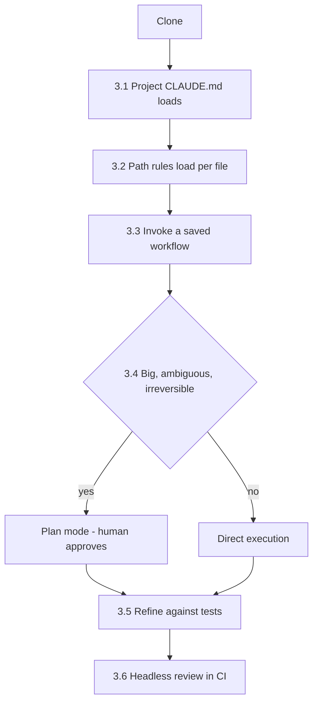
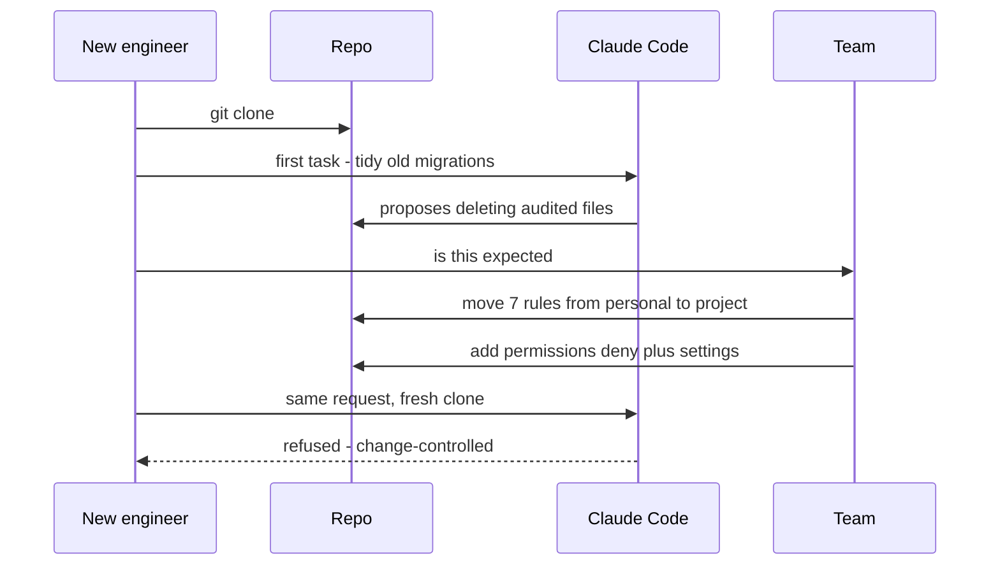

## What Problem Are We Solving?

An engineer has Claude Code working beautifully. Her conventions are configured, her shortcuts are
saved, her guardrails hold. She's fast.

None of it exists for anyone else on her team.

That gap is what this domain is about, and it's why the framing is **configuring Claude Code so a
team gets consistent results** rather than tuning it for yourself. 20% of the exam, about 12
questions, and a strikingly high proportion of them hinge on one judgement: does this belong to
*you* or to *the repository*?

The reason that judgement is hard is that both answers work — for you. A rule in your personal
config fires every session. A command in your home directory runs every time you type it. From
inside your own setup, personal and shared configuration are indistinguishable. The difference only
surfaces when someone else's session behaves differently, and the person who discovers it is
usually a new hire who has no idea what they're missing.

The second half of the domain is operational: choosing plan mode when a change is big enough to
warrant a review, refining iteratively instead of rephrasing hopefully, and running headless when
there's no human in the loop at all.

> **🗣️ In plain English:** Everything here answers "mine or the team's?" and "how much ceremony does this change deserve?" Both are easy to get wrong in a way that only hurts other people.

## Meet the Moving Parts

Six subtopics, in three groups:

**Configuration — what Claude knows before you speak**

- **3.1 CLAUDE.md.** The standing briefing, at three levels: user (`~/.claude/CLAUDE.md`, yours),
  project (`./CLAUDE.md`, the team's, in git), directory (a subfolder file, while working there).
  Team rules belong at project level — the single most consequential placement decision here.
- **3.2 Path-specific rules.** `.claude/rules/` with a `paths` glob, so a rule loads only for
  matching files. Scoping by *pattern* where a directory file scopes by *location*.

**Workflow assets — what you can invoke**

- **3.3 Slash commands & Skills.** Saved workflows. A command expands into your conversation; a
  Skill runs in its own context (`context: fork`) and can restrict its own tools
  (`allowed-tools`). Project-scoped for the team, personal for you — the same split as 3.1.

**Operation — how you drive it**

- **3.4 Plan mode vs direct execution.** Plan when the change is large, ambiguous, or hard to
  undo. Direct otherwise. `--permission-mode plan` makes it a mechanism rather than a habit.
- **3.5 Iterative refinement.** Four techniques — examples, test-driven iteration, the interview
  pattern, batching versus sequencing — each answering a different reason the first attempt missed.
- **3.6 CI/CD.** Headless with `-p`, structured output with `--output-format json` and
  `--json-schema`, and a *separate* instance for review so it isn't marking its own homework.

The through-line: 3.1 and 3.2 are context, 3.3 is reusable actions, 3.4–3.6 are how much
supervision a given piece of work gets — from a human approving a plan, down to nobody at all.

> **💡 Tip:** Three subtopics share one rule. CLAUDE.md, commands, and Skills all come in project and personal flavours, and in all three the mistake is the same: a team asset living in a home directory.

## How It Works, Step by Step

A change, from clone to merge, touching everything:

1. **Someone clones the repo** and their session picks up the project CLAUDE.md — conventions,
   guardrails, architecture notes (3.1).
2. **They open a test file**, and the testing rule loads because its glob matches; the component
   rule doesn't (3.2).
3. **They invoke a saved workflow** — `/review-staged`, or a forked read-only Skill (3.3).
4. **The change is assessed.** Sixty files and a migration means plan mode and a human at the
   decision point; a one-line fix means direct execution (3.4).
5. **The first attempt isn't right**, so they switch technique rather than rephrasing — examples,
   or tests as the spec (3.5).
6. **CI reviews the PR headlessly** with `-p` and a JSON schema, from a fresh instance with
   read-only tools and no memory of the branch (3.6).



## Minimal Working Implementation

The configuration audit this domain implies: does a fresh clone actually get what you think it
does? Save as `config_audit.py` and run it at a repo root.

```python
import pathlib
import re
import sys

HOME = pathlib.Path.home() / ".claude"
GUARDRAIL = ("never", "must not", "always", "do not", "required")


def project_config() -> list[str]:
    """What a fresh clone gets. Anything absent here, nobody else has."""
    gaps = []
    if not (pathlib.Path("CLAUDE.md").exists()
            or pathlib.Path(".claude/CLAUDE.md").exists()):
        gaps.append("no project CLAUDE.md - team rules have nowhere to live")
    if not pathlib.Path(".claude/commands").is_dir():
        gaps.append("no .claude/commands - shared workflows aren't shared")
    return gaps


def leaked_to_personal() -> list[str]:
    """Guardrails that live only on this machine - the 3.1 failure."""
    personal = HOME / "CLAUDE.md"
    if not personal.exists():
        return []
    project = pathlib.Path("CLAUDE.md")
    shared = project.read_text(encoding="utf-8").lower() if project.exists() else ""
    return [line.strip() for line in personal.read_text(encoding="utf-8").splitlines()
            if line.strip() and not line.startswith("#")
            and any(word in line.lower() for word in GUARDRAIL)
            and line.strip().lower() not in shared]


def dead_globs() -> list[str]:
    """Rules whose paths match nothing - silently never load (3.2)."""
    dead = []
    repo = [str(p).replace("\\", "/") for p in pathlib.Path(".").rglob("*")]
    for rule in pathlib.Path(".claude/rules").glob("*.md"):
        globs = re.findall(r'"([^"]+)"', rule.read_text(encoding="utf-8"))
        if globs and not any(pathlib.PurePath(f).match(g)
                             for g in globs for f in repo):
            dead.append(f"{rule.name}: globs match nothing")
    return dead
```

Run the three together and the output is a list of things your teammates don't have:

```python
if __name__ == "__main__":
    findings = project_config() + dead_globs()
    personal = leaked_to_personal()
    for item in findings:
        print(f"GAP: {item}")
    for rule in personal:
        print(f"ONLY ON THIS MACHINE: {rule}")
    print("configuration is shared correctly"
          if not (findings or personal) else "")
    sys.exit(1 if findings or personal else 0)
```

## Production Implementation

The audit answers "is it shared?" It doesn't answer "is it enforced?" — and in this domain those
are different questions with different mechanisms.

```json
{
  "permissions": {
    "deny": [
      "Write(migrations/**)",
      "Edit(.github/workflows/**)",
      "Bash(rm -rf *)"
    ],
    "allow": ["Read(**)", "Grep", "Glob", "Edit(src/**)"]
  }
}
```

Everything in this domain instructs; only permissions and hooks enforce:

```python
# Which mechanism a rule needs, decided by what a violation costs.
MECHANISMS = {
    "convention": "project CLAUDE.md (3.1)",          # style, naming
    "conditional": ".claude/rules with a glob (3.2)",  # per file type
    "workflow": ".claude/commands or skills (3.3)",    # repeated steps
    "reviewable": "plan mode, human approves (3.4)",   # big or ambiguous
    "absolute": "permissions.deny or a hook (1.4, 1.5)",  # must never happen
}


def mechanism_for(rule: str) -> str:
    text = rule.lower()
    if any(w in text for w in ("never", "must not", "no exceptions")):
        return MECHANISMS["absolute"]      # prose cannot guarantee this
    if any(w in text for w in ("*.test.", "*.spec.", "generated")):
        return MECHANISMS["conditional"]
    return MECHANISMS["convention"]
```

**What changed, and why:**

- **Absolute rules are routed away from CLAUDE.md.** "Never touch migrations" in prose is a
  request. The same sentence as a `deny` rule is a guarantee — the 1.4 distinction, arriving here
  as a configuration decision.
- **The allow-list is narrow, not the deny-list long.** Denying known-bad paths is endless;
  permitting `Edit(src/**)` and nothing else bounds the surface by construction.
- **Mechanism selection is explicit.** The phrase "must never" appearing in a proposed convention
  is a signal that it's in the wrong file, and that's cheap to check.
- **Enforcement is committed.** A `.claude/settings.json` in the repo travels with the clone; the
  same rules in your local settings protect exactly one laptop.

## In Production: Onboarding the Fourth Engineer

A three-person team adds a fourth, and discovers what their configuration actually contained.



**What the audit found.** Eleven rules in the lead's personal CLAUDE.md; **seven were team
standards**, invisible to everyone else for months. Two saved commands lived in
`~/.claude/commands/`, so "run our review command" did nothing for anybody else. One
`.claude/rules/` glob was missing its `**` and had matched zero files since the day it was written.

None of that had caused a visible incident. The symptoms were diffuse: recurring lockfile
conflicts, review quality that varied by reviewer, conventions that "everyone knows" being missed
in code review.

Three habits stuck:

- **The audit runs in CI.** Gaps fail the build, so configuration drift is caught the week it
  happens rather than at the next onboarding.
- **Absolute rules were duplicated as prose *and* deny rules.** The prose explains why migrations
  are protected, which makes Claude's refusal useful rather than baffling; the deny rule makes it
  certain.
- **Personal configs are reviewed when people join or leave.** A departing laptop takes its rules
  with it, which is the same failure arriving from the other direction.

> **🌍 Real-world example:** Every failure in this domain is silent. A dead glob, a rule only one person has, a command in the wrong directory, a CI job hanging with no output — none of them error. That's why the check that matters is not "does my setup work" but "what does a fresh clone get", and the only way to know is to look.

## Where This Applies — and Where It Doesn't

| Symptom you're given | Layer at fault | Subtopic |
|---|---|---|
| Works for one engineer, not a new hire | Rule in personal config | 3.1 |
| Root CLAUDE.md has grown unmanageable | Needs `@import` or `.claude/rules/` | 3.1, 3.2 |
| Test conventions ignored, files scattered | Needs a glob-scoped rule | 3.2 |
| Rules for everything under one folder | Directory-level CLAUDE.md | 3.1 |
| Verbose workflow floods the conversation | Needs `context: fork` | 3.3 |
| Review workflow could modify code | Needs `allowed-tools` | 3.3 |
| Big migration went wrong mid-flight | Should have been plan mode | 3.4 |
| Trivial fix bogged down in ceremony | Should have been direct execution | 3.4 |
| Rephrasing the same prompt repeatedly | Wrong refinement technique | 3.5 |
| CI job hangs with no output | Missing `-p` | 3.6 |
| Review always passes | Reviewer wasn't independent | 3.6 |

If an option proposes a longer prompt where placement, scoping, or a permission rule is the real
answer, it's a distractor. So is any option that treats CLAUDE.md as enforcement.

## Failure Modes Seen in the Wild

### 1. The configuration only one person has

**Symptom.** A teammate's Claude behaves differently; a guardrail doesn't fire.
**Cause.** Rules, commands or Skills in a home directory instead of the repo.
**Fix.** Project scope for anything the team relies on; audit personal configs (3.1, 3.3).

### 2. The rule that never loads

**Symptom.** A documented convention is consistently ignored.
**Cause.** A glob missing `**`, or a broken `@import` — the content simply isn't there.
**Fix.** Resolve imports and match globs against real paths in CI (3.1, 3.2).

### 3. Ceremony in the wrong place

**Symptom.** Plans rubber-stamped, or a large migration executed without review.
**Cause.** Plan mode applied uniformly, or not at all.
**Fix.** Threshold on scale, ambiguity and reversibility — weigh paths, not just counts (3.4).

### 4. The unattended run with no ceiling

**Symptom.** A hung job, or a surprising bill.
**Cause.** Interactive mode in CI, or no turn and budget caps.
**Fix.** `-p`, `--max-turns`, `--max-budget-usd`, and a job timeout (3.6).

> **⚠️ Watch out:** Nothing in this domain enforces anything. CLAUDE.md, rules and Skill prompts all *instruct*. When a rule genuinely must hold, it needs `permissions.deny` or a hook — and keeping the prose alongside is what makes the refusal explicable.

## Exam Lens & Key Takeaway

> **📝 Exam focus:** 20% of the exam, ~12 questions, and the highest-frequency judgement is **project versus personal scope** — it appears for CLAUDE.md (`./CLAUDE.md` vs `~/.claude/CLAUDE.md`), commands (`.claude/commands/` vs `~/.claude/commands/`) and Skills. "Works for one engineer but not a new hire" always means a team asset in a personal location. Then: **glob-scoped `.claude/rules/`** for file *types* scattered across folders versus **directory CLAUDE.md** for a location; **`context: fork`** for verbose Skills and **`allowed-tools`** for restricting them; **plan mode** for large/ambiguous/irreversible changes and direct execution for trivial ones; the four **refinement techniques** matched to symptoms; and headless CI needing **`-p`**, **`--output-format json`**, **`--json-schema`**, and an **independent** review instance.

> **🔑 Key takeaway:** This domain is about making one person's good setup into the team's, and matching supervision to risk. The recurring question is whether a thing lives in the repo or on your laptop — and because every failure here is silent, the only reliable test is what a fresh clone actually gets.
