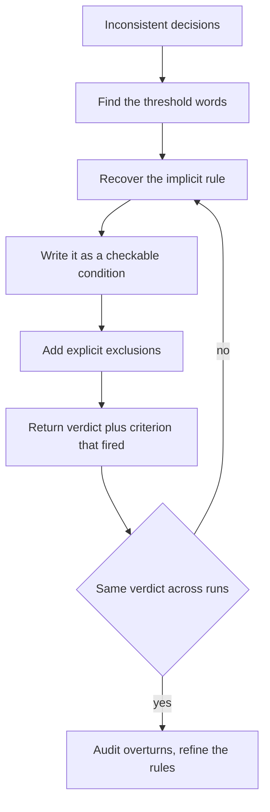
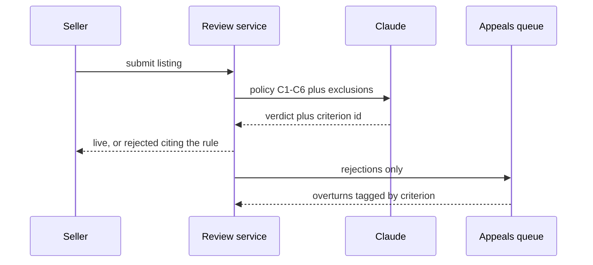

## What Problem Are We Solving?

A marketplace runs every new listing past Claude before it goes live. The prompt says: *"Reject
anything misleading. Use good judgment. Be conservative."*

In week one it rejects a listing for "Vintage 1970s denim — worn but loved" as misleading about
condition. In week two an almost identical listing sails through. Nothing changed: same model,
same prompt, same category. The seller who got rejected escalates, a human overturns it, and now
the trust team has an appeals queue they didn't budget for.

The instinct is that the model is being inconsistent. It isn't, in any way it could help. "Be
conservative" names a *disposition*, and a disposition has no fixed threshold — the threshold
lives in the head of whoever wrote the prompt. Two reviewers on the same team would apply it
differently. Claude is being asked to guess at a number nobody wrote down, and it guesses
differently on different inputs because there is nothing in the prompt to hold it steady.

The failure isn't that the guess is bad. It's that the guess is *unauditable*. When the seller
asks why their listing was rejected, there is no rule to point at — only an adjective. A policy
you cannot quote back to the person it was applied to isn't a policy.

Explicit criteria fix this by moving the threshold out of the author's head and into the prompt,
as a condition that is true or false about the input. Not "be conservative" but "reject only if X".

> **🗣️ In plain English:** Adjectives describe a feeling you want the output to have. Criteria describe a test the input either passes or fails. Only one of them survives being asked "why?"

## Meet the Moving Parts

| Piece | What it is | Where it goes wrong |
|---|---|---|
| **The adjective** | "conservative", "reasonable", "important", "suspicious", "high-confidence" | Reads as an instruction; is actually a request for the model to supply the missing threshold |
| **The criterion** | A condition checkable against the input alone | Written too narrowly, it silently stops catching a whole class |
| **The exclusion** | What to deliberately *not* flag | Almost always omitted — and omitting it is what generates noise |
| **The output contract** | What a decision looks like: verdict plus the criterion that fired | Without it you can't audit, and can't tell a real hit from a lucky one |

Three of these are where teams stop too early.

**An exclusion is not optional.** Most people rewrite "be conservative" into a positive rule and
stop. But the noise comes from cases nobody ruled out — style nits, formatting, preference. The
exclusion list does at least as much work as the inclusion rule.

**The criterion has to be checkable from the input.** "Flag security vulnerabilities" sounds
specific and isn't — it still needs a judgment call about what counts. "Flag any string
interpolated into a SQL statement" is checkable: you can point at the line. The test is whether
two people given the rule and the input reach the same verdict.

**Make the decision cite its rule.** A bare `reject` is consistent but not explicable. `reject`
plus the criterion that fired is auditable — and a spike in one criterion tells you exactly which
rule is miscalibrated.

> **💡 Tip:** Test a candidate criterion by asking whether you could hand it to a new hire with no context and get the same decisions you'd make. If you'd have to explain what you *really* meant, it isn't a criterion yet.

## How It Works, Step by Step

1. **Catch the adjective.** Scan the prompt for words that carry a threshold: *conservative,
   reasonable, important, significant, obvious, high-confidence, when appropriate, use judgment.*
   Each one is a decision you've delegated without specifying.
2. **Recover the real rule.** Look at decisions you agreed with and ones you didn't. The
   difference between them is the rule you were holding implicitly.
3. **Write it as a condition on the input.** "Reject only if the listing's stated condition
   contradicts the photos or description."
4. **Write the exclusions.** Name the classes that must never fire, explicitly.
5. **Make it cite itself.** Have Claude return the verdict plus which criterion fired — a
   `tool_use` call with an enum of criterion IDs (4.3) is the natural shape.
6. **Measure stability, not just correctness.** Run the same input several times. Differing
   verdicts across runs means a threshold is still unspecified.
7. **Feed disagreements back into the rules.** Each overturned decision is either a rule that's
   too broad or a missing exclusion. Change the text, not the temperature.



## Minimal Working Implementation

The point is measurable: the same input, the same model, two instructions. Save as `criteria.py`
and run it — the vague prompt's flag count moves between runs, the explicit one doesn't.

```python
import collections
import anthropic

client = anthropic.Anthropic()

DIFF = """def apply_discount(price, pct):
    # Caps the discount at 50% so we never sell below cost.
    return price * (1 - pct / 100)
"""

VAGUE = "Review this code. Be conservative - only flag things that matter."

EXPLICIT = """Review this code. Flag an issue ONLY when a comment states
behaviour that the code does not implement. Do not flag style, naming,
formatting, missing type hints, or input validation."""


def flag_count(instruction: str) -> int:
    prompt = (f"{instruction}\n\nList one issue per line, "
              f"or reply with the single word NONE.\n\n{DIFF}")
    reply = client.messages.create(
        model="claude-opus-5", max_tokens=1000,
        messages=[{"role": "user", "content": prompt}])
    text = next(b.text for b in reply.content if b.type == "text")
    if "NONE" in text.upper():
        return 0
    return len([line for line in text.splitlines() if line.strip()])


for label, instruction in (("vague", VAGUE), ("explicit", EXPLICIT)):
    counts = sorted(collections.Counter(
        flag_count(instruction) for _ in range(5)).elements())
    print(f"{label:9} flags across 5 runs: {counts}")
```

The code has one real defect: the comment promises a 50% cap that the code never applies. The
explicit run finds that and stops. The vague run also finds the missing validation, the unclear
parameter name, and the absent type hints — sometimes.

## Production Implementation

In production the criteria stop being prose in a string and become a numbered policy that the
output has to cite.

```python
CRITERIA = {
    "C1": "A comment or docstring states behaviour the code does not implement",
    "C2": "A user-controlled value is interpolated into a SQL string",
    "C3": "An exception is caught and silently discarded",
}
EXCLUDED = ["formatting", "naming", "type hints", "test coverage",
            "performance", "commented-out code"]

REVIEW_TOOL = {
    "name": "report_review",
    "description": "Report review findings against the numbered policy.",
    "strict": True,
    "input_schema": {
        "type": "object",
        "properties": {
            "findings": {
                "type": "array",
                "items": {
                    "type": "object",
                    "properties": {
                        "criterion": {"type": "string",
                                      "enum": list(CRITERIA)},
                        "line": {"type": "integer"},
                        "evidence": {"type": "string"},
                    },
                    "required": ["criterion", "line", "evidence"],
                    "additionalProperties": False,
                },
            },
        },
        "required": ["findings"],
        "additionalProperties": False,
    },
}
```

The system prompt is generated from the same dict, so the policy has exactly one source:

```python
policy = "\n".join(f"{cid}: {text}" for cid, text in CRITERIA.items())
system = (f"Review code against this policy, and only this policy.\n\n"
          f"{policy}\n\nNever report: {', '.join(EXCLUDED)}. "
          f"Call report_review exactly once. If nothing matches a "
          f"criterion, call it with an empty findings list.")
# ...
```

**What changed, and why:**

- **Criteria became IDs, and findings must cite one.** An `enum` over criterion IDs means a
  finding outside the policy is not expressible, rather than discouraged. Now "false positive
  rate" decomposes into a rate per criterion, so you know which rule to fix.
- **One source for the policy.** The prompt text is built from `CRITERIA`, so the schema and the
  instructions can't drift apart — the classic bug where a rule is retired from the prose but
  still accepted by the schema.
- **Exclusions are stated, not implied.** The list is short, concrete, and the first place to add
  to when noise appears.
- **Empty findings is a valid call.** Without that sentence, a tool the model is told to call
  creates quiet pressure to find *something* — a structural nudge toward false positives.

## In Production: The Listing Review Queue at a Marketplace

A used-goods marketplace reviews roughly 12,000 new listings a day. Claude gates them; anything
rejected goes to a human appeals queue.



**Before.** The prompt said "reject anything misleading or unsafe; be conservative". Rejections
ran at 9% of listings and 61% of appeals were overturned — the rejection was wrong more often
than it was right. Sellers received "your listing violates our policies", which the support team
could not elaborate on, because the prompt contained no policy to elaborate.

**After.** Six numbered criteria, an exclusion list of eleven items, and a `tool_use` call
returning the criterion ID. Rejections fell to 3.4% and overturns to 12%. The rejection notice
now quotes the criterion, and appeals that do arrive are arguments about the rule rather than
requests for an explanation.

The most valuable change was one nobody predicted. Overturns are tagged by criterion, so the team
can see which rule is miscalibrated. Two months in, C4 — "the listing's stated condition
contradicts the images" — accounted for 71% of remaining overturns, concentrated in one category:
refurbished electronics, where "like new" is a legitimate trade description rather than a claim
about wear. The fix was a carve-out in C4, and the rate dropped. Under the old prompt that signal
was invisible; every overturn was just "the model was too aggressive".

Two numbers worth keeping in view. Same model, same volume, no new infrastructure — rejection
accuracy roughly tripled on prompt text alone. And the review call itself got *cheaper*: the
vague prompt produced paragraphs of reasoning about borderline cases, averaging 340 output
tokens; the criteria version returns a tool call averaging 45.

> **🌍 Real-world example:** The clearest evidence came from the appeals team, not the metrics. Under the vague prompt their job was to guess what the model had objected to. Under the numbered policy the notice says "rejected under C2: stated brand contradicts the item photographs" — so the reviewer checks the photographs and is done. Median handling time went from just over four minutes to about fifty seconds, and the queue stopped needing a second shift.

## Where This Applies — and Where It Doesn't

| Situation | Use this | Use instead |
|---|---|---|
| Same input, different verdicts run to run | Explicit criteria | — |
| Users ask "why was this flagged?" and you can't say | Criteria plus cited IDs | — |
| Noise from style and preference nits | An explicit exclusion list | — |
| A rule everyone states differently | Write it down once, generate the prompt from it | — |
| The boundary is easier to show than to state | — | Few-shot examples (4.2) |
| The output shape is what's inconsistent | — | `tool_use` and a schema (4.3) |
| The task is genuinely open-ended — brainstorming, drafting | — | Leave it open; criteria narrow it |
| The rule needs facts not in the input | — | Fix the input; no wording helps |

Anti-patterns: rewriting an adjective into a longer adjective ("be *very* careful and thorough");
adding a positive rule without exclusions and then blaming the model for noise; criteria so narrow
they encode one example rather than a class; and reaching for temperature or model changes when
the prompt still contains the word "reasonable".

## Failure Modes Seen in the Wild

### 1. The laundered adjective

**Symptom.** The prompt was rewritten, results are as inconsistent as before.
**Cause.** "Be conservative" became "apply a high bar and use sound judgment" — same delegation,
more words.
**Fix.** Grep the prompt for threshold words. If one survives the rewrite, the rule hasn't been
written yet.

### 2. Rules without exclusions

**Symptom.** Real issues are caught, but buried under trivia nobody asked for.
**Cause.** Only the inclusion rule was specified; everything else is fair game by default.
**Fix.** Add the exclusion list. It is usually the shorter edit and the bigger win.

### 3. The criterion that encodes one example

**Symptom.** The exact case you were annoyed by is caught; near neighbours are missed.
**Cause.** The rule was written from a single incident — "flag when a docstring says 'returns a
list' but the function returns a tuple".
**Fix.** Write the class, not the instance, then check it against three other cases you'd want
caught.

### 4. Criteria that can't be checked from the input

**Symptom.** Verdicts still vary, even though the rules look specific.
**Cause.** The rule needs information the prompt never supplied — "flag if this breaks an existing
integration", with no integration list in context.
**Fix.** Supply the missing input, or drop the criterion. This is a data problem wearing a
prompt-engineering costume (4.4).

> **⚠️ Watch out:** Explicit criteria buy consistency, not correctness. A precisely stated wrong rule is applied wrongly every single time, with total confidence and an audit trail. Consistency makes miscalibration *visible* — which is the point — but somebody still has to look at the overturns and fix the rule.

## Exam Lens & Key Takeaway

> **📝 Exam focus:** The stem is a scenario where a prompt containing "be conservative", "use good judgment", "only flag important issues" or "be careful" produces inconsistent or noisy output — and the answer is always **replace the vague language with an explicit, checkable rule**, usually paired with **an explicit list of what not to flag**. The distractors are consistent across question variants: add more examples (that's 4.2, and it's the answer when the boundary is hard to *describe*, not when it's undefined), lower the temperature, switch to a larger model, or write a longer and more emphatic version of the same instruction. Expect at least one question where the correct option is recognisable purely because it names what to *exclude*.

> **🔑 Key takeaway:** A vague instruction silently asks Claude to supply a threshold you never wrote down, so it supplies a different one each time. Replace the adjective with a condition that's true or false about the input, say explicitly what not to flag, and have the output cite the rule that fired — consistency and auditability arrive together.
