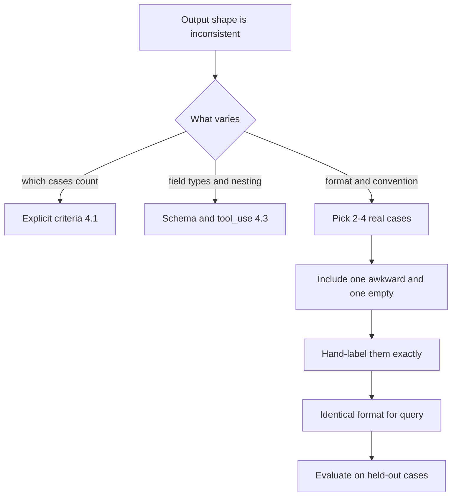
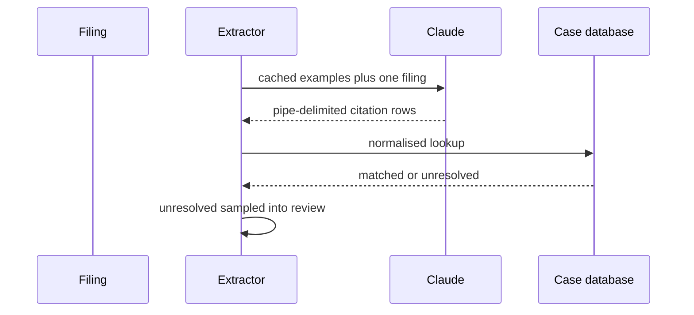

## What Problem Are We Solving?

A legal research tool ingests court filings and pulls out every case citation so they can be
linked to a case database. The prompt describes the job carefully: *"Extract all case citations.
Return the case name, reporter, volume, page, and year."*

It works, in the sense that citations come back. But the *shape* wanders. `Roe v. Wade` in one
document, `Roe v Wade` in the next, `ROE v. WADE` in a third. The year arrives as `1973`, then
`(1973)`, then `1973.`. A citation with a pinpoint page — `410 U.S. 113, 153` — sometimes yields
page 113, sometimes 153. Short-form citations (`Id. at 160`) are sometimes expanded against the
previous citation and sometimes returned verbatim.

Every one of these is defensible. Nothing in the prompt says which to do. The description named
the *fields*; it never pinned down the *conventions* — and legal citation has conventions the way
chess has openings, several of them valid, chosen by jurisdiction and house style.

You could keep writing prose. "Strip trailing punctuation from the year. Use the first page, not
the pinpoint. Normalise the case name to Title Case. Expand short-form citations against the most
recent full citation." That's four rules, each adding ambiguity of its own, and you are maybe a
third of the way there.

Or you show three worked examples and the conventions come along for free. That's few-shot: stop
describing the output and start demonstrating it.

> **🗣️ In plain English:** Some things are much easier to show than to say. When you find yourself writing the fourth rule about formatting, you're writing a spec that an example would have communicated in one line.

## Meet the Moving Parts

- **The task instruction.** Still needed, still short. Examples show *how*; the instruction says
  *what*. Deleting it and relying purely on pattern-matching makes the model guess at the goal.
- **The examples.** Two to four input/output pairs, formatted exactly as the real input will be.
  These are not illustrations — they are the operative part of the prompt.
- **The delimiters.** The labels separating input from output (`Document:` / `Citations:`). They
  must be identical in the examples and in the real query, or the model doesn't recognise it's
  continuing the same sequence.
- **The negative example.** At least one case whose correct output is "nothing here". Without it,
  every example says "produce output", and the model learns that producing output is the job.
- **The real input.** Appended in the same format, with the output label present and empty, so
  the obvious continuation is the answer.

Where people go wrong is treating examples as decoration — three cases pasted in "for context",
formatted differently from each other and from the real query. That's not few-shot; the model
reads it as reference material rather than a pattern to continue.

The subtler error is examples that are all the same. Three citations, all full-form, all from
U.S. Reports, all with clean years. The model generalises confidently from what you showed — and
you showed one case three times, so it learns nothing about the boundary you actually care about.

> **💡 Tip:** If your examples are the three cleanest cases you could find, they're the wrong three. Pick the ones you'd have to explain to a new hire.

## How It Works, Step by Step

1. **Diagnose first.** Inconsistent *formatting or convention* is a few-shot problem. Inconsistent
   *decisions* about what counts is usually a criteria problem (4.1). Guessed field shapes are a
   schema problem (4.3).
2. **Collect real cases**, including the awkward ones — short-form citations, pinpoint pages, a
   paragraph with no citation at all.
3. **Hand-label them.** The labels are the specification, so they must be exactly right; one
   sloppy example teaches the sloppiness.
4. **Fix a format** and use it identically in every example: same labels, same order, same
   separator.
5. **Assemble the prompt** — instruction, then examples, then the real input in the same format
   with an empty output slot.
6. **Put the examples in the system prompt** and cache them, so the stable prefix is paid for once
   (see the production step).
7. **Evaluate on held-out cases.** Examples that leak into your test set make few-shot look
   perfect and tell you nothing.



## Minimal Working Implementation

Same model, same documents, two prompts. Save as `fewshot.py` and run it — the zero-shot column
drifts in format, the few-shot column doesn't.

```python
import anthropic

client = anthropic.Anthropic()

TASK = "Extract every case citation as: Case Name|Reporter|Volume|Page|Year"

EXAMPLES = """Document: The court in Roe v. Wade, 410 U.S. 113, 153 (1973),
addressed this directly.
Citations: Roe v. Wade|U.S.|410|113|1973

Document: See Brown v. Board of Education, 347 U.S. 483 (1954); Id. at 495.
Citations: Brown v. Board of Education|U.S.|347|483|1954

Document: The parties disagree on the standard of review.
Citations: NONE
"""

TEST = [
    "Relying on MIRANDA v. ARIZONA, 384 U.S. 436, 444 (1966), counsel argued...",
    "No authority is cited for this proposition.",
    "Accord Katz v. United States, 389 U.S. 347 (1967); id. at 351.",
]


def extract(doc: str, few_shot: bool) -> str:
    prefix = EXAMPLES + "\n" if few_shot else ""
    body = f"{prefix}Document: {doc}\nCitations:"
    reply = client.messages.create(
        model="claude-opus-5", max_tokens=500,
        system=TASK,
        messages=[{"role": "user", "content": body}])
    text = next(b.text for b in reply.content if b.type == "text")
    return text.strip().replace("\n", " / ")


for doc in TEST:
    print(f"doc:       {doc[:52]}")
    print(f"  zero:    {extract(doc, False)}")
    print(f"  fewshot: {extract(doc, True)}\n")
```

Note what the examples pin down that the instruction never mentions: `MIRANDA v. ARIZONA`
normalises to Title Case, the pinpoint page is dropped in favour of the first page, the short-form
`id.` doesn't produce a second row, and a paragraph with no citation returns `NONE` rather than an
apology.

## Production Implementation

Examples are a large, stable prefix in front of a small, varying input — exactly the shape prompt
caching is for. Put them in the system prompt, cache them, and keep the document last.

```python
SYSTEM = [
    {"type": "text", "text": TASK},
    {"type": "text", "text": EXAMPLES,
     "cache_control": {"type": "ephemeral"}},
]


def extract_cached(doc: str) -> tuple[str, int]:
    reply = client.messages.create(
        model="claude-opus-5", max_tokens=500,
        system=SYSTEM,
        messages=[{"role": "user",
                   "content": f"Document: {doc}\nCitations:"}])
    text = next(b.text for b in reply.content if b.type == "text")
    return text.strip(), reply.usage.cache_read_input_tokens
```

The examples are an asset with a lifecycle, so they get versioned and regression-tested:

```python
import json
import pathlib

EXAMPLE_SET = pathlib.Path("examples/citations.v3.json")
HELD_OUT = pathlib.Path("examples/heldout.json")


def regression_check() -> list[str]:
    """Examples are the spec - a change to them is a change to behaviour."""
    cases = json.loads(HELD_OUT.read_text(encoding="utf-8"))
    failures = []
    for case in cases:
        got, _ = extract_cached(case["document"])
        if got != case["expected"]:
            failures.append(f"{case['id']}: {got!r} != {case['expected']!r}")
    return failures
    # ...
```

**What changed, and why:**

- **Examples moved into a cached system prompt.** They're identical on every call; paying full
  price per document is pure waste. A cache read is roughly a tenth the cost of the same tokens
  uncached, and the examples are usually the bulk of the prompt.
- **The document goes last, after the breakpoint.** Caching is a prefix match — one varying byte
  before the breakpoint invalidates everything after it. Instruction, then examples, then input.
- **Verify the cache is working.** `cache_read_input_tokens` returning zero across repeated calls
  means something upstream is varying and you're paying full price silently.
- **Examples are versioned and regression-tested.** They are the specification, so editing one
  changes production behaviour with no code change. A held-out set catches an "improvement" that
  quietly breaks a convention.

## In Production: Citation Extraction at a Legal Research Product

A legal research product ingests around 40,000 filings a week from federal and state courts and
links every citation to its case record. State courts have their own reporters and conventions;
the filings are written by thousands of different firms.



**Before.** A carefully written prose spec, grown to 600 words of formatting rules. 71% of
extracted citations matched a case record on the first lookup; the rest failed on formatting —
`v` versus `v.`, a trailing period on the year, a pinpoint page where the first page belonged.
Each near-miss needed fuzzy matching, and fuzzy matching on case names produces wrong matches,
which in a legal product is worse than no match.

**After.** The prose spec shrank to two sentences plus four examples: one full citation with a
pinpoint, one short-form `id.`, one state reporter with a parallel citation, and one paragraph
with no citation. First-pass match rate went to 94%.

The parallel-citation example was the one that paid for itself. State filings often cite both the
official and regional reporter — `120 Ohio St. 3d 1, 895 N.E.2d 805` — and the prose spec had
never contemplated it, so the model sometimes emitted one row, sometimes two, sometimes a mangled
hybrid. Nobody wrote a rule; they added the case as an example with both rows labelled, and the
behaviour settled.

**The economics.** The four examples are about 900 tokens, the average filing about 2,400. Cached,
the examples cost roughly a tenth of their uncached price after the first call in a window — so
across the week's run they add about 4% to token spend and are re-read on every request. Against
a 23-point improvement in first-pass match rate, this is not a close call.

> **🌍 Real-world example:** The regression suite justified itself within a month. An engineer added a fifth example covering administrative-law citations, which quietly changed the year convention — the new example had been labelled `(2019)` with parentheses, copied from the source document. Nothing errored. The held-out set caught 31 mismatches on the next run, and the fix was a two-character edit to the example. Without the suite it would have shipped, and the first symptom would have been a slow drop in match rate nobody could attribute to anything.

## Where This Applies — and Where It Doesn't

| Situation | Use this | Use instead |
|---|---|---|
| Output format drifts between runs | Few-shot with a fixed format | — |
| A convention is easier to show than state | Few-shot, including the awkward case | — |
| Inputs vary wildly in structure | Few-shot spanning the variation | — |
| The model over-reports — finds something in everything | An example whose output is empty | — |
| Disagreement about which cases qualify | — | Explicit criteria (4.1) |
| Field types, nesting, required-ness are the problem | — | `tool_use` and a schema (4.3) |
| Output is semantically wrong, not misformatted | — | Validation and retry (4.4) |
| Examples would exceed the useful context budget | — | Fewer, better examples; or fine-tuning territory |

Anti-patterns: examples formatted differently from each other or from the real query; three
examples of the same easy case; no negative example, so the model learns output is mandatory;
examples pasted fresh on every request instead of cached; and editing examples casually, without
a regression set, when they are in fact the specification.

## Failure Modes Seen in the Wild

### 1. The unrepresentative set

**Symptom.** Excellent on cases like the examples, poor everywhere else.
**Cause.** All the examples were clean and similar, so the demonstrated boundary is narrower than
the real one.
**Fix.** Replace one example with the case you'd have to explain to a new hire.

### 2. The format mismatch

**Symptom.** Few-shot barely beats zero-shot.
**Cause.** The real query uses different labels or ordering than the examples, so the model reads
them as background rather than a pattern to continue.
**Fix.** Build examples and query from one template. Never hand-write the query.

### 3. Everything is a citation

**Symptom.** Confident output on inputs that contain nothing.
**Cause.** Every example had a non-empty output; producing output looks like the job.
**Fix.** Add a negative example with an explicit empty marker — `NONE`, not a blank line.

### 4. The example that silently became the spec

**Symptom.** A convention changes across the corpus with no code change.
**Cause.** Someone edited or added an example; the examples *are* the specification.
**Fix.** Version the example set, run held-out regressions on every change, review them as code.

> **⚠️ Watch out:** Label your examples by hand and check them twice. A wrong label doesn't degrade output gracefully — it teaches the error, consistently, on every request, and it looks like correct behaviour because the model is doing exactly what you demonstrated.

## Exam Lens & Key Takeaway

> **📝 Exam focus:** The tell is **inconsistent formats or unclear boundaries**, not inconsistent judgment — "the same kind of document produces differently shaped output", "the model can't tell which items to skip". The answer is **2–4 examples in a consistent format**, and expect the count itself to be tested; also expect the point that examples must span the range including a case that should be skipped, since a set of uniformly positive examples is a named distractor. Distinguish it from its neighbours, which the exam tests as a pair: vague decision criteria → **explicit rules** (4.1), guaranteed output *structure* → **`tool_use` with a JSON schema** (4.3). "Write a longer description" and "use more examples (10+)" are the standard wrong answers.

> **🔑 Key takeaway:** Few-shot replaces description with demonstration, and it earns its place when the conventions are easier to show than to state. Two to four examples, formatted exactly like the real query, spanning the awkward cases and including one that should produce nothing — and remember they're a specification: cache them, version them, regression-test them.
