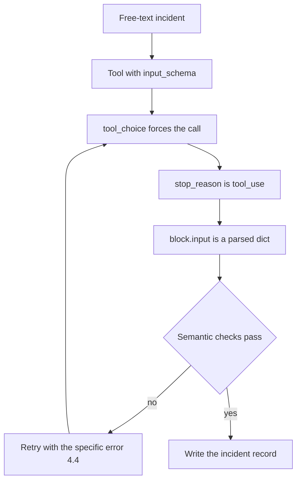
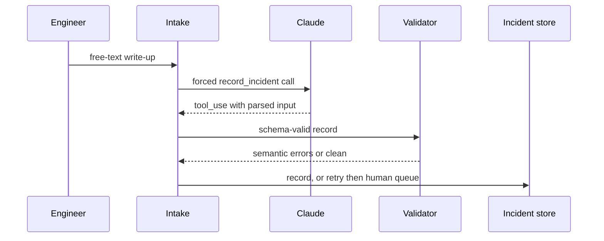

## What Problem Are We Solving?

An on-call platform turns free-text incident write-ups into structured records: severity,
affected service, customer impact, start and end time. The prompt ends with "Respond only with
JSON matching this shape", and a shape follows.

It works about 96% of the time, which sounds fine until you run 3,000 incidents a week. The other
4% arrives as: a leading "Here's the extracted incident:", JSON wrapped in a markdown fence,
`severity: "Sev-2"` where last time it was `"SEV2"`, or — the expensive one — a `resolved_at`
timestamp for an incident that is still open, invented because the field was in the shape.

The first three are parser problems, papered over with a regex that strips fences and finds the
first `{`. The last is a data-quality problem no regex sees: the JSON is beautiful and the value
is fiction. That one ends up in a postmortem.

The root cause is that "respond only with JSON" is a *request*, competing with every other
instruction. Define a tool with a JSON schema instead and the shape stops being a request: the
API validates the tool's input against your schema.

That fixes exactly one of the two problems. The schema guarantees `resolved_at` is a string or
null. It has no opinion on whether the incident was resolved. Structure and meaning are separate
problems with separate mechanisms, and conflating them is the most consequential mistake in this
domain.

> **🗣️ In plain English:** A schema is a promise about the shape of the answer, never about the truth of it. It stops the parser breaking; it does nothing to stop the model being wrong.

## Meet the Moving Parts

- **The tool definition.** `name`, `description`, and `input_schema`. The description tells Claude
  *when and how* to fill it; the schema constrains *what* it may contain.
- **`tool_choice`.** `{"type": "tool", "name": "..."}` forces this tool, so you get a `tool_use`
  block rather than prose — this is what turns "please return JSON" into a guarantee.
- **`strict: True`.** Opts into exact validation of the arguments. Requires
  `additionalProperties: false` and a `required` array. Without it the schema is guidance.
- **`required` vs nullable.** A field in `required` must be present. A field typed
  `["string", "null"]` may be explicitly absent. Different axes — mixing them up is the
  hallucination bug.
- **Enums.** A fixed value set, so `"Sev-2"`, `"SEV2"` and `"sev 2"` can't all reach a downstream
  `switch`.
- **The response.** `stop_reason` is `"tool_use"`; `response.content` holds a `tool_use` block
  whose `.input` is a parsed dict.

The point people miss: **required and nullable are not opposites.** Required but not nullable
tells the model "a value must appear here" — so when the write-up omits a resolution time,
inventing one is the only way to comply. Required *and* nullable says "you must address this
field, and `null` is a legitimate way to address it": mandatory to consider, permitted to be
absent.

The other trap is the enum with no escape hatch. A closed set the real world overflows forces
mis-bucketing. Pair it with an `"other"` member and a detail field, and unanticipated cases land
somewhere you can find them.

> **💡 Tip:** Read every required, non-nullable field as a sentence: "you must produce a value here even if the source doesn't contain one." If that sentence is wrong, the field needs to be nullable.

## How It Works, Step by Step

1. **Define the tool** with an `input_schema` describing the record you want.
2. **Mark genuinely-absent-able fields nullable** — `{"type": ["string", "null"]}` — and keep them
   in `required` so the model must address them.
3. **Enumerate closed fields**, with an `"other"` member plus a detail field.
4. **Send the request** with `tools=[...]` and `tool_choice={"type": "tool", "name": ...}`.
5. **Claude replies with `stop_reason: "tool_use"`** and a `tool_use` block; `.input` is already
   parsed — never string-match the serialised input, since escaping varies.
6. **Validate semantics separately.** Timestamps ordered, durations consistent with start and
   end, referenced service actually in your registry. The schema checked none of this.
7. **Route failures.** Schema-valid but semantically wrong goes to the retry-with-feedback loop
   (4.4), not to a parser fix.



## Minimal Working Implementation

The demonstration that matters is the nullable one. Save as `structured.py` and run it: the first
write-up has no resolution time, and the record comes back with `resolved_at` explicitly `null`
rather than a plausible invention.

```python
import json
import anthropic

client = anthropic.Anthropic()

INCIDENT_TOOL = {
    "name": "record_incident",
    "description": "Record one incident from an engineer's write-up. "
                   "Use null for any field the write-up does not state. "
                   "Never infer a time that is not written down.",
    "strict": True,
    "input_schema": {
        "type": "object",
        "properties": {
            "service": {"type": "string"},
            "severity": {"type": "string",
                         "enum": ["sev1", "sev2", "sev3", "other"]},
            "severity_detail": {"type": ["string", "null"]},
            "started_at": {"type": ["string", "null"]},
            "resolved_at": {"type": ["string", "null"]},
        },
        "required": ["service", "severity", "severity_detail",
                     "started_at", "resolved_at"],
        "additionalProperties": False,
    },
}

WRITEUPS = [
    "Checkout API started 500ing at 14:02 UTC. Paged, still investigating.",
    "Auth service degraded 09:10-09:41 UTC, sev2, login latency spike.",
]

for text in WRITEUPS:
    reply = client.messages.create(
        model="claude-opus-5", max_tokens=1000,
        tools=[INCIDENT_TOOL],
        tool_choice={"type": "tool", "name": "record_incident"},
        messages=[{"role": "user", "content": text}])
    block = next(b for b in reply.content if b.type == "tool_use")
    print(reply.stop_reason, json.dumps(block.input, indent=2))
```

Both records parse. The first has `"resolved_at": null` because the incident is open — the field
was required, so the model had to address it, and nullable, so it could address it honestly.

## Production Implementation

The schema is the easy half. Production adds the semantic layer the schema cannot provide, and
makes the enum's escape hatch observable.

```python
import datetime as dt

KNOWN_SERVICES = {"checkout-api", "auth", "search", "billing"}


def parse_ts(value: str | None) -> dt.datetime | None:
    if value is None:
        return None
    return dt.datetime.fromisoformat(value.replace("Z", "+00:00"))


def semantic_errors(rec: dict) -> list[str]:
    """Everything the JSON Schema is structurally incapable of checking."""
    errors = []
    if rec["service"] not in KNOWN_SERVICES:
        errors.append(f"unknown service {rec['service']!r}")
    start, end = parse_ts(rec["started_at"]), parse_ts(rec["resolved_at"])
    if end and not start:
        errors.append("resolved_at set but started_at is null")
    if start and end and end < start:
        errors.append(f"resolved_at {end} precedes started_at {start}")
    if start and start > dt.datetime.now(dt.timezone.utc):
        errors.append("started_at is in the future")
    if rec["severity"] == "other" and not rec["severity_detail"]:
        errors.append("severity 'other' requires severity_detail")
    return errors
```

The call itself gets the failure paths a demo doesn't need:

```python
import logging

log = logging.getLogger("incidents")


def extract(text: str) -> dict:
    reply = client.messages.create(
        model="claude-opus-5", max_tokens=1000,
        tools=[INCIDENT_TOOL],
        tool_choice={"type": "tool", "name": "record_incident"},
        messages=[{"role": "user", "content": text}])
    if reply.stop_reason == "refusal":
        raise RuntimeError(f"declined: {reply.stop_details}")
    block = next((b for b in reply.content if b.type == "tool_use"), None)
    if block is None:
        raise RuntimeError(f"no tool_use block, stopped on {reply.stop_reason}")
    record = block.input
    log.info("extracted", extra={"severity": record["severity"],
                                 "nulls": sum(v is None
                                              for v in record.values())})
    return record
    # ...
```

**What changed, and why:**

- **A semantic validator sits after the schema.** The schema proves `resolved_at` is a string or
  null; only this code can prove it isn't before `started_at` or attached to a service that
  doesn't exist. These are the errors that reach production data.
- **The `tool_use` block is looked for, not assumed.** Forced `tool_choice` makes a tool call
  overwhelmingly likely, not certain — a refusal or a `max_tokens` stop produces a response with
  no tool call, and `next(...)` without a default raises `StopIteration` in a place nobody
  expects it.
- **`.input` is used as a dict, never re-parsed from text.** JSON string escaping in tool inputs
  varies across models; string-matching the serialised form is a silent-breakage pattern.
- **Null counts and `"other"` rates are logged.** A rising null rate means inputs are degrading; a
  rising `"other"` rate means the enum needs a new member. Both are invisible without counters.

## In Production: Incident Intake at an On-Call Platform

An on-call platform ingests write-ups from about 900 customer engineering teams — roughly 3,000
incidents a week — and turns them into structured records that drive SLA reporting.



**Before.** Prose-instructed JSON with a fence-stripping regex. Parse failures ran at about 1.8%
and were handled. The damage was elsewhere: `resolved_at` was required and not nullable, so every
open incident got an invented resolution time. SLA reports were computed from those timestamps.
Nothing failed, no alert fired, and the numbers were wrong for eleven weeks — discovered when a
customer disputed an uptime figure and the underlying incident turned out to still be open.

**After.** A forced `tool_use` call with `strict: True`. Parse failures went to zero, which was
the expected win and the least important one. Making `resolved_at` nullable-and-required cut
invented timestamps to nil: about 23% of records now come back with `"resolved_at": null`, which
is roughly the share of incidents still open at intake. That number was always 23%; the old
pipeline just filled it with fiction.

The semantic validator catches what remains — around 0.9% of records, dominated by two classes:
timestamps that parse but predate the incident report, and services not in the registry (usually
a real service under a nickname, which is a registry gap rather than a model error). These route
to retry-with-feedback and then, if still failing, to a human queue of about 25 a week.

**Cost.** The schema adds roughly 180 input tokens per call against an average write-up of 400 —
noticeable in percentage terms, invisible in absolute ones at this volume. The eleven weeks of
wrong SLA reporting cost considerably more than a year of the token overhead.

> **🌍 Real-world example:** The enum escape hatch earned its place in month two. `"other"` was running at 0.4%, then jumped to 6% over a fortnight. The detail field showed why: a large customer had adopted an internal `"sev0"` for company-wide outages. Nothing broke, nothing was mis-bucketed into `sev1`, and the fix was adding a member to the enum. A closed enum would have silently absorbed those into `sev1` and no counter would have moved.

## Where This Applies — and Where It Doesn't

| Situation | Use this | Use instead |
|---|---|---|
| Output feeds code that parses it | `tool_use` with a schema | — |
| Parse failures, fences, preambles | Forced `tool_choice` | — |
| Fields invented when the source is silent | Nullable **and** required | — |
| Free-text drift in a categorical field | An `enum`, plus `"other"` and a detail field | — |
| Exact argument validation required | `strict: True` with `additionalProperties: false` | — |
| The values are wrong, not the shape | — | Semantic validation and retry (4.4) |
| Format conventions inside a field wander | — | Few-shot examples (4.2) |
| Output is for a human to read | — | Prose; a schema just adds ceremony |

Anti-patterns: treating "it parsed" as "it's correct"; required-and-not-nullable on anything the
source might omit; enums with no `"other"`; re-parsing `.input` from its serialised text; and
assuming forced `tool_choice` means a `tool_use` block is guaranteed to exist.

## Failure Modes Seen in the Wild

### 1. Schema-shaped fiction

**Symptom.** Perfect JSON, wrong values. No errors anywhere.
**Cause.** A required, non-nullable field the source didn't contain. The model filled it because
it was told to.
**Fix.** Nullable plus required. Then monitor the null rate — a sudden drop means inputs changed
or someone "tidied" the schema.

### 2. The closed enum

**Symptom.** A category's share quietly grows; nobody can explain the mix.
**Cause.** Real-world values outside the enum are being forced into the nearest member.
**Fix.** Add `"other"` and a free-text detail field, and alert on its rate.

### 3. The missing tool_use block

**Symptom.** `StopIteration` from `next(...)`, in production, on a small fraction of requests.
**Cause.** Forced `tool_choice` is near-certain, not certain — refusals and `max_tokens` stops
return no tool call.
**Fix.** Use `next(..., None)`, check `stop_reason`, and handle refusal explicitly.

### 4. Validation that only validates the schema

**Symptom.** A downstream report is wrong for weeks; the pipeline reports 100% success.
**Cause.** Structural validity was mistaken for correctness, so nothing checked the business
rules.
**Fix.** A separate semantic layer — orderings, cross-field arithmetic, registry lookups — and
treat its failures as first-class, not as parser noise.

> **⚠️ Watch out:** Every failure in this topic is silent. A schema violation is loud and gets fixed on day one; a schema-valid hallucination looks exactly like success and is discovered by a customer. Budget your monitoring accordingly: null rates, `"other"` rates, and semantic-failure rates are the instruments that see it.

## Exam Lens & Key Takeaway

> **📝 Exam focus:** Three things carry most of the marks. **`tool_use` + JSON Schema is the reliable way to enforce structure** — "ask for JSON in the prompt", "add a retry that strips markdown fences", and "lower the temperature" are the standing distractors. **Nullable fields prevent hallucination**: the stem describes a field being invented when the source doesn't contain the information, and the answer is to make it nullable so the model can say "not present" — not to make it optional, and not to add an instruction telling the model not to guess. And **schema validity is not semantic correctness**: a stem where the JSON parses perfectly but a total doesn't match its line items is asking for a *separate* validation step, never a schema change. Enums with an `"other"` catch-all plus a detail field show up as the fix for free-text drift in a categorical field.

> **🔑 Key takeaway:** A tool with a JSON schema makes the shape of the answer a guarantee rather than a request — and guarantees nothing about the truth of it. Mark anything the source might omit as nullable *and* required so "not present" is expressible, give closed fields an escape hatch, and put a semantic validator after the schema, because that is where the errors that reach production actually live.
