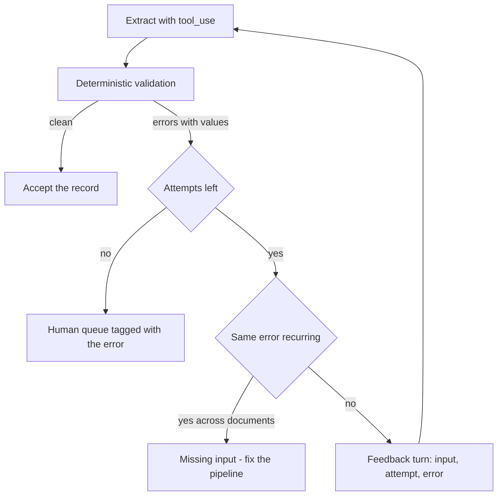
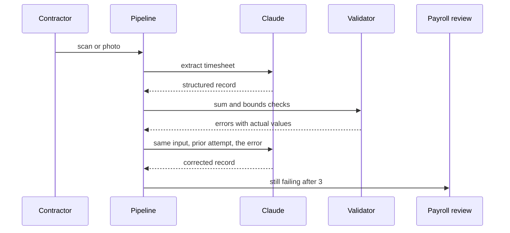

## What Problem Are We Solving?

A staffing agency extracts weekly timesheets from whatever contractors send in — scanned PDFs,
phone photos of paper sheets, spreadsheets, occasionally an email. A schema (4.3) guarantees the
record's shape. A validator checks the arithmetic: daily hours must sum to the weekly total.

About 11% of extractions fail that check. The first version of the pipeline resends the identical
prompt on failure. It works roughly a third of the time — about what a coin flip would give you
on which of two adjacent numbers got misread. The model has no idea it failed, no idea what
failed, and is being asked to redo the exact task that just went wrong.

Compare what a person would do. You don't hand a colleague's timesheet back saying "do it again".
You say "these don't add up — 38 in the daily column, 41 in the total". That sentence is the
entire difference: it turns a coin flip into a targeted correction, because now there's a
specific inconsistency to resolve.

But a second failure hides inside the same 11%, and from the outside it looks identical. Some of
those timesheets reference hours recorded on a page the pipeline never uploaded. No feedback
fixes that. The information was never in the context, and a retry loop against missing data is a
machine for spending money on increasingly confident guesses.

So the real problem is two problems: make retries informative, and learn to tell the difference
between "Claude processed the input wrong" and "the input never had it".

> **🗣️ In plain English:** Don't say "try again" — say what was wrong. And know when trying again can't possibly help, because the thing you're asking about was never in the prompt.

## Meet the Moving Parts

| Piece | What it does | Where it goes wrong |
|---|---|---|
| **Deterministic validator** | Plain code checking business rules | Written as a boolean; the *reason* is thrown away, and the reason is the whole asset |
| **The error message** | The specific inconsistency, with numbers | Written for a log line ("validation failed") instead of for the model |
| **The feedback prompt** | Original input + previous attempt + error | Previous attempt omitted, so the model can't see what it's correcting |
| **The retry cap** | 2–3, then stop | Absent, or an exponential-backoff loop borrowed from HTTP retries |
| **The escalation path** | A human queue | Missing, so the cap just drops the record |
| **The failure classifier** | Processing error vs. missing data | Skipped — and this is what makes retries expensive |

Two things are worth being precise about.

**The validator's error message is the product.** A validator that returns `False` has done the
cheap half of the job. `"daily hours sum to 38.0 but weekly_total is 41.0"` is what makes the
second attempt worth making. Write those strings for the model to read, with the actual values
in them.

**Retry-with-feedback fixes processing, never absence.** If the needed figure lives on a page you
didn't upload, no phrasing recovers it — at best the model produces a more confident guess, which
is worse than a failure. Repeated identical failures across many documents are the signature, and
the fix is upstream in the input pipeline, not in the prompt.

> **💡 Tip:** If a validator is a one-line boolean, you have built a gate, not a feedback loop. The upgrade is returning a sentence instead of a flag.

## How It Works, Step by Step

1. **Extract** via a forced `tool_use` call, so the shape is already guaranteed (4.3).
2. **Validate deterministically** — sums, orderings, cross-references, registry lookups. Plain
   code, no model involved.
3. **Collect reasons, not a verdict.** Return every failure as a sentence containing the actual
   values.
4. **On failure, build a feedback turn** carrying three things: the original input, the previous
   attempt, and the specific errors. Missing any one and the model is guessing again.
5. **Re-run, capped at 2–3 attempts.** Attempts beyond that almost never convert.
6. **Classify what's still failing.** Same error on the same field across documents means missing
   input; scattered arithmetic errors mean processing.
7. **Escalate.** A human queue for the residue, tagged with the error so the reviewer knows where
   to look — not a silent drop.



## Minimal Working Implementation

The loop, end to end, on a timesheet whose daily hours don't add up. Save as `retry_loop.py` and
run it — the first attempt typically fails the sum check and the second, given the numbers,
corrects it.

```python
import anthropic
client = anthropic.Anthropic()
TOOL = {
    "name": "record_timesheet",
    "description": "Record one weekly timesheet.",
    "strict": True,
    "input_schema": {
        "type": "object",
        "properties": {
            "contractor": {"type": "string"},
            "daily_hours": {"type": "array", "items": {"type": "number"}},
            "weekly_total": {"type": "number"},
        },
        "required": ["contractor", "daily_hours", "weekly_total"],
        "additionalProperties": False,
    },
}
SHEET = """Contractor: R. Okafor
Mon 7.5  Tue 8  Wed 6.5  Thu 8  Fri 9
Week total as signed: 41"""

def validate(rec: dict) -> list[str]:
    total = round(sum(rec["daily_hours"]), 2)
    if total == rec["weekly_total"]:
        return []
    return [f"daily_hours sum to {total} but weekly_total is "
            f"{rec['weekly_total']}; recheck each day"]

messages = [{"role": "user", "content": f"Record this timesheet:\n{SHEET}"}]
for attempt in range(1, 4):
    reply = client.messages.create(
        model="claude-opus-5", max_tokens=1000, tools=[TOOL],
        tool_choice={"type": "tool", "name": "record_timesheet"},
        messages=messages)
    block = next(b for b in reply.content if b.type == "tool_use")
    errors = validate(block.input)
    print(f"attempt {attempt}: {block.input} -> {errors or 'OK'}")
    if not errors:
        break
    messages += [
        {"role": "assistant", "content": reply.content},
        {"role": "user", "content": [
            {"type": "tool_result", "tool_use_id": block.id,
             "content": "Validation failed: " + "; ".join(errors)}]},
    ]
```

Note the shape of the feedback: the failed attempt goes back as the assistant turn it actually
was, and the error returns as a `tool_result` against that call. The model sees its own output
and the specific complaint about it, in the position where a tool's response belongs.

## Production Implementation

Production adds the part that decides whether retrying is worth doing at all.

```python
import collections
import logging

log = logging.getLogger("timesheets")
MAX_ATTEMPTS = 3
recent_errors: dict[str, collections.deque] = {}


def error_class(message: str) -> str:
    """Bucket an error so repeats across documents are visible."""
    return message.split(";")[0].split(" but ")[0][:40]


def is_missing_data(errors: list[str], source_id: str) -> bool:
    """Same error class recurring across documents means the input, not
    the model, is the problem - retrying cannot recover what was never
    supplied."""
    for message in errors:
        bucket = recent_errors.setdefault(error_class(message),
                                          collections.deque(maxlen=50))
        bucket.append(source_id)
        if len(bucket) == 50 and len(set(bucket)) >= 40:
            return True
    return False
```

The loop then spends attempts only where they can convert:

```python
def process(sheet: str, source_id: str) -> dict | None:
    messages = [{"role": "user", "content": sheet}]
    for attempt in range(1, MAX_ATTEMPTS + 1):
        record, errors, feedback = extract_and_validate(messages)
        if not errors:
            log.info("accepted", extra={"id": source_id, "tries": attempt})
            return record
        if is_missing_data(errors, source_id):
            escalate(source_id, record, errors, reason="missing_input")
            return None
        messages += feedback
    escalate(source_id, record, errors, reason="unconverged")
    return None
    # ...
```

**What changed, and why:**

- **A cap, and escalation at the cap.** Attempts past the third convert in the low single digits.
  Without escalation the cap is just a silent drop, which is how records vanish.
- **Missing-data detection is explicit.** One error class recurring across *different* documents
  is the signature of an input-pipeline gap. Detecting it turns a permanent retry cost into one
  ticket about a missing page.
- **Escalation carries the error and the last attempt.** A reviewer who is told "sum mismatch:
  38 vs 41, Wednesday looks misread" is done in under a minute; one handed a raw scan is not.
- **Attempt counts are logged per record.** The distribution is the health metric — a rising share
  of two-attempt successes means extraction quality is drifting, well before anything fails
  outright.

## In Production: Timesheet Intake at a Staffing Agency

The agency processes about 14,000 weekly timesheets from roughly 3,100 contractors, in every
format a person can produce. Payroll runs Monday morning, so the whole batch has to clear over
the weekend.



**Before.** Blind retry. 11.2% of extractions failed validation; retries recovered 34% of those,
leaving about 1,030 sheets a week for manual review — three people most of Sunday.

**After.** Retry-with-feedback recovered 81% of failures, nearly all on the first retry. The
manual queue fell to roughly 290 a week, and Sunday became one person for a few hours.

**The part that wasn't about retrying.** Of the residue, a recurring cluster shared one error
class: daily hours summing short by exactly the Saturday column. The cause was in the ingestion
step — a PDF splitter was dropping the final page on sheets that ran to two pages, which was
every sheet from contractors who worked weekends. No retry could have fixed it; the Saturday
hours were never in the context. The missing-data detector surfaced it in a fortnight by noticing
one error class spread across 40+ distinct documents. Under blind retry this had been running for
seven months, costing three API calls per affected sheet and producing, on the third attempt,
confident totals that were simply wrong.

**Economics.** Retry-with-feedback costs more per failed extraction than blind retry — the
feedback turn resends the input, the prior attempt, and the error, so an average failing sheet
runs about 2.3x the tokens of a clean one. Against that: 740 fewer sheets a week touched by a
human. The token line went up by low single-digit percent and the labour line dropped by most of
a full-time role.

> **🌍 Real-world example:** The detail that mattered most was unglamorous — putting the *actual numbers* in the error string. An early version said "daily hours do not match the weekly total", and recovery sat at 58%. Changing it to "daily_hours sum to 38.0 but weekly_total is 41.0; recheck each day" took it to 81%, with no other change. The model needs the discrepancy, not the category of discrepancy.

## Where This Applies — and Where It Doesn't

| Situation | Use this | Use instead |
|---|---|---|
| Output is schema-valid but fails a business rule | Retry with the specific error | — |
| Arithmetic or cross-field inconsistency | Feedback naming both values | — |
| A field was misread from a legible source | Feedback with the prior attempt | — |
| The same error recurs across many documents | — | Fix the input pipeline; retries can't help |
| The source genuinely lacks the information | — | Human review, or supply the missing page |
| The output shape is wrong | — | `tool_use` and a schema (4.3) |
| A rate limit or 5xx | — | SDK-level transport retry; a different mechanism |
| Three attempts have failed | — | Escalate with the error attached |

Anti-patterns: resending the identical prompt; validators that return a boolean; feedback that
omits the previous attempt; uncapped loops; exponential backoff applied to semantic failures
(the delay changes nothing — the *information* is what's missing); and capping without an
escalation path, which silently discards records.

## Failure Modes Seen in the Wild

### 1. The blind retry

**Symptom.** Retries succeed at roughly chance and cost a full call each.
**Cause.** The second prompt is identical to the first; the model never learns it failed.
**Fix.** Include the previous attempt and the specific error with its values.

### 2. The uninformative error

**Symptom.** Feedback is wired up correctly and barely beats blind retry.
**Cause.** The error string was written for a log — "validation failed", "inconsistent totals".
**Fix.** Put the numbers in it. This is usually a one-line change with a large effect.

### 3. Retrying a data gap

**Symptom.** One error class, over and over, across unrelated documents; three attempts each,
never converging.
**Cause.** The information isn't in the context. Nothing about the prompt can conjure it.
**Fix.** Detect recurrence across distinct documents, escalate as an input problem, and go fix
the ingestion.

### 4. The cap with no exit

**Symptom.** Records are missing from the output and nothing errored.
**Cause.** The loop stopped at the cap and returned `None`; nobody was watching.
**Fix.** Escalate at the cap, with the last attempt and the error attached, and count what lands
there.

> **⚠️ Watch out:** An uncapped feedback loop on a document that can't validate is an unbounded bill and, worse, an escalating hallucination — each round the model tries harder to satisfy a constraint the input can't support. Cap the attempts, and treat "the same error keeps recurring" as a signal to look at your inputs rather than your prompt.

## Exam Lens & Key Takeaway

> **📝 Exam focus:** Two ideas, and they're usually tested separately. First, **retry with the specific validation error included**, not a blind resend — the stem describes a validation failure and asks what the retry should contain; the answer names the original input, the previous output, and the exact error. "Resend the same prompt", "increase temperature for variety", and "switch to a larger model" are the distractors. Second, and the more discriminating item: **feedback loops cannot fix information that was never in the context.** A stem where a document refers to a table or page that wasn't provided is testing whether you know retrying is futile — the answer is to supply the missing input or route to a human, never to add retries or reword the prompt. Also expect the **2–3 attempt cap then escalate** number to appear directly.

> **🔑 Key takeaway:** A retry is only worth making if it carries new information — the original input, the failed attempt, and the specific error with its actual values. Cap attempts at two or three and escalate rather than dropping. And distinguish a processing mistake, which feedback fixes, from missing input, which no amount of retrying can.
