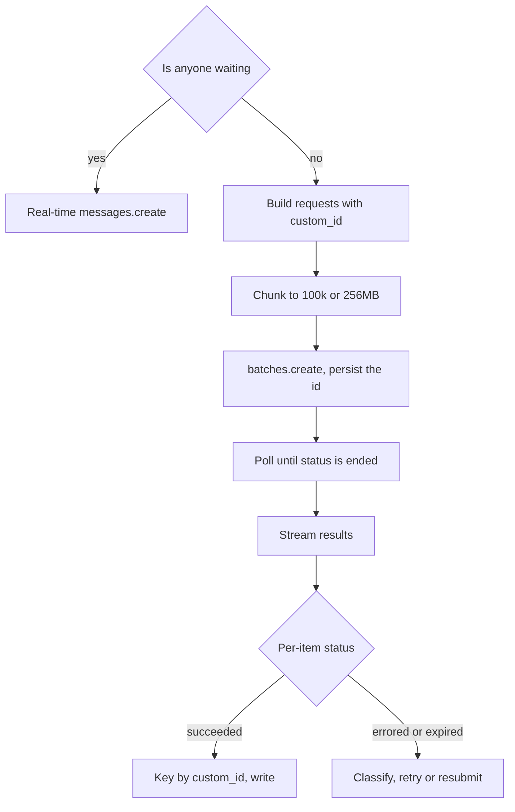
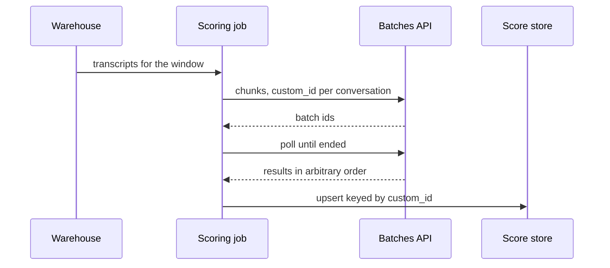

## What Problem Are We Solving?

A support organisation wants every conversation scored for quality — tone, resolution,
policy adherence — not a 2% sample pulled by team leads. That's 90 days of transcripts, about
340,000 conversations, and then roughly 26,000 more each week.

Run synchronously, the backfill is a thread pool firing `messages.create` for three days of
wall-clock, most of it spent backing off a 429. It competes for rate limit with the live product,
so somebody babysits it overnight and throttles it during business hours. It costs full price.
And when it dies at hour 31 on a timeout, nothing records which transcripts were done.

Everything wrong there comes from one mistaken assumption: that because the API call is
synchronous, the *workload* is. Nobody is waiting for any individual transcript score. The
deadline on the backfill is "this week", and on the weekly run "by Monday standup".

The Message Batches API is built for exactly that shape. Submit up to 100,000 requests as one
job, Claude works through them asynchronously, and you collect results later — most batches
finish within an hour, with a 24-hour ceiling. It costs 50% of standard pricing, and it doesn't
contend with your live traffic for rate limit.

The whole skill is recognising the shape. One question decides it: **is anyone — a person or a
live system — blocked on this response right now?** If yes, no discount justifies a wait that
might be 24 hours. If no, you are very likely paying double for latency nobody is consuming.

> **🗣️ In plain English:** Half price, if you can wait. The only question that matters is whether somebody is sitting there waiting for the answer.

## Meet the Moving Parts

| Piece | What it is | Where it goes wrong |
|---|---|---|
| **The batch** | Up to 100,000 requests or 256 MB, one job | Treated as a queue — it's immutable once created |
| **`custom_id`** | Your id on each request, returned with its result | Left as an index; results are unordered, so the mapping is lost |
| **`params`** | A complete Messages API request per item | Assumed limited — tools, vision, caching all work |
| **`processing_status`** | Poll until it reads `"ended"` | Confused with success: `"ended"` means finished, not successful |
| **Per-result status** | `succeeded`, `errored`, `canceled`, `expired` | Only the happy path is handled; the rest vanish |
| **The 24-hour ceiling** | Most finish in under an hour; 24h is the limit | Used as an estimate, so a deadline gets built on the typical case |

Two of these cause real incidents.

**`custom_id` is not optional bookkeeping.** Results are unordered. Zipping them against your
input list by position produces plausible, wrong data — transcript 40,001's score on transcript
12's record. Key by `custom_id`, and make it meaningful: a transcript ID, not `item-7`.

**`"ended"` is not "everything worked".** A batch ends when it stops processing, whatever became
of the individual items. Each result carries its own status, and an `errored` item distinguishes
`invalid_request` (your fault, don't retry) from a server error (retry safely).

Also: **batch requests are self-contained.** A multi-turn tool-calling loop doesn't fit inside one
batch request — there's nobody to execute the tool mid-flight.

> **💡 Tip:** Make `custom_id` the primary key of the row you're going to write back to. Then reconciliation is a dictionary lookup rather than a join you have to think about.

## How It Works, Step by Step

1. **Confirm nobody is waiting.** If a human or a live request is blocked, stop here.
2. **Build one `Request` per item**, each with a meaningful `custom_id` and a complete
   `MessageCreateParamsNonStreaming` in `params`.
3. **Put the shared prefix in a cached system prompt.** Batch and caching compose; the rubric is
   identical across every request in the job.
4. **Chunk to the limits** — 100,000 requests or 256 MB, whichever you hit first.
5. **Submit** with `client.messages.batches.create(requests=[...])` and persist the returned
   batch ID before doing anything else.
6. **Poll `processing_status`** on a sane interval — a minute, not a second — until `"ended"`.
7. **Stream results and key by `custom_id`**, branching on each item's own status.
8. **Handle the non-successes**: resubmit `expired`, retry server-side `errored`, fix and
   resubmit `invalid_request`.



## Minimal Working Implementation

The whole lifecycle on three transcripts. Save as `batch_score.py` and run it — it prints the
batch ID, polls until it ends, and reconciles by `custom_id`.

```python
import time
import anthropic
from anthropic.types.message_create_params import (
    MessageCreateParamsNonStreaming)
from anthropic.types.messages.batch_create_params import Request

client = anthropic.Anthropic()
RUBRIC = ("Score this support transcript 1-5 for resolution quality. "
          "Reply with the digit only.")

TRANSCRIPTS = {
    "conv-8801": "Customer: card declined. Agent: try another card. Closed.",
    "conv-8802": "Customer: card declined. Agent: checked the gateway log, "
                 "found an expired token, reissued it, confirmed the charge.",
    "conv-8803": "Customer: where is my refund? Agent: no idea, sorry.",
}

batch = client.messages.batches.create(requests=[
    Request(
        custom_id=conv_id,
        params=MessageCreateParamsNonStreaming(
            model="claude-opus-5", max_tokens=16, system=RUBRIC,
            messages=[{"role": "user", "content": text}]),
    )
    for conv_id, text in TRANSCRIPTS.items()
])
print(f"batch {batch.id}")
while True:
    batch = client.messages.batches.retrieve(batch.id)
    if batch.processing_status == "ended":
        break
    print(f"  {batch.processing_status}: {batch.request_counts.processing}")
    time.sleep(30)

scores = {}
for result in client.messages.batches.results(batch.id):
    if result.result.type == "succeeded":
        msg = result.result.message
        scores[result.custom_id] = next(
            b.text for b in msg.content if b.type == "text").strip()
    else:
        scores[result.custom_id] = f"<{result.result.type}>"

for conv_id in TRANSCRIPTS:
    print(f"{conv_id}: {scores[conv_id]}")
```

The final loop iterates the *input* keys and looks each one up. That ordering is deliberate — it
makes a missing result visible as a `KeyError` rather than a silently short list.

## Production Implementation

At 340,000 transcripts the batch itself is the easy part; chunking, durability and the
non-success paths are the work.

```python
import json
import logging
import pathlib

log = logging.getLogger("scoring")
STATE = pathlib.Path("batch_state.json")
MAX_PER_BATCH = 100_000
SYSTEM = [{"type": "text", "text": RUBRIC,
           "cache_control": {"type": "ephemeral"}}]


def submit(chunk: dict[str, str]) -> str:
    """Persist the batch id before anything can crash - an unrecorded
    batch still runs and still bills, but nobody can collect it."""
    batch = client.messages.batches.create(requests=[
        Request(custom_id=cid,
                params=MessageCreateParamsNonStreaming(
                    model="claude-opus-5", max_tokens=16, system=SYSTEM,
                    messages=[{"role": "user", "content": text}]))
        for cid, text in chunk.items()])
    state = json.loads(STATE.read_text()) if STATE.exists() else {}
    state[batch.id] = {"status": "submitted", "count": len(chunk)}
    STATE.write_text(json.dumps(state), encoding="utf-8")
    return batch.id
```

Collection branches on every outcome, not just the one you hope for:

```python
def collect(batch_id: str) -> tuple[dict, list, list]:
    scored, retry, broken = {}, [], []
    for result in client.messages.batches.results(batch_id):
        kind = result.result.type
        if kind == "succeeded":
            msg = result.result.message
            scored[result.custom_id] = next(
                b.text for b in msg.content if b.type == "text").strip()
        elif kind == "expired" or (
                kind == "errored"
                and result.result.error.type != "invalid_request"):
            retry.append(result.custom_id)
        else:
            broken.append((result.custom_id, kind))
    log.info("collected", extra={"batch": batch_id, "ok": len(scored),
                                 "retry": len(retry), "bad": len(broken)})
    return scored, retry, broken
    # ...
```

**What changed, and why:**

- **The batch ID is persisted before anything else can fail.** A submitted batch runs and bills
  whether or not you remember it. Losing the ID means paying for results you can't collect.
- **Input is chunked to the documented limits**, and each chunk is independently trackable — so a
  crash costs one chunk, not the run.
- **The rubric is a cached system prompt.** It's byte-identical across hundreds of thousands of
  requests; caching composes with batch, and the discounts multiply.
- **Every result status is handled.** `expired` and transient `errored` go back in the queue;
  `invalid_request` is a bug report, not a retry. Reading only `succeeded` is how a "complete"
  run quietly covers 96% of the corpus.

## In Production: Retroactive Quality Scoring at a Support Org

A support organisation scores 100% of conversations instead of the 2% its leads could sample by
hand: a 340,000-conversation backfill, then about 26,000 a week.



**The backfill.** Four chunks of 85,000. Submitted on a Friday evening, all four ended within
about six hours — well inside the 24-hour ceiling, and nobody was watching anyway. The equivalent
synchronous run had been estimated at three days of babysat wall-clock, throttled around business
hours to avoid starving live traffic. At roughly 1,800 input and 4 output tokens per
conversation, the backfill ran a little over $1,500 at batch pricing against just over $3,000
synchronous — and the real saving was that it didn't touch the production rate limit at all.

**The weekly run.** 26,000 transcripts submitted Sunday 02:00, collected by the 09:00 standup.
Typical completion is 20 to 40 minutes. The deadline is Monday morning, which leaves an enormous
margin against the ceiling — and that margin is the point, because the ceiling is what you must
plan against, not the typical case.

**What went wrong first.** The original collector zipped results against the input list by
position. It ran clean on a 50-row test batch — small batches often come back in order, which is
exactly what makes this bug survive testing. At 85,000 the ordering diverged, and roughly 31,000
conversations got another conversation's score. Nothing errored; the data was simply wrong, and
it was caught three days later when a team lead queried a transcript they remembered and found a
score that made no sense. Rewriting it to key by `custom_id` was a six-line change.

> **🌍 Real-world example:** A second, quieter lesson came from the weekly job's first failure. A malformed transcript — a null body from an upstream export bug — produced an `invalid_request` error on 12 items. The collector counted only `succeeded` results and reported "26,000 scored". The dashboard showed complete coverage for four weeks while twelve conversations a week fell on the floor. The fix wasn't the retry logic; it was making the non-success branches log loudly enough that somebody noticed them.

## Where This Applies — and Where It Doesn't

| Situation | Use this | Use instead |
|---|---|---|
| Nightly report, nobody waiting | Batches API, ~50% cost | — |
| Backfill or bulk re-processing | Batches API, chunked | — |
| Overnight test-case or doc generation | Batches API | — |
| Evaluating a prompt change over a corpus | Batches API | — |
| A developer waiting on a pre-merge check | — | Real-time `messages.create` |
| A user in a chat session | — | Real-time, streaming |
| Multi-turn tool calling within one request | — | Real-time; the loop needs a live executor |
| Needed within a guaranteed few minutes | — | Real-time; the ceiling is 24 hours |

Anti-patterns: batching anything a person is blocked on because the discount looked good;
positional reconciliation instead of `custom_id`; treating `"ended"` as success; planning against
the typical completion time rather than the 24-hour ceiling; and polling in a tight loop, which
adds cost and latency to a job whose entire premise is that you aren't in a hurry.

## Failure Modes Seen in the Wild

### 1. Positional reconciliation

**Symptom.** Results attached to the wrong records. No errors. Small test batches pass.
**Cause.** Results come back in arbitrary order; small batches often happen to be ordered.
**Fix.** Key by `custom_id` and iterate your input keys, so a missing result raises rather than
truncating.

### 2. "Ended" read as "succeeded"

**Symptom.** Coverage looks complete; a slice of the corpus is missing.
**Cause.** `processing_status == "ended"` means finished, not that every item succeeded.
**Fix.** Branch on each result's own type, and count and log the non-successes.

### 3. The lost batch ID

**Symptom.** A bill for a job whose results nobody has.
**Cause.** The submitting process died before persisting the returned ID; the batch ran anyway.
**Fix.** Write the ID to durable storage before anything else. `batches.list()` can recover it,
but only if you know to look.

### 4. Batch chosen for a blocking path

**Symptom.** A feature intermittently takes hours; the discount is unmissable in the invoice.
**Cause.** "Nobody's waiting" was assumed rather than checked — usually a pipeline that later
acquired a synchronous consumer.
**Fix.** Re-ask the question when consumers change. Deadline in minutes means real-time.

> **⚠️ Watch out:** Plan against 24 hours, not the hour your batches usually take. A job that normally finishes in 40 minutes and is scheduled with a two-hour margin will eventually meet a slow day, and the failure lands as a missed business deadline rather than an error anyone can see.

## Exam Lens & Key Takeaway

> **📝 Exam focus:** This is one of the most mechanically predictable topics on the exam. The stem gives a scenario and you classify it: **"someone is waiting right now" → real-time API**, **"nightly / weekly / bulk / nobody waiting" → Batches API**. Memorise three facts — **~50% cost reduction**, **up to 24 hours** (non-real-time by design), and **`custom_id` is how you match results to requests**, because results come back in any order. Expect a question where the scenario is a developer waiting on pre-merge CI feedback and batch is offered as the "cost-effective" answer: the discount never justifies blocking a person. Also know that **multi-turn tool calling isn't supported within a single batch request** — that limitation is directly testable.

> **🔑 Key takeaway:** Batch trades latency for half the cost, so the only question is whether anything is blocked on the answer. When nothing is, submit up to 100,000 self-contained requests, tag every one with a meaningful `custom_id`, poll until the batch has ended, and reconcile by that ID — checking each result's own status, because "ended" means finished, not successful.
