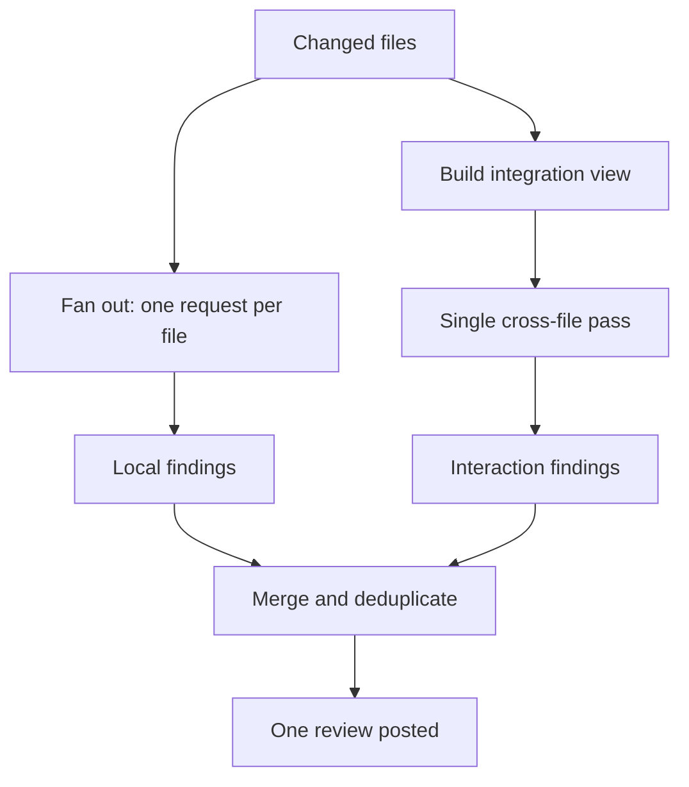
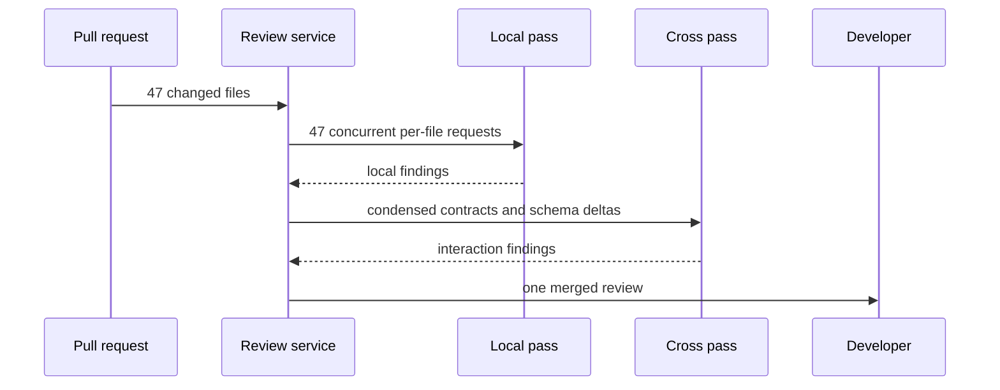

## What Problem Are We Solving?

A data platform team ships schema migrations as pull requests: the migration SQL, the ORM models,
the serializers, the backfill, and every consumer of the changed tables — 30 to 60 files. An
automated reviewer reads the whole diff in one request and posts its findings.

It is good at the first eight files. Past that it thins out — findings get shorter, more generic,
then stop. Nobody notices: a review saying nothing about file 40 looks exactly like a review that
found nothing wrong with file 40.

Then a migration ships that drops a column two weeks before the last consumer stops reading it.
Both halves were in the diff — the `ALTER TABLE` in file 3, the consumer still selecting that
column in file 47. The reviewer saw both. It never held them in mind at once with enough attention
left to notice they contradicted each other.

Two distinct things went wrong. Attention was spread thin across many independent units, so later
files got less scrutiny — a structural consequence of the request's shape, not of the model trying
harder. And the review was asked to do two jobs at once: find defects *inside* each file, and find
contradictions *between* files. Those need different context and different questions, and asking
for both in one pass makes them compete.

The fix follows from naming the two jobs: give each its own pass. One per file, asking only about
local correctness; one over everything, asking only about interactions.

> **🗣️ In plain English:** One reviewer reading 50 files at once does neither job well. Give each file its own read, then do a separate read whose only question is "do these files agree with each other?"

## Meet the Moving Parts

- **Pass 1 — per-file.** One request per changed file. Sees that file (plus enough surrounding
  context to be meaningful) and nothing else. Question: is anything wrong *within* this file?
- **Pass 2 — integration.** One request over all the diffs together, or a condensed form of them.
  Question: do these changes contradict each other? Explicitly told not to report local issues.
- **The fan-out.** Pass 1 is embarrassingly parallel — N independent requests, bounded only by
  rate limit.
- **The condenser.** For very large changesets, pass 2 can't take every full diff. Feed it
  signatures, schema deltas, and changed call sites rather than raw text.
- **The merge step.** Deduplicates: the same issue can surface in both passes, and shipping it
  twice erodes trust as fast as missing it.
- **The pass boundary.** What each pass is told *not* to look for. This is what stops pass 2
  turning into a second, worse local review.

The mistake that guts the design is a positive-only instruction for pass 2: "look for cross-file
issues." Given all the diffs, the model also reports the local issues it notices, because nothing
told it not to — so you pay for two passes and get one diluted review twice. Pass 2 needs an
explicit exclusion; this is 4.1 applied to the pass boundary.

The second mistake is thinking this is only about attention. "Review these 50 files" is an
underspecified request. Splitting the passes also asks two precise questions instead of one vague
one.

> **💡 Tip:** If pass 2's findings look like pass 1's findings, the boundary isn't in the prompt. Check for an explicit "do not report issues that are visible in a single file".

## How It Works, Step by Step

1. **Enumerate the changed units** — files, modules, or migration steps.
2. **Fan out pass 1**, one request per unit, with a prompt scoped to local correctness and an
   explicit exclusion of cross-file concerns.
3. **Run them concurrently**, bounded by a semaphore, so a 50-file PR isn't 50 sequential calls.
4. **Build the integration view**: full diffs if they fit, otherwise signatures, schema changes,
   and changed call sites.
5. **Run pass 2 once**, asking only about interactions — contract changes versus callers, shared
   state, ordering and migration safety — and explicitly excluding local issues.
6. **Merge and deduplicate** by file and line, preferring the more specific finding.
7. **Post once.** Two passes should produce one review; developers experience a doubled comment
   as noise regardless of correctness.



## Minimal Working Implementation

Two files that are individually fine and jointly broken: one drops a column, the other still reads
it. Save as `two_pass.py` and run it — pass 1 reports nothing, pass 2 finds it.

```python
import concurrent.futures as cf
import anthropic

client = anthropic.Anthropic()

FILES = {
    "migrations/0042_drop_legacy.sql":
        "ALTER TABLE orders DROP COLUMN legacy_ref;",
    "jobs/nightly_export.py":
        "rows = db.query('SELECT id, legacy_ref FROM orders')\n"
        "write_csv(rows)",
}

LOCAL = ("Review this ONE file for defects visible within it alone. "
         "Do not speculate about other files. List findings, or NONE.")

CROSS = ("Review these files ONLY for cross-file problems: a contract "
         "changed in one and relied on in another, shared state, unsafe "
         "ordering. Do NOT report issues visible in a single file alone. "
         "List findings, or NONE.")


def ask(system: str, body: str) -> str:
    reply = client.messages.create(
        model="claude-opus-5", max_tokens=1000, system=system,
        messages=[{"role": "user", "content": body}])
    return next(b.text for b in reply.content if b.type == "text").strip()


with cf.ThreadPoolExecutor(max_workers=8) as pool:
    jobs = {name: pool.submit(ask, LOCAL, f"{name}\n\n{text}")
            for name, text in FILES.items()}
    for name, job in jobs.items():
        print(f"[local] {name}: {job.result()}")

combined = "\n\n".join(f"--- {n}\n{t}" for n, t in FILES.items())
print(f"\n[cross] {ask(CROSS, combined)}")
```

A single combined pass over these two files usually finds it too — with two files there's nothing
to dilute. The behaviour that matters shows up at scale, which is what the production version and
the scenario below are about.

## Production Implementation

At 60 files the questions are concurrency, what pass 2 can actually be shown, and not posting the
same finding twice.

```python
import asyncio
import dataclasses

MAX_CONCURRENCY = 8
INTEGRATION_BUDGET = 60_000  # characters, not the whole diff


@dataclasses.dataclass(frozen=True)
class Finding:
    file: str
    line: int
    issue: str
    source: str  # "local" or "cross"


async def local_pass(files: dict[str, str]) -> list[Finding]:
    sem = asyncio.Semaphore(MAX_CONCURRENCY)

    async def one(name: str, text: str) -> list[Finding]:
        async with sem:
            return await review(LOCAL, f"{name}\n\n{text}", name, "local")

    batches = await asyncio.gather(
        *(one(n, t) for n, t in files.items()), return_exceptions=True)
    return [f for b in batches if not isinstance(b, Exception) for f in b]
```

Pass 2 gets a condensed view when the raw diffs don't fit, and the merge is deduplicated:

```python
def integration_view(files: dict[str, str]) -> str:
    """Full diffs when they fit; otherwise signatures and schema deltas -
    pass 2 needs the contracts, not every line of every body."""
    combined = "\n\n".join(f"--- {n}\n{t}" for n, t in files.items())
    if len(combined) <= INTEGRATION_BUDGET:
        return combined
    return "\n\n".join(f"--- {n}\n{condense(t)}" for n, t in files.items())


def merge(local: list[Finding], cross: list[Finding]) -> list[Finding]:
    """Same defect from both passes is one comment. Cross-file wins - it
    carries the context that explains why it matters."""
    seen = {(f.file, f.line): f for f in local}
    for f in cross:
        seen[(f.file, f.line)] = f
    return sorted(seen.values(), key=lambda f: (f.file, f.line))
    # ...
```

**What changed, and why:**

- **Pass 1 fans out under a semaphore.** 60 sequential calls is minutes of wall-clock on a
  pre-merge check; 60 concurrent calls is a 429. Eight at a time is neither.
- **One file's failure doesn't sink the review.** `return_exceptions=True` means a single failed
  request costs one file's findings, not the run — and the count of dropped files is worth
  logging, because a silently partial review is the original problem wearing a new hat.
- **Pass 2 gets a condensed view over a budget.** Feeding 60 full diffs into the integration pass
  recreates the dilution the design exists to avoid. Signatures, schema deltas and changed call
  sites are what cross-file reasoning actually needs.
- **Findings are merged and deduplicated, cross-file winning.** Both passes can see the same line.
  The cross-file version explains *why* it matters, so it's the one to keep.

## In Production: Schema Migration Review at a Data Platform Team

The team ships 15–20 migration PRs a week, each touching the migration, the models, the
serializers, a backfill, and every consumer of the changed tables.



**Before.** One request over the whole diff. Measured against defects later found in production
or by human review, the single pass caught 71% of local defects in the first ten files and 34%
beyond file twenty. Cross-file defects — the expensive class — it caught 18% of.

**After.** Per-file local detection flattened to 76–79% regardless of a file's position in the
diff, which is the whole point: file 47 now gets the same review as file 3. Cross-file detection
went to 64%.

**The incident that prompted it.** A migration dropped `orders.legacy_ref` while a nightly export
job, 44 files later in the same PR, still selected it. The export ran at 02:00, failed silently
into a retry loop, and the finance team noticed three days later when a reconciliation report was
empty. Under two-pass review that class is exactly what pass 2 exists to catch, and the condensed
view makes it easy: a dropped column and a `SELECT` naming it are both in the schema-delta and
changed-call-site summary, adjacent, with nothing else competing.

**Cost and latency.** A 47-file PR went from one request of roughly 95,000 input tokens to 48
requests totalling about 140,000 — call it 1.5x the tokens, and with the shared instruction
cached, meaningfully less than that in money. Wall-clock actually *improved*, from about 95
seconds to 40, because the per-file pass runs eight-wide while the single pass was one long
sequential generation. On a pre-merge check, latency is the number developers feel.

> **🌍 Real-world example:** The exclusion line in pass 2's prompt was worth more than any other single change. The first version just said "look for cross-file issues", and pass 2 returned mostly the same local findings pass 1 had already produced — the merge step deduplicated them, so the failure was invisible except as a cost with no benefit. Adding "Do NOT report issues visible in a single file alone" took cross-file detection from 29% to 64%, and nothing else about the system changed.

## Where This Applies — and Where It Doesn't

| Situation | Use this | Use instead |
|---|---|---|
| Many independent units, uneven review quality | Per-file pass, fanned out | — |
| Defects that only exist between units | A dedicated integration pass | — |
| Contract changed in one place, relied on elsewhere | Cross-file pass over signatures | — |
| Local judgment mixed with cross-item judgment | Separate passes, explicit exclusions | — |
| Two or three files, a simple change | — | One pass; the orchestration isn't worth it |
| Units genuinely independent, no shared state | — | Per-file only; skip the integration pass |
| Cost matters far more than recall | — | One pass, and accept the miss rate |
| Later files are skimmed but the total is small | — | Reordering or chunking may be enough |

Anti-patterns: passes without explicit exclusions, so pass 2 repeats pass 1; feeding pass 2 every
full diff, recreating the dilution the split was meant to fix; posting both passes separately, so
developers see the same issue twice; and running N sequential per-file calls, which trades a
quality problem for a latency one.

## Failure Modes Seen in the Wild

### 1. The duplicated review

**Symptom.** Two passes, and pass 2's findings look like pass 1's.
**Cause.** Pass 2 was told what to look for but not what to ignore.
**Fix.** An explicit exclusion — "do not report issues visible in a single file alone".

### 2. Integration pass, diluted

**Symptom.** Cross-file detection barely beats the single pass.
**Cause.** Every full diff was fed to pass 2, so it has the same attention problem the split was
meant to solve.
**Fix.** Condense to contracts: signatures, schema deltas, changed call sites.

### 3. The silently partial review

**Symptom.** A file's findings are missing; the review reports success.
**Cause.** One fan-out request failed and the result was dropped without counting.
**Fix.** Count completed versus expected units and surface the gap in the review itself.

### 4. Sequential fan-out

**Symptom.** Quality improved, and developers switched the bot off.
**Cause.** 50 sequential calls on a pre-merge check is minutes of blocking latency.
**Fix.** Bounded concurrency. The per-file pass is independent by construction — this is free.

> **⚠️ Watch out:** Multi-pass raises cost and orchestration complexity, and it earns that only when there are enough units to dilute attention or genuine interactions between them. On a three-file change it's pure overhead — and worse, the extra machinery is one more thing that can silently drop a file.

## Exam Lens & Key Takeaway

> **📝 Exam focus:** The stem is almost always a large pull request — "14 files", "an entire PR at once" — where the reviewer catches obvious bugs in early files but misses something involving two files together. The answer is the **two-pass split: a per-file pass for local issues, then a separate integration pass for cross-file issues**, and the distractors are "use a larger context window", "ask it to be more thorough", "raise max_tokens", and "split the PR into smaller PRs" (a process change, not an architecture). Know *why* it works — attention is spread unevenly across many units in one pass, and local versus cross-file are two different jobs — because the reasoning is asked about directly. The pattern generalises: whenever a task mixes a per-item judgment with a cross-item judgment, separate passes beat one combined pass.

> **🔑 Key takeaway:** One pass over many units reviews the early ones and skims the rest, and conflates two different questions while doing it. Give each its own pass — per-file for local defects, one integration pass for interactions — tell the second pass explicitly what *not* to report, and merge the findings into a single review.
