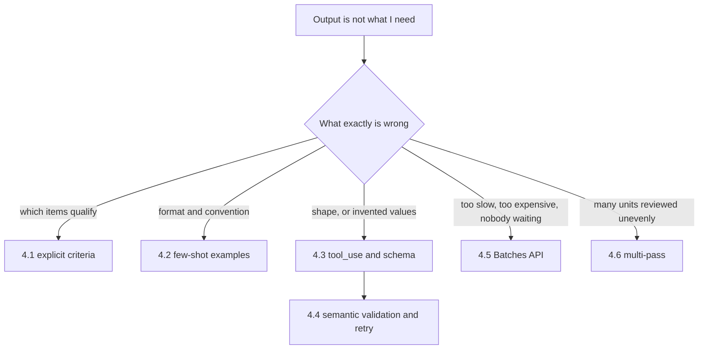
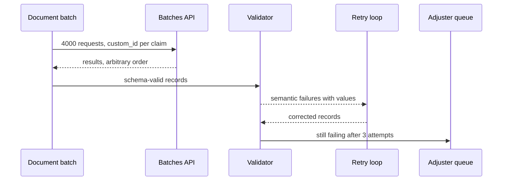

## What Problem Are We Solving?

Every topic in this domain is a different answer to one question: *the output isn't what I need —
what do I change?*

That question has at least five distinct answers, and reaching for the wrong one is the expensive
mistake. A team whose extractions keep inventing values adds retries, and burns three calls per
document producing three confident fabrications. A team whose reviewer is noisy adds examples,
when what was missing was a rule saying what not to flag. A team whose nightly job is slow and
expensive optimises the prompt, when the workload simply shouldn't have been synchronous.

Each is a reasonable move applied to the wrong diagnosis. The diagnosis is the skill.

So the domain splits into two halves that meet in the middle. **Prompting** — 4.1 and 4.2 — is
about making the instruction unambiguous, either by naming the rule or by showing the pattern.
**Structured output** — 4.3 through 4.6 — is about what happens once a machine, not a person, is
reading the answer: guaranteeing its shape, checking its meaning, and choosing an architecture
that fits the workload rather than fighting it.

The thread running through all six is a single distinction the exam returns to repeatedly: the
difference between what you can *enforce* and what you can only *check*. A schema enforces
structure. Nothing enforces truth. Everything in the back half of this domain is built on that
gap.

> **🗣️ In plain English:** Six tools for "the output is wrong". Picking the right one starts with naming precisely what's wrong — the instruction, the shape, the values, or the shape of the whole job.

## Meet the Moving Parts

| Symptom | Topic | The move |
|---|---|---|
| Same input, different verdicts run to run | **4.1** Explicit criteria | Replace the adjective with a checkable condition, and say what to exclude |
| Format and conventions wander between runs | **4.2** Few-shot | 2–4 labelled examples, formatted exactly like the real query |
| Preambles, fences, invented values, drifting fields | **4.3** `tool_use` + schema | Force a tool call; make absent-able fields nullable **and** required |
| Schema-valid output that's semantically wrong | **4.4** Validation and retry | Feed the specific error back; cap attempts; escalate |
| Bulk work, slow and at full price | **4.5** Batches API | ~50% cost if nothing is blocked on it; key results by `custom_id` |
| Many units reviewed unevenly; cross-unit defects missed | **4.6** Multi-pass | One pass per unit, one integration pass, plus exclusions |

Three relationships matter more than the individual rows.

**4.1 and 4.2 are not interchangeable.** Criteria fix *undefined* boundaries — you know the rule
and never wrote it down. Examples fix *indescribable* ones — the convention is easier shown than
stated. Reaching for examples when the problem is an unstated threshold gives you a consistent
model applying a rule nobody agreed on.

**4.3 and 4.4 are two halves of one pipeline.** The schema proves the fields and types. Only your
own code proves the numbers add up. Treating "it parsed" as "it's correct" is the most
consequential error here, and the one the exam probes hardest.

**4.5 and 4.6 are architecture, not prompting** — the two places where the answer is "change the
shape of the job", not "change the words".

> **💡 Tip:** Before changing a prompt, say out loud which of the six symptoms you have. If you can't pick one, you're about to fix the wrong thing.

## How It Works, Step by Step

1. **Name the symptom precisely.** Inconsistent *decisions*, inconsistent *format*, malformed or
   invented *values*, values that are well-formed but wrong, or a workload shaped wrong.
2. **Inconsistent decisions → 4.1.** Write the rule as a condition on the input, plus exclusions.
3. **Inconsistent format → 4.2.** Two to four examples, identical formatting, one negative case.
4. **A machine reads the output → 4.3.** Forced `tool_use` with a JSON schema; nullable *and*
   required for anything the source may omit; enums with an `"other"` escape hatch.
5. **Check meaning separately → 4.4.** Deterministic validation, then feedback carrying the input,
   the failed attempt, and the specific error. Cap at 2–3 and escalate.
6. **Ask who's waiting → 4.5.** Nobody waiting means batch, at roughly half the cost, keyed by
   `custom_id`.
7. **Ask how many units → 4.6.** Many independent units, or local-plus-cross-unit judgment, means
   separate passes with explicit exclusions.



## Minimal Working Implementation

The domain's failure modes are visible in a tool definition before a single call is made. Save as
`audit_schema.py` and run it against your own extraction schema — it needs no API key.

```python
import json
import sys

OPTIONAL_HINTS = ("discount", "resolved", "end", "note", "secondary",
                  "reference", "code", "detail", "comment")


def audit(tool: dict) -> list[str]:
    schema = tool.get("input_schema", {})
    props = schema.get("properties", {})
    required = set(schema.get("required", []))
    findings = []

    if not tool.get("strict"):
        findings.append("strict is not set - the schema is guidance, "
                        "not enforcement")
    if schema.get("additionalProperties") is not False:
        findings.append("additionalProperties is not false - extra keys "
                        "can appear and strict mode requires it")

    for name, spec in props.items():
        types = spec.get("type")
        types = types if isinstance(types, list) else [types]
        nullable = "null" in types
        if name in required and not nullable:
            if any(hint in name.lower() for hint in OPTIONAL_HINTS):
                findings.append(
                    f"{name}: required and not nullable, but the name "
                    f"suggests it may be absent - invites invention (4.3)")
        if "enum" in spec and "other" not in spec["enum"]:
            findings.append(
                f"{name}: closed enum with no 'other' - unanticipated "
                f"values get mis-bucketed silently")
        if name not in required and nullable:
            findings.append(
                f"{name}: nullable but not required - the model can omit "
                f"it entirely, so 'absent' and 'not found' are ambiguous")
    return findings


if __name__ == "__main__":
    tool = json.loads(open(sys.argv[1], encoding="utf-8").read())
    issues = audit(tool)
    print("\n".join(f"- {i}" for i in issues) or "no schema smells found")
    sys.exit(1 if issues else 0)
```

Every check maps to a failure mode in 4.3: enforcement that isn't enforcing, a required field with
no honest way to say "not present", and a closed enum the real world will overflow.

## Production Implementation

The schema audit is static. In production the same failure modes are visible as *rates*, and the
rates are what tell you which lever to pull.

```python
import collections

WINDOW = 500
counters = collections.defaultdict(lambda: collections.deque(maxlen=WINDOW))


def observe(record: dict, semantic_errors: list[str], attempts: int) -> None:
    """Every number here maps to a topic in this domain."""
    counters["null_rate"].append(
        sum(v is None for v in record.values()) / max(len(record), 1))
    counters["other_rate"].append(record.get("severity") == "other")
    counters["semantic_fail"].append(bool(semantic_errors))
    counters["retried"].append(attempts > 1)


def diagnose() -> list[str]:
    def rate(key: str) -> float:
        series = counters[key]
        return sum(series) / len(series) if series else 0.0

    signals = []
    if rate("other_rate") > 0.05:
        signals.append("enum overflow - add a member (4.3)")
    if rate("semantic_fail") > 0.10:
        signals.append("semantic failures high - check inputs, not the "
                       "prompt (4.4)")
    if rate("retried") > 0.25:
        signals.append("retry rate high - extraction quality drifting")
    return signals
    # ...
```

**What changed, and why:**

- **The failure modes became metrics.** Null rate, `"other"` rate, semantic-failure rate and
  retry rate are the four numbers that make this domain's silent failures visible. Without them,
  a schema-valid hallucination looks exactly like success.
- **Each signal names the topic that fixes it.** A rising `"other"` rate is a schema change (4.3),
  not a prompt change. A rising semantic-failure rate usually means the *input* degraded (4.4).
  Mapping symptom to lever is the whole domain.
- **Rates are windowed, not cumulative.** A lifetime average hides a regression that started on
  Tuesday; a rolling window surfaces it.
- **Retry rate is watched even when retries succeed.** A quiet climb from 8% to 25% means
  extraction quality is drifting well before anything fails outright — the earliest warning this
  domain offers.

## In Production: A Claims Pipeline That Reads 4,000 Documents a Night

An insurance claims processor ingests roughly 4,000 documents a night — adjuster reports, repair
invoices, photographs of damage — and extracts structured claim records. Every topic in the domain
appears exactly once.



**How the six fit.** Nobody waits on a claim overnight, so the run is a single batch keyed by
claim ID — half price, and no contention with the live quoting API (**4.5**). Each document is
extracted through a forced `tool_use` call whose schema marks `settlement_date` and `adjuster_note`
nullable-and-required, because plenty of claims genuinely lack them (**4.3**). The extraction
prompt carries three labelled examples spanning the three document layouts the corpus actually
contains, cached as a stable prefix (**4.2**). Fraud triage runs on numbered criteria with an
explicit exclusion list, so "suspicious" never appears in a prompt (**4.1**). A deterministic
validator checks that line items sum to the claimed total and that dates are ordered, feeding
failures back with the actual figures (**4.4**). And because a claim packet is 5 to 40 separate
documents, review runs per-document and then once across the packet, looking only for
contradictions between documents (**4.6**).

**What it's worth.** Before: a synchronous pipeline, prose-instructed JSON, blind retries, one
combined review pass. 78% of claims cleared without human touch. After: 94%, on the same model.
Token spend fell by about 40%, almost entirely from moving to batch and caching the examples.

The largest single improvement wasn't any prompt change. Making `settlement_date` nullable stopped
the pipeline inventing settlement dates for open claims — which had been flowing into reserve
calculations for months, unnoticed, because every record was perfectly valid JSON.

> **🌍 Real-world example:** The packet-level pass (4.6) catches the class nobody else can: a repair invoice claiming £4,200 of bodywork against an adjuster report describing a cracked wing mirror. Each document is internally consistent and passes its own review. Only a pass whose sole job is comparing documents to each other sees the contradiction — and that contradiction is, in this business, the entire point of the review.

## Where This Applies — and Where It Doesn't

| Situation | Use this | Use instead |
|---|---|---|
| A machine parses the output | `tool_use` with a schema (4.3) | — |
| Decisions vary run to run | Explicit criteria (4.1) | — |
| Format and conventions vary | Few-shot examples (4.2) | — |
| Values are well-formed but wrong | Semantic validation and retry (4.4) | — |
| Bulk work, nothing blocked on it | Batches API (4.5) | — |
| Many units, uneven review quality | Multi-pass (4.6) | — |
| Output is prose for a person to read | — | Plain prompting; schemas add ceremony |
| The required information isn't in the prompt | — | Fix the input; nothing here helps |

Anti-patterns that span the domain: treating schema validity as correctness; retrying what is
actually a missing-data problem; batching something a person is blocked on; adding examples when
the real gap is an unstated rule; and changing the model or the temperature when the prompt still
contains an undefined threshold word.

## Failure Modes Seen in the Wild

### 1. The valid, false record

**Symptom.** 100% parse success, wrong data downstream, discovered weeks later by a customer.
**Cause.** A required non-nullable field the source didn't contain, so the model supplied one.
**Fix.** Nullable *and* required, plus a semantic validator. Watch the null rate (4.3, 4.4).

### 2. Retrying a data gap

**Symptom.** One error class recurring across unrelated documents, three attempts each.
**Cause.** The information was never in the context; feedback can't conjure it.
**Fix.** Detect recurrence across distinct documents and fix the input pipeline (4.4).

### 3. The discount that cost a deadline

**Symptom.** A feature intermittently takes hours.
**Cause.** Batch chosen for cost on a path that acquired a synchronous consumer.
**Fix.** Re-ask "is anyone waiting?" whenever consumers change; plan against 24h, not the typical
hour (4.5).

### 4. Two passes, one review

**Symptom.** Multi-pass costs more and finds barely more.
**Cause.** The second pass was told what to look for but not what to ignore.
**Fix.** Explicit exclusions on the pass boundary — 4.1's lesson applied to 4.6.

> **⚠️ Watch out:** Almost every failure in this domain is silent. A malformed response throws and gets fixed on day one; a schema-valid hallucination, a batch result attached to the wrong record, a review that quietly skipped file 40 — none of those raise anything. The instruments that see them are rates, not exceptions.

## Exam Lens & Key Takeaway

> **📝 Exam focus:** 20% of the exam, ~12 questions, and the stems are diagnostic — a scenario, then "what should the team do?" Four answers carry most of the marks. **`tool_use` + JSON Schema** is how you enforce structure ("ask for JSON in the prompt" is always wrong). **Nullable fields prevent hallucination** when the source may not contain a value — and separately, **schema validity is never semantic correctness**, so a stem where the JSON parses but a total doesn't match its line items wants a *separate validation step*. **Retry with the specific error**, capped at 2–3 then escalated — and feedback cannot recover information that was never in the context. **Batch when nobody is waiting** (~50% cost, up to 24 hours, `custom_id` matches results to requests). Then: vague criteria → **explicit rules plus exclusions**; inconsistent formats → **2–4 examples**; and **multi-pass** for the large-PR stem where cross-file bugs are missed.

> **🔑 Key takeaway:** This domain is a diagnosis exercise: six symptoms, six different fixes, and the cost of the wrong one is a retry loop against missing data or a batch job on a blocking path. The spine holding it together is that you can enforce *structure* but only ever check *meaning* — so guarantee the shape with a schema, make "not present" expressible, and put your own code after it to decide whether the answer is actually true.
