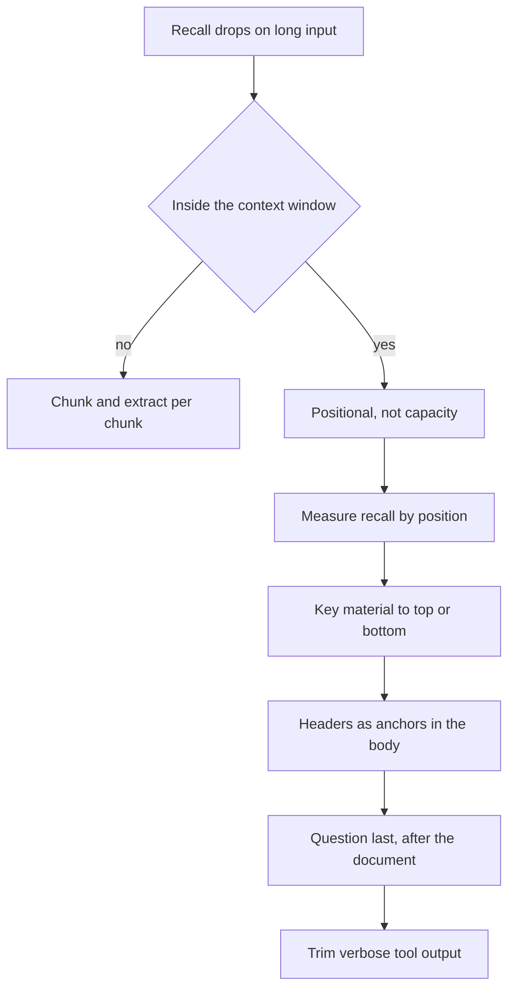
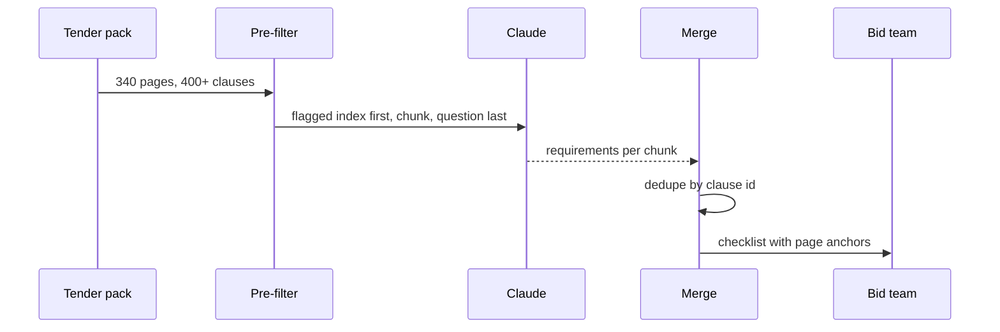

## What Problem Are We Solving?

A construction firm bids on public tenders. Each tender pack runs 200 to 400 pages: scope,
drawings, schedules, and — scattered throughout — mandatory compliance requirements. Miss one and
the bid is disqualified on submission, after six weeks of work.

They build an agent to extract every mandatory requirement. It is excellent on the instructions
at the front and the appendices at the back. On a bid that lost, the post-mortem found what it
missed: a clause on page 180 of 340 requiring a third-party accreditation. The clause was in the
context. It simply didn't come back.

Their first instinct was that the pack was too long, so they moved to a bigger context window. It
changed nothing — the pack fitted comfortably before and after. Their second was to summarise
first and extract from the summary, which made it worse: the summary compressed away the exact
accreditation number.

What's actually happening is positional. Attention over a long sequence isn't uniform — the start
sets up framing later tokens attend back to, and the end sits closest to where the answer is
generated. The middle has neither advantage. Recall follows a U-shape, and page 180 of 340 is the
bottom of it.

This is structural, not random. That single word is what rules out most of the fixes people reach
for: you cannot average it away, and you cannot buy your way out of it with a larger window.

> **🗣️ In plain English:** Claude reads the beginning and the end of a long document much more reliably than the middle. The fix is to control *where* the important material sits, not how much you can fit.

## Meet the Moving Parts

| Piece | What it is | Where it goes wrong |
|---|---|---|
| **Position** | Where a fact sits relative to the whole input | Treated as incidental — it's the variable that matters most |
| **The U-curve** | Strong recall at the start and end, weakest in the middle | Assumed to be a capacity limit, so people buy a bigger window |
| **Headers** | Section markers through the body | Omitted, leaving one undifferentiated block with no anchors |
| **The question's position** | Where your actual instruction sits | Buried above the document instead of directly after it |
| **Tool output** | Raw payloads appended to context | 40 fields returned when 5 matter, pushing signal into the middle |
| **Summarisation** | Compressing before extracting | Used as the fix; it destroys the exact values you needed |

Two of these deserve unpacking, because they're where the wrong mental model does damage.

**Bigger windows don't help, and why is worth being precise about.** The effect is about
*relative* position. A fact halfway through 20,000 tokens and one halfway through 500,000 are
both in the middle. A bigger window just gives you room to bury more.

**Summarising first trades one failure for a worse one.** It shortens the input, but
summarisation is lossy precisely where you need precision: figures, reference numbers, dates. You
get something that fits comfortably and can no longer answer the question.

Headers are the underrated fix. They don't shorten anything — they create multiple local
beginnings the model can anchor on, turning one long block into a navigable structure.

> **💡 Tip:** If your pipeline concatenates documents, log where each one landed. "It works in testing" often means the test fixture happened to put the answer in the first 10%.

## How It Works, Step by Step

1. **Confirm it's positional, not capacity.** If you're comfortably inside the window and recall
   still drops, position is the suspect.
2. **Measure it.** Plant a known fact at several positions in a representative document and
   record recall at each. Do this on your own corpus — the curve's depth varies by content.
3. **Move what matters to the edges.** Known-important clauses go at the top, or immediately
   before the question at the bottom.
4. **Put the question last**, after the document, so the instruction sits in the strongest
   position.
5. **Add headers and an index** through the body, so the middle has anchors instead of being
   undifferentiated.
6. **Trim tool output before it lands.** Project to the fields the task needs; every unused field
   pushes real signal further toward the middle.
7. **If it genuinely doesn't fit, chunk — don't summarise.** Run per-chunk extraction so every
   fact gets a turn near an edge, then merge.



## Minimal Working Implementation

A measurement harness, because the curve's depth depends on your content. Save as `needle.py` and
run it: it plants one clause at several depths in a synthetic tender and reports recall at each.

```python
import anthropic

client = anthropic.Anthropic()
TRIALS = 3
CLAUSES = 400

FILLER = ("Clause {n}. The Contractor shall maintain delivery records "
          "for the Works for a period of six years from completion.")
NEEDLE = ("Clause {n}. The Contractor shall hold current ISO 14064 "
          "accreditation, reference ACC-7731, at the date of tender.")
QUESTION = ("Which accreditation reference must the Contractor hold at "
            "the date of tender? Answer with the reference only.")


def document(depth: float) -> str:
    at = min(int(CLAUSES * depth), CLAUSES - 1)
    return "\n".join((NEEDLE if i == at else FILLER).format(n=i + 1)
                     for i in range(CLAUSES))


def recalled(depth: float) -> bool:
    reply = client.messages.create(
        model="claude-opus-5", max_tokens=100,
        messages=[{"role": "user",
                   "content": f"{document(depth)}\n\n{QUESTION}"}])
    text = next(b.text for b in reply.content if b.type == "text")
    return "ACC-7731" in text


for depth in (0.01, 0.25, 0.5, 0.75, 0.99):
    hits = sum(recalled(depth) for _ in range(TRIALS))
    print(f"depth {depth:>5.0%}: {hits}/{TRIALS} recalled")
```

Two things to know before you read the numbers. A distinctive needle in a short document is often
recalled everywhere — that's a real result, and it means this corpus doesn't have the problem.
The curve deepens as the document grows and as the needle looks more like its neighbours, which
is exactly the situation a real tender pack creates: 400 clauses that all read alike.

## Production Implementation

Production doesn't measure the curve — it stops relying on the middle at all.

```python
import re

MAX_CHUNK_CLAUSES = 60
PRIORITY = re.compile(r"\b(shall|must|mandatory|disqualif)\w*\b", re.I)


def build_prompt(clauses: list[str], question: str) -> str:
    """Edges carry the load: flagged clauses first, question last."""
    flagged = [c for c in clauses if PRIORITY.search(c)]
    index = "\n".join(f"- {c[:80]}" for c in flagged[:40])
    body = "\n".join(clauses)
    return (f"## Mandatory clauses identified by pre-filter\n{index}\n\n"
            f"## Full tender text\n{body}\n\n"
            f"## Your task\n{question}")


def chunks(clauses: list[str]) -> list[list[str]]:
    """Every clause gets a turn near an edge - no clause is only ever
    in the middle of something."""
    return [clauses[i:i + MAX_CHUNK_CLAUSES]
            for i in range(0, len(clauses), MAX_CHUNK_CLAUSES)]
```

Tool output is trimmed at the boundary, before it can crowd anything:

```python
KEEP = ("clause_id", "text", "section", "page")


def project(record: dict) -> dict:
    """A document-store row has 40 fields; the task needs four. The other
    36 don't just cost tokens - they push real signal toward the middle."""
    return {k: record[k] for k in KEEP if k in record}


def merge(per_chunk: list[list[dict]]) -> list[dict]:
    seen: dict[str, dict] = {}
    for found in per_chunk:
        for item in found:
            seen.setdefault(item["clause_id"], item)
    return sorted(seen.values(), key=lambda r: r["clause_id"])
    # ...
```

**What changed, and why:**

- **A cheap pre-filter puts candidates at the top.** A regex for `shall`/`must` is far too crude
  to be the answer, but it's an excellent way to decide what deserves the strongest position. The
  full text still follows, so nothing is lost if the filter misses.
- **The question moved to the bottom.** The instruction now sits in the second-strongest position
  rather than being separated from the answer by 340 pages.
- **Chunking replaced summarising.** Sixty clauses per chunk means every clause is near an edge in
  some pass. Summarising would have shortened the input by destroying the reference numbers the
  task exists to find.
- **Tool output is projected before it enters context.** Trimming 40 fields to 4 is usually sold
  as a token saving; the bigger win is positional.

## In Production: Tender Compliance at a Construction Bidder

The firm bids 40 to 60 public tenders a year, each pack 200–400 pages, each with 30–80 mandatory
requirements scattered through it. A missed requirement disqualifies the bid.



**Before.** Whole pack in one request, question first. Measured against a hand-built ground truth
for 12 past tenders, recall was 96% for clauses in the first 15% of the pack, 94% in the last
10%, and 71% in the middle band. Overall 82% — and the 18% missed were uniformly mid-document,
which is why the failure looked random to the team. One clause at a time, unpredictably.

**After.** Chunked at 60 clauses, flagged index at the top, question last. Recall moved to 97%
and, more importantly, flat across positions: 98/96/97 for the front, middle and back bands. The
flatness is the result worth having, because it means a miss is now a content problem you can
study rather than a lottery on where the clause happened to land.

**What surprised them.** Restructuring beat every other intervention they tried, and the
interventions they'd expected to work did nothing. Moving to a larger context window: no
measurable change, as predicted by the positional account. Running each pack three times and
unioning the results: 84% versus 82%, well inside noise — because the bias is structural, so
three runs share the same blind spot rather than sampling around it.

**Cost.** Chunking turned one 340-page request into six smaller ones. Input tokens rose about
15% from the repeated preamble, and with the instructions cached the money difference was under
10%. A single disqualified bid costs six weeks of a four-person team.

> **🌍 Real-world example:** The clause that lost the original bid is a good illustration of why headers matter. It sat in a section titled "General Provisions" — 40 pages of boilerplate that a human skims too. After restructuring, that clause is found reliably, and not because the model got better: it's in a 60-clause chunk where it's 20 lines from an edge, and the pre-filter hoisted it into the index at the top because it contains the word "shall".

## Where This Applies — and Where It Doesn't

| Situation | Use this | Use instead |
|---|---|---|
| Long document, recall drops mid-way | Reposition, add headers, chunk | — |
| You know which parts matter | Hoist them to the top | — |
| Question currently sits before the document | Move it after | — |
| Tool returns far more fields than the task needs | Project before it enters context | — |
| Input genuinely exceeds the window | Chunk and merge | Summarising, which loses exact values |
| Recall is poor but the input is short | — | A prompting problem (4.1/4.2), not position |
| You were about to buy a bigger window | — | Reposition; the middle is still the middle |
| You were about to run it three times and merge | — | Nothing; the bias is structural, not noise |

Anti-patterns: treating a positional failure as a capacity one; summarising a document in order to
extract precise values from it; appending raw tool payloads whole; putting the question before a
long document; and dumping concatenated sources in arrival order, so which source gets read
carefully is decided by whichever API answered first.

## Failure Modes Seen in the Wild

### 1. The bigger window that changed nothing

**Symptom.** Context window doubled, recall identical.
**Cause.** The effect is about relative position. The middle of a bigger document is still the
middle.
**Fix.** Reposition and chunk. Measure by depth so you can see it isn't capacity.

### 2. Summarise-then-extract

**Symptom.** Fewer misses, but the values that come back are approximate or unciteable.
**Cause.** Summarisation compresses exactly the specifics — reference numbers, dates, figures —
that the extraction exists to find.
**Fix.** Chunk the original. Never extract precise values from a summary.

### 3. The fixture that always passed

**Symptom.** Excellent in testing, unreliable in production.
**Cause.** Test documents were short, or the planted fact happened to sit near the top.
**Fix.** Make position an explicit test dimension — the same fact at 10%, 50% and 90%.

### 4. Context crowded out by tool output

**Symptom.** Recall degrades as a session goes on, with no change to the documents.
**Cause.** Verbose tool results accumulate and push real content toward the middle.
**Fix.** Project tool output at the boundary (see 5.4 for the session-level version).

> **⚠️ Watch out:** This failure is silent and looks random. A missed middle clause produces a confident, well-formed answer that simply omits it — there is no error, no low-confidence signal, nothing to alert on. The only way to know your curve is to measure recall by position against a ground truth you built yourself.

## Exam Lens & Key Takeaway

> **📝 Exam focus:** The stem describes a long document where content at the start and end is handled well and something in the middle is missed. The correct answers are **move the key information to the beginning** (the best single fix) and **add section headers as navigational anchors**. Three distractors recur and are all worth recognising on sight: **a larger context window does not help** (it's a positional effect, not a capacity limit — this is the most-tested wrong answer); **running multiple times and averaging does not help** (the bias is structural, not random noise, so every run shares it); and **summarising the document first is risky**, because it compresses away the exact figures and dates you needed. The related context-hygiene point also appears directly: **trim verbose tool output to the relevant fields** before it reaches the context.

> **🔑 Key takeaway:** Recall over long input follows a U-shape — strong at the start and end, weakest in the middle — and it's structural, so neither a bigger window nor repeated runs touches it. Control position instead: hoist what matters to the top, put the question last, add headers so the middle has anchors, chunk rather than summarise, and trim tool output before it crowds the real content.
