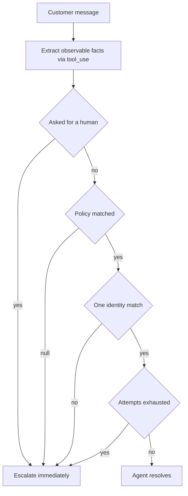
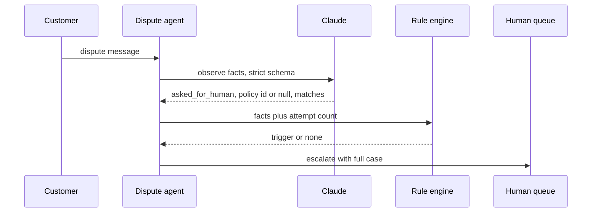

## What Problem Are We Solving?

A digital bank handles card disputes through an agent: it identifies the customer, pulls the
transaction, checks it against the chargeback policy, and either opens a dispute or explains why
it can't. Anything it shouldn't decide alone goes to a human.

The first escalation rule was "escalate when the model isn't confident". The agent was asked to
rate its own certainty and anything under 80% went to the queue. It was reasonable-sounding and
it failed in both directions at once. Straightforward disputes with an unusual merchant name came
back at 60% and clogged the queue. A dispute involving a merchant not covered by any documented
policy came back at 91% — because the *answer* felt clear to the model — and got auto-declined.
That one became a regulatory complaint.

The next attempt was sentiment: escalate angry customers. That produced a queue full of people
furious about a £4 fee, while a calm customer describing a multi-account fraud pattern stayed in
the bot loop for three days.

Both failures share a root cause. Confidence and sentiment are *inferences about internal states*
— the model's, or the customer's — and neither tracks what you care about: whether this case is
one the agent has the information and authority to resolve.

That property is knowable from observable facts. Did the customer ask for a person? Does a
documented policy cover this? Did three resolution attempts fail? Is the identity ambiguous?
None of those requires anyone to estimate anything.

> **🗣️ In plain English:** Escalate on facts about the case, not on how the model feels about its answer or how the customer feels about the company. Tone isn't difficulty, and a model's confidence isn't accuracy.

## Meet the Moving Parts

| Trigger | Reliable? | Why |
|---|---|---|
| Customer explicitly asks for a human | **Yes** | Unambiguous. Honour it immediately — no "let me try one more thing" |
| No documented policy covers the situation | **Yes** | The agent has no authority to invent policy |
| Repeated failure to make progress after retries | **Yes** | Objective evidence of failure, not a guess |
| Multiple customer records match | **Yes** | Ask for another identifier or escalate; never pick one |
| Sentiment analysis detects frustration | **No** | Tone is not difficulty — measures the wrong thing entirely |
| Model self-reports low confidence | **No** | Models are poorly calibrated at rating their own correctness |
| A separate classifier flags the message | **No** | Stacks a second unreliable component on the first |

The division isn't arbitrary. Every reliable trigger is a **fact about the state of the
interaction** that you could verify from a transcript. Every unreliable one is an **estimate of
something internal**.

**Why self-reported confidence fails** deserves precision, because it sounds responsible. Stated
confidence reflects how coherent an answer feels, not whether it's correct. The dangerous
quadrant is confident-and-wrong: the policy-gap case above scored 91% precisely *because* the
model had reasoned cleanly from a policy that didn't apply. The signal was strongest exactly
where it should have been weakest. (Confidence scores aren't useless — they must be *calibrated
against labelled data* first, which is 5.5, and even then they supplement rules rather than
replacing them.)

**Why sentiment fails** is simpler: anger correlates with a bad experience, not with a case the
agent can't handle.

> **💡 Tip:** Test a candidate trigger by asking whether two people reading the transcript would agree it fired. "The customer said 'let me speak to someone'" passes. "The customer seemed frustrated" doesn't.

## How It Works, Step by Step

1. **Split the work.** The model *observes*; your code *decides*. Escalation is a branch in
   Python, not a judgment the model makes.
2. **Extract observations via `tool_use`** with a strict schema (4.3): did they ask for a human,
   which policy ID matched, how many candidate records, was a required field absent.
3. **Nullable means nullable.** `matched_policy_id` must be allowed to come back `null` — that
   null *is* the policy-gap trigger. A required non-nullable field here manufactures a policy.
4. **Evaluate triggers in code**, in priority order, and record which one fired.
5. **Count attempts in your own state**, not by asking the model how it's going.
6. **Escalate with the case, not a ticket stub** — transcript, what was tried, which trigger
   fired, and what the agent had concluded.
7. **Review the trigger mix weekly.** A trigger firing far more than expected is a policy gap or
   a data problem, not a reason to loosen the threshold.



## Minimal Working Implementation

The model extracts facts; a pure function decides. Save as `escalate.py` and run it — the
policy-gap case escalates even though nothing about the text looks unusual.

```python
import anthropic
client = anthropic.Anthropic()
POLICIES = {"P1": "unauthorised transaction under 100 GBP",
            "P2": "goods not received, merchant contacted first",
            "P3": "duplicate charge by the same merchant"}
OBSERVE = {
    "name": "observe_case",
    "description": "Record only what the message states. Do not judge "
                   "difficulty. matched_policy_id must be null if no "
                   "listed policy plainly covers the situation.",
    "strict": True,
    "input_schema": {
        "type": "object",
        "properties": {
            "asked_for_human": {"type": "boolean"},
            "matched_policy_id": {"type": ["string", "null"]},
            "candidate_accounts": {"type": "integer"},
        },
        "required": ["asked_for_human", "matched_policy_id",
                     "candidate_accounts"],
        "additionalProperties": False,
    },
}
CASES = ["I want to dispute a 45 pound charge I never made at Coffee Co.",
         "A crypto exchange took 900 pounds in three goes. Get it back.",
         "Just put me through to a person please."]

def escalate(obs: dict, attempts: int) -> str | None:
    if obs["asked_for_human"]:
        return "customer_requested_human"
    if obs["matched_policy_id"] is None:
        return "policy_gap"
    if obs["candidate_accounts"] != 1:
        return "ambiguous_identity"
    return "no_progress" if attempts >= 3 else None

policy_list = "\n".join(f"{k}: {v}" for k, v in POLICIES.items())
for text in CASES:
    reply = client.messages.create(
        model="claude-opus-5", max_tokens=500, tools=[OBSERVE],
        tool_choice={"type": "tool", "name": "observe_case"},
        system=f"Known policies:\n{policy_list}",
        messages=[{"role": "user", "content": text}])
    obs = next(b for b in reply.content if b.type == "tool_use").input
    print(f"{text[:40]:42} -> {escalate(obs, attempts=1) or 'agent handles'}")
```

Nothing in `escalate` consults the model. The decision is four `if` statements over facts, which
means it is testable, explicable to a regulator, and identical on every run.

## Production Implementation

Production adds the honesty the demo doesn't need: a policy gap must be distinguishable from a
model that simply failed to match.

```python
import dataclasses
import logging

log = logging.getLogger("disputes")
TRIGGERS = ("customer_requested_human", "policy_gap", "ambiguous_identity",
            "no_progress", "missing_required_evidence")


@dataclasses.dataclass
class Case:
    case_id: str
    attempts: int = 0
    transcript: list[str] = dataclasses.field(default_factory=list)


def decide(case: Case, obs: dict) -> str | None:
    """Priority order is deliberate: an explicit request outranks
    everything, including a case the agent could have resolved."""
    reason = escalate(obs, case.attempts)
    if reason is None and obs["matched_policy_id"] not in POLICIES:
        # A policy id the model invented is a gap, not a match.
        reason = "policy_gap"
    if reason:
        log.info("escalated", extra={"case": case.case_id, "why": reason,
                                     "attempts": case.attempts})
    return reason
```

The handoff carries the case, and the trigger mix is watched as a health metric:

```python
import collections

fired = collections.Counter()


def handoff(case: Case, obs: dict, reason: str) -> dict:
    fired[reason] += 1
    return {"case_id": case.case_id, "reason": reason,
            "transcript": case.transcript, "attempts": case.attempts,
            "observed": obs, "agent_conclusion": None}


def weekly_review(total: int) -> list[str]:
    notes = []
    if fired["policy_gap"] / max(total, 1) > 0.15:
        notes.append("policy gaps over 15% - the policy set has a hole, "
                     "not the agent")
    if fired["ambiguous_identity"] / max(total, 1) > 0.05:
        notes.append("identity ambiguity high - check the matching rules")
    return notes
    # ...
```

**What changed, and why:**

- **An invented policy ID is treated as a gap.** Forced tool use guarantees a string, not a
  *true* string. Validating the ID against the real policy set is what stops a hallucinated match
  silently suppressing the most important trigger you have.
- **Attempts live in your state, not the conversation.** Asking the model "have you tried enough?"
  reintroduces exactly the self-assessment this topic exists to remove.
- **Priority order is explicit.** An explicit request for a human outranks a case the agent could
  have solved. Handling it "just after one more attempt" is the single most common way this is
  implemented wrong.
- **The trigger mix is reviewed.** Rising `policy_gap` means the policy set has a hole — a
  business signal, not a tuning problem. The instinct to loosen the trigger is how the regulatory
  complaint happened in the first place.

## In Production: Card Dispute Intake at a Digital Bank

The bank takes about 5,500 card disputes a month. The agent identifies the customer, matches a
policy, and either opens the dispute or hands off.



**Version one — self-reported confidence.** 31% of cases escalated, and post-hoc review found 44%
of those needed no human at all. Worse, of the cases that *should* have escalated, 12% didn't —
concentrated in exactly the confident-and-wrong quadrant, where the model had reasoned cleanly
from a policy that didn't apply.

**Version two — sentiment.** Escalation fell to 19% but the mix was wrong. Auditing a month of
handoffs, the correlation between the sentiment score and whether a human was actually needed was
near zero. The queue was sorted by how annoyed people were.

**Version three — objective triggers.** Escalation settled at 14%, with 8% judged unnecessary on
review, and missed escalations fell to under 2%. The `policy_gap` trigger accounts for about a
third of handoffs and turned out to be the most valuable output of the whole system: it produced
a ranked list of situations the bank had no written policy for. Four new policies were written in
the first quarter, and each one moved a slice of the queue back to automation.

**The number that mattered to Compliance.** Every escalation now names the rule that fired.
Asked why a dispute went to a human — or didn't — the bank can point at a trigger and a
transcript. Under the confidence-score version the honest answer was "the model said 0.78", which
is not an answer anyone can act on.

> **🌍 Real-world example:** The invented-policy-ID bug is the one worth internalising. With forced `tool_choice` the model always returned a string for `matched_policy_id`, and for genuinely uncovered cases it occasionally returned a plausible-looking ID like `"P2"` for a situation P2 didn't cover. The schema was satisfied; the gap trigger never fired. Validating the ID against the real policy dictionary moved `policy_gap` from 4% of cases to 11% overnight — and those extra 7% were the cases that mattered most.

## Where This Applies — and Where It Doesn't

| Situation | Use this | Use instead |
|---|---|---|
| Customer asks for a person | Escalate immediately, no further attempts | — |
| No policy covers the case | Escalate; the agent has no authority here | — |
| Several retries with no progress | Escalate on the attempt counter | — |
| Two records could be the customer | Ask for an identifier, or escalate | — |
| You want to use the model's confidence | — | Objective triggers; calibrate first (5.5) if at all |
| You want to escalate angry customers | — | Objective triggers; tone isn't difficulty |
| You're adding a classifier to catch hard cases | — | Rules; a second model is a second failure source |
| The agent is wrong but confident | — | Review sampling (5.5); no trigger catches this |

Anti-patterns: gating escalation on self-rated confidence; treating sentiment as a difficulty
proxy; trying one more automated step after an explicit request for a human; letting the model
decide whether it has made progress; and loosening a trigger because it fires often, when the
firing is telling you about a genuine policy gap.

## Failure Modes Seen in the Wild

### 1. Confident and wrong

**Symptom.** The cases that most needed a human had the highest confidence scores.
**Cause.** Confidence tracks coherence, not correctness — and a clean derivation from the wrong
policy is very coherent.
**Fix.** Trigger on policy coverage, not certainty. The absence of a matching policy is a fact.

### 2. The queue sorted by anger

**Symptom.** Humans handle trivial complaints; genuinely hard cases stay in the bot.
**Cause.** Sentiment measures tone; escalation needs difficulty.
**Fix.** Replace it with observable triggers. Keep sentiment for routing tone, if at all.

### 3. The hallucinated policy match

**Symptom.** `policy_gap` almost never fires, and uncovered cases get auto-decided.
**Cause.** Forced tool use guarantees a string, not a true one, so an invented ID reads as a
match.
**Fix.** Validate the ID against the real policy set; treat an unknown ID as a gap.

### 4. "Let me try one more thing"

**Symptom.** Complaints that the bot wouldn't hand over.
**Cause.** The explicit-request trigger was implemented below a retry, so it fired late.
**Fix.** Put it first in priority order, with nothing before it.

> **⚠️ Watch out:** The tempting fix when a trigger fires too often is to raise its threshold. For `policy_gap` that converts a visible business problem — situations with no written policy — into an invisible one, because the cases don't stop being uncovered, they just stop being flagged. Write the missing policy instead.

## Exam Lens & Key Takeaway

> **📝 Exam focus:** This topic is tested almost entirely as trigger classification, and the answer key is stable. **Reliable: the customer explicitly asks for a human** (honour it immediately — an option that tries one more automated step first is wrong), **no policy covers the situation**, **repeated failure to make progress after retries**, and **multiple matching customer records**. **Unreliable, and the standing distractors: sentiment analysis of customer frustration** (tone is not difficulty), **Claude's self-reported confidence** (models are poorly calibrated at judging their own correctness), and **a separate classifier** (a second unreliable component on top of the first). The underlying principle the exam rewards is that reliable triggers are objective, observable facts about the interaction, while unreliable ones are inferences about someone's internal state.

> **🔑 Key takeaway:** Escalate on facts, not feelings. An explicit request, a policy gap, exhausted retries and ambiguous identity are all verifiable from the transcript; sentiment and self-rated confidence measure something other than whether the agent can handle the case. Have the model observe and your own code decide — then every handoff names the rule that fired.
