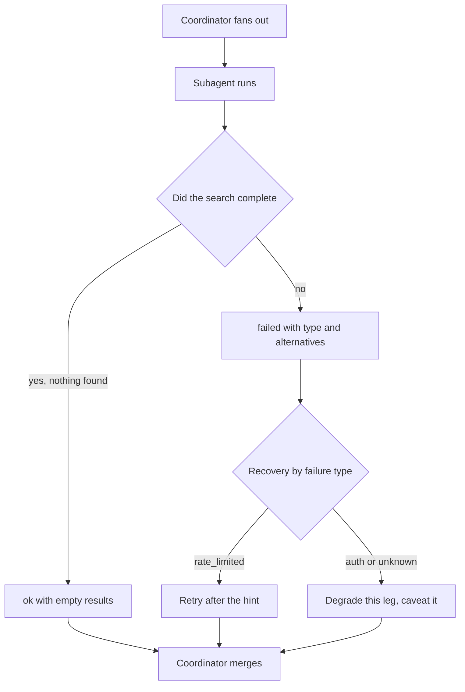
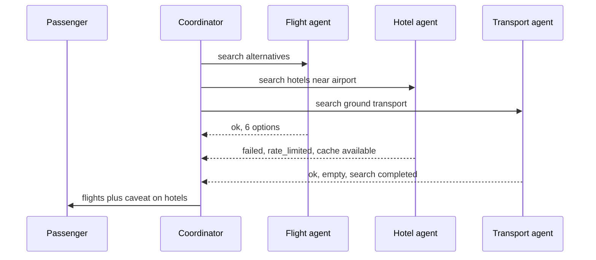

## What Problem Are We Solving?

A travel platform rebooks passengers when flights are cancelled. A coordinator fans out to three
subagents — flight inventory, hotel availability, ground transport — and assembles an options
package for the traveller.

During a storm that grounded 200 flights, the hotel subagent hit its provider's rate limit and
returned `[]`. The coordinator, seeing an empty list from a task that hadn't raised, told several
hundred stranded passengers there was no accommodation near the airport. There was; the subagent
had never managed to ask.

Be precise about where that failure lives. The subagent didn't crash. Nothing logged an error.
`[]` is a valid result for "search for hotels" — it means *no hotels exist*. The subagent used it
to mean *I couldn't look*. Different facts, and the coordinator had no way to tell them apart.

The team's first fix made it worse: any subagent failure aborted the whole workflow. One
rate-limited hotel call now threw away a completed flight search and a completed transport
search, and the passenger got nothing instead of most of an answer.

Their second fix — returning `"hotel search unavailable"` — still left the coordinator stuck.
Unavailable how? Retry in a minute, fall back to cached inventory, or give up and caveat? A
generic string doesn't distinguish between them, so the coordinator guessed.

With one agent a human is usually watching and can interpret an ambiguous failure. In a
multi-agent system the coordinator *is* the only thing watching, and it reasons only as well as
the failure reports it gets.

> **🗣️ In plain English:** "I found nothing" and "I couldn't look" must not arrive looking the same. A failure report is output, not an exception — design it like the rest of the contract.

## Meet the Moving Parts

| Pattern | What the coordinator can do | Verdict |
|---|---|---|
| Empty result marked as success | Nothing — it believes absence was confirmed | **Worst**: turns a failure into a false fact |
| Abort the whole workflow on any failure | Nothing; all completed work is discarded | Wastes successful subagents, overreacts to isolated faults |
| Generic message: "search unavailable" | Guess — retry, substitute, or skip? | No basis for choosing a recovery |
| Structured error: type, attempt, partials, alternatives | Choose a recovery deliberately | **Best**: failure becomes information |

A structured failure report carries four things, and each maps to a decision the coordinator has
to make.

- **Failure type** — `timeout`, `rate_limited`, `auth_failed`, `no_matching_data`,
  `malformed_input`. This is the field that selects a recovery strategy: rate limits want a wait,
  auth failures want a human, `no_matching_data` is a *result* rather than an error.
- **What was tried** — the query, the endpoint, the retry count. Reconstructable later, and it
  distinguishes "asked the wrong question" from "the service is down".
- **Partial results** — clearly labelled. Three hotels from page one beats nothing, provided the
  coordinator knows it's incomplete.
- **Known alternatives** — "cached snapshot from two hours ago is available". This is what turns
  a dead end into a choice.

The distinction that carries the topic: `no_matching_data` is a **successful search with an empty
result**. Everything else is a failure to search. Collapsing those two into `[]` is the original
bug, and no amount of coordinator cleverness recovers from it.

> **💡 Tip:** Make the success envelope and the failure envelope the same shape, with a discriminator field. Then "handle the error case" can't be skipped — you cannot read the results without passing the branch.

## How It Works, Step by Step

1. **Define one result envelope** for every subagent: a status discriminator plus the payload or
   the failure detail. Same shape whether it worked or not.
2. **Never return a bare collection.** An empty list means "searched, found nothing", and it is
   only ever emitted by a genuinely successful search.
3. **Classify the failure** into a small closed set of types the coordinator knows how to act on.
4. **Attach what was tried** — query, endpoint, attempts — so the failure is reconstructable.
5. **Include partial results** where any exist, flagged as partial.
6. **Name alternatives** the subagent knows about: a cache, a secondary provider, a narrower
   query.
7. **Let the coordinator branch per subagent**, not per workflow. One failed leg degrades one part
   of the answer.
8. **Caveat the output.** If a leg degraded, the traveller-facing answer says so — a silent
   partial answer is the original failure in a new place.



## Minimal Working Implementation

The envelope, and a coordinator that can tell the two empties apart. Save as `envelope.py` and
run it — no API key needed; the point is the contract, not the model.

```python
import dataclasses

@dataclasses.dataclass(frozen=True)
class Result:
    """One envelope for success and failure. Reading `.items` without
    checking `.status` is a type error, not a silent wrong answer."""
    status: str                      # "ok" | "failed"
    items: list = dataclasses.field(default_factory=list)
    failure_type: str | None = None  # timeout, rate_limited, auth_failed
    attempted: str | None = None
    partial: bool = False
    alternative: str | None = None

def hotel_search(city: str, rate_limited: bool) -> Result:
    if rate_limited:
        return Result(status="failed", failure_type="rate_limited",
                      attempted=f"hotels/v2 search city={city}, 3 tries",
                      alternative="cached inventory from 2h ago")
    return Result(status="ok", items=[])   # searched; genuinely none

RECOVERY = {"rate_limited": "retry after backoff",
            "timeout": "retry once, then degrade",
            "auth_failed": "escalate to a human, do not retry"}

def coordinate(name: str, result: Result) -> str:
    if result.status == "ok":
        if result.items:
            return f"{name}: {len(result.items)} options"
        return f"{name}: none available (search completed)"
    plan = RECOVERY.get(result.failure_type, "degrade and caveat")
    extra = f"; alternative: {result.alternative}" if result.alternative else ""
    return (f"{name}: UNAVAILABLE ({result.failure_type}) -> {plan}"
            f"{extra}")

print(coordinate("hotels", hotel_search("LHR", rate_limited=True)))
print(coordinate("hotels", hotel_search("LHR", rate_limited=False)))
```

The two lines it prints are the entire lesson. Both subagents returned zero hotels; only one of
them actually searched. Under the old contract both printed the same thing.

## Production Implementation

Production makes the envelope the only way results can travel, and stops the coordinator writing
a confident answer over a degraded one.

```python
import logging
from typing import Callable

log = logging.getLogger("rebooking")
RETRYABLE = {"rate_limited", "timeout", "transient_upstream"}


def run_leg(name: str, fn: Callable[[], Result], attempts: int = 2) -> Result:
    """An uncaught exception is the one thing the envelope can't express,
    so it is converted here rather than crossing the boundary raw."""
    last = None
    for attempt in range(1, attempts + 1):
        try:
            last = fn()
        except Exception as exc:
            last = Result(status="failed", failure_type="unhandled",
                          attempted=f"{name} attempt {attempt}: {exc!r}")
        if last.status == "ok" or last.failure_type not in RETRYABLE:
            break
    log.info("leg finished", extra={"leg": name, "status": last.status,
                                    "why": last.failure_type})
    return last
```

The answer the traveller sees carries the degradation explicitly:

```python
def assemble(legs: dict[str, Result]) -> dict:
    package, caveats = {}, []
    for name, result in legs.items():
        if result.status == "ok":
            package[name] = result.items
            if result.partial:
                caveats.append(f"{name}: partial results only")
        else:
            package[name] = None
            caveats.append(
                f"{name} could not be checked ({result.failure_type})"
                + (f"; {result.alternative}" if result.alternative else ""))
    return {"options": package, "caveats": caveats,
            "complete": not caveats}
    # ...
```

**What changed, and why:**

- **Exceptions are converted at the boundary.** A subagent that raises produces a `failed`
  envelope with type `unhandled`, so the coordinator sees a failure rather than a stack trace or,
  worse, a swallowed empty list.
- **Retry is driven by failure type, not by a blanket policy.** `rate_limited` and `timeout` are
  worth a second attempt; `auth_failed` never is, and retrying it just delays the escalation.
- **One leg failing degrades one leg.** The flight and transport results survive a hotel failure —
  the correction to the abort-everything overreaction.
- **`caveats` is part of the output, not a log line.** An answer built on two of three sources
  says so out loud. A silent partial answer is the original bug relocated to the last step.

## In Production: Storm Rebooking at a Travel Platform

The platform rebooks around 4,000 passengers on a bad weather day. The coordinator fans out to
flight inventory, hotel availability and ground transport, all against third-party providers with
their own rate limits and outages.



**The incident.** The hotel provider's rate limit returned 429s for about 40 minutes. The
subagent caught the error and returned `[]`. Roughly 600 passengers were told no accommodation
was available near the airport; a majority of them were within a mile of hotels with vacancies.
The cost was not just the rebooking — it was several hundred customers who had been given a false
statement of fact by a system they trusted.

**After the envelope.** The same rate limit now produces `failed / rate_limited` with
`alternative: "cached inventory from 2h ago"`. The coordinator retries twice with backoff, and if
that fails, presents the cached inventory explicitly labelled as up to two hours old. Passengers
get a usable answer and an honest description of its freshness.

**The abort-everything interlude is worth remembering.** For three weeks between the two fixes,
any subagent failure aborted the workflow. Complete-package delivery went from 94% to 61%,
because the probability that *all three* providers are healthy is meaningfully lower than the
probability that any one is. Aggregate availability is the product of the legs, which is exactly
why per-leg degradation matters more as you add subagents.

**What the failure types bought.** A month of structured errors showed 71% of failures were
`rate_limited` on one provider, concentrated in a two-hour window each evening. That was a
capacity conversation with the provider, not an engineering problem — and it was invisible when
every failure had been an empty list.

> **🌍 Real-world example:** The subtlest part of the fix was the transport leg. Ground transport genuinely does return no options for some regional airports at night — a true `no_matching_data`. Under the old contract that looked identical to the hotel failure, so when the team first went looking for the bug they suspected transport too and spent two days on a subagent that had been working correctly the whole time. Separating "searched and found nothing" from "could not search" made both legs legible at once.

## Where This Applies — and Where It Doesn't

| Situation | Use this | Use instead |
|---|---|---|
| A subagent reports results to a coordinator | Structured envelope with a status discriminator | — |
| A search can legitimately return nothing | `ok` with empty items, distinct from failure | — |
| Failures differ in how you'd recover | A closed set of failure types | — |
| Some results arrived, some didn't | Per-leg degradation plus caveats | Aborting the workflow |
| A subagent raised an exception | Convert at the boundary into a `failed` envelope | Letting it propagate raw |
| One agent, a human watching the output | — | Ordinary exceptions; the envelope is overhead |
| The failure is unrecoverable and total | — | Fail loudly; don't caveat your way past it |

Anti-patterns: returning a bare list from a fallible search; marking a caught exception as
success; aborting a whole workflow on an isolated leg failure; generic `"unavailable"` strings
with no type; and assembling a confident answer from partial data without saying which parts are
missing.

## Failure Modes Seen in the Wild

### 1. The empty list that meant "I couldn't look"

**Symptom.** Users are told something doesn't exist when it does.
**Cause.** A caught exception returned the same value as a successful empty search.
**Fix.** A status discriminator. `no_matching_data` is a success; everything else is a failure.

### 2. All-or-nothing abort

**Symptom.** Complete-package delivery drops sharply as subagents are added.
**Cause.** Any leg failing kills the workflow, and joint availability is the product of the legs.
**Fix.** Degrade per leg and caveat.

### 3. The untyped failure

**Symptom.** The coordinator retries auth failures forever and gives up instantly on rate limits.
**Cause.** Every failure arrives as the same generic string, so recovery can't be selective.
**Fix.** A closed set of failure types, mapped to recovery strategies.

### 4. The silent partial

**Symptom.** Answers look complete and occasionally are badly wrong.
**Cause.** The coordinator handled the failure correctly and then didn't tell anyone.
**Fix.** Make caveats part of the output contract, not a log line.

> **⚠️ Watch out:** The dangerous failure here isn't the one that crashes — it's the one that returns a plausible value. An empty list, a zero, a `None` that reads as "nothing to report": each is silently promoted to a fact by whatever consumes it. If a value can mean both "the answer is nothing" and "I failed", it will eventually mean the wrong one at the worst moment.

## Exam Lens & Key Takeaway

> **📝 Exam focus:** The stem describes a subagent failing and asks what it should return to the coordinator. The ranking is stable and directly testable, worst to best: **returning an empty result marked as success** (worst — the coordinator treats a failure as confirmed absence of data), **aborting the entire workflow** (discards the work other agents completed), **a generic "service unavailable" message** (the coordinator has no basis to choose between retrying, substituting, and skipping), and **a structured error containing the failure type, what was attempted, any partial results, and known alternatives** (correct — it gives the coordinator enough to make a real recovery decision). Remember the four fields, and remember *why* the reasoning holds: as agent count grows, the coordinator is the only thing watching, so its decisions are capped by the quality of the failure reports it receives.

> **🔑 Key takeaway:** In a multi-agent system a failure report is part of the output contract, not an exception to be swallowed. Never let "I found nothing" and "I couldn't look" arrive in the same shape: return a typed failure with what was attempted, any partial results, and the alternatives you know about — then degrade that one leg and say so in the answer.
