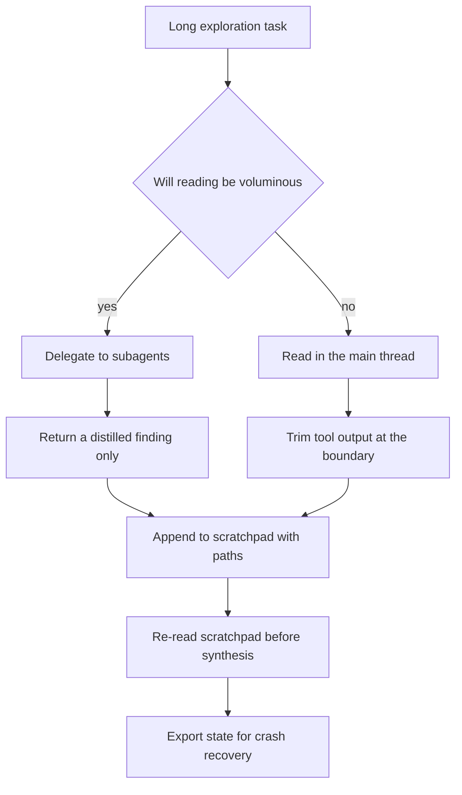
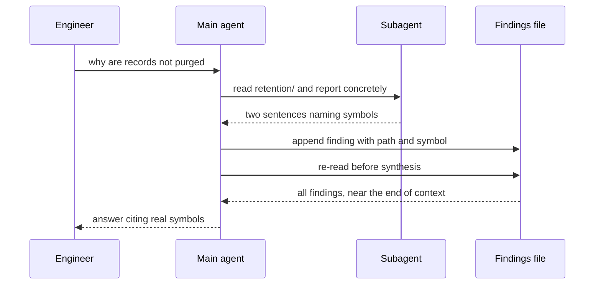

## What Problem Are We Solving?

An engineer is tracing a data-retention bug through a 4,000-file Django monolith: records that
should be purged after 30 days survive indefinitely. The deletion path runs through signals, a
Celery task, a soft-delete mixin, and two management commands written years apart.

The agent starts well. Tool call six reads `retention/tasks.py` and correctly spots that the
purge job filters on `deleted_at` rather than `created_at`. By call forty it is describing "the
standard Django soft-delete pattern, where `objects` is filtered by a default manager" — a real
pattern, and not what this codebase does. It had read the actual manager at call nineteen.

Nothing announced the transition. The output didn't hedge; it stayed fluent and confident and
quietly stopped being about this repository. That's **context degradation**: an agent substituting
generic knowledge of typical patterns for what it actually observed.

The mechanism is arithmetic. Every tool call appends its full output. Forty file reads and a
dozen greps is a large, growing transcript, and the observations that matter — made early — end
up deep in the middle of it, exactly where recall is weakest (5.1). Even well inside the window,
older content is progressively less influential before anything is literally dropped.

The instinct is a bigger window. It buys time and fixes nothing: the early observations just sit
in the middle of a larger transcript. The real fix is to stop treating the conversation as the
place where findings live.

> **🗣️ In plain English:** A long session slowly forgets what it saw and starts describing what code like this usually looks like. Write findings down somewhere durable instead of trusting the transcript to hold them.

## Meet the Moving Parts

| Strategy | What it does | Reach for it when |
|---|---|---|
| **Scratchpad file** | Findings written to a file outside the conversation, re-read on demand | One long-running agent that must remember specific facts |
| **Subagent delegation** | Verbose exploration happens in a subagent; only a distilled summary returns | The exploration itself will be voluminous |
| **`/compact`** | Summarises and compresses the existing session in place | The session is *already* long and you don't want to restart |
| **Structured state export** | Each agent periodically writes its state to a file | Reliability matters; a crash shouldn't lose the exploration |

All four share one idea: **don't let the live conversation be the only place truth lives.**
Persist what matters and re-inject it deliberately. Two distinctions decide which you reach
for.

**Delegation is preventive; `/compact` is reactive.** Delegation stops noise ever entering the
main thread — the subagent reads thirty files and returns two paragraphs, and the file contents
never touch the coordinator's context. `/compact` compresses noise you already generated, which
is worse than not generating it, but it's the tool you have mid-session.

**A scratchpad is not a summary.** Record specifics — `refreshToken()` in `auth/client.ts`, not
"the auth module handles token refresh". Findings are written as the agent reads, while the
detail is in front of it, and re-read once the transcript's memory has faded. A scratchpad of
generalities has already performed the lossy step you were avoiding.

> **💡 Tip:** The symptom to watch for is a shift in register — from "`purge_expired()` filters on `deleted_at`" to "typically, the purge task would filter on the deletion timestamp". Generic phrasing is the tell that the agent is no longer reading its own observations.

## How It Works, Step by Step

1. **Decide what the main thread is for.** Coordination and decisions — not holding file
   contents.
2. **Delegate voluminous reading to subagents.** The subagent's full transcript is discarded;
   only its distilled finding returns.
3. **Constrain what comes back.** A schema or a word budget, so a subagent can't hand you back
   the noise you delegated away.
4. **Write findings to a scratchpad as you go**, with file paths and symbol names, not
   paraphrases.
5. **Re-read the scratchpad** before any synthesis step, so the facts re-enter near the end of
   the context where recall is strong.
6. **Trim tool output at the boundary** — the fields and line ranges the task needs, not whole
   files.
7. **Export structured state periodically**, so a crash or a restart resumes rather than
   re-explores.
8. **Reach for `/compact`** when a session is already long and none of the above was done up
   front.



## Minimal Working Implementation

Measure the thing that degrades. Save as `growth.py` and run it: it reads files one at a time,
reporting the transcript's token count after each, against the distilled alternative.

```python
import pathlib
import anthropic

client = anthropic.Anthropic()
MODEL = "claude-opus-5"
FILES = sorted(pathlib.Path(".").rglob("*.py"))[:8]

def tokens(messages: list[dict]) -> int:
    return client.messages.count_tokens(
        model=MODEL, messages=messages).input_tokens

def distil(path: pathlib.Path) -> str:
    """What a subagent returns: the finding, not the file."""
    body = path.read_text(encoding="utf-8", errors="replace")[:6000]
    reply = client.messages.create(
        model=MODEL, max_tokens=150,
        system="Reply with at most two sentences naming the concrete "
               "symbols involved. No general commentary.",
        messages=[{"role": "user",
                   "content": f"What does {path} do?\n\n{body}"}])
    return next(b.text for b in reply.content if b.type == "text")

inline: list[dict] = []
notes: list[str] = []
for path in FILES:
    body = path.read_text(encoding="utf-8", errors="replace")[:6000]
    inline.append({"role": "user", "content": f"Read {path}:\n{body}"})
    inline.append({"role": "assistant", "content": "Noted."})
    notes.append(f"{path}: {distil(path)}")
    scratch = [{"role": "user", "content": "\n".join(notes)}]
    print(f"{path.name[:28]:30} inline={tokens(inline):>7}  "
          f"scratchpad={tokens(scratch):>6}")
```

The inline column climbs with every file; the scratchpad column grows slowly and holds specifics.
That gap is what delegation buys — and `count_tokens` is a real API call, so the numbers are the
ones you'd actually be billed for.

## Production Implementation

Production makes the scratchpad durable, bounded, and the thing synthesis actually reads.

```python
import json
import pathlib
import dataclasses

NOTES = pathlib.Path(".agent/findings.jsonl")
STATE = pathlib.Path(".agent/state.json")


@dataclasses.dataclass(frozen=True)
class Finding:
    path: str
    symbol: str          # concrete: purge_expired, not "the purge logic"
    detail: str
    tool_call: int


def record(finding: Finding) -> None:
    """Append-only: a finding written at call 6 is still readable at call
    60, which is the whole point."""
    NOTES.parent.mkdir(exist_ok=True)
    with NOTES.open("a", encoding="utf-8") as fh:
        fh.write(json.dumps(dataclasses.asdict(finding)) + "\n")


def checkpoint(visited: list[str], question: str, call: int) -> None:
    """Crash recovery: resume the exploration instead of redoing it."""
    STATE.write_text(json.dumps(
        {"visited": visited, "question": question, "calls": call}),
        encoding="utf-8")
```

Before synthesis the findings are re-injected at the end of the context, where recall is strong:

```python
def synthesis_prompt(question: str) -> str:
    findings = [json.loads(line) for line in
                NOTES.read_text(encoding="utf-8").splitlines()]
    body = "\n".join(
        f"- {f['path']}::{f['symbol']} - {f['detail']}" for f in findings)
    return (f"## Findings recorded during exploration\n{body}\n\n"
            f"## Question\n{question}\n\n"
            f"Answer only from the findings above. If a finding does not "
            f"cover something, say so rather than describing how such "
            f"code usually works.")
    # ...
```

**What changed, and why:**

- **Findings are append-only on disk.** A note written at tool call 6 is as readable at call 60 as
  it was when written — the property the transcript loses.
- **Every finding names a concrete symbol.** Requiring a `symbol` field makes "the standard
  soft-delete pattern" unwritable. The schema enforces specificity that a prose note wouldn't.
- **The synthesis prompt forbids generic answers explicitly.** "Say so rather than describing how
  such code usually works" is the direct countermeasure to the failure mode, and it only works
  because the findings are right there to answer from (this is 4.1 — naming the exclusion).
- **State is checkpointed.** A crash forty calls in resumes from `visited` rather than paying for
  the whole exploration twice.

## In Production: Tracing a Retention Bug in a Django Monolith

A 4,000-file monolith, twelve years old, with three generations of deletion logic layered on each
other. The question: why do records survive past their 30-day retention window?



**Before.** One agent, everything inline. The session ran to 61 tool calls and about 190,000
tokens. Reviewing the transcript afterwards, the engineer found the answer had been visible at
call 19 — the custom manager's `get_queryset` excluded soft-deleted rows, so the purge task's
filter never matched them — and the agent's final answer at call 61 described a generic Django
pattern instead. Two days of work, and the finding had been there the whole time.

**After.** Subagents read; the main thread coordinates. The same investigation took 23 main-thread
calls and a peak context of about 34,000 tokens, with 31 findings on disk. The answer named
`RetentionManager.get_queryset` and the file it lives in.

**The number that convinced the team.** They re-ran the original failing investigation with only
one change — the scratchpad, no delegation. It still worked. Writing findings down was doing most
of the work; delegation mainly made it cheaper and faster. That ordering is worth knowing when
you can only do one: **persist findings first, delegate second.**

**Cost.** The delegated version made more API calls — 23 coordinator calls plus 31 subagent calls
versus 61 — but the subagent calls are small and the coordinator's context stopped growing
quadratically. Total tokens fell roughly 55%, and wall-clock nearly halved because subagent reads
run concurrently.

> **🌍 Real-world example:** The `symbol` field was the accidental hero. An early version recorded free-text findings, and about a fifth of them came back as things like "handles the deletion lifecycle" — the generic drift, now durably written to disk where it would be re-injected at synthesis and trusted. Making `symbol` a required field meant a finding had to name something you could grep for. Notes that couldn't were rejected and the file re-read, which caught the drift at the moment it happened rather than forty calls later.

## Where This Applies — and Where It Doesn't

| Situation | Use this | Use instead |
|---|---|---|
| Long exploration, answers drifting generic | Scratchpad with concrete symbols | — |
| Reading will be voluminous | Subagent delegation | — |
| Session already long, mid-task | `/compact` | — |
| A crash would cost hours of exploration | Structured state export | — |
| Tool returns whole files when lines would do | Trim at the boundary | — |
| Short task, under a dozen tool calls | — | Nothing; the machinery costs more than it saves |
| You were about to buy a bigger context window | — | Persist findings; the middle is still the middle |
| The agent needs the *full* text to reason | — | Delegation would lose exactly what's needed |

Anti-patterns: treating the transcript as durable memory; scratchpad notes written as
generalities; delegating exploration and then letting the subagent return raw file contents;
running `/compact` as a substitute for delegation rather than a rescue; and adding context window
in response to a degradation problem.

## Failure Modes Seen in the Wild

### 1. The generic drift

**Symptom.** Late answers describe how code like this usually works, fluently and wrongly.
**Cause.** Early observations are deep in a long transcript; generic knowledge fills the gap.
**Fix.** Findings on disk, re-injected before synthesis, with an explicit instruction not to
generalise.

### 2. The scratchpad that summarised

**Symptom.** Notes exist, drift happens anyway.
**Cause.** The notes recorded conclusions rather than specifics — the lossy step, performed early
and then trusted.
**Fix.** Require a concrete symbol or path in every note. If it isn't greppable, it isn't a
finding.

### 3. Delegation that delegated nothing

**Symptom.** Subagents are used; the main context grows as fast as before.
**Cause.** The subagent returns its full transcript or the file contents it read.
**Fix.** Constrain the return with a schema or a hard word budget.

### 4. Re-exploring after a crash

**Symptom.** A failed run restarts from zero and costs the same again.
**Cause.** Progress lived only in the conversation.
**Fix.** Checkpoint visited files and open questions to disk.

> **⚠️ Watch out:** This failure never raises. The agent doesn't slow down, hedge, or flag uncertainty — it stays articulate while quietly switching from your codebase to the average codebase. By the time it's visible in an answer, the degradation has usually been happening for twenty calls.

## Exam Lens & Key Takeaway

> **📝 Exam focus:** The stem describes a long agent session where early answers cite actual code and later ones describe generic patterns. The four mitigations are the answer set, and the exam expects you to match them to situations: **scratchpad files** (persist key findings outside the conversation), **subagent delegation** (keep verbose exploration out of the main context — the main agent receives only a summary), **`/compact`** (compress an already-long session), and **structured state exports** (which double as crash recovery). Know the preventive-versus-reactive split — delegation stops the noise being generated, `/compact` cleans up noise you already have. As in 5.1, **a larger context window is the standing distractor**: this is a degradation-and-position problem, not a capacity one.

> **🔑 Key takeaway:** Every tool call adds its full output to the transcript, so a long exploration buries its own early observations and starts substituting generic patterns for what it actually read. Stop treating the conversation as memory: delegate voluminous reading to subagents that return only distilled findings, write those findings to a file with concrete symbols and paths, re-read them before you synthesise, and checkpoint state so a crash resumes instead of re-exploring.
