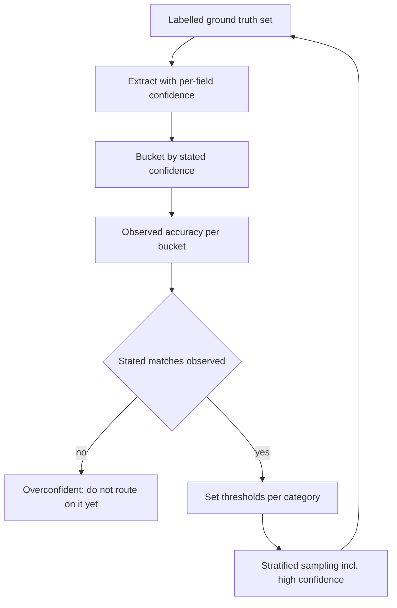
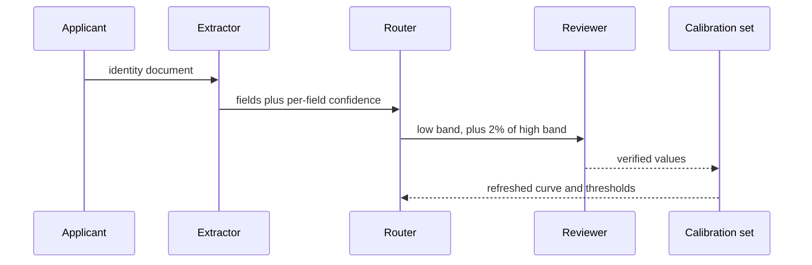

## What Problem Are We Solving?

A neobank verifies identity documents at signup — passports, ID cards and driving licences from
40-odd countries. Claude extracts document number, name, date of birth and expiry; a human checks
every one. At 9,000 signups a month that's four full-time reviewers.

The team measures accuracy at 97% and makes the obvious decision: stop reviewing everything,
review a random 10%.

Nine months later an audit finds the real picture. Passports and EU ID cards — 86% of volume —
run at 99.3%. A handful of types, about 4% of volume, run near 74%: older non-machine-readable
licences where the date format varies and the document number shares a field with the issuing
authority. Random 10% sampling caught those at exactly the rate you'd expect — about three a
month, scattered across reviewers who had no way to see they formed a pattern.

Two mistakes, and they compound. **The aggregate hid the variance**: 97% was real and useless,
averaging a near-perfect majority with a bad minority. And **the sampling looked where errors
weren't**: uniform random review spends 86% of its effort on cases that were never going to be
wrong.

Then the fix people try next, which is its own trap: ask the model how confident it is and review
the uncertain ones. That helps only if the numbers mean something — and until you've checked them
against labelled data, a stated 90% is a number, not a probability.

> **🗣️ In plain English:** One accuracy number averages away the thing you needed to know. Break it down per field and per category, check that stated confidence matches real accuracy, and sample where the errors actually are.

## Meet the Moving Parts

- **Aggregate accuracy.** One number over everything. Useful for a headline, dangerous for an
  automation decision, because it's dominated by whatever is most common.
- **Stratified sampling.** Sample deliberately per category — and specifically *including* the
  high-confidence stratum, because that's where unnoticed error patterns hide. Nobody looks where
  the score says it's fine.
- **Field-level confidence.** Confidence per extracted field rather than one blended number per
  document. A document can be fine everywhere except the tax ID.
- **Calibration.** The check that a stated confidence matches observed accuracy: of everything
  the model called 90%, about 90% should be right. Established against labelled ground truth.
- **Routing thresholds.** Derived from the calibration curve, not guessed.
- **Ambiguity routing.** When the *source* contradicts itself — two different dates for the same
  field — the answer is to flag the conflict, not to pick one.

Two points carry the topic.

**Calibrated and accurate are different properties.** A model can be 74% accurate and perfectly
calibrated, if it says 74% and is right 74% of the time — that's *useful*, because you can route
on it. One that says 95% and is right 74% is actively harmful: the number invites you to skip
review. Calibration is what makes a confidence score into something you can threshold.

**Sampling high-confidence cases is counterintuitive and essential.** The instinct is to review
what the model is unsure about — but you already distrust those, and they go to humans anyway.
What needs auditing is what the system has quietly decided is fine.

> **💡 Tip:** Before anyone proposes reducing review, ask for accuracy broken down by category and by field. If the answer is a single number, the decision doesn't have the evidence it needs.

## How It Works, Step by Step

1. **Build labelled ground truth** — a few hundred documents with verified values per field. There
   is no calibration without it.
2. **Ask for per-field confidence** in the extraction schema (4.3), not one document-level score.
3. **Bucket predictions by stated confidence** and compute observed accuracy in each bucket. That
   table is the calibration curve.
4. **Read the curve.** Buckets where stated far exceeds observed are the overconfident region, and
   they're where unreviewed errors will live.
5. **Set thresholds from the curve**, per category — not one global number, because the curve
   differs by document type.
6. **Stratify sampling** by category and confidence band, deliberately including high-confidence
   cases at a non-zero rate.
7. **Route source ambiguity to humans** as its own class: the model should flag a conflict, never
   resolve it silently.
8. **Recalibrate on a schedule.** Document mixes change; a curve is a measurement, not a
   constant.



## Minimal Working Implementation

The calibration curve, computed the only way it can be — against labels. Save as `calibrate.py`
and run it; it extracts with per-field confidence and compares stated against observed.

```python
import collections
import anthropic

client = anthropic.Anthropic()
TOOL = {
    "name": "extract_id",
    "description": "Extract identity document fields. Give an honest "
                   "per-field confidence between 0 and 1.",
    "strict": True,
    "input_schema": {
        "type": "object",
        "properties": {
            "doc_number": {"type": "string"},
            "doc_number_confidence": {"type": "number"},
            "expiry": {"type": "string"},
            "expiry_confidence": {"type": "number"},
        },
        "required": ["doc_number", "doc_number_confidence",
                     "expiry", "expiry_confidence"],
        "additionalProperties": False,
    },
}
LABELLED = [
    ("Passport P<GBR SMITH<<JOHN 5210 exp 14 MAR 2031",
     {"doc_number": "5210", "expiry": "2031-03-14"}),
    ("Licence SMIJ670421AB9CD auth DVLA valid to 21/04/27",
     {"doc_number": "SMIJ670421AB9CD", "expiry": "2027-04-21"}),
    ("ID card 99887766 Netherlands expires 2029-11-02",
     {"doc_number": "99887766", "expiry": "2029-11-02"}),
]
buckets = collections.defaultdict(lambda: [0, 0])   # [correct, total]
for text, truth in LABELLED:
    reply = client.messages.create(
        model="claude-opus-5", max_tokens=500, tools=[TOOL],
        tool_choice={"type": "tool", "name": "extract_id"},
        messages=[{"role": "user", "content": text}])
    got = next(b for b in reply.content if b.type == "tool_use").input
    for field in ("doc_number", "expiry"):
        band = round(got[f"{field}_confidence"] * 10) / 10
        buckets[band][1] += 1
        buckets[band][0] += got[field] == truth[field]
for band in sorted(buckets):
    correct, total = buckets[band]
    print(f"stated {band:.0%}: observed {correct / total:.0%} ({total} preds)")
```

Three documents is a demonstration, not a calibration — a real curve needs a few hundred
predictions per bucket before the observed rates mean anything. The structure is the point: no
confidence number earns a threshold until it has been through this table.

## Production Implementation

Production stratifies the sampling and keeps the curve fresh.

```python
import collections
import random

TARGETS = {"high": 0.02, "medium": 0.15, "low": 1.00}
by_stratum: dict[tuple, list] = collections.defaultdict(list)


def stratum(doc_type: str, confidence: float) -> tuple[str, str]:
    band = ("high" if confidence >= 0.95
            else "medium" if confidence >= 0.80 else "low")
    return doc_type, band


def should_review(doc_type: str, confidence: float) -> bool:
    """High-confidence cases are sampled at a low but non-zero rate -
    zero is how a 74% category hides for nine months."""
    _, band = stratum(doc_type, confidence)
    return random.random() < TARGETS[band]


def thresholds_from_curve(curve: dict[float, tuple[int, int]],
                          floor: float = 0.97) -> float:
    """The lowest stated band whose *observed* accuracy clears the bar."""
    for band in sorted(curve):
        correct, total = curve[band]
        if total >= 100 and correct / total >= floor:
            return band
    return 1.01        # nothing qualifies: review everything
```

Coverage is audited per stratum, because a global sampling rate hides thin cells:

```python
def coverage_gaps(seen: dict[tuple, int], reviewed: dict[tuple, int],
                  min_reviews: int = 30) -> list[str]:
    gaps = []
    for key, n in seen.items():
        got = reviewed.get(key, 0)
        if n >= 200 and got < min_reviews:
            gaps.append(f"{key[0]}/{key[1]}: {n} seen, only {got} reviewed "
                        f"- no basis for its accuracy estimate")
    return gaps
    # ...
```

**What changed, and why:**

- **Thresholds come from observed accuracy, not stated confidence.** `thresholds_from_curve`
  refuses to trust a band until at least 100 labelled predictions say it earns it, and returns an
  impossible threshold when none does — failing closed to full review.
- **High-confidence sampling is non-zero by construction.** 2% of a large stratum is hundreds of
  documents a month: enough to detect a pattern, cheap enough to run forever.
- **Strata are per document type *and* confidence band.** A global rate would have reviewed the
  rare licence type three times a month, which is how the original audit missed it.
- **Coverage gaps are reported.** A category with 200 documents and 8 reviews has no accuracy
  estimate worth quoting — and saying so is more useful than quoting one anyway.

## In Production: KYC Document Verification at a Neobank

9,000 signups a month, 40+ document types, a regulator who expects the bank to be able to explain
its controls.



**The audit.** 97% aggregate. Per document type: 99.3% on passports and EU ID cards (86% of
volume), 96% on newer licences, and 74% on a cluster of older non-machine-readable licences —
about 4% of volume, roughly 360 documents a month, of which some 94 carried an error.

**The calibration finding.** Worse than the accuracy gap was its shape. On the weak cluster the
model's stated confidence averaged 0.93 while observed accuracy was 0.74 — confidently wrong,
exactly the quadrant that any confidence-based routing sends straight through unreviewed. On
passports, stated 0.97 against observed 0.99: slightly *under*-confident, and harmless.

**After.** Per-field confidence, thresholds set per document type from each type's own curve, and
stratified sampling with 2% of the high-confidence band always reviewed. Review load landed at
about 22% of documents — up from the 10% random sample, down from 100% — and the errors reaching
the KYC record fell by roughly 85%. Review effort moved to where errors are: the weak cluster now
gets 100% review, which costs 360 reviews a month, while passports dropped to 2%.

**What it meant for the regulator.** The bank can now answer "how do you know your automated
checks are reliable?" with a per-type calibration curve and a sampling policy, rather than a
single number and an assurance. That conversation is a large part of why the work was funded.

> **🌍 Real-world example:** The 2% high-confidence sample paid for itself in month four, on something nobody was looking for. A passport issuer changed its date format, and accuracy on that issuer's documents dropped from 99% to about 91% within a fortnight. Stated confidence didn't move — the model was as sure as ever, and wrong more often. The only thing that caught it was the routine sample of cases the system had already decided were fine. Under the old random-10% policy it would have surfaced eventually, as a handful of unconnected errors spread across four reviewers.

## Where This Applies — and Where It Doesn't

| Situation | Use this | Use instead |
|---|---|---|
| Deciding whether to reduce human review | Per-category, per-field accuracy | A single aggregate number |
| You want to route on confidence | Calibrate against labels first | Raw self-reported confidence |
| Rare categories with different behaviour | Stratified sampling, per-type thresholds | One global threshold |
| Errors might be hiding in "fine" cases | Sample the high-confidence band | Reviewing only low-confidence cases |
| One field is uncertain, the document isn't | Field-level confidence | A blended document score |
| The source document contradicts itself | Flag the conflict, route to a human | Letting the model pick one |
| No labelled ground truth exists | — | Build it; there is no calibration without it |
| Confidence is used as an escalation trigger | — | Objective triggers (5.2); calibration supplements |

Anti-patterns: cutting review on an aggregate number; uniform random sampling over a skewed
category mix; one global confidence threshold; never sampling high-confidence output; treating a
calibration curve as a constant rather than a measurement; and having the model silently resolve
a contradiction that exists in the source.

## Failure Modes Seen in the Wild

### 1. The average that hid a category

**Symptom.** Headline accuracy is healthy; a specific segment is quietly bad for months.
**Cause.** The aggregate is dominated by high-volume, easy cases.
**Fix.** Break accuracy down by category and field before any automation decision.

### 2. Confidently wrong

**Symptom.** The errors that get through are the ones the model was surest about.
**Cause.** Stated confidence was never calibrated, and it's most inflated where the model is
weakest.
**Fix.** Build the curve. Route only on bands whose observed accuracy earns it.

### 3. Sampling where the errors aren't

**Symptom.** Reviewers rarely find anything; audits find plenty.
**Cause.** Uniform random sampling over a skewed mix spends its effort on easy cases.
**Fix.** Stratify by category and confidence band, including a standing high-confidence sample.

### 4. The silently resolved contradiction

**Symptom.** A field is confidently wrong and the source shows two different values.
**Cause.** The model picked one, because nothing told it that flagging was an option.
**Fix.** Make "conflicting values in source" an explicit output state routed to a human.

> **⚠️ Watch out:** A calibration curve is a measurement of a moment, not a property of the model. Document mixes shift, issuers change formats, upstream capture quality drifts. A curve built once and trusted for a year is an aggregate number wearing better clothes — recalibrate on a schedule and watch for drift between recalibrations.

## Exam Lens & Key Takeaway

> **📝 Exam focus:** The stem is usually a team pointing at a high aggregate accuracy — "our system is 97% accurate, can we reduce human review?" — and the correct answers reject the single number. Four specific practices carry the marks: **stratified sampling that deliberately includes high-confidence cases** (because that's where unnoticed error patterns hide — this is the most counterintuitive item and therefore the most tested); **field-level confidence scores** rather than one blended per-document number; **calibrating confidence against labelled data** to set routing thresholds empirically instead of guessing; and **routing genuinely ambiguous source documents to humans** rather than having the model pick a value. Note the link to 5.2: a model's self-reported confidence isn't trustworthy on its own — here it becomes usable only after calibration, and even then it supplements rules rather than replacing them.

> **🔑 Key takeaway:** One accuracy number is an average that hides exactly the categories where errors are costliest. Score confidence per field, calibrate it against labelled ground truth so a stated 90% means a real 90%, set thresholds per category from that curve, and stratify your sampling — including a standing sample of the cases the system is most sure about, because that is where the errors nobody is looking for accumulate.
