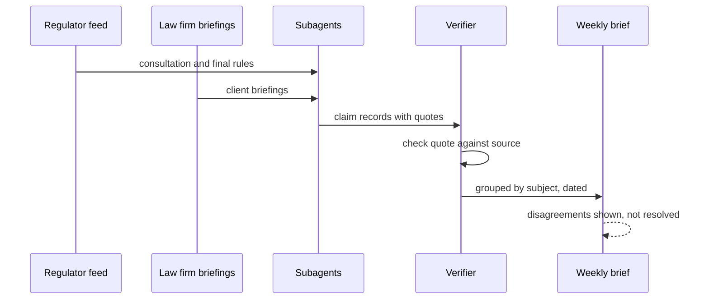

## What Problem Are We Solving?

A compliance team monitors regulatory change across twelve jurisdictions. Subagents watch
regulator publications, law-firm briefings and an internal legal memo store; a coordinator
synthesises a weekly brief telling the business what is changing and when.

One brief said: *"The reporting threshold falls to €500,000, effective 1 January."* The business
started a four-month project to meet it.

Three sources had contributed. The regulator's consultation paper proposed €500,000 with an
indicative date. A law firm's briefing, published two months later, noted the final rule had
landed at €750,000 with an 18-month transition. The internal memo predated both. The
summarisation step blended them into one fluent sentence, keeping the number from the first
source and the date from a third, and attributing nothing.

No step in that pipeline malfunctioned. Each subagent reported its source accurately. The
coordinator wrote a clean summary. The failure happened *between* the steps: at every handoff,
the link from a claim to the source it came from was optional, and summarisation — which is lossy
by design — discarded it first, because provenance is metadata rather than "the point" of the
text.

Once that link is gone it cannot be recovered. A downstream agent holding "the threshold is
€500,000" has no way to know it came from a superseded consultation paper, that another source
disagreed, or that the date belongs to a different document entirely. The claim has become an
orphan, and orphans get stated with the confidence of established fact.

> **🗣️ In plain English:** Summarising throws away where things came from before it throws away anything else. If the source isn't carried as structured data alongside the claim, it won't survive the first handoff.

## Meet the Moving Parts

| Problem | What goes wrong | The fix |
|---|---|---|
| Two sources give different values | One is silently chosen; the disagreement vanishes | Report **both**, each with its source |
| Sources carry different dates | Looks like a contradiction; often isn't | Carry publication dates; different years aren't a conflict |
| Attribution lost in summarisation | Claim becomes unattributable, permanently | Structured `{claim, value, source, date}` records every agent must preserve |
| Everything flattened to one format | Tables, figures and commentary become indistinguishable prose | Route by type: financial data to tables, news to prose |

Three things are worth being precise about.

**Silently picking a winner is the worst outcome, not the tidiest.** When two sources disagree,
one value with no attribution is strictly worse than two values with attribution, even though it
reads better. Reading better is exactly the problem: a single confident number gives the reader no
signal that a judgment was made on their behalf.

**Dates convert false conflicts into real information.** €500,000 in a consultation and €750,000
in a final rule aren't contradictory — they're a sequence. Strip the dates and you get a
contradiction the system must resolve, usually badly. Keep them and the resolution is obvious:
the later document supersedes.

**Provenance has to be structured, not mentioned.** Prose that says "according to the regulator"
is not provenance; the next summarisation step drops it like any other clause. A `source` field in
a record survives because preserving it is a schema requirement rather than a stylistic
preference.

> **💡 Tip:** Test a pipeline by asking it for one number and then asking "where did that come from?" If the answer is vaguer than the original source, you've already lost provenance somewhere upstream.

## How It Works, Step by Step

1. **Define a claim record** — `{claim, value, source, source_date, retrieved_at}` — as the only
   currency between agents.
2. **Subagents emit records, never prose.** A subagent that returns a paragraph has already made
   the lossy step.
3. **Make the schema enforce it** (4.3): `source` and `source_date` required and non-nullable, so
   an unattributed claim is not expressible.
4. **Group claims by what they're about**, not by which agent found them, so competing values for
   one fact land together.
5. **Detect disagreement mechanically** — same subject, different value — in code, not by asking
   a model to notice.
6. **Order by date before judging conflict.** Different values at different dates are a timeline;
   different values at the same date are a genuine dispute.
7. **Present both, attributed.** The output names each value, its source and its date.
8. **Route by type.** Figures to tables, narrative to prose — a uniform format destroys the
   structure that made the data checkable.

```mermaid
flowchart TD
    A[Subagents gather] --> B[Emit claim records, not prose]
    B --> C[Group by subject]
    C --> D{Values agree}
    D -->|yes| E[Single attributed claim]
    D -->|no| F{Same date}
    F -->|no| G[Timeline: later supersedes, both shown]
    F -->|yes| H[Genuine dispute: present both]
    G --> I[Brief with attribution]
    H --> I
    E --> I
```

## Minimal Working Implementation

The whole failure and its fix, offline. Save as `provenance.py` and run it — no API key needed;
the mechanism is in the data structure, not the model.

```python
import dataclasses
from collections import defaultdict

@dataclasses.dataclass(frozen=True)
class Claim:
    subject: str        # what the claim is about - the grouping key
    value: str
    source: str
    source_date: str    # ISO; the field that turns conflicts into timelines

CLAIMS = [
    Claim("reporting_threshold", "EUR 500,000",
          "Regulator consultation paper CP24-3", "2025-02-11"),
    Claim("reporting_threshold", "EUR 750,000",
          "Hensmore LLP client briefing", "2025-04-30"),
    Claim("effective_date", "2026-01-01",
          "Regulator consultation paper CP24-3", "2025-02-11"),
    Claim("effective_date", "2026-10-01",
          "Hensmore LLP client briefing", "2025-04-30"),
]

def blended(claims: list[Claim]) -> str:
    """What a naive summariser does: one value, no source, no date."""
    first = {c.subject: c.value for c in reversed(claims)}
    return (f"The reporting threshold falls to {first['reporting_threshold']}"
            f", effective {first['effective_date']}.")

def attributed(claims: list[Claim]) -> str:
    by_subject = defaultdict(list)
    for claim in claims:
        by_subject[claim.subject].append(claim)
    lines = []
    for subject, group in by_subject.items():
        group.sort(key=lambda c: c.source_date)
        if len({c.value for c in group}) == 1:
            lines.append(f"{subject}: {group[0].value} ({group[0].source})")
            continue
        lines.append(f"{subject}: SOURCES DISAGREE")
        lines += [f"    {c.value} - {c.source}, {c.source_date}"
                  for c in group]
        lines.append(f"    most recent: {group[-1].value}")
    return "\n".join(lines)

print("--- blended ---\n" + blended(CLAIMS))
print("\n--- attributed ---\n" + attributed(CLAIMS))
```

The blended output is the sentence that cost four months. The attributed output says the same
facts and makes the disagreement — and which source is newer — impossible to miss.

## Production Implementation

Production makes the record the only thing that can cross an agent boundary, and treats an
unattributed claim as a bug rather than a style issue.

```python
import datetime as dt

CLAIM_TOOL = {
    "name": "report_claims",
    "description": "Report each factual claim separately with the exact "
                   "source document it came from. Never merge two "
                   "sources into one claim.",
    "strict": True,
    "input_schema": {
        "type": "object",
        "properties": {
            "claims": {
                "type": "array",
                "items": {
                    "type": "object",
                    "properties": {
                        "subject": {"type": "string"},
                        "value": {"type": "string"},
                        "source": {"type": "string"},
                        "source_date": {"type": "string"},
                        "quote": {"type": "string"},
                    },
                    "required": ["subject", "value", "source",
                                 "source_date", "quote"],
                    "additionalProperties": False,
                },
            },
        },
        "required": ["claims"],
        "additionalProperties": False,
    },
}
```

Every claim is verified against the document it names before it is allowed downstream:

```python
def verify(claim: dict, documents: dict[str, str]) -> list[str]:
    """A source field the model invented is worse than none - it looks
    like provenance while being fiction."""
    errors = []
    body = documents.get(claim["source"])
    if body is None:
        errors.append(f"unknown source {claim['source']!r}")
    elif claim["quote"] not in body:
        errors.append(f"quote not found in {claim['source']}")
    try:
        dt.date.fromisoformat(claim["source_date"])
    except ValueError:
        errors.append(f"unparseable source_date {claim['source_date']!r}")
    return errors
    # ...
```

**What changed, and why:**

- **A supporting `quote` is required and checked against the document.** This is the difference
  between provenance and the *appearance* of provenance: forced tool use guarantees a `source`
  string, not a true one, and a fabricated citation is more dangerous than a missing one because
  it survives review.
- **`source` and `source_date` are required and non-nullable.** An unattributed claim cannot be
  represented, so it can't be produced by accident at a handoff.
- **Claims are separate array items, not one merged object.** Merging is the operation that loses
  provenance; the schema makes each claim carry its own.
- **Dates are parsed, not trusted as strings.** Conflict resolution depends on ordering, and an
  unparseable date silently disables supersession, reintroducing the false-conflict problem.

## In Production: Regulatory Change Monitoring at a Compliance Team

Twelve jurisdictions, three source classes, a weekly brief the business acts on.



**The incident.** The €500,000 sentence cost roughly four months of a six-person project scoped to
the wrong threshold, caught when a lawyer read the brief and recognised the figure as the
consultation number rather than the final rule. The direct cost was the rework; the lasting cost
was that the compliance team stopped trusting the brief, which had been the point of building it.

**After.** Claims carry subject, value, source, date and a verified quote. In the first month the
new pipeline surfaced 23 disagreements across 12 jurisdictions. Nineteen were *temporal* — a
consultation figure and a final figure, correctly ordered by date, where the brief now shows both
and marks the later as current. Four were genuine same-date disputes between a regulator's text
and a law firm's reading of it, and those are exactly the items a compliance team wants on its
desk.

**The number that changed the brief's standing.** Nineteen of 23 were false conflicts that dates
alone resolved. Under the old pipeline every one of those had been a coin flip performed silently
during summarisation. Carrying one extra field per claim converted the majority of the system's
hardest-looking problem into bookkeeping.

**The quote check earned its place immediately.** About 6% of claims in the first fortnight failed
verification — the quoted text wasn't in the document named. Most were near-misses where the
subagent had paraphrased rather than quoted, but a handful attributed a real claim to the wrong
document of the two it had read. Every one of those would have passed a schema check, read as
well-sourced, and been wrong about the one thing provenance exists to establish.

> **🌍 Real-world example:** The routing-by-type rule mattered more than expected. An early version rendered everything as prose, including a table of thresholds by entity size. Flattened into a sentence — "thresholds range from €250,000 to €750,000 depending on size" — it was true and useless, and the per-band figures were unrecoverable downstream. Financial data now stays tabular end to end, with narrative alongside rather than merged in.

## Where This Applies — and Where It Doesn't

| Situation | Use this | Use instead |
|---|---|---|
| Claims pass through several agents | Structured `{claim, source, date}` records | Prose that mentions sources |
| Two sources give different values | Present both with attribution | Silently picking one |
| Sources are from different dates | Carry dates; order before judging conflict | Treating it as a contradiction |
| A summarisation step sits in the pipeline | Require provenance through it | Hoping the summary keeps it |
| Mixed data types in one flow | Route by type — tables stay tables | One uniform format |
| A model supplies its own `source` field | Verify with a quote against the document | Trusting a schema-valid string |
| Single agent, one source, no synthesis | — | The overhead isn't earning anything |

Anti-patterns: prose attribution that summarisation will eat; averaging or silently choosing
between disagreeing sources; dropping publication dates and then having to adjudicate false
conflicts; flattening tabular data into narrative; and accepting a `source` string without
checking it names a real document that contains the claim.

## Failure Modes Seen in the Wild

### 1. The blended number

**Symptom.** One confident figure; nobody can say which source it came from.
**Cause.** Summarisation merged disagreeing sources, keeping whichever it saw last.
**Fix.** Group by subject and present every distinct value with its source.

### 2. The false conflict

**Symptom.** The system flags contradictions between sources that are simply from different
years.
**Cause.** Publication dates were dropped, so a timeline looks like a dispute.
**Fix.** Carry `source_date` and order before judging. Later supersedes; same date is a real
dispute.

### 3. The fabricated citation

**Symptom.** Claims look impeccably sourced; occasionally the source doesn't contain them.
**Cause.** A schema guarantees a `source` string, not a true one.
**Fix.** Require a verbatim quote and check it against the named document.

### 4. Everything became prose

**Symptom.** Figures that were tabular upstream are unrecoverable downstream.
**Cause.** One uniform output format for convenience.
**Fix.** Route by type; keep tables tabular through the pipeline.

> **⚠️ Watch out:** Provenance loss is a *handoff* failure, so it will not show up when you test any single agent. Each subagent cites its sources correctly and the coordinator writes a clean summary; the link dies in between. Test the pipeline end to end by taking a number from the final output and tracing it back — that's the only test that exercises the step where it breaks.

## Exam Lens & Key Takeaway

> **📝 Exam focus:** Stems describe multi-agent synthesis where source attribution is lost. Four fixes map to four problems and are tested as pairs. **Two sources report different statistics → report both values with attribution**, never silently pick one (the distractor is averaging them or choosing "the most reliable source"). **Sources have different dates → include publication dates in structured output**, because what looks like a conflict is often two correct-at-the-time figures — this is the most discriminating item. **Attribution lost during summarisation → subagents must emit structured claim-source mappings** that every downstream agent preserves, rather than prose that mentions sources. **Mixed content flattened into one format → route by type**: financial data to tables, news to prose, technical findings to structured lists. The unifying principle is that **summarisation is lossy by default and provenance is the first thing it discards**, so preserving it must be a hard architectural requirement.

> **🔑 Key takeaway:** Provenance dies at handoffs, because summarisation drops metadata before content and the loss is unrecoverable. Make a structured `{claim, value, source, date}` record the only thing that crosses an agent boundary, verify the source with a quote so attribution can't be fabricated, keep dates so timelines don't read as contradictions, and when sources genuinely disagree, present both rather than quietly choosing.
