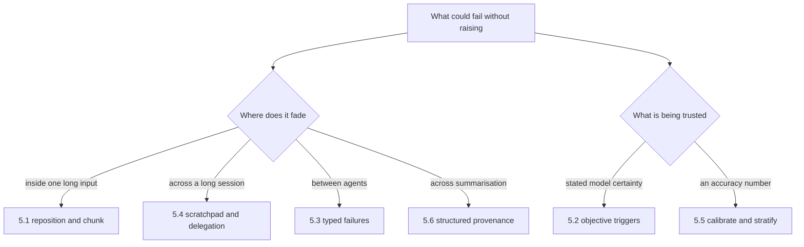
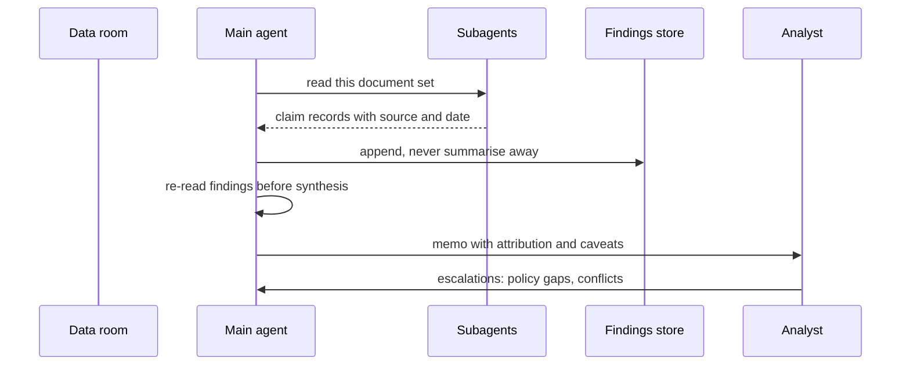

## What Problem Are We Solving?

This is the smallest domain by weight and the one that shows up in every other domain's
scenarios, because it covers what happens when a system that works starts running for a long
time, across many agents, at volume.

The thread joining its six topics is that **every failure here is silent**. That isn't a
stylistic observation; it's the design constraint. A malformed response throws. A schema
violation is caught. But a clause missed on page 180, a subagent that returned `[]` because it
couldn't search, an agent forty calls deep describing how code like this usually looks, a claim
that lost its source at a handoff, a document type quietly running at 74% inside a 97% average —
none of those raise anything. They produce fluent, confident, well-formed output that happens to
be wrong.

That shapes how you build. Elsewhere, reliability means handling errors. Here it means
**manufacturing signals that don't exist by default**: measuring recall by position, giving
failures a type, writing findings somewhere durable, keeping provenance structured, calibrating
confidence against labels. Each topic is an instrument for making an invisible failure visible.

The second thread is that three of the six are the same mistake in different clothes: **trusting
something that fades**. A conversation fades (5.1, 5.4). An unattributed claim fades (5.6). A
model's self-assessment was never solid to begin with (5.2, 5.5). The fix in each case is to put
the thing somewhere durable and check it against reality.

> **🗣️ In plain English:** Nothing in this domain crashes. It just quietly gets things wrong while sounding certain — so the work is building the instruments that would let you notice.

## Meet the Moving Parts

| Symptom | Topic | The move |
|---|---|---|
| Long input; the middle is missed | **5.1** Lost in the middle | Reposition, add headers, chunk — not a bigger window |
| Agent handles cases it shouldn't | **5.2** Escalation | Trigger on observable facts, never on sentiment or self-confidence |
| Coordinator acts on a false negative | **5.3** Error propagation | Typed failure envelope: type, attempt, partials, alternatives |
| Long session drifts to generic answers | **5.4** Long exploration | Scratchpad, subagent delegation, `/compact`, state exports |
| Aggregate accuracy hides a bad category | **5.5** Review & calibration | Field-level confidence, calibrate on labels, stratified sampling |
| A claim loses the source it came from | **5.6** Provenance | Structured `{claim, source, date}` records across every handoff |

Three relationships matter more than the rows.

**5.1 and 5.4 are the same mechanism at two timescales.** One document's middle, and one
session's middle. Both are positional, both are made worse by verbose tool output, and for both
the standing wrong answer is a larger context window.

**5.2 and 5.5 are the two halves of "don't trust self-assessment".** 5.2 says don't route on
self-reported confidence — use objective triggers. 5.5 says confidence becomes usable only after
you've calibrated it against labelled data, and even then it supplements the rules rather than
replacing them.

**5.3 and 5.6 are both handoff failures.** Every individual agent behaves correctly; information
dies in the gap between them. Neither shows up when you test a single agent, which is why both
need an end-to-end test that follows one fact all the way through.

> **💡 Tip:** When a system here "works fine", ask what would have told you if it didn't. If the answer is "a customer would eventually notice", you have the domain's characteristic gap.

## How It Works, Step by Step

1. **Ask what would fail silently.** For each step, name the wrong output that would look exactly
   like a right one.
2. **Position what matters at the edges** — key content at the top, the question last, headers
   through the body (5.1).
3. **Keep the transcript from becoming the memory.** Delegate voluminous reading; write findings
   to a file with concrete symbols; re-read before synthesis (5.4).
4. **Give failure a type.** One envelope with a status discriminator, so "found nothing" can't be
   confused with "couldn't look" (5.3).
5. **Carry provenance as data.** `{claim, value, source, date}` across every handoff, verified
   with a quote (5.6).
6. **Decide escalation in code**, from observable facts — explicit request, policy gap, exhausted
   retries, ambiguous identity (5.2).
7. **Calibrate before you automate.** Per-field confidence, a curve built on labels, thresholds
   per category, stratified sampling including high-confidence cases (5.5).
8. **Watch the rates.** Trigger mix, failure types, null and confidence bands. These are the
   instruments; without them the domain's failures are invisible.



## Minimal Working Implementation

The domain's failures are silent, so the useful tool is one that finds the places where they
could hide. Save as `audit_reliability.py` and run it against your own agent code — no API key
needed.

```python
import pathlib
import re
import sys

SMELLS = (
    (r"return\s*\[\s*\]", "5.3: bare empty list - 'found nothing' and "
                          "'could not look' become indistinguishable"),
    (r"except[^:]*:\s*(\n\s+)?(pass|return\s+(\[\]|None|\{\}))",
     "5.3: swallowed exception returns a plausible value as success"),
    (r"confidence\s*[<>]=?\s*0?\.\d+", "5.5/5.2: routing on a raw "
                                       "confidence threshold - calibrated?"),
    (r"sentiment|frustrat|angry", "5.2: sentiment as a control signal - "
                                  "tone is not difficulty"),
    (r"random\.sample|random\.random\(\)\s*<", "5.5: sampling - is it "
                                               "stratified, or uniform?"),
    (r"\.summar|summarize|summarise", "5.6: summarisation step - does "
                                      "provenance survive it?"),
    (r"max_tokens\s*=\s*\d{6,}", "5.1/5.4: very large window - is this "
                                 "capacity, or position?"),
)


def audit(path: pathlib.Path) -> list[str]:
    text = path.read_text(encoding="utf-8", errors="replace")
    found = []
    for line_no, line in enumerate(text.splitlines(), 1):
        for pattern, note in SMELLS:
            if re.search(pattern, line, re.I):
                found.append(f"{path}:{line_no}: {note}")
    return found


if __name__ == "__main__":
    root = pathlib.Path(sys.argv[1] if len(sys.argv) > 1 else ".")
    hits = [h for f in sorted(root.rglob("*.py")) for h in audit(f)]
    print("\n".join(hits) or "no reliability smells found")
    sys.exit(1 if hits else 0)
```

These are questions, not verdicts — a bare `return []` is fine in a function that cannot fail.
The value is that each hit names the silent failure it could become, which is the thing nobody
thinks to look for.

## Production Implementation

In production the domain's six failures become six counters. If they aren't counted, they aren't
detectable.

```python
import collections

WINDOW = 1000
series = collections.defaultdict(lambda: collections.deque(maxlen=WINDOW))


def observe(event: dict) -> None:
    """One counter per silent failure mode in this domain."""
    series["escalated"].append(bool(event.get("escalation_trigger")))
    series["policy_gap"].append(
        event.get("escalation_trigger") == "policy_gap")
    series["leg_failed"].append(event.get("failed_legs", 0) > 0)
    series["untyped_failure"].append(
        event.get("failure_type") in (None, "unknown"))
    series["unattributed"].append(event.get("claims_without_source", 0) > 0)
    series["high_conf_sampled"].append(bool(event.get("hc_review")))
    series["generic_answer"].append(bool(event.get("no_symbol_cited")))
```

Each rate maps to the topic that fixes it, so an alert is already a diagnosis:

```python
THRESHOLDS = {
    "policy_gap": (0.15, "5.2: the policy set has a hole - write the "
                         "policy, do not loosen the trigger"),
    "untyped_failure": (0.02, "5.3: failures arriving without a type - "
                              "the coordinator cannot choose a recovery"),
    "unattributed": (0.0, "5.6: a claim crossed a handoff with no source"),
    "generic_answer": (0.05, "5.4: answers not citing concrete symbols - "
                             "context degradation"),
}


def alerts() -> list[str]:
    out = []
    for key, (limit, note) in THRESHOLDS.items():
        data = series[key]
        if data and sum(data) / len(data) > limit:
            out.append(f"{key} at {sum(data) / len(data):.1%}: {note}")
    if not any(series["high_conf_sampled"]):
        out.append("5.5: no high-confidence cases reviewed in the window")
    return out
    # ...
```

**What changed, and why:**

- **`unattributed` has a threshold of zero.** Every other rate is a judgment call; a claim
  crossing a handoff without a source is a contract violation, and tolerating any rate of it
  means the schema isn't enforcing what you think.
- **Alerts name the topic and the wrong fix.** "Write the policy, do not loosen the trigger" is in
  the alert text because the tempting response to a noisy trigger is to silence it.
- **The absence of a signal is itself an alert.** Zero high-confidence reviews in a window is the
  5.5 failure exactly — nobody looking where the system says it's fine.
- **Rates are windowed.** A lifetime average buries a regression that started on Tuesday.

## In Production: Deal Diligence at a Private Equity Firm

An analyst team runs pre-acquisition diligence: 300–900 documents per deal — contracts,
financials, regulatory filings, board minutes — read by an agent that produces a findings memo the
investment committee votes on. All six topics appear.



**How the six fit.** Long contracts are chunked with key clauses hoisted and the question last,
because a change-of-control clause on page 180 is worth millions (**5.1**). Document reading is
delegated to subagents that return claim records, never raw text, and findings are appended to a
store the synthesis step re-reads (**5.4**). A subagent that can't reach the filings archive
returns a typed failure with alternatives, so the memo says "not checked" rather than "no
liens found" (**5.3**). Every claim carries source and date, so a covenant quoted from a
superseded draft is never silently blended with the executed version (**5.6**). Anything without
a documented diligence procedure routes to an analyst on a rule, not on the agent's comfort level
(**5.2**). And field-level confidence, calibrated per document class, decides what a human reads
— with a standing sample of high-confidence extractions (**5.5**).

**The near-miss that built the system.** An early memo stated a target had no change-of-control
provision in its largest customer contract. It did — on page 180 of 240, in a contract the agent
had been given in full. The deal was two days from signing when an analyst found it by reading
the contract herself. A change-of-control provision in the top customer contract was, in that
deal, the difference between the thesis working and not.

**After.** Positional recall on long contracts went from 74% mid-document to 96%. Claims in the
memo carry attribution, and the committee can click through to the clause. Of the memo's content,
about 11% now arrives marked "not verified" — legs that failed, or sources that disagreed —
which the committee reports as the single most valuable change, because previously that 11% had
been indistinguishable from verified fact.

> **🌍 Real-world example:** The "not checked" caveat class was resisted initially — partners thought it made the memo look weaker. The first time it earned its place, a filings archive had been down during the run; under the old pipeline the memo would have read "no undisclosed liens identified", which is a sentence a committee acts on. It now read "liens: not checked (archive unavailable)". Same underlying run, same data, and the second version is the one that doesn't lose money.

## Where This Applies — and Where It Doesn't

| Situation | Use this | Use instead |
|---|---|---|
| Long documents, key content mid-way | Reposition, headers, chunk (5.1) | A larger context window |
| Long agent sessions | Scratchpad + delegation (5.4) | Trusting the transcript |
| Subagents reporting to a coordinator | Typed failure envelopes (5.3) | Bare empties or generic strings |
| Claims passing through summarisation | Structured provenance (5.6) | Prose that mentions sources |
| Deciding when a human takes over | Objective triggers (5.2) | Sentiment, self-reported confidence |
| Deciding how much to review | Calibration + stratification (5.5) | A single aggregate accuracy figure |
| Short, single-agent, single-source tasks | — | Most of this machinery is overhead |

Anti-patterns spanning the domain: answering a positional problem with capacity; letting a
plausible value stand in for a failure; trusting a model's self-assessment without calibration;
allowing summarisation to be the step where metadata dies; and — the one that enables all the
others — shipping without the counter that would have shown you.

## Failure Modes Seen in the Wild

### 1. The confident omission

**Symptom.** An answer is complete, fluent, and missing the thing that mattered.
**Cause.** Mid-document position (5.1), or a subagent that returned an empty result (5.3).
**Fix.** Measure recall by position; give failures a type. Both convert silence into a signal.

### 2. The fading memory

**Symptom.** Late-session answers describe typical patterns rather than this system.
**Cause.** Early observations buried in a long transcript (5.4).
**Fix.** Findings on disk with concrete symbols, re-read before synthesis.

### 3. Trusted self-assessment

**Symptom.** The worst errors carry the highest confidence.
**Cause.** Routing on an uncalibrated number (5.2, 5.5).
**Fix.** Objective triggers for escalation; calibration against labels before any threshold.

### 4. The orphaned claim

**Symptom.** A number in the output that nobody can trace.
**Cause.** Provenance dropped at a handoff, usually by summarisation (5.6).
**Fix.** Structured claim records with verified quotes, required end to end.

> **⚠️ Watch out:** Every topic here has a tempting non-fix that makes the problem invisible rather than absent: a bigger context window, a looser escalation threshold, a retry that averages over the failure, a summary that reads more cleanly. Each removes the symptom from view while leaving the fault in place — which in a domain of silent failures is strictly worse than doing nothing.

## Exam Lens & Key Takeaway

> **📝 Exam focus:** 15% of the exam, ~9 questions, recognisable by their distractors. **5.1**: a larger window and run-and-average never fix a middle-of-document miss; moving key content to the top and adding headers do, and summarising first loses exact values. **5.2**: reliable triggers are an explicit request for a human, a policy gap, failure after retries, and ambiguous identity — sentiment and self-reported confidence are always wrong. **5.3**: rank the failure-reporting patterns — empty-result-as-success worst, then aborting the workflow, then a generic message, with a structured error (type, attempt, partials, alternatives) correct. **5.4**: scratchpad files, subagent delegation, `/compact`, state exports, matched to situations. **5.5**: aggregate accuracy hides variance — stratify sampling *including high-confidence cases*, score confidence per field, calibrate against labelled data. **5.6**: report both values when sources disagree, keep publication dates so timelines aren't read as conflicts, and emit structured claim-source records, because summarisation drops provenance first.

> **🔑 Key takeaway:** This domain is about failures that never raise — a clause missed in the middle, a subagent's empty list, an agent quoting generic patterns, a claim that lost its source, a category hidden inside an average. The work is building the signals that would reveal them: measure recall by position, persist findings outside the transcript, give failures a type, carry provenance as structured data, and calibrate confidence against reality before you trust it to reduce oversight.
