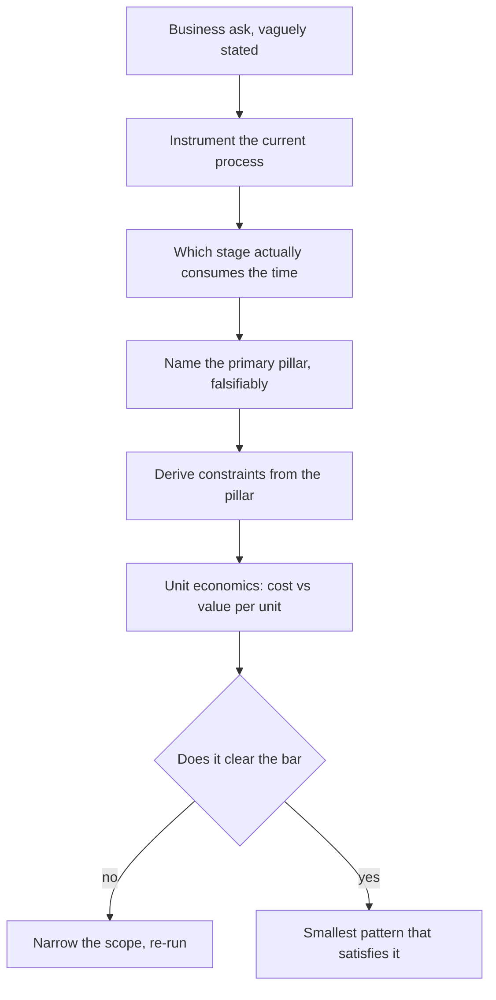
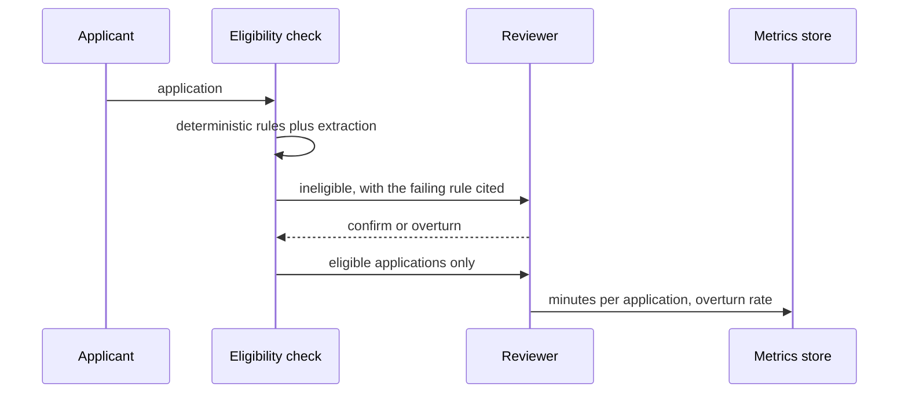

## What Problem Are We Solving?

A research funder screens 14,000 grant applications a year. The programme director says: *"We want
to use AI to speed up review."*

The architect who takes that at face value builds a multi-agent system — a methodology critic, a
budget analyst, a novelty checker, a synthesiser writing a reviewer-ready brief. It demos
beautifully. Eight months later it is switched off, because reviewers didn't trust a brief they
couldn't audit, and because the thing that was actually slow was never the reviewing.

The bottleneck was triage. About 40% of applications are ineligible on mechanical grounds — wrong
call, missing co-investigator statement, budget over the cap — and each one still consumed twenty
minutes of a reviewer's time before being rejected. Nobody said that in the kickoff, because
"screening is slow" is how the problem feels from the inside.

Two different solutions follow from two different readings. *Speed up review* points at
judgment support, which is expensive, hard to evaluate and needs reviewers to trust it. *Stop
reviewers seeing ineligible applications* points at a deterministic eligibility check with a
human confirming rejections — smaller, measurable in week one, and worth roughly 1,900 reviewer
hours a year on its own.

Translating a business ask is not gathering requirements. It is finding which measurable outcome
is actually being bought, because that single choice determines the architecture, the evaluation
strategy, and whether anyone uses the result.

> **🗣️ In plain English:** Stakeholders describe how a problem feels, not where the time goes. Find the outcome you're being paid to move before you choose anything technical.

## Meet the Moving Parts

The five value pillars are not labels for a slide — each points at a different architecture.

| Pillar | The win | What it forces architecturally |
|---|---|---|
| **Efficiency** | Speed or headcount leverage on work that happens today | Low latency, embedded in the tool people already use, human-in-the-loop |
| **Transformation** | Something previously impossible or uneconomic | Justifies deeper retrieval and heavier evaluation — the capability *is* the value |
| **Productivity** | Skilled humans get better at their existing job | Augmentation, not automation; optimise for trust and explainability |
| **Cost Reduction** | A direct line-item saving | Simple ROI, and the tightest accuracy scrutiny — errors cost money directly |
| **Performance SLA** | A hard operational target | Constrains the design: may rule out agentic loops or deep retrieval outright |

Three things about using them.

**Identify the *primary* pillar.** Projects touch several; only one survives a trade-off. When
latency and thoroughness conflict, the primary pillar decides — and if nobody has named it, that
argument gets re-litigated every sprint.

**The pillar is a claim you can be wrong about.** "Efficiency: saves twenty minutes per ineligible
application" is falsifiable — measure the twenty minutes. "Improves the review process" is not.
If the pillar statement can't be checked in a month, it isn't finished.

**Over-engineering and under-engineering are both real.** A narrow prompt-and-response feature
that saves an analyst two hours a day beats an elaborate agentic system nobody can debug. But
forcing a genuinely open-ended, judgment-heavy task into a rigid pipeline produces something
brittle that fails the first time reality deviates.

> **💡 Tip:** Ask "what would you stop doing if this worked?" Stakeholders answer that concretely when they can't answer "what do you want the AI to do?"

## How It Works, Step by Step

1. **Get the volume and the minutes.** How many units a month, how long each takes today, what
   the loaded cost of that time is. Without these there's no business case, only a preference.
2. **Find where the time actually goes.** Split the work into stages and measure each. The slow
   stage is rarely the interesting one.
3. **Name the primary pillar** for the stage you're targeting, as a falsifiable sentence.
4. **Derive the constraints from the pillar**, not from taste: an SLA pillar rules out unbounded
   loops; a productivity pillar makes explainability non-negotiable.
5. **Run the unit economics** before choosing a pattern. Cost per unit against value per unit
   decides what you can afford to build.
6. **Choose the smallest architecture that clears the bar** (1.2). Autonomy is a cost, not a
   default.
7. **Define the measurement now**, while the pillar is fresh — it becomes the feedback loop (1.5).
8. **Bank the simple win, then revisit.** The transformation-pillar ambition is a legitimate
   phase two, once phase one is trusted.



## Minimal Working Implementation

The business case is arithmetic, and doing it first kills more bad architectures than any review.
Save as `unit_economics.py` and run it — no API key needed.

```python
import dataclasses

IN_PER_MTOK, OUT_PER_MTOK = 5.00, 25.00      # claude-opus-5

@dataclasses.dataclass(frozen=True)
class Design:
    name: str
    pillar: str
    volume_month: int
    minutes_each: float          # human time today, per unit
    hourly_rate: float           # loaded
    in_tokens: int
    out_tokens: int
    deflection: float            # share needing no human touch after

def economics(d: Design) -> dict:
    api = d.volume_month * (d.in_tokens / 1e6 * IN_PER_MTOK
                            + d.out_tokens / 1e6 * OUT_PER_MTOK)
    human_now = d.volume_month * d.minutes_each / 60 * d.hourly_rate
    human_after = human_now * (1 - d.deflection)
    return {"api": api, "human_now": human_now,
            "net": human_now - human_after - api,
            "hours_freed": d.volume_month * d.minutes_each
                           * d.deflection / 60}

DESIGNS = [
    Design("eligibility triage", "efficiency", 1170, 20, 95,
           in_tokens=6_000, out_tokens=400, deflection=0.40),
    Design("full review assistant", "productivity", 1170, 95, 95,
           in_tokens=48_000, out_tokens=3_500, deflection=0.05),
]
for d in DESIGNS:
    e = economics(d)
    print(f"{d.name:24} [{d.pillar:12}] api=${e['api']:>8,.0f}  "
          f"net=${e['net']:>9,.0f}/mo  freed={e['hours_freed']:>5,.0f}h")
```

The triage design costs a fraction as much per unit and frees far more time, because deflection —
how many units stop needing a human — dominates everything else. That number is a property of the
*problem you chose*, not of how good the model is.

## Production Implementation

In production the pillar stops being a document and becomes the thing the system measures itself
against.

```python
import dataclasses
import datetime as dt

@dataclasses.dataclass(frozen=True)
class PillarClaim:
    """A falsifiable statement. If it can't be checked, it isn't done."""
    pillar: str
    metric: str                  # the field the warehouse can actually query
    baseline: float              # measured before launch, not estimated
    target: float
    measured_by: dt.date
    owner: str

CLAIM = PillarClaim(
    pillar="efficiency",
    metric="reviewer_minutes_per_ineligible_application",
    baseline=20.4,               # measured over 300 applications
    target=2.0,
    measured_by=dt.date(2026, 3, 31),
    owner="programme-operations",
)
```

The claim is then evaluated on real traffic, and a miss is a design signal rather than a surprise:

```python
def verdict(claim: PillarClaim, observed: float, n: int) -> str:
    if n < 200:
        return f"insufficient evidence ({n} units)"
    if observed <= claim.target:
        return f"met: {observed:.1f} vs target {claim.target}"
    reached = (claim.baseline - observed) / (claim.baseline - claim.target)
    if reached < 0.25:
        return ("missed badly - suspect the wrong stage was targeted, "
                "not the implementation")
    return f"partial: {reached:.0%} of the intended improvement"
    # ...
```

**What changed, and why:**

- **The baseline is measured, not estimated.** Almost every business case that collapses does so
  because the "before" number was someone's recollection. Measuring 300 applications costs a week
  and makes every later claim defensible.
- **The metric names a queryable field.** "Reviewer satisfaction" cannot be evaluated;
  `reviewer_minutes_per_ineligible_application` can. This is the difference between a pillar and
  a slogan.
- **A large miss is diagnosed as targeting, not execution.** Under 25% of the intended improvement
  usually means the time was never in that stage — send it back to step 2, don't tune the prompt.
- **The claim has an owner and a date.** An unowned success metric is checked once, at launch, by
  the person who wrote it.

## In Production: Grant Screening at a Research Funder

14,000 applications a year, 40 staff reviewers, a statutory 12-week decision window the funder had
been missing for three years running.



**What the instrumenting found.** Reviewers spent 20.4 minutes on average on an application they
ultimately rejected as ineligible, against 95 minutes on one they actually assessed. At 5,600
ineligible applications a year that is 1,900 hours — roughly a full-time reviewer, spent
confirming that budgets exceeded a published cap.

**What was built.** Not a review assistant. An extraction step pulling the eight fields the
eligibility rules touch, with the rules themselves in ordinary code, and a screen that shows a
reviewer the failing rule and the quoted text so a rejection takes under two minutes to confirm.
Reviewers still make every rejection — the pillar was efficiency, not automation, and their
accountability was never in question.

**Result against the claim.** Minutes per ineligible application went from 20.4 to 1.8, against a
target of 2.0. That is 1,750 reviewer hours a year, and the 12-week window was met for the first
time in four years. API cost came to about £310 a month.

**The phase two that then made sense.** Only after that was banked did the funder revisit the
review assistant — now with a reviewer population that had used the tool for six months and a
concrete sense of where judgment support would actually help. It scoped much more narrowly the
second time: surfacing the three most similar previously-funded projects, a transformation-pillar
capability nobody could do by hand at all.

> **🌍 Real-world example:** The eight months spent on the original multi-agent system weren't wasted for technical reasons — every agent worked. They were wasted because nobody had measured where the twenty minutes went. A week of instrumenting first would have redirected the entire project, and the tell was available at the kickoff: the director said "speed up review", and nobody asked which part of review.

## Where This Applies — and Where It Doesn't

| Situation | Use this | Use instead |
|---|---|---|
| Vague ask: "use AI for X" | Instrument first, then name the pillar | Designing from the ask as stated |
| Several pillars seem to apply | Pick the primary — it decides trade-offs | Claiming all of them |
| A hard latency or throughput target | SLA pillar constrains the pattern directly | Choosing the pattern first |
| Humans stay accountable for output | Productivity pillar: explainability over throughput | Optimising for automation rate |
| The ROI case won't close | Narrow the scope until it does | Building it and hoping |
| Genuinely open-ended judgment work | — | A rigid pipeline; it'll break on first deviation |
| Capability that doesn't exist today | — | Efficiency framing; it undersells transformation |

Anti-patterns: taking the stated ask as the requirement; choosing an architecture before the unit
economics; estimating rather than measuring the baseline; success metrics nothing can query; and
reaching for the most sophisticated pattern available because the problem sounds sophisticated.

## Failure Modes Seen in the Wild

### 1. Solving the stage nobody was stuck on

**Symptom.** The system works, adoption doesn't follow.
**Cause.** The ask described a feeling; the time was elsewhere.
**Fix.** Instrument the current process by stage before designing anything.

### 2. The unfalsifiable pillar

**Symptom.** Everyone agrees it's valuable; nobody can say whether it worked.
**Cause.** The success metric was a sentiment, not a queryable field.
**Fix.** Write the claim with a baseline, a target, a date and an owner.

### 3. Architecture chosen before economics

**Symptom.** Per-unit cost is discovered late and kills the project.
**Cause.** The pattern was picked on sophistication, then costed.
**Fix.** Run cost-per-unit against value-per-unit first; it eliminates options for free.

### 4. Phase two built first

**Symptom.** An ambitious system, low trust, quiet abandonment.
**Cause.** The transformation-pillar ambition was built before the efficiency win earned any
credibility.
**Fix.** Bank the simple win, then spend the trust on the ambitious one.

> **⚠️ Watch out:** The deflection rate — the share of units that stop needing a human — dominates every other number in the business case, and it is a property of the problem you picked rather than of the model. A 40% deflection on a cheap, mechanical stage beats a 5% deflection on an expensive, judgment-heavy one, almost regardless of how impressive the second one is.

## Exam Lens & Key Takeaway

> **📝 Exam focus:** Scenario stems describe a business situation and ask what to build. Classify against the **five pillars — efficiency, transformation, productivity, cost reduction, performance SLA** — before evaluating any technical option; the pillar usually eliminates two or three answers immediately. Expect the **technically impressive answer to be wrong** and the appropriately-scoped one to be right: over-engineering is the domain's signature distractor. Know what each pillar forces — efficiency wants low latency and a human in the loop, transformation justifies heavier investment because the capability itself is the value, productivity means augmentation and explainability, cost reduction invites the tightest accuracy scrutiny, and an SLA constrains the architecture directly. Also expect the reverse trap once: a genuinely open-ended task where the *under*-engineered rigid workflow is the wrong answer.

> **🔑 Key takeaway:** The first architectural decision is which measurable business outcome you're being paid to move, and stakeholders state that in feelings rather than in where the time goes — so instrument before you design. Name one primary pillar as a falsifiable claim with a measured baseline, let it dictate your constraints, run the unit economics before choosing a pattern, and build the smallest thing that clears the bar.
