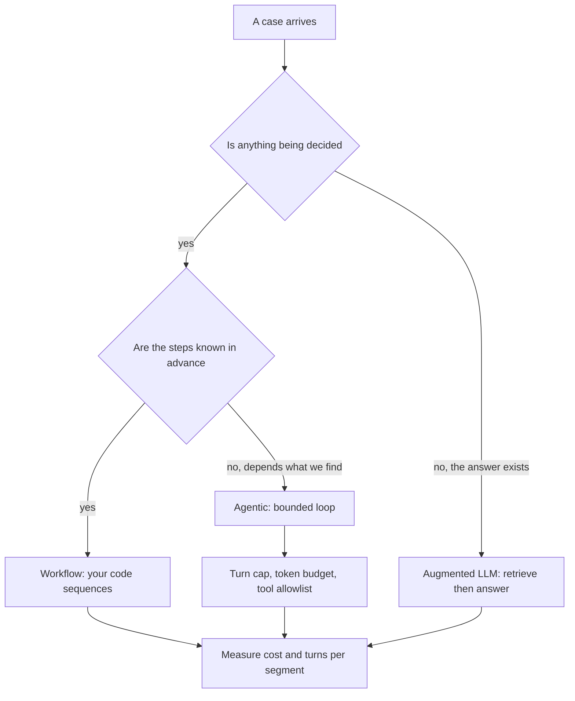
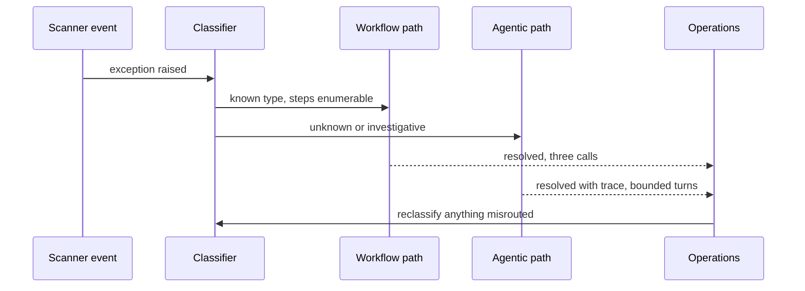

## What Problem Are We Solving?

A logistics operator moves 30,000 shipments a week and wants "AI in exception handling". The
architect builds one agentic system with twelve tools and lets Claude decide what to do.

It works on the hard cases, which is why it survived review. It is a disaster on the easy ones.
A "delivery attempted, customer absent" exception has exactly one correct handling — reschedule,
notify, update the ETA — and the agent takes between three and nine turns to reach it, sometimes
checking the tariff table on the way, at 40x the cost of the three API calls the task actually
needs. Worse, it is not always the same three actions, so operations can't tell customers what
the system will do.

The mistake is treating pattern choice as a capability question. It isn't; it's a question about
**where the uncertainty lives**. In the absent-customer case the sequence is known and only the
content varies — that's a workflow. In "this pallet arrived 14kg lighter than the manifest and
the seal is intact", the next action genuinely depends on what the last one found — that's
agentic. In "what's our liability cap for temperature-controlled freight into Norway?", nothing
needs deciding at all; the answer exists in a document and needs retrieving — that's an augmented
LLM.

One system was built for the hardest 4% of traffic and applied to all of it. Autonomy is a cost —
paid in predictability, latency, debuggability and money — and worth paying only where the
uncertainty genuinely is.

> **🗣️ In plain English:** Don't ask how clever the system needs to be. Ask whether you know the steps in advance — and if you do, don't let the model choose them.

## Meet the Moving Parts

| Pattern | Who controls the sequence | Best fit | Predictability | Guardrails needed |
|---|---|---|---|---|
| **Workflow** | Your code — fixed steps | Known, repeatable processes | High | Input validation, step-level error handling |
| **Agentic** | Claude, in a dynamic loop | Next step depends on what the last found | Lower | Tool permissions, iteration and cost caps, checkpoints |
| **Augmented LLM** | Your code retrieves; Claude answers once | Accurate answers from your own data | High | Retrieval quality, grounding and citation checks |

Three clarifications that matter more than the table.

**A workflow can call Claude many times.** The distinguishing property isn't the number of calls —
it's that your code, not the model, decides what happens next. Five Claude calls in a fixed order
is still a workflow.

**Augmented LLM is not "a small agent".** It has no loop. Retrieve, answer, done. Confusion here
produces RAG systems with tool loops bolted on, inheriting agentic unpredictability while solving
a problem that never needed it.

**Most real systems are a router over all three.** The logistics answer isn't one pattern; it's
classify-then-dispatch. That's the design most exam scenarios are quietly describing when they
give you a mix of easy and hard cases.

> **💡 Tip:** If you can draw the flowchart without a "it depends what we find" branch, you have a workflow. Reaching for an agent anyway is paying for optionality you just proved you don't need.

## How It Works, Step by Step

1. **Write down the steps for a typical case.** If you can enumerate them, the uncertainty is in
   content, not sequence.
2. **Look for the "depends on what we find" branch.** Genuinely unknowable next steps are the only
   thing that justifies agentic.
3. **Check whether anything needs deciding at all.** If the answer exists in a document, it's
   retrieval, not reasoning.
4. **Segment the traffic.** Easy majority and hard minority usually want different patterns —
   classify first and dispatch.
5. **Build the workflow path first.** It's cheaper, testable, and it becomes the baseline the
   agentic path has to beat.
6. **Bound the agentic path** with a turn cap, a token budget and a tool allowlist, before it sees
   traffic.
7. **Measure per segment.** Cost and turns per case class is what tells you a segment was
   misrouted.



## Minimal Working Implementation

The same exception, both ways. Save as `patterns.py` and run it — the workflow takes a fixed three
calls, the agentic path takes however many it takes.

```python
import anthropic

client = anthropic.Anthropic()
CASE = ("Delivery attempted 09:14, customer absent, parcel returned to "
        "depot DP-17. Shipment SH-88213, service: next-day.")

def ask(prompt: str, tools=None, messages=None) -> object:
    return client.messages.create(
        model="claude-opus-5", max_tokens=800,
        **({"tools": tools} if tools else {}),
        messages=messages or [{"role": "user", "content": prompt}])

def workflow(case: str) -> list[str]:
    """Your code owns the sequence. Three calls, always, in this order."""
    steps = []
    for instruction in ("Extract shipment id and depot as 'id|depot'.",
                        "Propose the next delivery date. Date only.",
                        "Draft one sentence to the customer."):
        reply = ask(f"{instruction}\n\n{case}")
        steps.append(next(b.text for b in reply.content
                          if b.type == "text").strip())
    return steps

TOOLS = [{"name": "lookup", "description": "Look up any shipment or "
          "tariff record by key.",
          "input_schema": {"type": "object",
                           "properties": {"key": {"type": "string"}},
                           "required": ["key"]}}]

def agentic(case: str, max_turns: int = 6) -> int:
    """Claude owns the sequence. Turn count is not knowable up front."""
    messages = [{"role": "user", "content": f"Resolve this: {case}"}]
    for turn in range(1, max_turns + 1):
        reply = ask("", tools=TOOLS, messages=messages)
        if reply.stop_reason != "tool_use":
            return turn
        messages.append({"role": "assistant", "content": reply.content})
        messages.append({"role": "user", "content": [
            {"type": "tool_result", "tool_use_id": b.id, "content": "{}"}
            for b in reply.content if b.type == "tool_use"]})
    return max_turns

print(f"workflow: {len(workflow(CASE))} calls, fixed")
print(f"agentic:  {agentic(CASE)} turns, variable")
```

The workflow line is a constant you can put in a capacity plan. The agentic line is a
distribution, and the `max_turns` argument is the only thing standing between you and an
unbounded bill.

## Production Implementation

Production routes, rather than choosing one pattern for everything.

```python
import dataclasses

@dataclasses.dataclass(frozen=True)
class Route:
    pattern: str
    handler: str
    max_turns: int          # meaningless for non-agentic, deliberately kept
    est_cost_pence: int

ROUTES = {
    "absent_customer": Route("workflow", "reschedule_flow", 0, 4),
    "address_invalid": Route("workflow", "address_flow", 0, 4),
    "policy_question": Route("augmented", "tariff_rag", 0, 6),
    "weight_discrepancy": Route("agentic", "investigate", 8, 190),
    "unknown": Route("agentic", "investigate", 8, 190),
}

def route(exception_type: str) -> Route:
    """Unknown types go agentic - the expensive path is the safe default
    when you cannot enumerate the steps, but it is never the cheap one."""
    return ROUTES.get(exception_type, ROUTES["unknown"])
```

The agentic path is bounded before it runs, and the router is audited by what it costs:

```python
import collections

spend = collections.Counter()
volume = collections.Counter()

def observe(exception_type: str, pence: int) -> None:
    spend[exception_type] += pence
    volume[exception_type] += 1

def misroutes(threshold: float = 3.0) -> list[str]:
    """A class routed agentic whose real cost sits near the workflow
    band was probably enumerable all along."""
    out = []
    for kind, total in spend.items():
        actual = total / max(volume[kind], 1)
        expected = route(kind).est_cost_pence
        if route(kind).pattern == "agentic" and actual < expected / threshold:
            out.append(f"{kind}: {actual:.0f}p actual vs {expected}p "
                       f"budgeted - try enumerating the steps")
    return out
    # ...
```

**What changed, and why:**

- **Classification happens before pattern selection.** One pattern for mixed traffic means the
  easy 96% pays the hard 4%'s cost. Routing is usually the largest single saving available in
  this domain.
- **Unknown types default to agentic.** When you can't enumerate the steps, the flexible path is
  the correct default — and the cost table makes it obvious that "unknown" is where the money
  goes, which is the right pressure.
- **Agentic routes carry a turn cap in the route definition.** Not in the handler, where it gets
  forgotten; in the table where someone reviewing the architecture will see it.
- **Actual cost is compared to the budgeted band.** An agentic class consistently resolving in two
  turns is a workflow nobody has written yet — the router surfaces that instead of quietly
  overpaying.

## In Production: Freight Exception Handling at a Logistics Operator

30,000 shipments a week, about 2,400 exceptions, 11 operations staff.



**Before.** One agentic system for everything. Median 5.2 turns per exception, mean cost 190p,
weekly spend about £4,560. Operations could not predict what it would do on routine cases, so
they checked every one, which removed most of the benefit.

**After.** A classifier routes to four workflows, one RAG path, and one bounded agentic path.
Distribution: 71% of exceptions hit a workflow at 4p, 13% the tariff RAG path at 6p, 16% the
agentic path at an average 210p. Weekly spend fell to about £830, an 82% reduction, with no change
of model.

**The part that mattered more than cost.** The workflow paths do the same three things every time,
so operations stopped reviewing them and customer messaging became scriptable. The agentic path
kept its human review, which is affordable precisely because it's now 16% of volume rather than
100%.

**What the router then revealed.** Within two months the misroute check flagged
`weight_discrepancy` — routed agentic, resolving in a mean of 2.1 turns at 61p against a 190p
band. Investigating showed 80% of those cases were a single pattern: pallet weight within
tolerance of a known packaging variant. That became a fifth workflow, and the agentic path shrank
to 9% of volume.

> **🌍 Real-world example:** The tariff questions are the clearest case of a pattern being wrong in the cheap direction, not the expensive one. They had originally been handled by the agentic system, which would reason about the question and call the lookup tool two or three times. Nothing was being decided — the liability cap for temperature-controlled freight into Norway is written down. Retrieve and answer once cut it from 170p to 6p and, more importantly, made the answer quotable, because it now cites the tariff clause it came from.

## Where This Applies — and Where It Doesn't

| Situation | Use this | Use instead |
|---|---|---|
| Steps are always the same; content varies | Workflow | — |
| Next step depends on what the last found | Agentic, bounded | — |
| Answer exists in your documents | Augmented LLM | — |
| Mixed easy and hard traffic | Classify, then route per segment | One pattern for everything |
| Unknown or novel case types | Agentic as the default path | A workflow that can't adapt |
| You can draw the flowchart with no branches | — | An agent; you've proved it's a workflow |
| Hard latency SLA | — | Agentic; turn count is unbounded by nature |
| RAG that keeps needing more tools | — | Re-examine: it may genuinely be agentic now |

Anti-patterns: one agentic system for mixed traffic; an augmented LLM with a tool loop bolted on,
inheriting unpredictability for no gain; an unbounded agentic loop with no turn cap; and choosing
a pattern from the demo rather than from where the uncertainty lives.

## Failure Modes Seen in the Wild

### 1. The agent doing a workflow's job

**Symptom.** Variable turn counts on cases with one obvious handling.
**Cause.** Built for the hardest traffic, applied to all of it.
**Fix.** Classify and route. Measure turns per case class — low variance means enumerable.

### 2. The unbounded loop

**Symptom.** A cost spike nobody can attribute.
**Cause.** No turn cap, no token budget, and a tool that can fail in a way that invites retrying.
**Fix.** Caps in the route table, where an architecture review will see them.

### 3. RAG wearing an agent costume

**Symptom.** A question-answering system with unpredictable latency.
**Cause.** Tools were added to an augmented LLM until it became a loop.
**Fix.** Decide which it is. If nothing is being decided, retrieve and answer once.

### 4. The workflow that can't bend

**Symptom.** Frequent escalations on cases just outside the happy path.
**Cause.** A genuinely open-ended task forced into fixed steps.
**Fix.** Route the deviating class to the agentic path rather than growing branches forever.

> **⚠️ Watch out:** Pattern choice is not permanent, and the drift runs both ways. Workflows accrete branches until they're an unreadable state machine that should have been an agent; agentic paths turn out to resolve in two predictable turns and should have been workflows. Both are visible in per-segment turn variance — which is why measuring it is the architecture's maintenance signal, not just a cost control.

## Exam Lens & Key Takeaway

> **📝 Exam focus:** Match the phrase to the pattern. **"The steps are always the same"**, "known process", "the same three stages" → **workflow**. **"Depends on what it finds"**, "unpredictable number of steps", "the investigator can't know in advance" → **agentic**. **"Must answer accurately from our documents"** or "grounded in our policy database" → **augmented LLM (RAG)**. Two further rules carry marks: when a scenario seems to fit two patterns, **prefer the simplest one that satisfies the requirement** — added autonomy is a cost, not a default, and the over-engineered agentic answer is the standing distractor; and remember that a **workflow can call Claude repeatedly** — what makes it a workflow is that your code owns the sequence, not the call count. Expect a mixed-traffic scenario where the correct answer is to classify and route rather than to pick one pattern.

> **🔑 Key takeaway:** Choose the pattern by asking where the uncertainty lives, not how capable the system should be. Known steps with varying content is a workflow; a next step that genuinely depends on the last is agentic; an answer that already exists in your data is retrieval. Mixed traffic wants a router, and every agentic path wants a turn cap written where an architecture review will see it.
