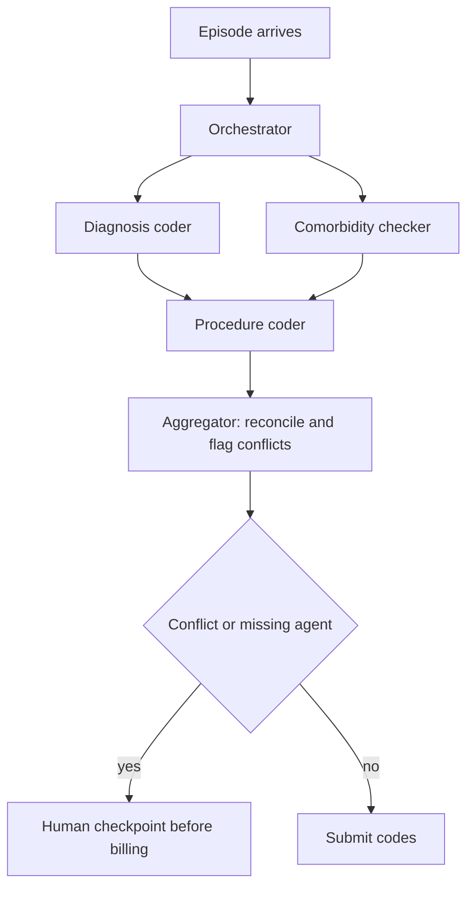
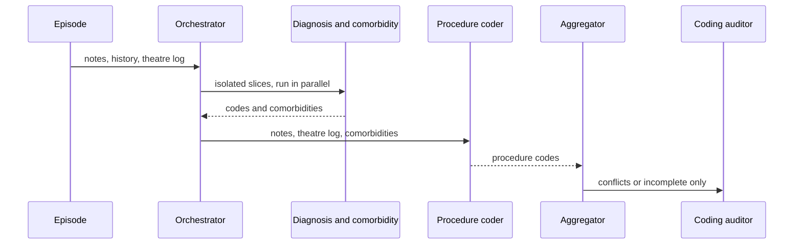

## What Problem Are We Solving?

A hospital group codes 18,000 inpatient episodes a month into ICD-10 and procedure codes for
reimbursement. The team builds four specialist agents: a diagnosis coder, a procedure coder, a
comorbidity checker, and a compliance reviewer. Each is good at its job in isolation.

In production the system produces codes that are individually defensible and jointly wrong. The
procedure coder assigns a code that the comorbidity checker's findings would have excluded, but
it never saw them. The compliance reviewer receives all four outputs plus every agent's full
working transcript — 40,000 tokens of reasoning — and its accuracy is *worse* than when it saw
only the final codes, because the signal is buried.

And when the comorbidity checker times out on a long episode, the orchestrator has no policy, so
it does what unspecified systems do: returns what it has. The episode is coded without
comorbidities, which understates severity and underbills by an average of £1,400.

None of those are agent failures. Every agent worked. What failed was the **wiring** — who talks
to whom, what each one is allowed to see, what happens when one doesn't answer, and how four
outputs become one. Those four decisions are the architecture; the agents are the easy part.

The signature of this domain is that a design review passes and production doesn't, because the
review looked at the boxes and the failures live in the arrows.

> **🗣️ In plain English:** In a multi-agent system the agents are rarely the problem. The joins are — what each one sees, what happens when one fails, and who reconciles the answers.

## Meet the Moving Parts

**Topology** decides where complexity lives.

| Topology | How it works | Strengths | Weaknesses |
|---|---|---|---|
| **Hub-and-spoke** | An orchestrator dispatches subtasks and collects results | Easy to reason about, central logging and checkpoints | Orchestrator is a bottleneck and a single point of failure |
| **Pipeline** | Fixed sequence, each agent consuming the previous output | Predictable, testable stage by stage | Rigid; hard to branch or loop back, slow if strictly serial |
| **Peer-to-peer** | Agents talk directly, no coordinator | Flexible, models genuine collaboration | Hardest to debug; loops and error propagation are hard to bound |

Four design decisions then sit on top, and each is a place production breaks.

- **Context isolation.** Every agent sees exactly what it needs. Handing everyone everything
  sounds safe and actively degrades quality — relevant signal gets buried, cost rises, and the
  compliance reviewer above got *worse*.
- **Error propagation.** Decide deliberately whether one agent's failure halts the system or is
  absorbed. "Any failure stops everything" is safe and brittle; silence is worse than both.
- **Result aggregation.** Something must reconcile four outputs, especially when they conflict.
  This is usually designed last and deserves to be designed first.
- **Human checkpoints.** Where a person must approve before the system proceeds — a first-class
  part of the topology, not an afterthought bolted on after an incident.

> **💡 Tip:** Draw the diagram, then label every arrow with what flows along it and what happens if nothing does. The unlabelled arrows are your incident list.

## How It Works, Step by Step

1. **Pick the topology from the coordination you need.** Independent specialists reporting to one
   place is hub-and-spoke; strictly ordered transformation is a pipeline; peer-to-peer needs a
   reason.
2. **Define each agent's input contract explicitly** — the fields it gets, not "the conversation
   so far".
3. **Cut the context to that contract.** A writing agent gets the research agent's *summary*, not
   its transcript.
4. **Identify cross-agent dependencies.** If agent B's correctness depends on A's findings, that's
   an ordering constraint, not an optional enrichment.
5. **Write the error policy per agent**: retry, skip, substitute a default, or escalate — and what
   the orchestrator emits in each case (5.3 of CCAR-F is the wire format).
6. **Design aggregation before the specialists.** Concatenation, a synthesiser agent, or rules —
   and what happens on conflict.
7. **Place human checkpoints at irreversible actions**, on the diagram.
8. **Test the joins, not the agents.** Kill one agent and assert on what the system emits.



## Minimal Working Implementation

Context isolation is the decision people get wrong, so make it visible. Save as `isolation.py` and
run it — no API key needed; it prints what each agent is actually allowed to see.

```python
import dataclasses

@dataclasses.dataclass(frozen=True)
class Contract:
    """What an agent receives. Anything not listed is not passed -
    'the conversation so far' is not a contract."""
    name: str
    needs: tuple[str, ...]
    produces: str
    depends_on: tuple[str, ...] = ()
CONTRACTS = (
    Contract("diagnosis", ("notes", "history"), "diagnosis_codes"),
    Contract("comorbidity", ("notes", "history"), "comorbidities"),
    Contract("procedure", ("notes", "theatre_log", "comorbidities"),
             "procedure_codes", depends_on=("comorbidity",)),
    Contract("compliance", ("diagnosis_codes", "procedure_codes",
                            "comorbidities"), "verdict",
             depends_on=("diagnosis", "procedure", "comorbidity")),
)

EPISODE = {"notes": "<8kB clinical notes>", "history": "<prior episodes>",
           "theatre_log": "<procedure log>", "transcripts": "<40kB>"}
def slice_for(contract: Contract, episode: dict, produced: dict) -> dict:
    available = {**episode, **produced}
    if missing := [k for k in contract.needs if k not in available]:
        raise KeyError(f"{contract.name} needs {missing} - ordering bug")
    return {k: available[k] for k in contract.needs}

def order(contracts: tuple[Contract, ...]) -> list[Contract]:
    done, out, remaining = set(), [], list(contracts)
    while remaining:
        ready = [c for c in remaining if set(c.depends_on) <= done]
        if not ready:
            raise ValueError("cycle in agent dependencies")
        for c in ready:
            out.append(c)
            done.add(c.name)
            remaining.remove(c)
    return out

produced: dict = {}
for contract in order(CONTRACTS):
    got = slice_for(contract, EPISODE, produced)
    produced[contract.produces] = f"<{contract.name} output>"
    print(f"{contract.name:12} sees {sorted(got)}")
```

Note what the compliance agent sees: three outputs, not `transcripts`. And note that `procedure`
running before `comorbidity` raises a `KeyError` rather than silently coding without it — the
dependency is enforced by the contract, not by the order someone happened to write the calls in.

## Production Implementation

Production adds the error policy and the aggregation the demo assumes away.

```python
import dataclasses

@dataclasses.dataclass(frozen=True)
class Policy:
    """Written per agent, deliberately. The default is the dangerous one."""
    on_failure: str          # retry | skip | default | escalate
    retries: int
    blocks_billing: bool     # may the episode proceed without this agent

POLICIES = {
    "diagnosis": Policy("escalate", 1, blocks_billing=True),
    "comorbidity": Policy("escalate", 2, blocks_billing=True),
    "procedure": Policy("escalate", 1, blocks_billing=True),
    "compliance": Policy("retry", 2, blocks_billing=True),
}

def resolve(name: str, error: str, attempt: int) -> str:
    policy = POLICIES[name]
    if attempt <= policy.retries:
        return "retry"
    return "escalate" if policy.blocks_billing else "skip"
```

Aggregation is a named step with a conflict rule, not a dict merge:

```python
def aggregate(results: dict[str, object], failed: set[str]) -> dict:
    """Missing is not empty. An episode coded without comorbidities is
    not an episode with no comorbidities."""
    blocking = {n for n in failed if POLICIES[n].blocks_billing}
    conflicts = []
    if "procedure_codes" in results and "comorbidities" in results:
        conflicts = cross_check(results["procedure_codes"],
                                results["comorbidities"])
    return {"codes": results,
            "incomplete": sorted(blocking),
            "conflicts": conflicts,
            "route": "human" if blocking or conflicts else "submit"}
    # ...
```

**What changed, and why:**

- **Every agent has a written failure policy.** The unspecified default — return what you have —
  is how an episode gets billed without comorbidities. Making `blocks_billing` explicit forces
  someone to decide per agent whether the output is optional.
- **Missing is distinguished from empty.** `incomplete` names the agents that didn't answer, so
  downstream can never read absence as a finding. This is the same distinction as CCAR-F 5.3,
  applied at the aggregation layer.
- **Aggregation cross-checks rather than merges.** The original bug — a procedure code the
  comorbidities exclude — is only catchable at the point where both are in hand.
- **The human checkpoint is a routing decision, not an exception.** Anything incomplete or
  conflicting routes to a person by rule, which is what makes the failure path predictable enough
  to staff.

## In Production: Clinical Coding at a Hospital Group

18,000 inpatient episodes a month across four sites, feeding reimbursement claims.



**Before.** Four agents, everything shared with everyone, no failure policy. Coding accuracy
against auditor review was 91.2%. Underbilling from silently-dropped comorbidities ran at an
estimated £61,000 a month. The compliance agent's context averaged 47,000 tokens.

**After.** Explicit contracts, an ordering constraint making comorbidities available to the
procedure coder, per-agent failure policies, and an aggregator that cross-checks. Accuracy went to
97.8%; the silent-drop underbilling went to nil, because an episode missing a blocking agent can't
reach submission. Compliance context fell to about 3,100 tokens — and its accuracy rose, which is
the counterintuitive result worth keeping.

**Where the accuracy actually came from.** Roughly two-thirds of the improvement was the ordering
fix — giving the procedure coder the comorbidities it needed — and only a third was context
isolation. That ordering was not a code change to any agent; it was noticing a dependency nobody
had written down.

**Cost.** Token spend fell 64%, almost entirely from not passing transcripts around. Four agents
at 47,000 tokens of shared context each is an expensive way to be less accurate.

> **🌍 Real-world example:** The result that convinced the clinical team was the compliance agent getting *better* with less input. It had been receiving every agent's full reasoning on the theory that more context means better judgment. On a sample of 400 episodes it had been agreeing with whichever agent reasoned at greatest length, rather than checking the codes — a failure invisible in any single-agent test, because the agent was working correctly on the input it was given. The input was the bug.

## Where This Applies — and Where It Doesn't

| Situation | Use this | Use instead |
|---|---|---|
| Independent specialists, central control | Hub-and-spoke | — |
| Strictly ordered transformation | Pipeline | — |
| One agent's correctness depends on another's findings | An explicit ordering constraint | Hoping shared context covers it |
| Agents drowning in each other's output | Per-agent input contracts | "Give everyone everything" |
| An agent may fail | A written per-agent policy | The unspecified default |
| Outputs can conflict | A named aggregation step with a conflict rule | A dict merge |
| Irreversible action at the end | Human checkpoint on the diagram | A checkpoint added after the incident |
| One agent could do the whole job | — | Multi-agent; the coordination is pure cost |

Anti-patterns: sharing full transcripts between agents; an aggregation step designed last;
undeclared cross-agent dependencies; no failure policy, so absence reads as a finding; and
peer-to-peer chosen for flexibility nobody needed.

## Failure Modes Seen in the Wild

### 1. The undeclared dependency

**Symptom.** Individually defensible outputs that are jointly wrong.
**Cause.** Agent B needed A's findings; nothing made that explicit, so ordering was incidental.
**Fix.** Declare dependencies in the contract and fail loudly when an input is missing.

### 2. Context generosity

**Symptom.** An agent's accuracy falls as you give it more.
**Cause.** Signal buried in other agents' reasoning.
**Fix.** Input contracts listing fields. Pass summaries, never transcripts.

### 3. The unwritten failure policy

**Symptom.** Output that is quietly incomplete, with no error anywhere.
**Cause.** Nobody decided what happens when one agent doesn't answer, so it returned what it had.
**Fix.** A per-agent policy including whether the agent's absence blocks the outcome.

### 4. Aggregation as an afterthought

**Symptom.** Conflicting outputs resolved by whichever key was written last.
**Cause.** Specialists designed carefully, reconciliation bolted on.
**Fix.** Design aggregation first; it's where the conflicts you can only see centrally are caught.

> **⚠️ Watch out:** Every one of these passes a review that looks at the agents. Each specialist is correct on its own input, so unit tests pass, demos pass, and the system fails in production on the joins. Test by killing an agent and asserting on what the system emits — if it emits a confident complete-looking answer, you have found the bug.

## Exam Lens & Key Takeaway

> **📝 Exam focus:** Two things are tested. First, **topology trade-offs**: hub-and-spoke is easy to reason about and log but the orchestrator is a bottleneck and single point of failure; pipelines are predictable and testable but rigid; peer-to-peer is flexible and hardest to debug and bound. Second, and more often, **spotting the missing design decision** — the stem describes a plausible architecture and the correct answer names what's absent. The four to check by name are **context isolation** (each agent gets only what it needs; giving everyone everything degrades quality as well as costing more), **error propagation** (a deliberate per-agent policy, not "halt everything" and not silence), **result aggregation** (something must reconcile conflicting outputs — the commonly-omitted one), and **human checkpoints before irreversible actions**. Read scenario questions for what is *absent* rather than what is present.

> **🔑 Key takeaway:** In multi-agent design the agents are the easy part and the wiring is the architecture. Give every agent an explicit input contract rather than the whole conversation, declare cross-agent dependencies so ordering isn't incidental, write a failure policy per agent so absence can never read as a finding, and design the aggregation step — with its conflict rule and its human checkpoint — before you design the specialists.
