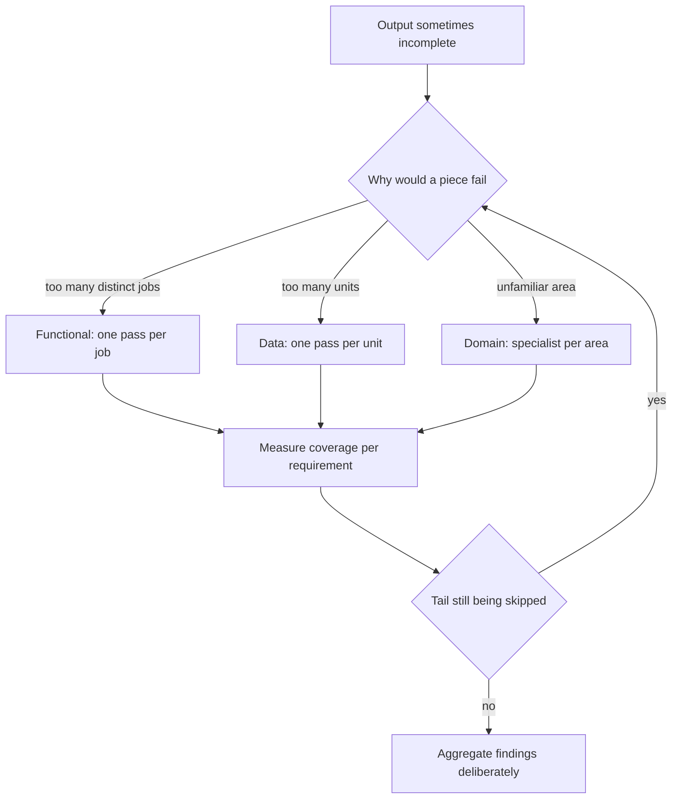
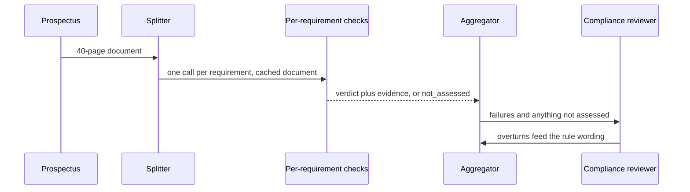

## What Problem Are We Solving?

An asset manager reviews fund prospectuses before distribution — 400 documents a quarter, each
checked against eleven regulatory requirements: fee disclosure placement, risk-warning wording,
performance-data caveats, benchmark consistency, and seven more.

The first system sends each prospectus to Claude with all eleven requirements in one prompt. It
finds problems. Compliance signs off. Six months later a spot audit shows requirements one through
four are checked reliably, requirements five through eight patchily, and nine through eleven
almost never — despite being in every prompt, every time.

The output never looked incomplete. It returned findings, formatted correctly, citing real clauses.
It simply stopped partway down a list nobody was counting.

The instinct is to blame the prompt and add emphasis: *check ALL eleven*. That moves the cliff and
doesn't remove it. The piece is too large — one call doing eleven distinct analyses, and
thoroughness degrades down a long list in a way that produces plausible partial output rather
than an error.

There's a subtler version of the same failure, and it catches experienced architects. The next
attempt split by *document* — one agent per prospectus, in parallel. That's a real decomposition
along a real axis, and it changed nothing, because the complexity was never in handling many
documents. It was in the eleven requirements inside each.

Decomposition is choosing the axis along which to cut, and the right axis is the one that matches
**where the complexity actually lives**, not the one that's easiest to draw.

> **🗣️ In plain English:** When output is quietly incomplete, the piece was too big. And splitting along the wrong axis — by document when the difficulty is per-requirement — feels like progress and fixes nothing.

## Meet the Moving Parts

| Technique | How it cuts | When it fits |
|---|---|---|
| **Functional** | By *what each part does* — extract, then validate, then summarise | Distinct phases or skill types that don't overlap |
| **Data** | By *the unit being processed* — one pass per document, record, chunk | The same operation repeated across independent units |
| **Domain** | By *business domain* — a legal agent, a finance agent, an HR agent | Different subject-matter or policy expertise per slice |

They compose, and real systems usually need at least two. The prospectus answer is data
decomposition (one pass per document) *combined with* functional decomposition (one pass per
requirement) — and it was the second axis that mattered.

Two failure shapes follow from getting this wrong.

**Pieces too large.** A single step still asked to do too much, so it silently drops requirements
or half-completes. This is the "missing output" failure, and its signature is that nothing errors.

**Cut along the wrong axis.** Splitting by data when the complexity is functional gives you many
copies of the same overloaded step. Splitting by function when the real driver is domain
expertise gives you a "writer" agent expected to know both legal and financial nuance it was
never given.

The diagnostic question is simple and rarely asked: *if this piece fails, what is the reason?*
If the answer is "it had too many different things to do", cut functionally. If it's "there were
too many of them", cut by data. If it's "it didn't know this area", cut by domain.

> **💡 Tip:** Count the distinct requirements in a single step. Past about four, assume the tail is being skimmed until you have measured otherwise — and measure per requirement, not per document.

## How It Works, Step by Step

1. **Enumerate the requirements** a single step is carrying. The count is usually a surprise.
2. **Ask where the complexity lives** — many units, many distinct operations, or many areas of
   expertise.
3. **Cut along that axis first**, then check whether a second axis is still needed.
4. **Measure coverage per requirement**, not per document. An aggregate pass rate hides a tail
   that is never checked (CCAR-F 5.5 is the same lesson).
5. **Give each piece one job and one output contract**, so partial completion is expressible
   rather than silent.
6. **Watch cost.** Eleven calls per document is eleven times the overhead — cache the shared
   prefix and batch where nothing is waiting.
7. **Recombine deliberately.** Per-requirement findings need an aggregation step (1.3), not a
   concatenation.



## Minimal Working Implementation

The measurement that settles the argument: coverage per requirement, monolithic versus split.
Save as `coverage.py` and run it.

```python
import anthropic

client = anthropic.Anthropic()
REQUIREMENTS = {
    "R1": "the annual fee is stated as a percentage",
    "R2": "a capital-at-risk warning appears",
    "R3": "past performance is described as no guarantee of future results",
    "R4": "the benchmark index is named",
    "R5": "the dealing cut-off time is stated",
    "R6": "the fund's currency is stated",
    "R7": "an ISIN is present",
}
DOC = """Growth Fund II. Annual management charge 0.85%. Benchmark: FTSE
All-Share. Dealing cut-off 12:00 UK time. ISIN GB00B0000001. Past
performance is not a guide to future returns."""

def ask(prompt: str) -> str:
    reply = client.messages.create(
        model="claude-opus-5", max_tokens=1500,
        messages=[{"role": "user", "content": prompt}])
    return next(b.text for b in reply.content if b.type == "text")

def monolithic() -> set[str]:
    listed = "\n".join(f"{k}: {v}" for k, v in REQUIREMENTS.items())
    out = ask(f"Check this prospectus against every requirement. For each, "
              f"reply on its own line as 'R#: PASS' or 'R#: FAIL'.\n\n"
              f"{listed}\n\nProspectus:\n{DOC}")
    return {line.split(":")[0].strip() for line in out.splitlines()
            if line.strip()[:2] in REQUIREMENTS}

def split() -> set[str]:
    covered = set()
    for key, text in REQUIREMENTS.items():
        out = ask(f"Does this prospectus satisfy: {text}? Reply PASS or "
                  f"FAIL only.\n\n{DOC}")
        if "PASS" in out.upper() or "FAIL" in out.upper():
            covered.add(key)
    return covered

mono, per_req = monolithic(), split()
print(f"monolithic covered {len(mono)}/{len(REQUIREMENTS)}: "
      f"{sorted(mono)}")
print(f"split covered      {len(per_req)}/{len(REQUIREMENTS)}: "
      f"{sorted(per_req)}")
```

With seven requirements and a short document the two often tie — which is the honest result, and
the reason the real system's cliff only appeared at eleven requirements against a 40-page
prospectus. Coverage is the metric; run it on your own list and length before deciding.

## Production Implementation

Production splits on the axis that matters and keeps per-requirement coverage as a standing
metric.

```python
import collections
import dataclasses

@dataclasses.dataclass(frozen=True)
class Check:
    requirement_id: str
    verdict: str            # pass | fail | not_assessed
    evidence: str | None

seen = collections.Counter()
assessed = collections.Counter()

def record(check: Check) -> None:
    """not_assessed is a first-class verdict. Without it, a requirement
    that was skipped is indistinguishable from one that passed."""
    seen[check.requirement_id] += 1
    if check.verdict != "not_assessed":
        assessed[check.requirement_id] += 1

def coverage_report(minimum: float = 0.99) -> list[str]:
    return [f"{rid}: assessed on {assessed[rid] / n:.1%} of documents"
            for rid, n in seen.items()
            if n >= 50 and assessed[rid] / n < minimum]
```

The shared document is cached so that per-requirement splitting doesn't multiply the bill:

```python
def check_one(doc: str, requirement: str) -> dict:
    """The prospectus is identical across all eleven calls - it is the
    cache prefix, and the requirement is the varying suffix."""
    return {
        "model": "claude-opus-5", "max_tokens": 700,
        "system": [{"type": "text", "text": REVIEW_RULES},
                   {"type": "text", "text": doc,
                    "cache_control": {"type": "ephemeral"}}],
        "messages": [{"role": "user",
                      "content": f"Assess only: {requirement}"}],
    }
    # ...
```

**What changed, and why:**

- **`not_assessed` exists as a verdict.** This is the whole fix. A requirement that was skipped now
  produces a distinguishable value instead of being absent, which is what made the original
  failure invisible for six months.
- **Coverage is tracked per requirement.** An aggregate "97% of documents reviewed" says nothing
  about R9 through R11. The per-requirement denominator is the only view that shows a tail.
- **The document is the cache prefix.** Eleven calls over the same 40-page prospectus would
  otherwise cost eleven times the input; cached, the marginal calls are cheap, which is what makes
  functional decomposition affordable at this granularity.
- **Each check returns evidence.** One requirement per call leaves room for a quotation, which is
  what a compliance reviewer actually needs and what the eleven-in-one version never had space
  for.

## In Production: Prospectus Review at an Asset Manager

400 prospectuses a quarter, eleven regulatory requirements each, a compliance team of six.



**The audit finding.** Requirements R1–R4 were assessed on 99% of documents, R5–R8 on 71%, and
R9–R11 on 12%. Nobody had a number like that before, because coverage had only ever been measured
per document — and by that measure the system reviewed 100% of prospectuses.

**After the split.** Every requirement is assessed on over 99% of documents. Detected breaches
rose from 3.1 per hundred prospectuses to 8.7 — not because the system got cleverer, but because
it started looking at the last three requirements at all. Two of those requirement classes carry
direct regulatory penalties.

**The wrong-axis interlude.** The intermediate version — one agent per document, in parallel —
cut wall-clock from about 40 minutes to under 3 for a quarterly batch, which felt like a
significant win and was one. It moved coverage on R9–R11 from 12% to 14%. Parallelism across
documents was a throughput fix applied to a thoroughness problem.

**Cost.** Eleven calls per document instead of one, with the prospectus cached: input tokens rose
about 2.2x rather than 11x, and total quarterly spend went from roughly £240 to £560. Against two
regulatory breach classes that had been going undetected, this was not a discussion.

> **🌍 Real-world example:** The clearest evidence that the axis mattered more than the effort came from the `not_assessed` verdict alone. Before any splitting, the team added it to the monolithic prompt's output contract — the model now had to say explicitly which requirements it hadn't reached. Coverage didn't improve, but it became *visible*: the model reported skipping R9–R11 on most documents. That one-line change turned a six-month silent failure into a dashboard, and it's what made the case for the rework.

## Where This Applies — and Where It Doesn't

| Situation | Use this | Use instead |
|---|---|---|
| Output quietly incomplete on long requirement lists | Functional decomposition | More emphasis in the prompt |
| Many independent units, same operation | Data decomposition | — |
| Different expertise or policy per slice | Domain decomposition | — |
| Many units *and* many operations | Combine data and functional axes | Either one alone |
| Throughput is the problem | Data decomposition, in parallel | — |
| Thoroughness is the problem | Functional decomposition | Parallelism across units |
| Three or four simple requirements | — | Decomposition overhead exceeds the gain |
| Requirements that genuinely interact | — | Splitting; assess them together |

Anti-patterns: adding emphasis instead of cutting the piece; splitting by data when the difficulty
is per-requirement; measuring coverage per document rather than per requirement; decomposing with
no aggregation step; and cutting so finely that requirements which depend on each other are
assessed in isolation.

## Failure Modes Seen in the Wild

### 1. The silent tail

**Symptom.** Later items in a requirement list are never addressed; nothing errors.
**Cause.** One step carrying too many distinct jobs; thoroughness degrades down the list.
**Fix.** Functional decomposition, plus a `not_assessed` verdict so skipping is expressible.

### 2. The wrong axis

**Symptom.** A real decomposition, correctly implemented, changes nothing.
**Cause.** Split by data when the complexity was functional — or the reverse.
**Fix.** Ask what would make a piece fail. Cut along that.

### 3. Coverage measured per unit

**Symptom.** Dashboards show full coverage; audits find untouched requirements.
**Cause.** The denominator was documents, not requirements.
**Fix.** Per-requirement coverage with its own denominator.

### 4. Over-cutting

**Symptom.** Individually correct findings that contradict each other.
**Cause.** Requirements that interact were assessed in isolation.
**Fix.** Keep interacting requirements in one piece, and add an aggregation pass (1.3).

> **⚠️ Watch out:** Decomposition failures never announce themselves. A piece that is too large returns well-formed, correctly-cited, confident output that simply stops partway down the list — so every test that checks "did we get findings?" passes. Only a per-item coverage metric with the right denominator sees it.

## Exam Lens & Key Takeaway

> **📝 Exam focus:** The stem describes output that is **"sometimes incomplete"** or **"occasionally misses requirements"** from an architecture that otherwise sounds reasonable — and decomposition is the intended answer, specifically **pieces that are still too large**, or **cut along the wrong axis for where the complexity lives**. Know the three techniques by name and fit: **functional** (split by what each part does — distinct phases), **data** (split by the unit processed — same operation over many records), **domain** (split by business area — different expertise). Expect a scenario where the correct answer **combines two axes**, most often data plus functional: one pass per document *and* a dedicated step per analysis, because per-document parallelism alone doesn't fix a per-requirement thoroughness problem. "Write a longer, more emphatic prompt" and "use a larger context window" are the standing distractors.

> **🔑 Key takeaway:** Decomposition is choosing the axis, and the right one matches where the complexity actually lives — many units means data, many distinct jobs means functional, many areas of expertise means domain. Pieces that are too large fail silently rather than loudly, so make "not assessed" an expressible verdict and measure coverage per requirement, not per document; splitting along a real but irrelevant axis feels like progress and fixes nothing.
