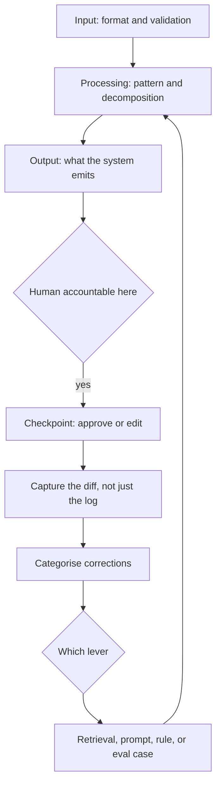
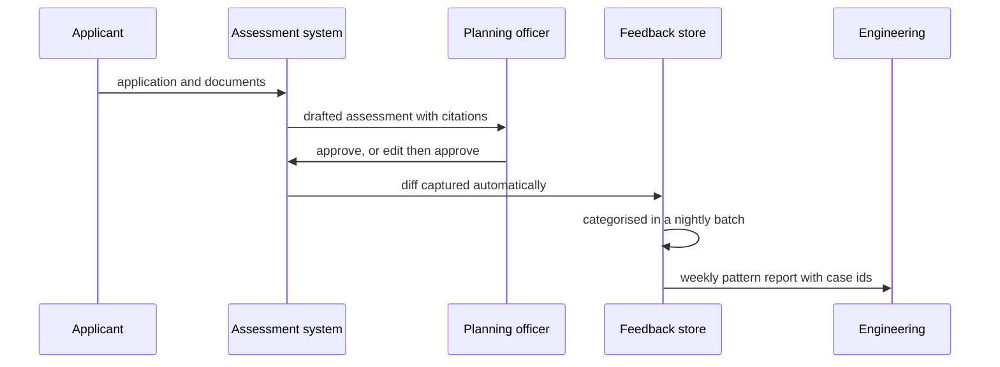

## What Problem Are We Solving?

A city council processes 2,800 planning applications a year. The architecture is genuinely good:
an augmented LLM retrieves the relevant policy, checks the application against it, and drafts an
officer's assessment with citations. Officers liked it from week one.

Eighteen months later it is making the same mistakes it made in month one.

Officers edit roughly 30% of drafts before signing, and the commonest edit is the same every
time: the system applies a city-wide frontage-setback policy inside a conservation area, where a
stricter one governs. An officer fixes it in thirty seconds and moves on. That correction is a
keystroke in a text box, and then it is gone — never captured, never categorised, never routed.

The processing stage is excellent. The input and output boundaries work. What was never built is
the **feedback loop**, so the architecture is a snapshot: correct as designed on day one, with no
mechanism to notice that reality contains a category the design didn't anticipate.

This is a failure of *scope*, not skill. The interesting part is the processing stage, so that's
where the effort goes; the input, output and feedback boundaries get drawn as arrows and left
implicit. Then production breaks there — or, worse, quietly stops improving.

A complete architecture is four stages, and the one that turns a project into a system is the one
most often missing.

> **🗣️ In plain English:** Draw the whole loop, not the clever middle. If nothing captures what humans change about the output, the system will still be making today's mistakes in a year.

## Meet the Moving Parts

| Stage | What it covers | The questions an architect must answer |
|---|---|---|
| **Input** | Where the request or data originates — user, upstream, batch | What format arrives? How is it validated? |
| **Processing** | Claude plus tools, retrieval, or multi-agent structure | Which pattern (1.2)? How is it decomposed (1.4)? |
| **Output** | The reply, document, API call or triggered process | Does a human review it before it takes effect? |
| **Feedback** | How outcomes are evaluated and fed back | How is quality measured? Where do corrections go? |

Three things about the fourth stage, because it's the one that gets skipped.

**A feedback loop is not logging.** Logging records what the system did; a feedback loop captures
what was *wrong* with it, in a form something can act on. The council logged every draft; none of
that told anyone about conservation areas.

**The signal is usually already being produced.** Officers corrected the system thirty times a
week. That information existed, was free, and evaporated because nothing caught it. Most feedback
loops are a capture problem, not a measurement problem.

**Closing the loop means naming what it changes.** A captured correction must route somewhere
specific — a retrieval fix, a prompt change, an eval case, a rule. A loop ending in a dashboard
nobody owns is the same snapshot with extra steps.

Thinking end to end also finds where **responsibility crosses a boundary** — where processing ends
and a human becomes accountable. That handover is where approval, audit and liability live, and
it's invisible if you design only the middle.

> **💡 Tip:** Ask "what does a human change about this, and where does that change go?" If the answer is "into the document", you have an output stage and no feedback stage.

## How It Works, Step by Step

1. **Name all four stages explicitly** before designing any of them. Naming is what stops the
   middle absorbing the whole effort.
2. **Define the input contract**: format, validation, and what happens to malformed input.
3. **Choose the processing pattern** from where the uncertainty lives (1.2), decomposed on the
   right axis (1.4).
4. **Define the output boundary**: what the system emits, whether it takes effect directly, and
   who is accountable once it does.
5. **Find the responsibility handover.** Mark it on the diagram — it's where the human checkpoint
   belongs.
6. **Capture the correction signal at the output stage.** Diff what the human approved against
   what the system produced.
7. **Categorise corrections** so patterns are visible; a raw edit log is not a feedback loop.
8. **Route each category to a specific change** — retrieval, prompt, rule, or eval case — with an
   owner.



## Minimal Working Implementation

The missing stage is usually missing on the diagram too, so check the design before you build it.
Save as `architecture_check.py` and run it — no API key needed.

```python
import json
import sys

STAGES = {
    "input": ("source", "format", "validation"),
    "processing": ("pattern", "decomposition"),
    "output": ("emits", "takes_effect", "accountable_party"),
    "feedback": ("captured_signal", "categorisation", "routes_to", "owner"),
}

def audit(design: dict) -> list[str]:
    gaps = []
    for stage, fields in STAGES.items():
        if stage not in design:
            gaps.append(f"{stage}: stage entirely absent from the design")
            continue
        for field in fields:
            if not design[stage].get(field):
                gaps.append(f"{stage}.{field}: not specified")
    fb = design.get("feedback", {})
    if fb.get("captured_signal") and not fb.get("routes_to"):
        gaps.append("feedback: signal is captured but routes nowhere - "
                    "a dashboard is not a feedback loop")
    out = design.get("output", {})
    immediate = out.get("takes_effect") == "immediately"
    if immediate and not out.get("accountable_party"):
        gaps.append("output: takes effect with no accountable party named")
    return gaps

if __name__ == "__main__":
    design = json.load(open(sys.argv[1], encoding="utf-8"))
    found = audit(design)
    print("\n".join(f"- {g}" for g in found) or "all four stages specified")
    sys.exit(1 if found else 0)
```

Point it at the council's original design document and it prints four lines, all of them under
`feedback`. That design passed a human architecture review, because reviewers read what is on the
page rather than checking for what isn't.

## Production Implementation

The feedback stage, built as a real component rather than a promise.

```python
import dataclasses
import difflib

@dataclasses.dataclass(frozen=True)
class Correction:
    case_id: str
    produced: str
    approved: str
    category: str | None      # assigned later, never by the editor
    officer: str

def captured(case_id: str, produced: str, approved: str,
             officer: str) -> Correction | None:
    """The signal is the diff. Asking the human to also fill in a reason
    is how capture rates collapse to near zero."""
    if produced.strip() == approved.strip():
        return None
    return Correction(case_id, produced, approved, None, officer)

def changed_spans(c: Correction) -> list[str]:
    diff = difflib.unified_diff(c.produced.split(), c.approved.split(),
                                lineterm="", n=0)
    return [line for line in diff if line.startswith(("+", "-"))
            and not line.startswith(("+++", "---"))]
```

Categorisation runs as a batch job, and each category names the lever it pulls:

```python
LEVERS = {
    "wrong_policy_applied": "retrieval: add the policy-area filter",
    "tone": "prompt: adjust the drafting instructions",
    "missing_condition": "rule: extend the conditions checklist",
    "factual_error": "eval: add as a regression case",
}

def weekly_review(corrections: list[Correction]) -> list[str]:
    counts: dict[str, int] = {}
    for c in corrections:
        counts[c.category] = counts.get(c.category, 0) + 1
    total = max(len(corrections), 1)
    return [f"{cat} {n / total:.0%} of edits -> {LEVERS.get(cat, 'triage')}"
            for cat, n in sorted(counts.items(), key=lambda kv: -kv[1])]
    # ...
```

**What changed, and why:**

- **The signal is the diff, captured automatically.** Asking an officer to classify their own edit
  adds friction to the one moment they're trying to finish a task; capture rates collapse. Take
  the diff, categorise it later, offline.
- **Categorisation is a separate batch step.** Nothing is waiting on it, which makes it a natural
  Batches API job at half the cost — and it keeps the officer's path fast.
- **Every category names its lever.** "Wrong policy applied → add the policy-area filter to
  retrieval" is actionable. A category with no lever is a statistic.
- **Corrections carry the case id.** A pattern is only convincing when you can pull the twelve
  cases behind it, which is also what turns a weekly review into a change rather than a
  discussion.

## In Production: Planning Permit Assessment at a City Council

2,800 applications a year, eleven planning officers, statutory determination deadlines.



**Before.** No feedback stage. 30% of drafts edited; the edit rate was flat across eighteen
months, which nobody noticed was itself the finding. Drafting time saved was real and the system
was well liked, so the absence of improvement never surfaced as a problem.

**After.** Diffs captured at approval, categorised nightly, reviewed weekly. In the first month
the top category was `wrong_policy_applied` at 41% of all edits, and 88% of those were
conservation areas. The lever was a retrieval filter on planning-area designation — about a day
of work, identified because the loop existed.

**Result.** The overall edit rate went from 30% to 17% within a quarter, and the conservation-area
error effectively disappeared. Two further categories surfaced in month three, both smaller, both
fixed. The edit rate is now a tracked metric with an expectation that it declines.

**The number that made the case internally.** Eighteen months of officers correcting the same
error, roughly thirty times a week, is about 2,000 corrections — each one a free, perfectly
labelled training signal about a real production gap, thrown away on the spot. The feedback stage
cost around three days to build.

> **🌍 Real-world example:** The first version asked officers to pick a reason from a dropdown when they edited. Capture rate was 9%, and the reasons that were recorded skewed heavily toward whichever option was first in the list. Replacing it with an automatic diff took capture to 100% and moved classification to a nightly batch job — the officer's workflow got *shorter*, not longer, which is the only version of this that survives contact with people under deadline pressure.

## Where This Applies — and Where It Doesn't

| Situation | Use this | Use instead |
|---|---|---|
| Designing any production system | Name all four stages explicitly | Designing the processing stage |
| Humans edit the output before it takes effect | Capture the diff automatically | Asking them to tag a reason |
| The system's quality is flat over time | Build the feedback stage | More processing-stage tuning |
| Output takes effect directly | Name the accountable party at the boundary | An implicit handover |
| Corrections are captured but nothing changes | Route each category to a named lever | A dashboard |
| A genuine one-off batch job | — | A feedback loop has nothing to improve |
| No human ever sees the output | — | Find another signal — outcomes, downstream rework |

Anti-patterns: designing the middle and drawing the boundaries as arrows; logging instead of
capturing corrections; adding friction to the human's path to collect metadata; categories with no
lever; and treating a flat error rate as stability rather than as the absence of learning.

## Failure Modes Seen in the Wild

### 1. The snapshot architecture

**Symptom.** Month-eighteen errors are month-one errors.
**Cause.** No feedback stage; corrections evaporate at the point of editing.
**Fix.** Capture the diff at approval, categorise offline, route each category to a lever.

### 2. Friction at the capture point

**Symptom.** A feedback mechanism exists and almost nobody uses it.
**Cause.** It asks the human for extra work at the moment they're trying to finish.
**Fix.** Capture automatically; classify later, away from the user's path.

### 3. The unowned dashboard

**Symptom.** Correction patterns are visible and nothing changes.
**Cause.** Categories don't map to a specific lever or an owner.
**Fix.** Name the lever per category; review weekly with the case ids attached.

### 4. The implicit handover

**Symptom.** After an incident, nobody can say who was accountable for the output.
**Cause.** The responsibility boundary was never marked on the diagram.
**Fix.** Mark where processing ends and a human becomes accountable; put the checkpoint there.

> **⚠️ Watch out:** A flat error rate over many months reads as stability and is usually the opposite — it's the signature of a system with no feedback stage, because a system that learns has a *declining* one. If your quality metric hasn't moved since launch, the question isn't whether the system is good; it's whether anything could have made it better.

## Exam Lens & Key Takeaway

> **📝 Exam focus:** When asked to evaluate or design a **"complete"** architecture, check all four stages by name: **input** (origin, format, validation), **processing** (pattern and decomposition), **output** (what it emits, and whether a human reviews it before it takes effect), and **feedback** (how quality is measured and how outcomes route back into refinement). Scenario stems frequently describe a system that is **well-designed on the processing side and silently missing the feedback loop** — that omission is the crux of the question, and it's the stage most often skipped in a first-pass design. Expect the correct answer to name the missing stage rather than improve the existing ones. The related point that also appears: without a feedback mechanism an architecture is a **snapshot** — fine on day one, with no way to notice or correct drift as usage reveals gaps the design didn't anticipate.

> **🔑 Key takeaway:** A complete architecture is input, processing, output and feedback — and the fourth is the one that turns a project into a system that improves. Capture what humans change about the output automatically, rather than asking them to explain it; categorise offline; route every category to a named lever with an owner. And mark where responsibility crosses from the system to a person, because that boundary is invisible if you only design the middle.
