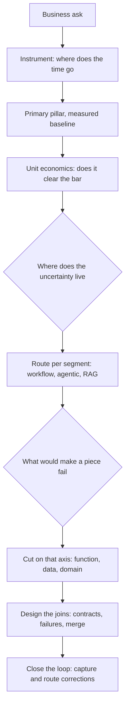
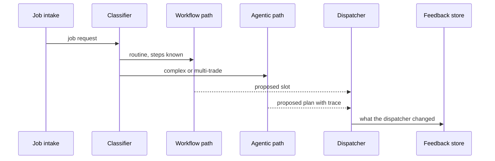

## What Problem Are We Solving?

This domain is the one where projects are won or lost, and the losses look like successes for
about six months.

Every other CCAR-P domain assumes a decision already made here. Integration (D3) assumes you know
what's being integrated; evaluation (D4) assumes you know what good looks like; governance (D5)
assumes you know what the system does. Get the architecture wrong and those domains are
well-executed work on the wrong thing.

The characteristic failure is not incompetence. It's an architecture that is *technically
excellent and pointed at the wrong problem* — the multi-agent review system built when the
bottleneck was triage, the agentic loop applied to traffic whose steps were always the same, the
eleven-requirement check that silently stopped at four, the well-designed pipeline that never
improves because nothing captures what humans fix.

Each of those passed a design review. Reviews look at what's on the page, and every one of these
failures is an *absence*: an unmeasured baseline, a missing router, an uncut requirement list, an
unbuilt feedback stage.

So the professional skill this domain tests isn't knowing patterns. It's a sequence of questions
asked in the right order — what outcome are we moving, where does the uncertainty live, along what
axis does this cut, how do the pieces join, and what closes the loop — with the discipline to
answer the first before reaching for the fourth.

> **🗣️ In plain English:** The hard part isn't picking an architecture, it's picking the right problem and then not over-building. Every failure here looks impressive right up until someone measures it.

## Meet the Moving Parts

| Question | Topic | The decision |
|---|---|---|
| What outcome are we actually moving? | **1.1** Business problems | Name one primary value pillar, falsifiably, from a measured baseline |
| How much autonomy does this need? | **1.2** Patterns | Workflow, agentic, or augmented LLM — decided by where uncertainty lives |
| How do we split it? | **1.4** Decomposition | Functional, data, or domain — matched to where complexity lives |
| How do the pieces join? | **1.3** Multi-agent design | Topology, context isolation, error policy, aggregation, checkpoints |
| Is the loop complete? | **1.5** End-to-end | Input, processing, output, and the feedback stage everyone skips |

Two things about how these relate.

**The order is not arbitrary.** 1.1 constrains 1.2 — an SLA pillar rules out unbounded agentic
loops before you've considered them. 1.2 and 1.4 are separate cuts at the same problem: 1.2 asks
who controls the *sequence*, 1.4 asks along what axis the *work* divides. 1.3 only applies once
1.4 has produced more than one piece. Teams that start at 1.3 — "we're building a multi-agent
system" — have skipped three decisions and will discover them as incidents.

**Simplicity is the domain's recurring correct answer.** The narrow workflow beats the agentic
system; the smallest thing that clears the ROI bar beats the impressive one; the single agent
beats the four that need coordinating. Autonomy, agents and sophistication are all costs, and the
exam is built around candidates who reach for them by default.

> **💡 Tip:** Before defending an architecture, say which of the five questions it answers and what the answer was. If you can't state the primary pillar in one falsifiable sentence, the design is downstream of a decision nobody made.

## How It Works, Step by Step

1. **Instrument before designing.** Volume, minutes per unit, loaded cost — measured, not
   recalled. Find which stage actually consumes the time (1.1).
2. **Name one primary pillar** as a claim with a baseline, target, date and owner.
3. **Run the unit economics.** Cost per unit against value per unit eliminates options before you
   evaluate any of them.
4. **Locate the uncertainty.** Known steps means workflow; a next step that depends on the last
   means agentic; an answer that already exists means retrieval (1.2).
5. **Segment the traffic and route.** Mixed easy and hard almost always wants a classifier over
   several patterns, not one pattern for everything.
6. **Choose the decomposition axis** from what would make a piece fail — too many jobs, too many
   units, or unfamiliar territory (1.4).
7. **Design the joins before the specialists** — input contracts, ordering constraints, failure
   policy, aggregation, human checkpoints (1.3).
8. **Complete the loop.** Define input and output boundaries, mark where accountability transfers,
   and build the feedback stage (1.5).



## Minimal Working Implementation

The domain's failures are absences, so the useful tool checks a design for what isn't there. Save
as `design_review.py` and run it against a design document — no API key needed.

```python
import json
import sys

def review(d: dict) -> list[str]:
    gaps = []
    pillar = d.get("pillar", {})
    if not pillar.get("metric"):
        gaps.append("1.1 no queryable success metric - the pillar is a "
                    "slogan, not a claim")
    if pillar.get("baseline_source") != "measured":
        gaps.append("1.1 baseline is estimated, not measured")

    seg = d.get("segments", [])
    patterns = {s.get("pattern") for s in seg}
    if len(seg) > 1 and len(patterns) == 1:
        gaps.append("1.2 several traffic segments, one pattern - the easy "
                    "majority is paying the hard minority's cost")
    for s in seg:
        if s.get("pattern") == "agentic" and not s.get("max_turns"):
            gaps.append(f"1.2 segment {s.get('name')}: agentic with no "
                        f"turn cap")

    steps = d.get("processing", {}).get("requirements_per_step")
    if isinstance(steps, int) and steps > 4:
        gaps.append(f"1.4 {steps} requirements in one step - expect a "
                    f"silent tail; cut functionally")

    agents = d.get("agents", [])
    if len(agents) > 1:
        for a in agents:
            if not a.get("input_contract"):
                gaps.append(f"1.3 agent {a.get('name')}: no input contract")
            if not a.get("on_failure"):
                gaps.append(f"1.3 agent {a.get('name')}: no failure policy")
        if not d.get("aggregation"):
            gaps.append("1.3 multiple agents, no aggregation step defined")

    if not d.get("feedback", {}).get("routes_to"):
        gaps.append("1.5 no feedback stage - this design is a snapshot")
    return gaps

if __name__ == "__main__":
    found = review(json.load(open(sys.argv[1], encoding="utf-8")))
    print("\n".join(f"- {g}" for g in found) or "no structural gaps found")
    sys.exit(1 if found else 0)
```

Every check corresponds to a failure that shipped. None of them inspect the processing stage,
which is the part design reviews already scrutinise.

## Production Implementation

In production the architecture's assumptions become measurements, and each one names the topic it
would send you back to.

```python
import collections
import dataclasses

@dataclasses.dataclass
class SegmentStats:
    calls: int = 0
    turns: int = 0
    pence: int = 0
    escalated: int = 0

stats: dict[str, SegmentStats] = collections.defaultdict(SegmentStats)

def observe(segment: str, turns: int, pence: int, escalated: bool) -> None:
    s = stats[segment]
    s.calls += 1
    s.turns += turns
    s.pence += pence
    s.escalated += int(escalated)
```

Each signal points at the decision that needs revisiting, not at a knob to turn:

```python
def architecture_signals(budget: dict[str, int]) -> list[str]:
    out = []
    for name, s in stats.items():
        if s.calls < 50:
            continue
        mean_turns = s.turns / s.calls
        if mean_turns and mean_turns < 2.2:
            out.append(f"{name}: {mean_turns:.1f} turns - enumerable; "
                       f"this segment is a workflow (1.2)")
        if s.pence / s.calls > budget.get(name, 10**9) * 1.5:
            out.append(f"{name}: over cost band - re-check the pillar "
                       f"economics (1.1)")
        if s.escalated / s.calls > 0.25:
            out.append(f"{name}: {s.escalated / s.calls:.0%} escalated - "
                       f"wrong pattern or wrong decomposition (1.2/1.4)")
    return out
    # ...
```

**What changed, and why:**

- **Turn variance is the pattern's maintenance signal.** A segment resolving in a consistent two
  turns is a workflow nobody has written yet. This is the only cheap way to notice that a pattern
  decision has gone stale.
- **Signals name the topic, not a fix.** "This segment is a workflow (1.2)" sends someone back to
  a decision. "Reduce max_turns" would be tuning around the symptom.
- **Cost is compared per segment against a band.** An aggregate cost line tells you spend is up; a
  per-segment band tells you which architectural assumption was wrong.
- **A high escalation rate is read as a design fault.** The instinct is to widen the automation
  criteria. The usual cause is a segment routed to the wrong pattern, or a piece cut too large.

## In Production: Rebuilding Dispatch at a Field Services Company

A field services company schedules 1,100 engineer visits a day — heating, electrical, plumbing —
and wanted "AI dispatch". The first attempt was a multi-agent scheduler. All five topics appear
in what replaced it.



**What instrumenting found (1.1).** Dispatchers spent 6.2 minutes per job, but 71% of jobs were
single-trade, single-visit, and took 40 seconds. The time was concentrated in the 12% needing
multi-trade coordination — averaging 21 minutes each. The primary pillar was efficiency on that
12%, not on the 71% the first design had optimised.

**Pattern and routing (1.2).** Routine jobs became a three-step workflow. Multi-trade
coordination — where the next action genuinely depends on which engineer's availability comes
back — became a bounded agentic path, capped at 10 turns. Policy questions from field engineers
became a RAG path.

**Decomposition (1.4).** The original scheduler had one step checking nine constraints — skills,
certifications, parts, travel, SLA, working time, customer windows, access, subcontractor
eligibility. Constraints seven through nine were applied on under a fifth of jobs. Splitting into
one check per constraint, with the job cached as prefix, took that to over 99%.

**The joins (1.3).** Parts availability must be known before an engineer is proposed. That
dependency had been implicit; making it an ordering constraint removed a class of scheduled visits
that arrived without parts.

**The loop (1.5).** Dispatcher overrides are diffed and categorised nightly. Override rate went
from 34% to 19% in a quarter, with the top category — access constraints on commercial premises —
fixed by a retrieval change.

**Net.** Dispatcher time per job fell from 6.2 minutes to 2.4; cost per job fell 76% against the
first multi-agent design, mostly from routing the 71% to a workflow.

> **🌍 Real-world example:** The first architecture wasn't bad engineering — the five agents worked, and it demoed well enough to get funded. It was aimed at the wrong 71% of the problem, and nothing in its design would have revealed that, because it had no per-segment measurement and no feedback stage. A week of instrumenting before any of it was built would have produced a different system.

## Where This Applies — and Where It Doesn't

| Situation | Use this | Use instead |
|---|---|---|
| Vague business ask | Instrument, then name the pillar (1.1) | Designing from the ask |
| Mixed easy and hard traffic | Classify and route per segment (1.2) | One pattern for everything |
| Output quietly incomplete | Cut on the right axis (1.4) | A longer, more emphatic prompt |
| Several agents in play | Contracts, failure policy, aggregation (1.3) | Shared context and hope |
| Quality flat since launch | Build the feedback stage (1.5) | More processing-stage tuning |
| A single well-understood task | — | Most of this; one prompt may be the architecture |
| Genuinely open-ended judgment work | — | A rigid workflow; it breaks on first deviation |

Anti-patterns across the domain: starting at the topology; choosing a pattern before the
economics; estimating the baseline; one pattern for mixed traffic; measuring coverage per document
rather than per requirement; and treating a flat error rate as stability.

## Failure Modes Seen in the Wild

### 1. The impressive system aimed at the wrong stage

**Symptom.** It works; adoption doesn't follow.
**Cause.** The ask described a feeling and nobody measured where the time went (1.1).
**Fix.** Instrument by stage first. A week of measurement redirects entire projects.

### 2. One pattern for all traffic

**Symptom.** Routine cases cost and behave like hard ones.
**Cause.** Built for the hardest minority, applied to everything (1.2).
**Fix.** Classify and route; measure turns per segment.

### 3. The silent tail

**Symptom.** Later requirements are never assessed; nothing errors.
**Cause.** A piece carrying too many distinct jobs (1.4).
**Fix.** Cut functionally; make "not assessed" an expressible verdict.

### 4. The snapshot

**Symptom.** Month-eighteen errors are month-one errors.
**Cause.** No feedback stage; corrections evaporate (1.5).
**Fix.** Capture the diff automatically, categorise offline, route each category to a lever.

> **⚠️ Watch out:** Every failure in this domain survives a design review, because reviews examine what is written down and these failures are absences — an unmeasured baseline, a missing router, an undeclared dependency, an unbuilt feedback stage. Review a design by asking which of the five questions it does *not* answer.

## Exam Lens & Key Takeaway

> **📝 Exam focus:** 17% of the exam, ~11 questions, almost all scenario-based, and they rarely have a single technically-correct answer in isolation — they test whether your choice fits the **stated** business constraints of cost, latency, team size and risk tolerance. Read the constraints first. The five recurring items: classify the scenario against the **five value pillars** before evaluating technical options; match phrasing to **pattern** ("steps are always the same" → workflow, "depends what it finds" → agentic, "accurately from our documents" → augmented LLM), preferring the simplest that satisfies the requirement; name the **decomposition axis** (functional, data, domain) when output is "sometimes incomplete", and expect an answer combining two axes; spot the **missing multi-agent design decision** — context isolation, error propagation, aggregation, human checkpoints; and check a "complete" architecture for all four stages, where the **missing feedback loop** is usually the crux. The over-engineered answer is wrong far more often than the under-engineered one.

> **🔑 Key takeaway:** Architecture is a sequence of questions in order — what outcome are we moving, where does the uncertainty live, along what axis does the work cut, how do the pieces join, and what closes the loop. Answer them in that order, from measurements rather than assumptions, and choose the smallest design that clears the bar; every failure this domain punishes is an absence that a design review will not catch, so review for what a design doesn't say.
