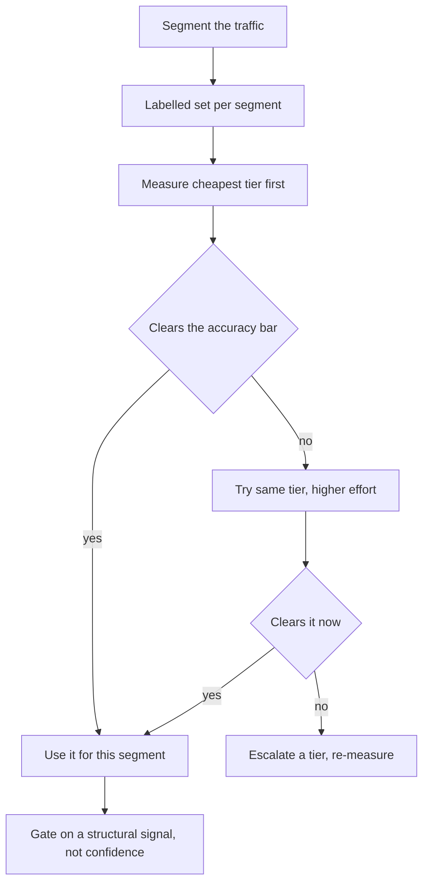
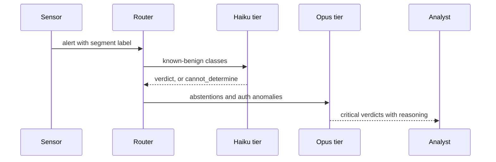

## What Problem Are We Solving?

A managed security provider triages 240,000 alerts a day across its customers. The first
production system sent every alert to the largest model available, on the reasoning that security
is high-stakes and you don't economise on high-stakes.

The bill was $71,000 a month, and about 94% of it was spent confirming that a known-benign
scanner IP had done the same benign thing it does every hour. Meanwhile the alerts that genuinely
needed judgment — a credential used from two countries in nine minutes — got exactly the same
treatment as the noise, and analysts waited behind a queue clogged with it.

The reflex fix is to downgrade everything to a cheaper model. That trades one uniform policy for
another and reintroduces the original fear: the hard 6% now gets a model that is measurably worse
at them.

Model selection at the architect level is not picking a model. It's designing a **routing policy**
— which tier handles which class of request, on what signal, with what happens when the cheap tier
is wrong. And the dimensions that policy trades off are not just "fast versus smart": latency,
cost per token, reasoning depth and context capacity move somewhat independently, and one of them
usually dominates for any given segment.

There's also a lever most teams reach for last and should reach for first. Effort on a current
model often beats a model downgrade outright, and unlike a downgrade it doesn't split your cache.

> **🗣️ In plain English:** Don't pick a model, design a routing policy. And before dropping a tier, try the same model at lower effort — it's usually cheaper than you expect and keeps everything else intact.

## Meet the Moving Parts

| Dimension | What moves | Where it dominates |
|---|---|---|
| **Latency** | Time to first token and total generation | Synchronous, user-facing flows — chat, voice, autocomplete |
| **Cost per token** | Input and output rates | High volume; compounds into the largest line item |
| **Reasoning depth** | Reliability on ambiguity and multi-step logic | Judgment calls, high-stakes decisions |
| **Context capacity** | How much fits in one call | Long documents, large codebases, long history |

Current tiers, as the numbers an architect actually plans against:

| Model | Input $/MTok | Output $/MTok | Context |
|---|---:|---:|---:|
| `claude-opus-5` | 5.00 | 25.00 | 1M |
| `claude-sonnet-5` | 2.00 | 10.00 | 1M |
| `claude-haiku-4-5` | 1.00 | 5.00 | 200K |

Three things this table doesn't say.

**Context capacity doesn't track price.** Haiku 4.5 is the cheapest and has a 200K window against
1M on the others. A long-document task can be forced onto a more expensive tier by capacity alone,
regardless of how easy the reasoning is.

**Effort is a lever inside one model.** `output_config: {"effort": ...}` takes `low`, `medium`,
`high` (the default), `xhigh` and `max`, and it trades thoroughness against token spend without
changing models. Lower effort on a current model often matches a prior generation at high effort.

**Caches are model-scoped.** A cascade forfeits cache reuse across its tiers — the cheap model and
the expensive one keep separate entries for the same prefix. That cost is invisible until you
measure it, and it is the reason a cascade sometimes loses to one model at lower effort.

> **💡 Tip:** Measure the one-model-lower-effort option before building a cascade. It's a config change rather than an architecture, and it keeps one cache namespace.

## How It Works, Step by Step

1. **Segment the traffic** by the judgment it actually needs, not by how important it sounds.
2. **Build a labelled set per segment** — a few hundred requests with known-correct answers.
3. **Measure each tier on each segment**: accuracy, latency, cost per request. Cheapest first.
4. **Try lower effort on the current model** before dropping a tier, and compare like for like.
5. **Check capacity separately.** A segment whose inputs exceed 200K cannot use Haiku, whatever
   its reasoning profile.
6. **Choose the cheapest tier that clears the accuracy bar** per segment — not per application.
7. **Design the escalation gate on a structural signal**, not on self-reported confidence: a
   rules layer, an explicit "cannot determine" output, or a disagreement check.
8. **Account for the split cache** when costing a cascade, and re-measure after any prompt change.



## Minimal Working Implementation

Selection is an empirical question, so measure it. Save as `tiers.py` and run it — it prints
accuracy, latency and cost per tier on the same inputs.

```python
import time
import anthropic

client = anthropic.Anthropic()
PRICES = {"claude-haiku-4-5": (1.00, 5.00),
          "claude-sonnet-5": (2.00, 10.00),
          "claude-opus-5": (5.00, 25.00)}
SYSTEM = ("Classify the security alert as benign, suspicious or critical. "
          "Reply with one word only.")
ALERTS = [
    ("Scanner 10.0.0.9 probed port 443, known internal scanner.", "benign"),
    ("User jsmith authenticated from Dublin 09:02 and Lagos 09:11.",
     "critical"),
    ("Failed login x3 for svc-backup then success from same host.",
     "suspicious"),
]

def measure(model: str) -> tuple[int, float, float]:
    correct, ms, cost = 0, 0.0, 0.0
    for text, expected in ALERTS:
        start = time.perf_counter()
        reply = client.messages.create(
            model=model, max_tokens=16, system=SYSTEM,
            messages=[{"role": "user", "content": text}])
        ms += (time.perf_counter() - start) * 1000
        out = next(b.text for b in reply.content if b.type == "text")
        correct += expected in out.lower()
        rate_in, rate_out = PRICES[model]
        cost += (reply.usage.input_tokens / 1e6 * rate_in
                 + reply.usage.output_tokens / 1e6 * rate_out)
    return correct, ms / len(ALERTS), cost / len(ALERTS)

for model in PRICES:
    hits, mean_ms, mean_cost = measure(model)
    print(f"{model:20} {hits}/{len(ALERTS)} correct  "
          f"{mean_ms:6.0f}ms  ${mean_cost * 1000:.4f}/1k calls")
```

Three alerts is a demonstration; the decision needs a few hundred per segment. But the *shape* is
the point — you are looking for the cheapest row that clears your accuracy bar on **that
segment**, and a tier that ties on accuracy while costing a fifth is not a compromise.

## Production Implementation

Production routes per segment and gates escalation on something structural.

```python
import dataclasses

@dataclasses.dataclass(frozen=True)
class Tier:
    model: str
    effort: str | None       # None = default (high)
    max_input_tokens: int

ROUTING = {
    "known_scanner": Tier("claude-haiku-4-5", None, 200_000),
    "auth_anomaly": Tier("claude-opus-5", "high", 1_000_000),
    "malware_report": Tier("claude-sonnet-5", "medium", 1_000_000),
    "unclassified": Tier("claude-opus-5", "high", 1_000_000),
}

def request_for(segment: str, prompt_tokens: int) -> dict:
    tier = ROUTING.get(segment, ROUTING["unclassified"])
    if prompt_tokens > tier.max_input_tokens:
        tier = ROUTING["unclassified"]      # capacity, not reasoning
    body = {"model": tier.model, "max_tokens": 1000}
    if tier.effort:
        body["output_config"] = {"effort": tier.effort}
    return body
```

The escalation gate uses an explicit abstention, never a confidence number:

```python
TRIAGE_TOOL = {
    "name": "triage", "strict": True,
    "description": "Classify the alert. Use 'cannot_determine' when the "
                   "evidence does not support a confident verdict.",
    "input_schema": {
        "type": "object",
        "properties": {"verdict": {"type": "string", "enum": [
            "benign", "suspicious", "critical", "cannot_determine"]}},
        "required": ["verdict"], "additionalProperties": False},
}

def should_escalate(verdict: str, segment: str) -> bool:
    """Structural, not self-assessed: an explicit abstention, or a
    segment policy that never trusts the cheap tier."""
    return verdict == "cannot_determine" or segment == "auth_anomaly"
    # ...
```

**What changed, and why:**

- **Effort is part of the tier, not a separate knob.** Recording `medium` alongside the model
  makes the real configuration reviewable — two segments on the same model at different efforts
  are genuinely different tiers and should cost differently.
- **Capacity overrides routing.** A long input pushes a segment up a tier for a reason that has
  nothing to do with reasoning. Encoding that explicitly stops a mysterious 400 in production.
- **Escalation gates on an explicit `cannot_determine`, not a confidence score.** A self-reported
  number is poorly calibrated and is most inflated exactly where the model is weakest — the same
  failure CCAR-F 5.2 and 5.5 cover. An enum member the model must choose is a structural signal.
- **The cascade's split cache is costed.** Two tiers on the same prefix keep separate cache
  entries, so a cascade's saving is smaller than the price table suggests (2.4).

## In Production: Alert Triage at a Managed Security Provider

240,000 alerts a day across 190 customers, 14 analysts on rotation, a contractual 15-minute
acknowledgement SLA on critical alerts.



**Before.** One model for everything, at default effort. $71,000 a month, mean latency 4.1s, and
an analyst queue that backed up during scanner storms because everything shared one throughput
budget.

**The measurement.** Per-segment evaluation on 400 labelled alerts each. On `known_scanner` —
62% of volume — Haiku 4.5 scored 99.1% against Opus 5's 99.4%, at a fifth of the price and 380ms
against 4.1s. On `auth_anomaly` — 3% of volume, and the segment that matters — Haiku scored 71%
against 96%. That gap is the entire argument for routing rather than a uniform choice in either
direction.

**After.** Segment routing plus abstention-gated escalation. Spend fell to $11,400 a month, an
84% reduction, with `auth_anomaly` accuracy unchanged because that segment never leaves Opus.
Mean latency on the benign majority dropped to about 400ms, which cleared the queue that had been
causing SLA risk on the alerts that mattered.

**The result that surprised them.** Before building the cascade they tested Opus 5 at `low` effort
across all segments as a control. It came in at $19,000 a month with 98.9% on `known_scanner` and
94% on `auth_anomaly` — worse than the cascade on cost and on the critical segment, but better
than the original on both, from a one-line config change and with no routing infrastructure to
maintain. It ran in production for six weeks while the cascade was built, and it is what the team
now recommends as the first move on any new customer.

> **🌍 Real-world example:** The split cache cost more than expected. The 3,400-token system prompt cached well under one model; across two tiers it produced two sets of cache writes, and cache-read savings fell from an estimated 71% to 58% of input spend. It didn't change the decision — the cascade still won — but the original business case had been about 9% optimistic, entirely because caches are scoped per model and nobody had accounted for it.

## Where This Applies — and Where It Doesn't

| Situation | Use this | Use instead |
|---|---|---|
| High volume, low complexity | Smallest tier that clears the bar, plus caching | The largest model "to be safe" |
| Latency-sensitive, user-facing | Smaller/faster tier | Deep reasoning on the synchronous path |
| Complex multi-step reasoning, high stakes | Larger tier, and don't gate it on cost | Downgrading and hoping |
| Cost is too high on a mixed workload | Segment and route | One uniform downgrade |
| Before building a cascade | Same model at lower effort | Assuming a tier drop is the only lever |
| Inputs over 200K tokens | A 1M-context tier, on capacity alone | Haiku, whatever the reasoning profile |
| Only one traffic segment exists | — | Routing; there's nothing to route |
| You want to gate escalation on confidence | — | An explicit abstention or a rules layer |

Anti-patterns: defaulting to the largest model for safety; downgrading uniformly to cut cost;
choosing a tier from a benchmark rather than your own labelled segment; gating escalation on
self-reported confidence; and costing a cascade without accounting for its split cache.

## Failure Modes Seen in the Wild

### 1. Uniform policy in either direction

**Symptom.** Either the bill is dominated by trivial requests, or hard cases quietly degrade.
**Cause.** One model chosen for the whole application.
**Fix.** Segment, measure per segment, pick the cheapest tier that clears each bar.

### 2. The cascade nobody needed

**Symptom.** Routing infrastructure whose saving is smaller than projected.
**Cause.** Lower effort on one model was never tested, and the split cache wasn't costed.
**Fix.** Benchmark the one-model-lower-effort control first; include cache effects in the case.

### 3. Escalation gated on confidence

**Symptom.** The requests that most needed the bigger model didn't escalate.
**Cause.** Self-reported confidence is highest where a model is coherently wrong.
**Fix.** An explicit `cannot_determine`, a rules layer, or a segment policy.

### 4. Capacity discovered in production

**Symptom.** Intermittent failures on a segment that usually works.
**Cause.** A tier was chosen on reasoning profile; occasional inputs exceed its window.
**Fix.** Check input size against the tier's capacity and route up on that basis explicitly.

> **⚠️ Watch out:** Don't default to the largest model "to be safe". On simple, high-volume tasks an oversized model inflates cost and latency without improving quality — and the latency inflation is the part that hurts, because it fills the same throughput budget your genuinely hard requests are queued behind.

## Exam Lens & Key Takeaway

> **📝 Exam focus:** Scenario stems carry a signal phrase and you map it to a tier. **"Latency-sensitive"** or **"real-time"** → a smaller, faster model. **"Complex multi-step reasoning"**, **"nuanced judgment"** or **"high-stakes decision"** → a larger model. **"High volume, low complexity"** → the smallest viable model, ideally **combined with prompt caching**. Know the **cascade pattern** as the architect-level answer to mixed traffic: a cheap model does a first pass, a confidence or rules check decides sufficiency, and failures escalate to a larger model — serving the easy majority cheaply while reserving the expensive tier for the minority that needs it. And expect at least one question where the correct answer is that **a smaller model is the right choice, not a compromise** — defaulting to the largest model "to be safe" is the domain's standing distractor, because it inflates cost and latency without improving quality.

> **🔑 Key takeaway:** Model selection is a routing policy, not a pick — segment the traffic, measure each tier on a labelled set per segment, and choose the cheapest that clears each bar. Latency, cost, reasoning depth and context capacity move independently, so a long input can force a tier for reasons unrelated to difficulty. Before building a cascade, test the same model at lower effort: it is a config change rather than an architecture, and it keeps one cache namespace instead of splitting it.
