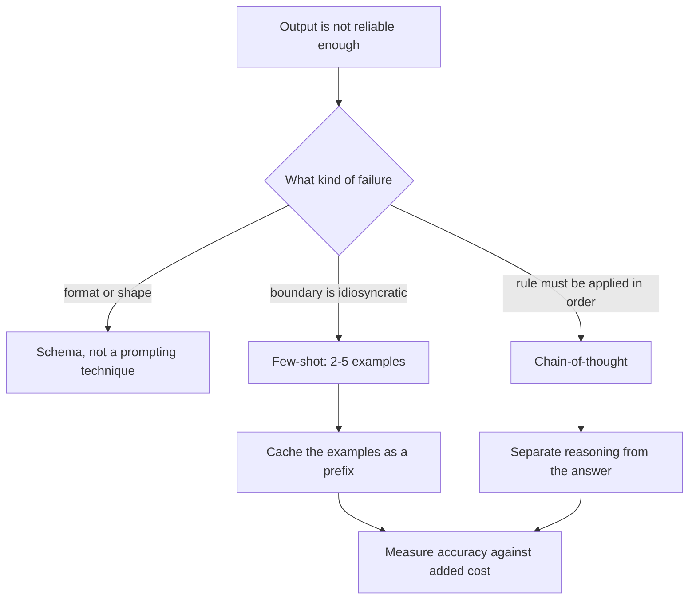
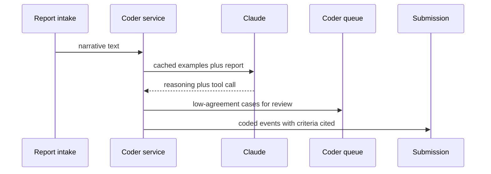

## What Problem Are We Solving?

A pharmacovigilance team codes adverse event reports into MedDRA terms — 3,000 reports a week,
each needing a preferred term, a seriousness assessment, and a causality judgment against the
suspect drug.

The first prompt described all three tasks and asked for JSON. Preferred-term accuracy came in at
81%, which sounds workable until you see the shape of the errors: they clustered on reports where
the reporter's words don't map cleanly to the dictionary ("felt like my heart was doing
somersaults"), and on the seriousness call, where the regulatory definition of *serious* is a
specific list of six criteria that has nothing to do with how bad it sounds.

The team's response was to write more instructions. The prompt reached 1,400 words and accuracy
moved to 83%.

The problem is that three different failures were being treated with one remedy. Term mapping
fails because the correspondence is idiosyncratic and hard to state in prose — that's what
examples are for. Seriousness fails because a six-criterion checklist has to be *applied*, step
by step, rather than judged holistically — that's what step-by-step reasoning is for. And the
JSON shape was never the problem at all.

Choosing a technique is diagnosis. Zero-shot, few-shot and chain-of-thought aren't a ladder of
sophistication you climb; they're answers to different questions, and each carries a different
cost in tokens and latency that an architect has to justify.

> **🗣️ In plain English:** More instructions is not a technique. Show examples when the rule is hard to state; ask for step-by-step reasoning when the rule has to be applied in order; do neither when the task is already clear.

## Meet the Moving Parts

| Technique | What it is | Best when | Cost |
|---|---|---|---|
| **Zero-shot** | Task description only, no examples | Simple, common, well-defined tasks | Cheapest and fastest |
| **Few-shot** | Task plus 2–5 worked examples | Ambiguous "correct", specific formats, known edge cases | Input tokens, cacheable |
| **Chain-of-thought** | Reason step by step before answering | Multi-step logic, maths, multi-condition rules | Output tokens — the expensive kind |

They compose. A robust production prompt often carries few-shot examples *and* an instruction to
reason step by step, then emit only the final structured answer.

Three things matter more than the definitions.

**The two costs are not equivalent.** Few-shot spends input tokens, which cache (2.4) and are
cheap on reads. Chain-of-thought spends *output* tokens, which are priced 5x input, never cache,
and directly extend latency. A few-shot prompt that adds 900 input tokens once and caches is
nearly free at volume; CoT that adds 400 output tokens costs on every call, forever.

**Few-shot examples act as a specification.** Showing beats telling for format, tone and boundary
cases — which also means a badly chosen example teaches the error, consistently. The examples are
the operative part of the prompt, not decoration.

**Chain-of-thought buys an audit trail as well as accuracy.** For a regulated task, the visible
reasoning is often the point: a coder can see *which* of the six seriousness criteria fired.

> **💡 Tip:** If you're on your third round of adding clarifying sentences, stop. Rephrasing an ambiguous rule doesn't disambiguate it — an example does, and a checklist applied in order does.

## How It Works, Step by Step

1. **Name the failure.** Wrong format, inconsistent boundary, or a rule not being applied in
   order — three different diagnoses.
2. **Start zero-shot.** It's the baseline and sometimes it's sufficient; anything else must beat
   it on a labelled set.
3. **Ambiguous boundary or idiosyncratic mapping → few-shot.** Two to five examples spanning the
   awkward cases, in a fixed format.
4. **Multi-step or multi-condition rule → chain-of-thought.** Have it enumerate the criteria and
   check each, then answer.
5. **Combine where the task needs both**, and keep the reasoning separate from the answer so
   downstream code parses one thing.
6. **Cache the examples.** They're a stable prefix — an identical opening every request shares —
   so put them in the system block behind a breakpoint, the marker that says everything before it
   can be reused.
7. **Measure the added cost honestly** — input tokens for few-shot, output tokens and latency for
   CoT — against the accuracy it bought.
8. **Cap the reasoning.** Unbounded step-by-step on a synchronous path is a latency incident
   waiting to happen.



## Minimal Working Implementation

Three techniques, one task, and the cost of each made visible. Save as `techniques.py` and run it.

```python
import anthropic

client = anthropic.Anthropic()
REPORT = ("Patient reported her heart was doing somersaults for 20 minutes "
          "after the second dose. She drove herself to A&E and was kept in "
          "overnight for observation.")

ZERO = "Give the MedDRA preferred term and whether the event is serious."

FEW = """Report: felt my chest flutter and skip after dosing.
Term: Palpitations | Serious: no

Report: woke with the room spinning, could not stand, admitted overnight.
Term: Vertigo | Serious: yes

Report: mild itching at the injection site, settled in an hour.
Term: Injection site pruritus | Serious: no

"""

COT = """Work through this in order, then answer.
1. Quote the reporter's own words describing the event.
2. Map them to a MedDRA preferred term.
3. Check each seriousness criterion in turn: death, life-threatening,
   hospitalisation or prolongation, persistent disability, congenital
   anomaly, other medically important event.
4. State which criteria are met.
Finish with a line: Term: <term> | Serious: <yes/no>"""

for label, prompt in (("zero-shot", f"{ZERO}\n\nReport: {REPORT}"),
                      ("few-shot", f"{ZERO}\n\n{FEW}Report: {REPORT}\nTerm:"),
                      ("chain-of-thought", f"{COT}\n\nReport: {REPORT}")):
    reply = client.messages.create(
        model="claude-opus-5", max_tokens=1200,
        messages=[{"role": "user", "content": prompt}])
    text = next(b.text for b in reply.content if b.type == "text")
    u = reply.usage
    print(f"{label:16} in={u.input_tokens:>4} out={u.output_tokens:>4}  "
          f"{text.strip().splitlines()[-1][:52]}")
```

Watch which column moves. Few-shot grows `in`; chain-of-thought grows `out`. At scale those are
very different bills — and the CoT run is the only one that can show you *why* it called the event
serious, which for a regulated submission is not an optional nicety.

## Production Implementation

Production picks the technique per task shape, caches what it can, and keeps reasoning out of the
parsed answer.

```python
import dataclasses

@dataclasses.dataclass(frozen=True)
class TaskProfile:
    name: str
    technique: str           # zero | few | cot | few+cot
    examples_version: str | None
    max_reasoning_tokens: int

PROFILES = {
    "term_mapping": TaskProfile("term_mapping", "few", "v4", 0),
    "seriousness": TaskProfile("seriousness", "cot", None, 600),
    "causality": TaskProfile("causality", "few+cot", "v2", 800),
    "dedupe_check": TaskProfile("dedupe_check", "zero", None, 0),
}

SYSTEM_BASE = "You are a pharmacovigilance coding assistant."

def build_system(profile: TaskProfile, examples: str | None) -> list[dict]:
    """Examples are identical across every report - they belong in a
    cached system block, not re-sent per request as user content."""
    blocks = [{"type": "text", "text": SYSTEM_BASE}]
    if examples:
        blocks.append({"type": "text", "text": examples,
                       "cache_control": {"type": "ephemeral"}})
    return blocks
```

The reasoning is produced but not parsed, so a format change upstream can't break the pipeline:

```python
ANSWER_TOOL = {
    "name": "record_coding", "strict": True,
    "description": "Record the final coding after reasoning is complete.",
    "input_schema": {
        "type": "object",
        "properties": {
            "preferred_term": {"type": "string"},
            "serious": {"type": "boolean"},
            "criteria_met": {"type": "array",
                             "items": {"type": "string"}},
        },
        "required": ["preferred_term", "serious", "criteria_met"],
        "additionalProperties": False},
}
# Reasoning goes in text blocks; the answer arrives as a tool call, so
# downstream code never regex-parses prose.
    # ...
```

**What changed, and why:**

- **Technique is per task, not per application.** `dedupe_check` stays zero-shot because nothing
  about it is ambiguous. Applying the most sophisticated technique everywhere is the same
  over-engineering failure as picking the largest model everywhere (2.1).
- **Examples live in a cached system block.** They are byte-identical across 3,000 reports a week,
  so paying full input price for them on every call is pure waste — and versioning them (`v4`)
  matters because the examples *are* the specification (CCAR-F 4.2).
- **Reasoning and answer are separated.** The chain-of-thought lands in text blocks for the
  auditor; the parsed result arrives as a `tool_use` call. Regex-parsing a "Term: X | Serious: Y"
  line out of prose is a pipeline that breaks the first time the model adds a preamble.
- **Reasoning has a token ceiling.** Step-by-step on an unbounded budget is how a synchronous path
  acquires a p99 latency — the time 99% of requests come in under, the slow tail — that nobody
  planned for.

## In Production: Adverse Event Coding at a Pharmacovigilance Team

3,000 reports a week, regulatory submission deadlines, and an audit trail requirement on every
seriousness determination.



**Before.** One 1,400-word prompt covering all three tasks. Preferred-term accuracy 83%,
seriousness accuracy 88%, and no visible reasoning — so every seriousness determination had to be
re-derived by a human for the audit file.

**After, task by task.** Term mapping moved to five few-shot examples chosen from the cases coders
argued about most: accuracy 83% → 94%. Seriousness moved to an explicit six-criterion walk:
88% → 97%, and the criteria list now goes straight into the audit file. Causality took both.
Deduplication stayed zero-shot, because it was already at 99%.

**The cost split is the architect's point.** Few-shot added about 1,100 input tokens per call —
cached, that's roughly 110 tokens' worth on a read, or about $0.0006 per report. Chain-of-thought
added 520 output tokens per call, at $25/MTok, or about $0.013 per report — over twenty times
more, and it extended p50 latency from 1.9s to 5.4s. Both were worth it here. Only one of them
would have been worth it on a synchronous path.

**What the audit trail was actually worth.** Coders had been spending about four minutes per
serious case reconstructing why it qualified. With the criteria list emitted directly, that
dropped to under a minute — roughly 90 hours a quarter, which exceeded the entire additional API
cost of chain-of-thought by an order of magnitude.

> **🌍 Real-world example:** The five few-shot examples were drawn from the team's own disagreement log — cases where two coders had assigned different terms. That selection rule mattered more than the count: an earlier attempt with eight examples picked for being "clear illustrations" moved accuracy by two points, while five contested ones moved it by eleven. Examples earn their tokens by covering the boundary, not by being representative.

## Where This Applies — and Where It Doesn't

| Situation | Use this | Use instead |
|---|---|---|
| Simple, common, well-defined task | Zero-shot | Examples that buy nothing |
| "Correct" is idiosyncratic or hard to state | Few-shot, 2–5 boundary cases | More prose instructions |
| Specific output format or house style | Few-shot | A paragraph describing the format |
| Multi-step logic, maths, multi-condition rules | Chain-of-thought | A direct-answer prompt |
| A decision that must be auditable | Chain-of-thought — the trail is the point | Reconstructing it afterwards |
| Latency-sensitive synchronous path | Few-shot, cached | Chain-of-thought's output tokens |
| The output *shape* is what's unreliable | — | A schema (CCAR-F 4.3), not a technique |
| You've added three rounds of clarifying prose | — | An example or a checklist |

Anti-patterns: adding instructions as a substitute for examples; chain-of-thought on a
latency-critical path; examples chosen for clarity rather than for covering the boundary;
re-sending examples as uncached user content; and parsing the final answer out of the reasoning
prose.

## Failure Modes Seen in the Wild

### 1. The growing prompt

**Symptom.** Instructions accumulate; accuracy moves a point or two per round.
**Cause.** Prose is being used where a demonstration or an ordered checklist is needed.
**Fix.** Diagnose the failure shape, then pick the matching technique.

### 2. Chain-of-thought on the hot path

**Symptom.** p99 latency doubles; cost per call rises sharply.
**Cause.** Reasoning is output tokens — 5x input price, uncacheable, serialised into latency.
**Fix.** Reserve CoT for asynchronous or high-value paths; cap the reasoning budget.

### 3. Examples that teach the wrong thing

**Symptom.** A consistent, confident error that matches an example exactly.
**Cause.** A hand-written example was subtly wrong, or all examples sat on one side of the
boundary.
**Fix.** Draw examples from real disagreement cases; version and review them like code.

### 4. Parsing the reasoning

**Symptom.** The pipeline breaks after a prompt tweak, with no code change.
**Cause.** The answer was regex-extracted from prose that was free to change shape.
**Fix.** Reasoning in text, answer in a `tool_use` call.

> **⚠️ Watch out:** Few-shot and chain-of-thought look similarly "expensive" on a prompt diff and are not. Few-shot spends input tokens that cache at roughly a tenth of their price; chain-of-thought spends output tokens at five times input price, on every single call, and adds latency that no caching strategy can recover. Cost the two separately before choosing.

## Exam Lens & Key Takeaway

> **📝 Exam focus:** Match the task shape to the technique. **Zero-shot** for simple, well-defined, common tasks — cheapest and fastest. **Few-shot (2–5 examples)** when the definition of correct is ambiguous or hard to describe, when you need a specific output format or house style, or when there are known edge cases the model gets wrong — showing beats telling. **Chain-of-thought** for genuinely multi-step problems: maths, multi-condition logic, planning — forcing intermediate steps measurably improves accuracy *and* yields an auditable trail. Know that they **combine** — a production prompt often carries few-shot examples plus a step-by-step instruction, then emits only the final structured answer. The architect-level point the exam rewards is justifying the choice against cost and latency: **chain-of-thought adds output tokens**, so it's the wrong reflex on a latency-sensitive path.

> **🔑 Key takeaway:** These three are answers to different diagnoses, not a ladder of sophistication. Show examples when the rule is idiosyncratic; ask for ordered reasoning when a multi-condition rule has to be applied step by step; stay zero-shot when neither is true. And cost them differently — few-shot buys accuracy with cacheable input tokens, while chain-of-thought buys it with output tokens at five times the price, on every call, plus latency.
