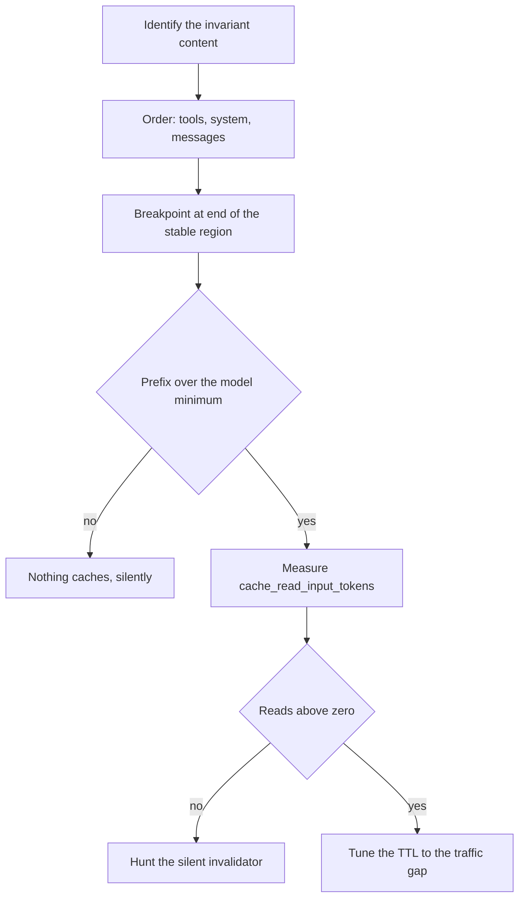
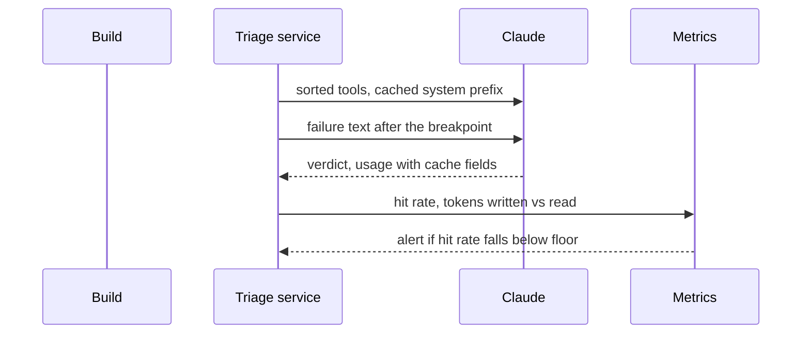

## What Problem Are We Solving?

Every time you call Claude, it reads your prompt from the beginning and you pay for every token it
reads. Send the same long instruction sheet with each request and you pay for that sheet every
single time.

**Prompt caching** lets Claude reuse the work it already did on the *start* of your prompt. The
start is called the **prefix**, and the catch is in that word: caching is a prefix match, so it
only helps while the beginning of the prompt is identical, byte for byte, to last time.

Here is what that is worth. A CI platform triages failing test runs for its customers: 90,000
failures a day, each sent to Claude with a 7,200-token prefix — triage instructions, the tool
schemas, and a house guide to common flake signatures — followed by the 300-token failure itself.

96% of every request is byte-identical to the last one. Without caching, all of it is reprocessed
from scratch, every time. That's 648 million input tokens a day paid at full rate for content
that hasn't changed since the previous call, and it lands in latency too, because more tokens to
process means longer before the first output token appears.

So the team adds `cache_control` and waits for the bill to fall. It doesn't. `cache_read_input_tokens`
comes back zero on almost every request.

Three separate reasons, each invisible:

The triage instructions began with `Generated at {timestamp}`. One byte of variation at position
zero invalidates everything after it.

The tool list was built per customer, and tools render *before* system and messages — so even
identical instructions never shared a prefix across customers.

And on one of their model tiers the prefix was under the minimum cacheable length, so the marker
was accepted and silently did nothing.

Caching is not a flag you enable. The architecture either produces a stable prefix or it doesn't.

> **🗣️ In plain English:** Caching reuses the work done on the start of your prompt. One changing byte near the front throws all of it away — and nothing errors when that happens.

## Meet the Moving Parts

**The one invariant:** caching is a prefix match, and any change anywhere in the prefix
invalidates everything after it. A **breakpoint** is the marker you place to say "everything
before this point is cacheable". Render order is `tools` → `system` → `messages`, so a breakpoint
on the last system block caches the tools *and* the system prompt together.

| Mechanic | Value |
|---|---|
| Marker | `"cache_control": {"type": "ephemeral"}`, or with `"ttl": "1h"` |
| Breakpoints | Max **4** per request |
| Write cost | **1.25x** base input at 5-minute TTL; **2x** at 1-hour |
| Read cost | **~0.1x** base input |
| Break-even | **2 requests** at 5-minute TTL; **3** at 1-hour |
| Verification | `usage.cache_read_input_tokens` — zero means it isn't working |

**TTL** is time to live: how long a cache entry survives before it expires and the next request has
to pay to write it again.

The minimum cacheable prefix is model-dependent and, importantly, **not monotonic across
generations**:

| Model | Minimum prefix |
|---|---:|
| `claude-opus-5` | 512 tokens |
| `claude-sonnet-5` | 1,024 tokens |
| `claude-haiku-4-5` | 4,096 tokens |

A 3,000-token prefix caches on Opus 5 and Sonnet 5 and silently will not on Haiku 4.5. There is no
error — just `cache_creation_input_tokens: 0`.

Two consequences architects miss. **A cache read refreshes the entry's timer for free**, and the
lifetime runs from the *start* of the request, so generation time counts against it. And **caches
are scoped per model and per workspace** — a cascade (2.1) or traffic split across workspaces
keeps separate entries for the same prefix.

> **💡 Tip:** Choose the TTL from the start-to-start gap between requests sharing the prefix: under five minutes, the default refreshes itself indefinitely and the 1-hour TTL only buys you a doubled write price.

## How It Works, Step by Step

1. **Identify what's genuinely invariant** across requests — instructions, tool schemas, reference
   documents, few-shot examples.
2. **Put it first**, in render order: stable tools, then stable system blocks.
3. **Put everything volatile last** — the current question, retrieved context, per-request IDs.
4. **Place the breakpoint** at the end of the stable region; the last system block covers tools
   and system together.
5. **Check the prefix clears the model's minimum.** 512 on Opus 5, 4,096 on Haiku 4.5.
6. **Choose the TTL from the traffic gap**, not from optimism.
7. **Verify with `cache_read_input_tokens`.** Zero across repeated identical-prefix requests means
   a silent invalidator.
8. **Grep for invalidators** in anything feeding the prefix: timestamps, UUIDs, unsorted
   `json.dumps`, per-user tool lists, conditional system sections.



## Minimal Working Implementation

Caching is verifiable, so verify it. Save as `caching.py` and run it — three requests, the third
deliberately sabotaged by a timestamp.

```python
import datetime
import anthropic

client = anthropic.Anthropic()
GUIDE = ("You triage failing CI test runs. " + "Flake signature reference. "
         * 400)          # comfortably over the 512-token Opus 5 minimum

def triage(failure: str, prefix: str) -> tuple[int, int, int]:
    reply = client.messages.create(
        model="claude-opus-5", max_tokens=200,
        system=[{"type": "text", "text": prefix,
                 "cache_control": {"type": "ephemeral"}}],
        messages=[{"role": "user", "content": failure}])
    u = reply.usage
    return (u.input_tokens, u.cache_creation_input_tokens,
            u.cache_read_input_tokens)

FAILURES = ["test_checkout_timeout failed: Connection reset",
            "test_login_flaky failed: element not found after 3s"]

print(f"{'request':32} {'uncached':>9} {'written':>9} {'read':>9}")
for i, failure in enumerate(FAILURES, 1):
    fresh, written, read = triage(failure, GUIDE)
    print(f"{'stable prefix, call ' + str(i):32} "
          f"{fresh:>9} {written:>9} {read:>9}")

stamped = f"Generated at {datetime.datetime.now().isoformat()}\n{GUIDE}"
fresh, written, read = triage(FAILURES[0], stamped)
print(f"{'timestamped prefix':32} {fresh:>9} {written:>9} {read:>9}")
```

Call one writes the cache; call two reads it, and its `read` column is the whole prefix. The
timestamped call writes a brand-new entry and reads nothing — the same content, one byte
different at position zero, and the saving is gone with no error to tell you.

## Production Implementation

Production makes the prefix stable by construction and alerts when it stops being.

```python
import json

STABLE_TOOLS = [...]        # sorted, identical for every customer

def render_tools(tools: list[dict]) -> list[dict]:
    """Tools render at position 0. A per-customer tool list means no
    prefix is ever shared - sort, and keep the set global."""
    return sorted(tools, key=lambda t: t["name"])

def build(system_text: str, customer_id: str, failure: dict) -> dict:
    return {
        "model": "claude-opus-5", "max_tokens": 1000,
        "tools": render_tools(STABLE_TOOLS),
        "system": [{"type": "text", "text": system_text,
                    "cache_control": {"type": "ephemeral"}}],
        # Everything varying lives after the breakpoint, in messages.
        "messages": [{"role": "user", "content": json.dumps(
            {"customer": customer_id, "failure": failure},
            sort_keys=True)}],
    }
```

Hit rate is monitored, because a silent invalidator produces no other symptom:

```python
import collections

window = collections.deque(maxlen=500)

def observe(usage) -> None:
    cached = usage.cache_read_input_tokens
    window.append(cached / max(cached + usage.input_tokens, 1))

def cache_alert(floor: float = 0.80) -> str | None:
    if len(window) < 200:
        return None
    rate = sum(window) / len(window)
    if rate < floor:
        return (f"cache hit rate {rate:.0%} - check for a timestamp, a "
                f"per-user id in the prefix, an unsorted dump, or a "
                f"prefix under the model minimum")
    return None
    # ...
```

**What changed, and why:**

- **Tools are sorted and global.** They render before everything else, so a per-customer tool list
  guarantees zero cross-customer sharing — the most expensive kind of invalidator because it's the
  earliest.
- **`json.dumps(..., sort_keys=True)`.** Non-deterministic serialisation produces different bytes
  for identical data. Sets and unsorted dicts are the usual culprits.
- **The customer ID is in the message, not the system block.** Per-user prefixes mean no sharing
  at all; the identifier belongs after the breakpoint.
- **Hit rate is alerted on.** Caching failing is indistinguishable from caching working, apart
  from the bill. A hit-rate floor is the only thing that catches a regression introduced by an
  unrelated change.

## In Production: Failure Triage at a CI Platform

90,000 test failures a day across 1,400 customer repositories, triaged synchronously so a
developer sees the verdict on the build page.



**Before caching worked.** 7,200-token prefix, 90,000 calls a day, $5/MTok input: about $3,240 a
day, or $97,000 a month, on input alone. p50 latency 3.8s.

**After the three invalidators were fixed.** Hit rate 94%. Cached reads at roughly a tenth of base
price took input spend to about $11,400 a month — an 88% reduction. p50 latency fell to 1.4s,
because the cached prefix doesn't need reprocessing before generation starts.

**Finding them took longer than fixing them.** The timestamp was found by diffing two rendered
prompts byte-for-byte, which is the technique that actually works. The per-customer tool list took
longer, because the team had reasoned about the system prompt and not realised tools render first.
The Haiku minimum was the last: a secondary classification path on `claude-haiku-4-5` with a
2,900-token prefix, under the 4,096 minimum, caching nothing and reporting no error. Moving that
path to `claude-sonnet-5` — a 1,024 minimum — made it cache immediately.

**The TTL decision.** Traffic is continuous during working hours, with requests sharing the prefix
starting seconds apart, so the default 5-minute TTL refreshes itself indefinitely and is strictly
cheaper. The 1-hour TTL was trialled and cost more: double the write price, with no additional
hits, because nothing was ever gapped by more than five minutes. Overnight the prefix goes cold,
which is correct — there's no traffic to serve.

> **🌍 Real-world example:** The most instructive detail is that the original caching work was reported as "done" and shipped. `cache_control` was in the request, code review passed, and nothing failed. Nobody looked at `cache_read_input_tokens` for five weeks, during which the platform paid full price for content it believed it was caching. Caching is the one optimisation whose complete failure is indistinguishable from success without checking the usage fields.

## Where This Applies — and Where It Doesn't

| Situation | Use this | Use instead |
|---|---|---|
| Large static system prompt across many calls | Cache it; put volatile content last | — |
| Long-running agent loop repeating tools and system | Cache the prefix — biggest single win | — |
| RAG reusing one large reference document | Cache the document, vary the query after it | — |
| High-volume batch with shared instructions | Cache; it composes with Batches | — |
| Requests sharing a prefix gapped 5–60 minutes | 1-hour TTL | The default, which will expire |
| Continuous traffic, gaps under 5 minutes | Default TTL — reads refresh it free | 1-hour TTL and a doubled write |
| Prefix below the model's minimum | Lengthen it, or use a lower-minimum model | The marker, which does nothing |
| Prompt genuinely differs from the first token | — | Caching; there's no shared prefix |

Anti-patterns: a timestamp, UUID or session ID anywhere in the prefix; per-user tool lists;
`json.dumps` without `sort_keys`; conditional system sections that fragment the prefix into
variants; shipping caching without checking `cache_read_input_tokens`; and assuming a marker works
regardless of prefix length.

## Failure Modes Seen in the Wild

### 1. The timestamp at position zero

**Symptom.** `cache_read_input_tokens` is zero; everything looks correctly configured.
**Cause.** One varying byte near the front invalidates the whole prefix.
**Fix.** Diff two rendered prompts byte-for-byte. Move the dynamic piece after the breakpoint.

### 2. Tools rendered per user

**Symptom.** Caching works within a session and never across users.
**Cause.** Tools render at position 0, before system — a varying tool list poisons everything.
**Fix.** A global, sorted tool set; per-user variation goes in messages.

### 3. Under the minimum

**Symptom.** One path never caches while others do, with no error.
**Cause.** Its prefix is below that model's minimum — 4,096 on Haiku 4.5, 512 on Opus 5.
**Fix.** Check the minimum for the model on that path; lengthen the prefix or change tier.

### 4. Shipped and never verified

**Symptom.** Months of full-price bills for a feature believed to be live.
**Cause.** `cache_control` present, hit rate never measured.
**Fix.** Alert on a hit-rate floor; treat zero reads as a production incident.

> **⚠️ Watch out:** Every failure here is silent. A broken cache returns correct answers at full price with no error, no warning and no log line — the only evidence is `cache_read_input_tokens` sitting at zero and an invoice nobody has questioned. Make the hit rate a monitored metric before you make caching a design assumption.

## Exam Lens & Key Takeaway

> **📝 Exam focus:** One of the most frequently tested concrete techniques in the domain, and the rule to know cold is **static content first, dynamic content last**. Caching matches a **shared prefix** that is byte-for-byte identical to a previous call, so anything varying placed earlier breaks the prefix and everything after it loses cache eligibility — interleaving dynamic content is the standing wrong answer. Know the three workloads it's tested against: **long-running agentic loops** repeating the same system prompt and tool schemas every turn, **RAG pipelines** reusing one large reference document across many queries, and **high-volume batch jobs** applying the same instructions to many inputs. Expect the caveat that "static" means **byte-for-byte static** — a timestamp or injected value in that block invalidates everything after it. It pairs with 2.1 and with 2.6, where caching a static system prompt is the single largest cost lever.

> **🔑 Key takeaway:** Caching is a prefix match, not a feature flag: render order is tools, then system, then messages, so put everything invariant first, the breakpoint at the end of it, and everything that varies after. Check the prefix clears the model's minimum — 512 tokens on Opus 5 but 4,096 on Haiku 4.5, and silent below it — pick the TTL from the gap between requests rather than optimism, and monitor `cache_read_input_tokens`, because a completely broken cache is indistinguishable from a working one except on the invoice.
