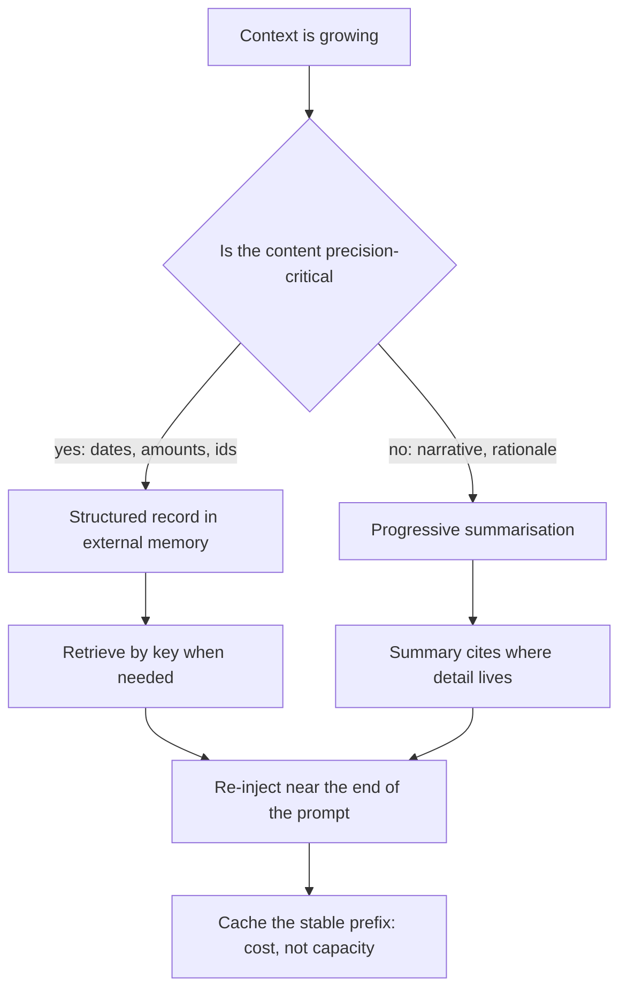
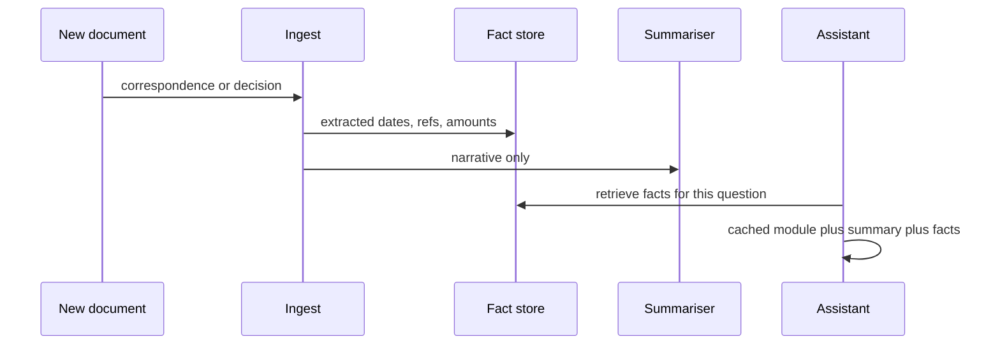

## What Problem Are We Solving?

An immigration law firm runs an assistant across live cases. A case is open for eighteen months on
average: 200-plus documents, client correspondence, Home Office decisions, tribunal directions,
and a running conversation with the caseworker handling it.

The first version kept the whole case transcript in context and relied on a large window. That
worked until a case crossed roughly 400,000 tokens, at which point two things happened at once.
Cost per turn became untenable — every question re-sent the entire case history. And accuracy
dropped on exactly the questions that mattered: details from month three sat in the geometric
middle of the prompt, where recall is weakest.

So the team added progressive summarisation, which is where the real incident came from. A
caseworker asked which date the Home Office had set for further submissions. The assistant gave a
date that was two weeks off. It had come from a summary written four months earlier that said
"a deadline was set in late March" — the exact date had been compressed away, and the model, asked
for a date, produced a plausible one.

The failure isn't summarisation. It's summarisation applied to content whose *precision* was the
point. Context management is a set of four strategies with different loss profiles, and the
architect's job is matching the strategy to what must survive.

> **🗣️ In plain English:** You can't keep everything in the window, so you choose what to lose. Summarising loses exact wording and numbers — which is fine for narrative and catastrophic for a deadline.

## Meet the Moving Parts

| Strategy | How it works | Trade-off |
|---|---|---|
| **Progressive summarisation** | Replace older turns with a condensed summary | Loses exact wording, figures, dates |
| **External memory** | Store detail in a store, retrieve what's relevant | Retrieval latency, and retrieving the wrong thing |
| **Modular prompts / Skills** | Load only the instruction sections this task needs | Requires upfront organisation and tagging |
| **Prompt caching** | Keep a static prefix constant across calls | Content must be byte-for-byte static |

They are not alternatives; mature systems combine them. But two distinctions decide which does
what.

**Summarisation is the lossiest and the easiest, which is a dangerous combination.** It's the
first thing teams reach for because it needs no infrastructure. It is the strategy most likely to
have silently dropped the exact figure a later turn depends on — and the dropped detail doesn't
error, it gets replaced by a plausible substitute.

**Caching doesn't shrink the window.** It changes the *economics* of what you're willing to keep
resident, not the token count. A 7,000-token reference block still occupies 7,000 tokens of the
window whether or not it's cached — caching just means you're not paying full price to re-send
it. Treating caching as a capacity strategy is a category error the exam probes.

Two API-level tools sit alongside these. **Context editing** (`clear_tool_uses_20250919`) *clears*
old tool results; **compaction** (`compact_20260112`) summarises history server-side near a
trigger threshold. Clearing and summarising have different loss profiles — the same distinction,
one level down.

> **💡 Tip:** Before summarising anything, ask what in it is precision-critical — dates, amounts, reference numbers, names. Those belong in external memory or a structured record, not in prose a summariser will smooth over.

## How It Works, Step by Step

1. **Classify the content.** Narrative and rationale tolerate compression; identifiers, dates and
   amounts do not.
2. **Extract precision-critical facts into structured records** as they appear, while the detail
   is still in front of the model.
3. **Put those records in external memory**, retrievable by key, not compressed into prose.
4. **Summarise only the narrative**, and make the summary cite where the detail lives rather than
   trying to carry it.
5. **Modularise the instructions** so a task loads only the sections it needs.
6. **Cache the stable prefix** — it changes cost, not capacity (2.4).
7. **Re-inject retrieved detail near the end** of the prompt, where recall is strongest.
8. **Test recall of old specifics deliberately.** Ask for a figure from month three and check it
   against the source.



## Minimal Working Implementation

The four strategies have measurably different footprints. Save as `strategies.py` and run it — it
prints the token cost of one long case under each.

```python
import anthropic

client = anthropic.Anthropic()
MODEL = "claude-opus-5"
TURNS = [f"Turn {i}: correspondence about case CX-{i:03d}, decision "
         f"reference HO/{4000 + i}, deadline 2026-03-{(i % 27) + 1:02d}."
         for i in range(1, 121)]
QUESTION = "What is the deadline on decision reference HO/4007?"

def tokens(system: str, messages: list[dict]) -> int:
    return client.messages.count_tokens(
        model=MODEL, system=system, messages=messages).input_tokens

FULL = [{"role": "user", "content": "\n".join(TURNS + [QUESTION])}]

summary = ("Earlier correspondence covered 120 case updates with "
           "decisions and deadlines set across March 2026.")
SUMMARISED = [{"role": "user", "content": f"{summary}\n\n{QUESTION}"}]

facts = {t.split("reference ")[1].split(",")[0]: t.split("deadline ")[1]
         for t in TURNS}
retrieved = f"HO/4007 deadline {facts['HO/4007']}"
EXTERNAL = [{"role": "user",
             "content": f"{summary}\n\nRetrieved: {retrieved}\n\n"
                        f"{QUESTION}"}]

for label, msgs in (("full transcript", FULL),
                    ("summarised only", SUMMARISED),
                    ("summary + retrieval", EXTERNAL)):
    print(f"{label:22} {tokens('Case assistant.', msgs):>6} tokens")

print(f"\nthe answer the summary cannot give: {facts['HO/4007']}")
```

The summarised column is the cheapest and cannot answer the question. The third column costs a
few tokens more than the second and is the only one that's correct — because the deadline was
extracted as a fact rather than compressed as prose.

## Production Implementation

Production splits the case into what compresses and what must not.

```python
import dataclasses

@dataclasses.dataclass(frozen=True)
class Fact:
    """Precision-critical content never enters a summariser. Extracted
    when first seen, stored by key, retrieved verbatim."""
    case_id: str
    key: str                 # e.g. "deadline:HO/4007"
    value: str
    source_turn: int

def extract_facts(turn_text: str, turn_no: int, case_id: str) -> list[Fact]:
    """Run at ingest, while the detail is in front of the model - not
    reconstructed later from a summary that no longer contains it."""
    # ... tool_use extraction of dates, references, amounts, names
    return []

def summarise_narrative(turns: list[str]) -> str:
    """Only rationale and correspondence. The prompt states explicitly
    that specifics are held elsewhere, so nothing is invented."""
    return ("Summarise the reasoning and outcomes below. Do not restate "
            "dates, amounts or reference numbers - they are stored "
            "separately and will be retrieved verbatim.")
```

The prompt is then assembled with the stable parts first and the retrieved specifics last:

```python
def build(case_id: str, question: str, summary: str,
          facts: list[Fact], module: str) -> dict:
    retrieved = "\n".join(f"{f.key} = {f.value} (turn {f.source_turn})"
                          for f in facts)
    return {
        "model": "claude-opus-5", "max_tokens": 2000,
        "system": [{"type": "text", "text": BASE_INSTRUCTIONS},
                   {"type": "text", "text": module,
                    "cache_control": {"type": "ephemeral"}}],
        "messages": [{"role": "user", "content":
                      f"## Case narrative\n{summary}\n\n"
                      f"## Verified facts\n{retrieved}\n\n"
                      f"## Question\n{question}"}],
    }
    # ...
```

**What changed, and why:**

- **Facts are extracted at ingest, not recovered later.** Once a detail has been through a
  summariser it is gone; the only moment to capture it verbatim is when it first arrives.
- **The summariser is explicitly told not to restate specifics.** Without that instruction it
  produces approximate dates, which is worse than omitting them — an approximate date reads as a
  fact.
- **Retrieved facts go last, immediately before the question.** They land where recall is
  strongest rather than in the middle of a long prompt.
- **The instruction module is cached, the case content isn't.** The module is stable across cases;
  case data varies per request and belongs after the breakpoint (2.4).

## In Production: Case Handling at an Immigration Law Firm

1,100 open cases, 18-month average lifespan, 14 caseworkers, statutory deadlines where a missed
date is a case lost.



**Before.** Full transcript in context. By month twelve a case averaged 380,000 tokens per turn,
about $1.90 per question at input rates, and recall of mid-case details was poor enough that
caseworkers had learned to double-check anything from the middle of a case.

**The summarisation-only interlude.** Cost dropped by roughly 96%, and the two-week deadline error
happened. That error is the reason the firm now treats "which strategy" as a compliance question
rather than an engineering one: an approximate date presented as fact is a professional liability,
not a quality issue.

**After.** Facts extracted at ingest into a store; narrative summarised with specifics explicitly
excluded; instruction modules cached. A turn now averages about 9,400 tokens — roughly $0.047 —
and exact-date recall measured against source documents went from 71% under summarisation to
99.6%.

**What the measurement showed about the middle.** They tested recall by case-month: under the
full-transcript version, details from months 1–2 and the most recent month were recalled well,
months 4–9 poorly. That's the same positional effect as anywhere else, and it means a large window
was never actually solving the problem it appeared to solve — it was deferring it.

**Where modular prompts earned their place.** Instruction sets differ by case type — asylum,
spouse visa, sponsor licence — and the monolithic prompt carrying all of them was 11,000 tokens.
Loading one module per case type took it to 2,800, cached, and removed a class of error where the
assistant cited the wrong procedural rules.

> **🌍 Real-world example:** The instruction that fixed the date problem was one sentence added to the summariser: "Do not restate dates, amounts or reference numbers — they are stored separately." Before it, summaries contained approximate dates that looked authoritative. After it, summaries say "a deadline was set; see the fact store", and the assistant retrieves the exact value. The dangerous version wasn't the one that lost the date — it was the one that replaced it with something close.

## Where This Applies — and Where It Doesn't

| Situation | Use this | Use instead |
|---|---|---|
| Long conversation, narrative history | Progressive summarisation | — |
| Detail is too large to keep resident | External memory with retrieval | Summarising it |
| Exact figures, dates, references matter | External memory, extracted at ingest | Summarisation — it will approximate |
| Instructions cover many scenarios | Modular prompts / Skills | One monolithic prompt |
| Same static block on every call | Caching — changes cost, not capacity | Treating it as a capacity fix |
| Old tool results filling the window | Context editing — clears rather than summarises | Summarising tool output |
| Short, single-turn tasks | — | All of it; the machinery costs more than it saves |
| You were about to buy a larger window | — | It defers the problem; the middle is still the middle |

Anti-patterns: summarising precision-critical content; reaching for summarisation first because
it's easiest; treating caching as a way to fit more in; retrieving into the middle of a long
prompt; and relying on a bigger context window instead of managing what's in it.

## Failure Modes Seen in the Wild

### 1. The approximate fact

**Symptom.** A date or amount is confidently wrong by a small margin.
**Cause.** Summarisation compressed the exact value; the model supplied a plausible one.
**Fix.** Extract precision-critical values at ingest; forbid the summariser from restating them.

### 2. Summarisation as the default

**Symptom.** It's the only strategy in the system and quality degrades over long sessions.
**Cause.** It needs no infrastructure, so it gets chosen before the content is classified.
**Fix.** Classify first. Narrative compresses; specifics go to external memory.

### 3. Caching mistaken for capacity

**Symptom.** The window still fills; the team is surprised.
**Cause.** Caching changes what re-sending costs, not how many tokens the block occupies.
**Fix.** Separate the two questions — capacity is retrieval and modularity, cost is caching.

### 4. Retrieval into the middle

**Symptom.** External memory is wired up and recall barely improves.
**Cause.** Retrieved facts were placed before a long narrative block.
**Fix.** Put retrieved specifics immediately before the question.

> **⚠️ Watch out:** Progressive summarisation is usually the first strategy teams reach for, because it's the easiest to implement, and it is also the lossiest. If a task depends on recalling an exact figure, quote or instruction from early in a session, summarisation is the strategy most likely to have silently dropped it — and what replaces it is a plausible approximation, not a gap you'd notice.

## Exam Lens & Key Takeaway

> **📝 Exam focus:** Know the **four strategies and their trade-offs** as a set: **progressive summarisation** (summarise older turns to free space — loses exact wording), **external memory** (store detail in a database, retrieve on demand — adds retrieval latency and a wrong-retrieval failure mode), **modular prompts / Skills** (load only the relevant instruction sections — requires upfront organisation), and **prompt caching** (cache a static prefix — content must be truly static). Two points carry most of the marks. **Summarisation is the lossiest**, and a stem describing a task that needs an exact figure, quote or instruction from early in a session is pointing at summarisation as the culprit. And **caching is not a capacity strategy** — it makes re-sending a large static block cheaper and faster without reducing the tokens it occupies, which changes the cost calculus of how much reference material you keep resident. Expect the correct answer to **combine** strategies rather than pick one.

> **🔑 Key takeaway:** You can't keep everything resident, so the decision is what to lose. Classify content first: narrative and rationale tolerate summarisation, while dates, amounts and references must be extracted verbatim into external memory at ingest, because once summarised they come back as plausible approximations rather than gaps. Modularise instructions so each call loads only what it needs, cache the stable prefix for cost rather than capacity, and re-inject retrieved specifics at the end where recall is strongest.
