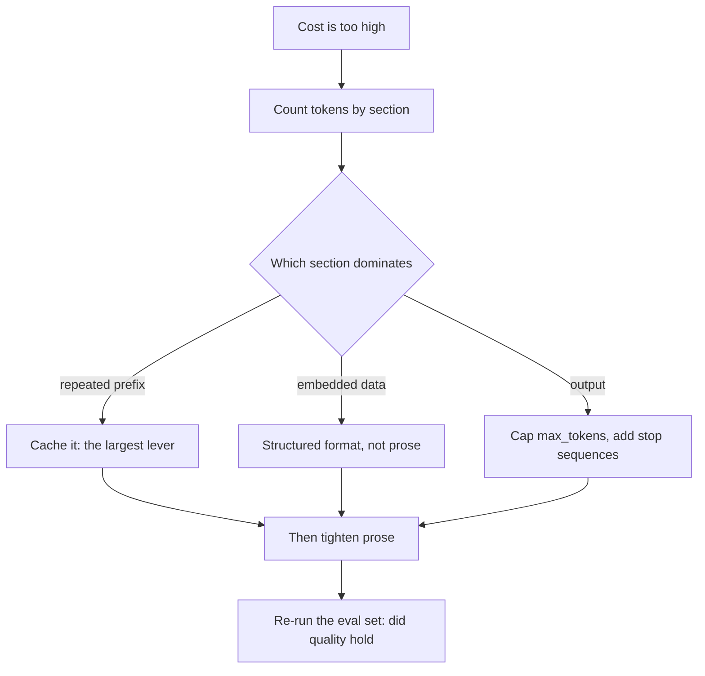
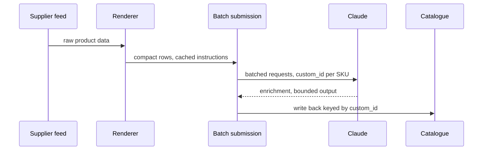

## What Problem Are We Solving?

A wholesale distributor enriches product listings — 140,000 SKUs, refreshed monthly — turning
supplier data into descriptions, attribute tags and search keywords.

The monthly bill is $34,000 and the team is asked to halve it. They begin where most teams begin:
rewriting prompts to be more concise. Two weeks of work removes about 340 tokens of hedging and
politeness from a 9,800-token request. The bill moves by 3%.

Meanwhile three things nobody looked at were doing the actual damage. The supplier catalogue was
being rendered into the prompt as prose — *"the first item is called Widget A, it costs 12 dollars
and it is currently in stock"* — where the same data as JSON is roughly a third of the tokens. The
7,100-token instruction block was re-sent uncached on all 140,000 calls. And `max_tokens` was set
to 8,192 for a task whose useful output is about 200 tokens, so occasional runaway generations
produced pages of elaboration nobody read, billed at five times the input rate.

Prompt tightening is the most visible lever and one of the weakest. The levers that matter are
structural: how data is represented, whether the repeated block is cached, and what bounds the
output.

And there's an ordering: caching a static system prompt is the single largest reduction available
in most systems, because it eliminates repeated processing of the largest, most-repeated block in
the request. Everything else is incremental trimming on top of that foundation.

> **🗣️ In plain English:** Rewording prompts feels productive and moves the bill a few percent. Caching the block you send every time, representing data compactly, and capping the output are where the money is.

## Meet the Moving Parts

| Lever | What it trims | Typical impact |
|---|---|---|
| **Cache the static prefix** | Repeated processing of the largest block | Largest single win |
| **Data representation** | Input tokens spent describing structure | Large on data-heavy prompts |
| **Prompt tightening** | Filler, hedging, repeated instructions | Small, but compounds on every call |
| **`max_tokens`** | Runaway generations | Bounds the worst case |
| **Stop sequences** | Generation past the useful part | Cuts the tail on every call |

Three things worth being precise about.

**Input and output tokens are not priced alike.** On `claude-opus-5`, input is $5/MTok and output
$25/MTok — a 5x difference. An output token saved is worth five input tokens saved, which is why
`max_tokens` and stop sequences punch above their apparent weight, and why chain-of-thought (2.2)
is the expensive prompting technique.

**Structured formats beat prose for data, twice over.** JSON or XML costs fewer tokens than the
same information described in sentences, and it's more reliably parsed at both ends. The saving
scales with how much data you embed — on a catalogue prompt it dominates everything else.

**Tightening has a floor and a risk.** Past a point, removing words removes clarity rather than
noise, and a prompt compressed into terseness starts producing worse output. The measurable
version is: cut, then re-run your eval set, and keep the cut only if quality holds.

Token optimisation and caching compound rather than compete: a tightened, well-formatted static
prefix is cheaper to send once *and* more cacheable on every call after.

> **💡 Tip:** Before optimising anything, count tokens by section — prefix, embedded data, output. The section that dominates is almost never the one being edited.

## How It Works, Step by Step

1. **Measure first**, with `messages.count_tokens`, split by section. Guesswork picks the wrong
   lever.
2. **Cache the static prefix.** Largest single reduction, and it's usually available immediately
   (2.4).
3. **Convert embedded data to a structured format** — JSON or a compact tabular form — rather than
   prose.
4. **Cap `max_tokens`** to slightly above the longest reasonable answer, not to the model's
   maximum.
5. **Add stop sequences** where the useful output has a clear terminator.
6. **Then tighten the prose**, and verify quality against an eval set rather than assuming.
7. **Batch anything not latency-bound** — 50% off, and it composes with everything above (CCAR-F
   4.5).
8. **Track cost per unit of work**, not per request. A cheaper request that needs a retry isn't
   cheaper.



## Minimal Working Implementation

Measure the levers instead of guessing at them. Save as `tokens.py` and run it — it counts the
same catalogue three ways and shows what the representation is worth.

```python
import json
import anthropic

client = anthropic.Anthropic()
MODEL = "claude-opus-5"
ITEMS = [{"sku": f"WID-{i:04d}", "name": f"Widget {i}", "price": 12 + i,
          "in_stock": i % 3 != 0, "category": "fasteners"}
         for i in range(1, 61)]

def prose(items: list[dict]) -> str:
    return " ".join(
        f"The item called {i['name']} has SKU {i['sku']}, it costs "
        f"{i['price']} dollars, it is "
        f"{'currently in stock' if i['in_stock'] else 'out of stock'}, "
        f"and it belongs to the {i['category']} category."
        for i in items)

def as_json(items: list[dict]) -> str:
    return json.dumps(items, separators=(",", ":"))

def as_tsv(items: list[dict]) -> str:
    head = "sku\tname\tprice\tin_stock\tcategory"
    rows = [f"{i['sku']}\t{i['name']}\t{i['price']}\t"
            f"{int(i['in_stock'])}\t{i['category']}" for i in items]
    return "\n".join([head, *rows])

def count(text: str) -> int:
    return client.messages.count_tokens(
        model=MODEL,
        messages=[{"role": "user", "content": text}]).input_tokens

baseline = count(prose(ITEMS))
for label, render in (("prose", prose), ("json", as_json),
                      ("tsv", as_tsv)):
    n = count(render(ITEMS))
    print(f"{label:6} {n:>6} tokens  ({n / baseline:.0%} of prose)")
```

Run it on your own data shape. The ordering is reliable — prose is the most expensive, compact
JSON well below it, and a tabular form below that when the fields are uniform — but the *size* of
the gap depends on your field names and value lengths, which is exactly why you measure rather
than assume.

## Production Implementation

Production puts the levers in order and keeps cost per unit of work visible.

```python
MAX_OUTPUT = 280           # measured p99 of useful answers, plus headroom
STOP = ["\n## END"]

def enrich_request(catalogue_rows: str, sku: str) -> dict:
    """Static instructions cached; data compact; output bounded on both
    ends - a cap for the worst case, a stop sequence for the common one."""
    return {
        "model": "claude-opus-5",
        "max_tokens": MAX_OUTPUT,
        "stop_sequences": STOP,
        "system": [{"type": "text", "text": ENRICHMENT_RULES,
                    "cache_control": {"type": "ephemeral"}}],
        "messages": [{"role": "user",
                      "content": f"{catalogue_rows}\n\nEnrich {sku}. "
                                 f"End with '## END'."}],
    }
```

Spend is attributed by section so the next optimisation targets the right one:

```python
import collections

spend = collections.Counter()
IN_RATE, OUT_RATE = 5.00 / 1e6, 25.00 / 1e6

def observe(usage) -> None:
    spend["cached_in"] += usage.cache_read_input_tokens
    spend["fresh_in"] += usage.input_tokens
    spend["out"] += usage.output_tokens

def report() -> list[str]:
    cost = {"cached_in": spend["cached_in"] * IN_RATE * 0.1,
            "fresh_in": spend["fresh_in"] * IN_RATE,
            "out": spend["out"] * OUT_RATE}
    total = sum(cost.values()) or 1.0
    return [f"{k:10} ${v:>9,.2f}  {v / total:>5.0%}"
            for k, v in sorted(cost.items(), key=lambda kv: -kv[1])]
    # ...
```

**What changed, and why:**

- **`max_tokens` is set from a measured p99, not from the model's ceiling.** A generous cap costs
  nothing until the day a malformed input triggers a runaway, and output is the expensive
  direction.
- **A stop sequence ends generation at the useful point.** The cap bounds the disaster; the stop
  sequence trims the ordinary tail on every single call, which is where the steady saving is.
- **Spend is attributed to cached input, fresh input and output.** Without that split, "the bill
  is too high" leads straight back to prompt tightening. With it, the dominant line is obvious.
- **Cached reads are costed at their real rate.** Reporting cached tokens at full price makes
  caching look ineffective and has talked more than one team out of it.

## In Production: Catalogue Enrichment at a Wholesale Distributor

140,000 SKUs refreshed monthly, run overnight, with no human waiting on any individual result.



**Starting point.** $34,000 a month. Section breakdown, once they measured it: 61% the repeated
instruction block, 27% the prose-rendered catalogue data, 12% output.

**In order of impact.** Caching the 7,100-token instruction block: about $17,900 a month saved on
its own, and it was a two-line change. Switching catalogue data from prose to compact rows cut
that section by roughly 62%. Capping `max_tokens` at 280 against a measured p99 of 210, plus a
stop sequence, cut output tokens by 44% — mostly by removing elaboration past the useful answer.
Prompt tightening, done last, contributed about 3%.

**The lever nobody had considered.** Nothing waits on this job; it runs overnight against a
morning deadline. Moving it to the Batches API took 50% off everything above. Final: $3,100 a
month, down from $34,000.

**What it cost in quality.** Nothing measurable — they held out 500 SKUs with human-rated
enrichments and scored before and after. That check is the reason the prompt tightening stopped
where it did: a further compression round scored measurably worse on attribute completeness, and
was reverted.

> **🌍 Real-world example:** The two weeks spent rewording prompts weren't wasted knowledge, but they were two weeks aimed at 3% while 61% sat untouched two lines away. The team's own post-mortem conclusion was the process fix, not the technical one: count tokens by section before choosing what to optimise. Every subsequent cost review at that company starts with the breakdown, and it has never once pointed at prompt wording first.

## Where This Applies — and Where It Doesn't

| Situation | Use this | Use instead |
|---|---|---|
| A large block repeats on every call | Cache it — the single largest lever | Rewording it |
| Structured data embedded in the prompt | JSON or a compact tabular form | Prose descriptions |
| Output length is unbounded | `max_tokens` from a measured p99 | The model's maximum |
| Output has a clear terminator | A stop sequence | Letting it run on |
| Nothing is waiting on the result | Batches API — 50% off everything | Real-time calls |
| The prompt is genuinely verbose | Tighten, then re-run the eval set | Tightening on faith |
| Cost is dominated by one call a day | — | Any of this; there's nothing to compound |
| Quality is already marginal | — | Compression; you'll trade away the margin |

Anti-patterns: optimising prompt wording before measuring which section dominates; leaving
`max_tokens` at the model ceiling; describing structured data in prose; reporting cached tokens at
full price; and compressing without an eval set to catch the quality it costs.

## Failure Modes Seen in the Wild

### 1. Optimising the visible section

**Symptom.** Weeks of prompt editing; the bill barely moves.
**Cause.** The edited section was a small share of spend.
**Fix.** Count tokens by section first. The dominant section is usually the repeated prefix.

### 2. The unbounded output

**Symptom.** Occasional requests costing many times the median.
**Cause.** `max_tokens` at the ceiling, so a malformed input produces pages.
**Fix.** Cap from a measured p99, and add a stop sequence for the ordinary case.

### 3. Prose-rendered data

**Symptom.** Input tokens far above what the underlying data seems to warrant.
**Cause.** Structured information described in sentences.
**Fix.** JSON or tabular. Cheaper to send and more reliably parsed at both ends.

### 4. Compression that cost quality

**Symptom.** Cost down, output subtly worse, noticed weeks later.
**Cause.** Tightening past the point where words were noise.
**Fix.** An eval set run on every compression round; revert what doesn't hold.

> **⚠️ Watch out:** Output tokens cost five times input on `claude-opus-5`, so the levers that bound generation are worth far more than their apparent size — and conversely, anything that adds output (visible reasoning, verbose formats, unbounded caps) costs five times what the same tokens would on the way in. Cost the two directions separately or you'll optimise the cheap side.

## Exam Lens & Key Takeaway

> **📝 Exam focus:** Know the levers and, crucially, their ordering. **Caching a static system prompt produces the largest single cost reduction**, because it eliminates repeated processing of the largest, most-repeated block — everything else is complementary, incremental trimming on top of that foundation, and a stem asking for the biggest win is asking for caching. On the input side: **tighten verbose prompt wording** (compounds on every call, but it's the small lever), and **use structured formats like JSON or XML rather than natural-language descriptions** for data-heavy content, which is both more token-efficient and more reliably parsed. On the output side, two named controls: **`max_tokens`** to cap generation and prevent runaway responses, and **stop sequences** to end generation as soon as the needed content is produced. Expect the point that **token optimisation and prompt caching compound rather than compete** — a tightened static prefix is cheaper to send once and more cacheable thereafter.

> **🔑 Key takeaway:** Count tokens by section before optimising anything, because the section being edited is rarely the one that dominates. Cache the repeated prefix first — it's the largest single lever — then represent embedded data as JSON or a table rather than prose, then bound the output with a measured `max_tokens` and a stop sequence, since output costs five times input. Tighten wording last, and only keep the cut if an eval set says quality held.
