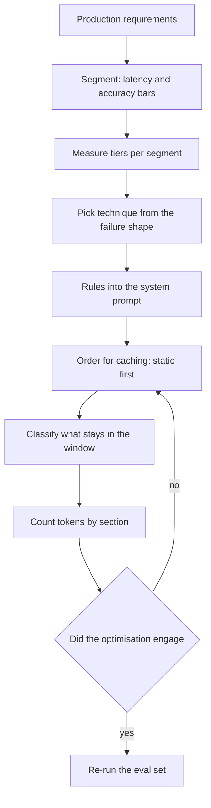
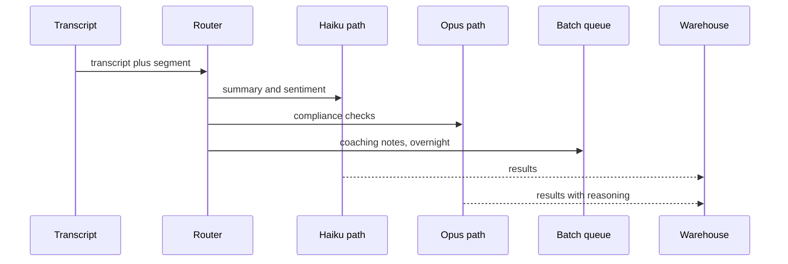

## What Problem Are We Solving?

Foundations taught you to write a prompt that works. This domain is about a prompt that works
140,000 times a day inside a cost envelope, a latency budget and a context window — which is a
different discipline, and mostly a different set of decisions.

The shift is that everything here is a **trade-off with a number attached**. A bigger model is
more capable and slower and dearer. Chain-of-thought is more accurate and spends output tokens at
five times the input rate. Few-shot examples improve reliability and lengthen the **prefix** —
the identical opening every request shares — which is fine, because the prefix caches, unlike the
reasoning. Keeping a reference document resident
improves grounding and consumes window. None of these has a right answer in the abstract; each
has a right answer for a stated volume, latency target and accuracy bar.

The second thing that changes is that the failures stop being visible. A prompt that produces a
bad answer announces itself. A prompt that silently isn't caching, a `max_tokens` left at the
model ceiling, a summarisation step quietly approximating a date, a system prompt with a session
ID interpolated into it — all of these produce correct-looking output and a bill nobody has
questioned.

So the through-line is: **measure the thing before you optimise it, and verify the optimisation
actually engaged.** Almost every expensive mistake in this domain is a team optimising the section
they could see, or believing a lever worked because it was configured.

> **🗣️ In plain English:** Foundations is "does this prompt work?" Professional is "what does it cost, how fast is it, does it fit — and did the optimisation I shipped actually do anything?"

## Meet the Moving Parts

| Question | Topic | The decision |
|---|---|---|
| Which model handles this request? | **2.1** Model selection | A routing policy per segment, not one pick |
| Which prompting technique? | **2.2** Techniques | Zero-shot, few-shot or chain-of-thought, by failure shape |
| Where do the rules live? | **2.3** System prompt design | The only channel a user cannot override |
| How do we stop paying for the same tokens? | **2.4** Caching | Static first, dynamic last — a prefix match |
| What stays in the window? | **2.5** Context management | Summarise, retrieve, modularise, cache |
| Where is the waste? | **2.6** Token optimisation | Measure by section; caching first, wording last |

Three relationships do most of the work.

**2.3 and 2.4 are the same block seen twice.** The system prompt is where authority lives *and* it
is the cache prefix. That's why a per-user identifier interpolated into it is both an
architectural smell and an expensive one — and why conditional sections that fragment it cost more
than they look like they should.

**2.2 and 2.6 disagree in a way you have to resolve deliberately.** Chain-of-thought buys accuracy
with output tokens; token optimisation wants output bounded. Both are right. The resolution is
per-path: reasoning on asynchronous, high-value work; bounded output on the synchronous hot path.

**2.1 and 2.4 interact and it's easy to miss.** Caches are scoped per model, so a cascade splits
its cache across tiers. A routing policy's saving is always smaller than the price table suggests,
and sometimes smaller than one model at lower effort.

> **💡 Tip:** For any optimisation here, name the field you'll check to prove it worked — `cache_read_input_tokens`, `usage.output_tokens`, tokens by section. If there isn't one, you're shipping a belief.

## How It Works, Step by Step

1. **Segment the traffic** and set a latency and accuracy bar per segment (2.1).
2. **Measure each tier on a labelled set** for each segment; take the cheapest that clears the bar.
3. **Try lower effort on one model** before building a cascade — it keeps a single cache
   namespace.
4. **Diagnose the prompting failure shape** — format, boundary, or an ordered rule — and pick the
   matching technique (2.2).
5. **Put anything that must survive user pressure in the system prompt** (2.3), and keep that block
   byte-stable.
6. **Order the prompt for caching**: stable tools, stable system, breakpoint, then everything that
   varies (2.4).
7. **Classify content for the window** — narrative summarises, specifics go to external memory
   verbatim (2.5).
8. **Count tokens by section, then optimise the dominant one**, and re-run an eval set to confirm
   quality held (2.6).



## Minimal Working Implementation

Every lever in this domain has a usage field that proves it engaged. Save as `verify.py` and run
it — it reports, from one real call, whether each one actually did.

```python
import anthropic

client = anthropic.Anthropic()
PREFIX = "You classify support tickets. " + "Category guidance. " * 300

def probe(use_cache: bool, cap: int) -> dict:
    block = {"type": "text", "text": PREFIX}
    if use_cache:
        block["cache_control"] = {"type": "ephemeral"}
    reply = client.messages.create(
        model="claude-opus-5", max_tokens=cap, system=[block],
        messages=[{"role": "user",
                   "content": "Ticket: card declined at checkout."}])
    u = reply.usage
    return {"fresh_in": u.input_tokens,
            "written": u.cache_creation_input_tokens,
            "read": u.cache_read_input_tokens,
            "out": u.output_tokens,
            "stop": reply.stop_reason}

first = probe(use_cache=True, cap=300)
second = probe(use_cache=True, cap=300)
capped = probe(use_cache=True, cap=16)

print(f"write call : written={first['written']:>5} read={first['read']:>5}")
print(f"read call  : written={second['written']:>5} "
      f"read={second['read']:>5}  <- must be non-zero")
hit = second["read"] / max(second["read"] + second["fresh_in"], 1)
print(f"hit rate   : {hit:.0%}")
print(f"output cap : out={capped['out']:>5} stop={capped['stop']}")
print(f"  (stop_reason 'max_tokens' means the cap is binding - "
      f"size it from a measured p99, not a guess)")
```

The second call's `read` column is the only evidence that caching engaged; the `stop_reason` on
the third is the only evidence your cap is doing something. Both are cheap to check and almost
never checked.

## Production Implementation

Production makes each lever's evidence a standing metric, and each alert names the topic.

```python
import collections

WINDOW = 1000
series = collections.defaultdict(lambda: collections.deque(maxlen=WINDOW))

def observe(usage, stop_reason: str, segment: str, model: str) -> None:
    cached = usage.cache_read_input_tokens
    series["hit_rate"].append(cached / max(cached + usage.input_tokens, 1))
    series["truncated"].append(stop_reason == "max_tokens")
    series["out_tokens"].append(usage.output_tokens)
    series[f"model:{segment}"].append(model)
```

Each threshold points at the decision to revisit, not at a knob:

```python
def signals() -> list[str]:
    def mean(key):
        d = series[key]
        return sum(d) / len(d) if d else 0.0

    out = []
    if series["hit_rate"] and mean("hit_rate") < 0.80:
        out.append(f"2.4 cache hit {mean('hit_rate'):.0%} - hunt the "
                   f"invalidator: timestamp, per-user id, unsorted dump, "
                   f"or a prefix under the model minimum")
    if mean("truncated") > 0.02:
        out.append("2.6 output truncating - max_tokens is under the real "
                   "p99, not over it")
    for key in [k for k in series if k.startswith("model:")]:
        if len(set(series[key])) > 1:
            out.append(f"2.1 {key} served by several models - caches are "
                       f"model-scoped, so this segment splits its cache")
    return out
    # ...
```

**What changed, and why:**

- **Hit rate is a monitored metric, not a design assumption.** Caching's total failure is
  indistinguishable from success except on the invoice, so it needs a floor and an alert.
- **A truncation rate is watched as well as a cap.** `max_tokens` too high wastes money; too low
  silently cuts answers mid-sentence. Only `stop_reason` distinguishes the two.
- **Model mix per segment is tracked.** A segment quietly served by two models is splitting its
  cache — the 2.1/2.4 interaction that makes cascade savings smaller than projected.
- **Every alert names the topic.** "Hunt the invalidator" sends someone to a decision; "increase
  the cache TTL" would be tuning around a symptom.

## In Production: Transcript Intelligence at a Contact Centre Platform

The platform processes 310,000 call transcripts a day for 600 customers — summaries, sentiment,
compliance checks and coaching notes. All six topics appear.



**How the six fit.** Summary and sentiment — 88% of volume, simple and latency-visible — run on
`claude-haiku-4-5`; compliance checks run on `claude-opus-5` because a missed disclosure is a
regulatory finding (**2.1**). Compliance uses chain-of-thought over a named checklist, because the
reasoning is the audit artefact; summarisation stays zero-shot (**2.2**). The compliance
perimeter — what constitutes advice, what must be disclosed — lives in the system prompt, where a
transcript's content cannot argue with it (**2.3**). The 5,800-token instruction block is cached
per path (**2.4**). Long calls are handled by extracting structured facts at ingest and
summarising only the narrative (**2.5**). And coaching notes, which nobody waits for, go through
the Batches API (**2.6**).

**Where the money went.** Starting point $186,000 a month. Caching: -41%. Routing the 88% to
Haiku: a further -34% of the remainder. Batching the coaching path: -50% on that path. Capping
`max_tokens` from 4,096 to a measured 340: -11% of output spend. Final: $41,000.

**The mistake that cost four months.** The compliance path had a per-customer clause injected into
its system prompt — "for {customer}, also check clause 7b". That gave every one of 600 customers a
unique prefix, so the block cached within a customer's traffic and never across it. Hit rate read
72% and looked healthy; the ceiling was simply much lower than anyone had computed. Moving the
clause into the message and keeping one global system block took it to 96%.

> **🌍 Real-world example:** That 72% is the detail worth keeping. It wasn't zero, so no alarm fired and nobody investigated — a hit rate that is merely *lower than it should be* is far harder to notice than one that's broken outright. What eventually surfaced it was the token-by-section breakdown from 2.6: fresh input tokens were four times what the architecture predicted, and the only explanation was a prefix that wasn't being shared.

## Where This Applies — and Where It Doesn't

| Situation | Use this | Use instead |
|---|---|---|
| Mixed-complexity traffic at volume | Segment and route (2.1) | One model for everything |
| Output unreliable in a specific way | Match technique to failure shape (2.2) | More instructions |
| A rule must survive user pressure | System prompt (2.3) | A user-turn instruction |
| A large block repeats every call | Cache it, static first (2.4) | Rewording it |
| History or documents exceed the window | Retrieve and modularise (2.5) | A bigger window |
| The bill is too high | Count by section, then act (2.6) | Tightening the prompt first |
| One-off or low-volume work | — | Most of this; it earns nothing at small n |

Anti-patterns spanning the domain: defaulting to the largest model; adding prose where an example
or a checklist belongs; safety rules outside the system prompt; interpolating identifiers into the
cache prefix; summarising precision-critical content; and shipping any optimisation without
checking the usage field that proves it engaged.

## Failure Modes Seen in the Wild

### 1. The optimisation that never engaged

**Symptom.** Configured, reviewed, shipped — and the bill doesn't move.
**Cause.** A silent invalidator, or a prefix under the model's minimum (2.4).
**Fix.** Check `cache_read_input_tokens`. Treat zero as an incident and a low ceiling as a bug.

### 2. Optimising the visible section

**Symptom.** Weeks of prompt rewording for a few percent.
**Cause.** The dominant section was never measured (2.6).
**Fix.** Count tokens by section first; it almost never points at wording.

### 3. Uniform model policy

**Symptom.** Either the bill is dominated by trivial work, or hard cases degrade.
**Cause.** One model chosen for the whole application (2.1).
**Fix.** Segment, measure per segment, route.

### 4. The approximation presented as fact

**Symptom.** A date or figure is confidently wrong by a small margin.
**Cause.** Summarisation compressed a precision-critical value (2.5).
**Fix.** Extract specifics verbatim at ingest; forbid the summariser from restating them.

> **⚠️ Watch out:** This domain's failures are quiet and they're mostly *degradations* rather than breaks — a cache hit rate of 72% when it should be 96%, a `max_tokens` cap that truncates 3% of answers, a summary that's right about most dates. Nothing alerts on "working, but worse than it should be", which is why every lever here needs a named field and a threshold rather than a code review.

## Exam Lens & Key Takeaway

> **📝 Exam focus:** 13% of the exam, ~8 questions, and the domain's recurring theme is **trade-offs** — faster/cheaper models against more capable ones, zero-shot against few-shot against chain-of-thought, and what stays in the context window. **Prompt caching is described as one of the most frequently tested concrete techniques here: static content first, dynamic content last — know it cold.** Beyond that: map signal phrases to model tiers ("latency-sensitive" → smaller, "complex multi-step reasoning" → larger, "high volume, low complexity" → smallest viable plus caching), and know the **cascade** as the mixed-traffic answer. Match prompting technique to task shape, remembering **chain-of-thought costs output tokens**. Know the **five system-prompt building blocks** — role, boundaries, output format, guardrails, tone — and that user messages cannot override it. Know the **four context strategies** with their trade-offs, that summarisation is the lossiest, and that caching changes cost rather than capacity. And that **caching a static system prompt is the single largest token-cost lever**.

> **🔑 Key takeaway:** Professional-level prompting is engineering against numbers: every choice here buys something and costs something, and the right answer depends on a stated volume, latency target and accuracy bar. Measure before optimising — count tokens by section, evaluate tiers per segment on labelled data — and then verify the optimisation actually engaged, because this domain's failures are silent degradations that produce correct-looking output and an invoice nobody has questioned.
