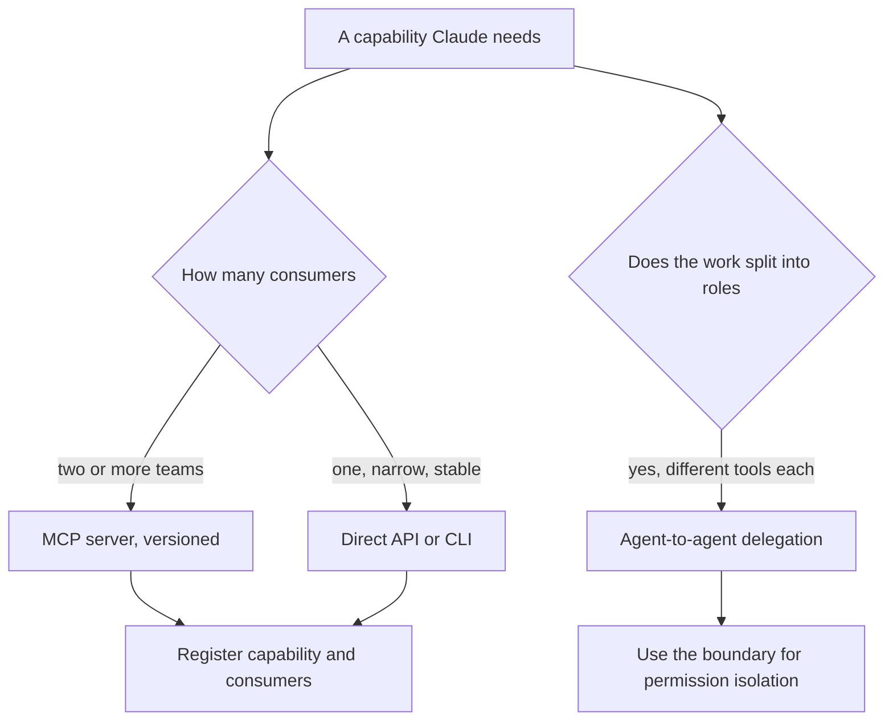
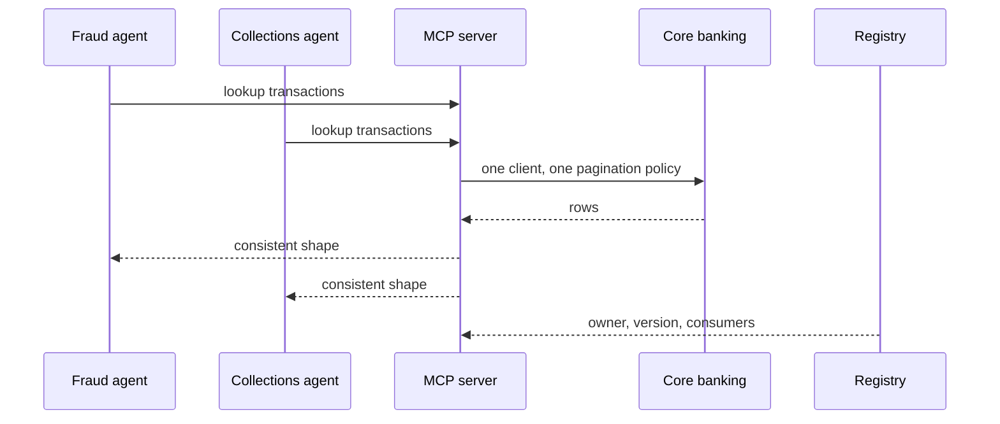

## What Problem Are We Solving?

A retail bank has six teams building Claude-powered tools: fraud review, collections, complaints
handling, mortgage pre-qualification, branch support and an internal analyst assistant. Five of
them need to look up a customer's transactions.

Five teams wrote five transaction-lookup integrations. They were written at different times
against different versions of the same internal API, and they diverged. Two of them paginate; one
silently truncates at 100 rows. Three interpret the `pending` flag differently. One caches for
five minutes and one doesn't cache at all.

Then the transaction schema changed — `amount` split into `amount` and `fee` — and the bank
discovered its integration inventory the hard way. Two agents started reporting transaction totals
that excluded fees. Nothing errored, because the field was still there and still a number. It took
nine days and a customer complaint to find.

That's not a Claude problem or an API problem. It's a **protocol** problem: the bank had no
standard way to expose a capability, so each consumer built its own, and there was no single place
where a fix could land once.

Protocol selection is the decision about how Claude reaches the rest of the world — and it's
mostly a question about **how many consumers a capability will have** and **who owns keeping it
correct**, not about which technology is more modern.

> **🗣️ In plain English:** If several teams need the same capability, build it once behind a standard interface. If one narrow pipeline needs it, wiring it directly is fine — and standing up a server would be ceremony.

## Meet the Moving Parts

| Protocol | What it is | Choose when | Key trade-off |
|---|---|---|---|
| **MCP** | A standard protocol exposing tools and resources to any MCP client | Team-shared tooling; many consumers of one capability | Upfront cost, pays off at scale |
| **API / CLI** | Your code calls Claude and external services directly | One narrow, tightly-controlled pipeline; one-off integrations | Full control, no built-in reuse — you own all the glue |
| **Agent-to-agent** | One Claude agent delegates to another | Work splits into roles; you want context or permission isolation | Isolation, at the cost of coordination |

Three things the table doesn't capture.

**MCP's payoff is a single place to fix things.** The reusability argument is usually made about
build effort, the smaller half. The larger half is that when the schema changes, one server
changes and every consumer picks it up — exactly what the bank didn't have.

**Agent-to-agent is chosen for isolation as often as for specialisation.** Separate agents mean
separate context windows — the text each request can hold — *and* separate tool permissions, which
is how least privilege (3.3), giving each part only the access its job needs, gets enforced
structurally rather than by policy.

**They compose.** A coordinator delegating to specialists (agent-to-agent), each reaching shared
capabilities through MCP servers, with one direct call for an odd legacy system, is a normal and
correct architecture. The question is per capability, not per system.

On the wire, the MCP connector needs both halves: `mcp_servers` declares the server, and a
matching `mcp_toolset` entry in `tools` makes it usable. Declaring only the server is a validation
error.

> **💡 Tip:** Count the consumers before choosing. One consumer and no roadmap for more: direct. Two or more, or one plus an obvious second: MCP, and the second consumer pays for it.

## How It Works, Step by Step

1. **Enumerate the capability, not the project.** "Look up transactions" is the unit, not "the
   fraud agent".
2. **Count current and likely consumers** of that capability across teams.
3. **Ask who owns correctness.** If the answer should be one team, that's an argument for a
   server, because ownership needs somewhere to live.
4. **One consumer, narrow and stable → direct API/CLI.** Standing up a server for it is ceremony.
5. **Several consumers, or a capability that will drift → MCP.** Build once, version it, let
   consumers pick up fixes.
6. **Work that decomposes into specialised roles with different tool needs → agent-to-agent**, and
   use the boundary for permission isolation.
7. **Wire MCP correctly**: `mcp_servers` plus a matching `mcp_toolset` in `tools`.
8. **Keep an inventory.** The bank's failure was not knowing what existed; a registry of
   capabilities and consumers is the artefact that prevents it.



## Minimal Working Implementation

The decision is mostly arithmetic about duplication, so do the arithmetic. Save as `protocol.py`
and run it — no API key needed.

```python
import dataclasses

@dataclasses.dataclass(frozen=True)
class Capability:
    name: str
    consumers: int          # teams needing it today
    likely_consumers: int   # plus credible near-term ones
    build_days: float       # to implement it once, directly
    server_days: float      # to implement and operate it as MCP
    drift_risk: str         # low | high - does the upstream change?

def recommend(c: Capability) -> str:
    total = c.consumers + c.likely_consumers
    duplicated = c.build_days * total
    if total <= 1 and c.drift_risk == "low":
        return f"direct ({c.build_days:.0f}d; a server would be ceremony)"
    if c.drift_risk == "high" and total > 1:
        return (f"MCP (one fix point; {total} consumers would otherwise "
                f"drift independently)")
    if duplicated > c.server_days:
        return (f"MCP ({duplicated:.0f}d duplicated vs {c.server_days:.0f}d "
                f"once)")
    return f"direct (duplication {duplicated:.0f}d < server {c.server_days:.0f}d)"

CAPABILITIES = [
    Capability("transaction_lookup", 5, 1, build_days=4, server_days=9,
               drift_risk="high"),
    Capability("pdf_statement_render", 1, 0, build_days=2, server_days=7,
               drift_risk="low"),
    Capability("credit_bureau_pull", 2, 2, build_days=6, server_days=11,
               drift_risk="high"),
]
for cap in CAPABILITIES:
    print(f"{cap.name:24} -> {recommend(cap)}")
```

The middle row is the one worth noticing: one consumer, stable upstream, and a direct integration
wins clearly. Reaching for MCP everywhere is the mirror-image mistake of the bank's, and it costs
real time.

## Production Implementation

Production keeps a registry, so the duplication question can be answered without an archaeology
project.

```python
import dataclasses

@dataclasses.dataclass(frozen=True)
class Registration:
    capability: str
    protocol: str            # mcp | direct | agent
    server: str | None
    version: str
    consumers: tuple[str, ...]
    owner: str

REGISTRY = (
    Registration("transaction_lookup", "mcp", "mcp://core/transactions",
                 "2.3.0", ("fraud", "collections", "complaints",
                           "mortgage", "branch"), "core-banking"),
    Registration("pdf_statement_render", "direct", None, "n/a",
                 ("statements",), "statements-team"),
)

def duplication_report() -> list[str]:
    """Two direct integrations of one capability is the bank's failure
    mode, caught before the schema changes rather than after."""
    by_capability: dict[str, list[Registration]] = {}
    for reg in REGISTRY:
        by_capability.setdefault(reg.capability, []).append(reg)
    return [f"{name}: {len(regs)} separate integrations - consolidate"
            for name, regs in by_capability.items() if len(regs) > 1]
```

The MCP connector needs both halves of the declaration, which is the shape teams get wrong first:

```python
def mcp_request(server_name: str, url: str, question: str) -> dict:
    """mcp_servers alone is a validation error - the matching
    mcp_toolset entry in `tools` is what makes the tools usable."""
    return {
        "model": "claude-opus-5", "max_tokens": 2000,
        "betas": ["mcp-client-2025-11-20"],
        "mcp_servers": [{"type": "url", "url": url, "name": server_name}],
        "tools": [{"type": "mcp_toolset", "mcp_server_name": server_name}],
        "messages": [{"role": "user", "content": question}],
    }
    # ...
```

**What changed, and why:**

- **A registry exists at all.** The bank's nine-day incident was an inventory failure, not a
  technical one. Knowing which capabilities have several integrations is what makes consolidation
  a decision rather than a discovery.
- **Registrations carry a version and an owner.** An MCP server without a named owner drifts back
  toward the thing it replaced, because nobody is accountable for its correctness.
- **Consumers are listed.** When the schema changes, the server team knows exactly who is
  affected and can verify rather than announce.
- **Both halves of the MCP declaration are in one function.** `mcp_servers` without a matching
  `mcp_toolset` is rejected, and the error is easy to misread as a connectivity problem.

## In Production: Tooling Across Six Agent Teams at a Retail Bank

Six agent teams, roughly 40 distinct capabilities, one core banking platform underneath.



**The incident.** The `amount`/`fee` split. Two of five integrations computed totals without fees;
the other three happened to use a different endpoint and were unaffected. Detection took nine days
and came from a customer, not a monitor, because every integration returned plausible numbers.

**The consolidation.** Transaction lookup became one MCP server owned by the core banking team.
Five integrations became one, with a single pagination policy and one interpretation of `pending`.
The five consuming teams deleted roughly 1,400 lines of near-duplicate client code between them.

**What it cost and returned.** The server took about nine working days to build and operate
properly — versioning, contract tests, an on-call owner — against roughly four days per team for
the direct versions, so it was already cheaper in build terms at three consumers. The real return
came at the next schema change six months later: one server updated, contract tests caught two
consumers making assumptions the new shape broke, and the whole thing landed in a day with no
production impact.

**What stayed direct, deliberately.** Statement PDF rendering has exactly one consumer and a
stable upstream. It remains a direct integration, and the registry records that as a decision with
a rationale rather than an oversight — which matters, because the next reviewer's instinct is to
"standardise" it.

**Where agent-to-agent came in.** Fraud review decomposed into a transaction-history agent and a
decisioning agent, chosen mainly for permission isolation: the history agent has read-only
transaction access and no ability to place a hold, while the decisioning agent can place a hold
and cannot read raw transactions. That separation is enforced by the boundary rather than by a
policy document.

> **🌍 Real-world example:** The consolidation's most useful side effect was the contract tests. Five bespoke integrations had no shared notion of correct, so "does this return the right total?" was five different questions with five different answers. One server with a contract test suite turned it into one question — and that suite, not the protocol itself, is what caught the two broken assumptions at the next schema change.

## Where This Applies — and Where It Doesn't

| Situation | Use this | Use instead |
|---|---|---|
| Multiple teams need the same capability | MCP server, versioned and owned | Each team wiring its own |
| A standardised, discoverable capability | MCP | Bespoke glue per consumer |
| One narrow custom pipeline | Direct API / CLI | An MCP server nobody else will use |
| Tight control over request and parsing | Direct API / CLI | An abstraction you'd fight |
| Work splits into specialised roles | Agent-to-agent delegation | One agent with every tool |
| Agents need different tool permissions | Agent-to-agent, for the isolation | Policy on a shared toolset |
| One consumer, stable upstream | — | MCP; the ceremony outweighs the benefit |
| A capability already duplicated | — | Adding a sixth copy |

Anti-patterns: standardising a one-off; five teams wrapping the same API independently; declaring
`mcp_servers` without the matching `mcp_toolset`; an MCP server with no owner or version; and
choosing agent-to-agent for work that doesn't decompose, adding coordination for nothing.

## Failure Modes Seen in the Wild

### 1. Silent divergence

**Symptom.** Different agents report different answers from the same underlying data.
**Cause.** Several independent integrations, written at different times against the same API.
**Fix.** One server, one owner, contract tests. Registry first, so you know they exist.

### 2. Ceremony for one consumer

**Symptom.** A server, a version, an on-call rota — for a capability with one caller.
**Cause.** "Standardise everything" applied without counting consumers.
**Fix.** Direct integration, recorded as a deliberate decision so it isn't "fixed" later.

### 3. The half-declared MCP connector

**Symptom.** MCP tools never appear; the error reads like a connection failure.
**Cause.** `mcp_servers` declared without a matching `mcp_toolset` in `tools`.
**Fix.** Both halves, with the server name matching exactly.

### 4. Agents that don't decompose

**Symptom.** Coordination overhead with no specialisation benefit.
**Cause.** Agent-to-agent chosen because the system "should" be multi-agent.
**Fix.** Use it where roles genuinely differ, especially where permissions should differ.

> **⚠️ Watch out:** The duplication cost of skipping MCP is invisible until an upstream change, and then it arrives all at once and silently — every divergent integration keeps returning plausible values. Count your consumers while the decision is cheap, because the bill for getting it wrong is paid in a schema migration you didn't schedule.

## Exam Lens & Key Takeaway

> **📝 Exam focus:** Map the scenario's phrasing to the protocol. **"Multiple teams need the same tool"** or **"standardised, discoverable capability"** → **MCP**, whose payoff is reusability and one place to maintain the integration. **"One narrow custom pipeline"**, "we just need to call the API directly", or a need for tight control over the request and response → **API / CLI**, where you own all the glue and get no automatic reuse. **"Delegation"**, **"specialised agents working together"**, or a need to isolate context windows or tool permissions → **agent-to-agent**. The architect-level point the exam rewards is the *reason* rather than the label: MCP prevents the same integration logic being duplicated and drifting out of sync across teams, and agent-to-agent boundaries are a natural place to enforce different tool access, which ties straight back to least privilege (3.3).

> **🔑 Key takeaway:** Protocol selection is a question about consumers and ownership, not technology. One consumer with a stable upstream is a direct integration and a server would be ceremony; two or more, or an upstream that will drift, is an MCP server built once with an owner, a version and contract tests. Agent-to-agent is for work that genuinely splits into roles — and its best property is that the boundary can carry different permissions.
