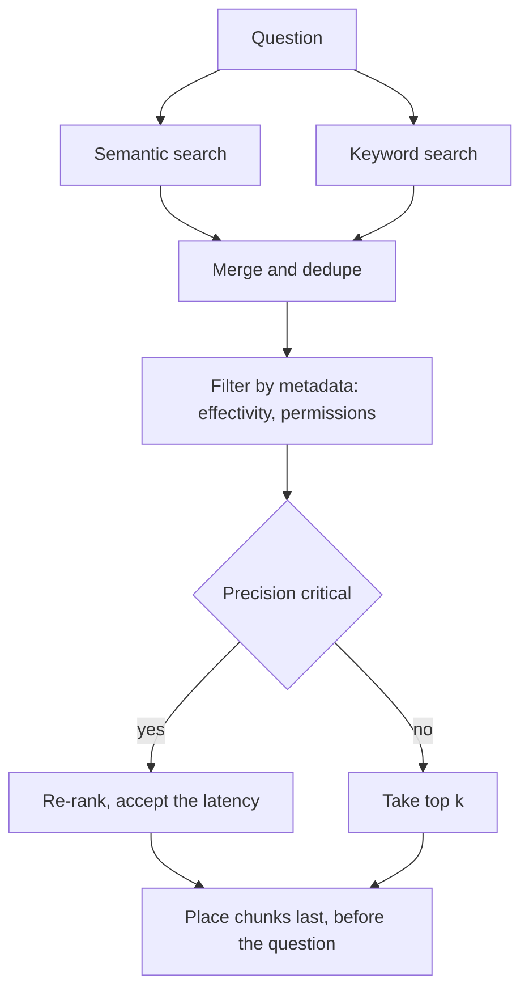
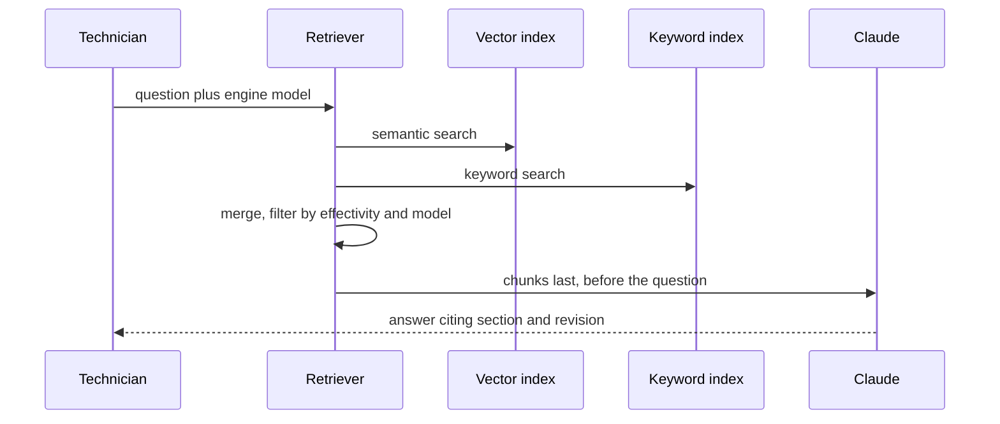

## What Problem Are We Solving?

An aerospace MRO shop maintains engines. Technicians ask an assistant questions against 40,000
pages of maintenance manuals, service bulletins and airworthiness directives — documents Claude
has never seen, some issued last week.

That gap is what **RAG** — retrieval-augmented generation — exists to close: retrieve the relevant
passages from your own source and put
them in the prompt, so the answer is grounded in current, private information rather than
recollection.

The shop's first build embedded everything and searched by similarity. It answered conceptual
questions well — "why would a carbon seal fail early in a hot-section environment?" — and failed
on the questions technicians actually ask most, which are about part numbers. Asked for the torque
spec for `NAS1149F0332P`, it returned passages about washers in general. The embedding captures
*meaning*, and a part number has no meaning to capture; it's a token that either matches or
doesn't.

They added keyword search and the part-number questions started working. Then a subtler failure
surfaced. A technician asked about a torque value and got the right number from the wrong
context — the manual gives a value for installation and a different one for reinstallation after
inspection, and fixed-size chunking had split the qualifying sentence from the number, so the
retrieved chunk contained a torque spec with no indication of which procedure it belonged to.

Nothing in that chain is a model failure. RAG is six stages of decisions, and "embed everything
and search" is a decision at one of them.

> **🗣️ In plain English:** RAG hands Claude the right pages before it answers. The engineering is all in *which* pages — and in not cutting a page in half through the middle of the thing that made it meaningful.

## Meet the Moving Parts

Six stages, each a deliberate decision:

1. **Ingestion** — which documents are in scope, and how often they refresh. Nightly for a manual,
   near-real-time for a bulletin feed.
2. **Chunking** — splitting documents into retrievable pieces. Size and overlap are tuning
   parameters, not defaults.
3. **Embedding** — each chunk to a vector. Model choice affects retrieval quality and storage
   cost.
4. **Indexing** — vectors plus metadata (source, date, effectivity, permissions), so you can
   filter, not only search.
5. **Retrieval** — finding the relevant chunks. Semantic, keyword, hybrid, re-ranking.
6. **Generation** — assembling chunks and question into a prompt: how many chunks, and where they
   sit.

| Chunking | How | Best for |
|---|---|---|
| Fixed-size | Every N tokens, regardless of content | Simple, uniform content |
| Semantic / paragraph | At natural boundaries | Narrative documents |
| Hierarchical | Large and small chunks, retrieve at both | Long documents needing context *and* precision |
| Sliding window | Overlapping, so an idea isn't cut mid-thought | Preventing loss at boundaries |

| Retrieval | How | Best for |
|---|---|---|
| Semantic (vector) | Chunks with similar *meaning* | Conceptual, "explain X" questions |
| Keyword (BM25) | Chunks containing the exact terms | Part numbers, codes, SKUs, error strings |
| Hybrid | Both, merged | Most production systems |
| Re-ranking | A second model rescores the results | Higher precision, at added latency |

The asymmetry underneath all of it: semantic search misses an exact identifier because an
embedding encodes meaning rather than tokens, and keyword search misses a conceptually related
passage that shares no vocabulary. Neither is a superset. That is why hybrid dominates production.

> **💡 Tip:** Before tuning retrieval, check whether the answer even survives chunking intact. A perfectly retrieved chunk that lost its qualifying clause is a retrieval success and an answer failure.

## How It Works, Step by Step

1. **Scope ingestion and set refresh cadence** per source; stale airworthiness data is worse than
   none.
2. **Chunk on structure, not length, where structure exists** — procedure boundaries, sections.
3. **Keep the qualifying context with the value.** Overlap, or hierarchical chunks carrying the
   parent heading.
4. **Index metadata alongside vectors** so you can filter by effectivity, model, date and
   permission before ranking.
5. **Run hybrid retrieval** — semantic and keyword — and merge.
6. **Re-rank when precision matters more than latency** (3.5).
7. **Place retrieved chunks near the end**, immediately before the question, where recall — the
   share of the relevant material the system actually finds — is strongest.
8. **Measure retrieval separately from generation.** If the right chunk wasn't retrieved, no
   prompt work fixes it.



## Minimal Working Implementation

The failure that costs most is upstream of retrieval, so make it visible. Save as `chunking.py`
and run it — no API key needed.

```python
import re

MANUAL = (
    "7.4.2 Installation. Torque the retaining nut to 35 Nm using a "
    "calibrated wrench. Do not exceed this value.\n"
    "7.4.3 Reinstallation after inspection. Torque the retaining nut "
    "to 28 Nm. The lower value accounts for thread wear."
)
QUESTION_TERMS = {"torque", "retaining", "nut"}

def fixed(text: str, size: int = 90) -> list[str]:
    return [text[i:i + size] for i in range(0, len(text), size)]

def sliding(text: str, size: int = 90, overlap: int = 45) -> list[str]:
    step = size - overlap
    return [text[i:i + size] for i in range(0, len(text), step)]

def by_section(text: str) -> list[str]:
    parts = re.split(r"(?=\d+\.\d+\.\d+ )", text)
    return [p.strip() for p in parts if p.strip()]

def answerable(chunk: str) -> bool:
    """A chunk answers only if it carries the value AND the procedure
    that qualifies it. A number with no procedure is worse than nothing."""
    has_value = bool(re.search(r"\d+ Nm", chunk))
    has_procedure = ("Installation" in chunk or "Reinstallation" in chunk)
    return has_value and has_procedure

for name, chunks in (("fixed-size", fixed(MANUAL)),
                     ("sliding window", sliding(MANUAL)),
                     ("by section", by_section(MANUAL))):
    good = [c for c in chunks if answerable(c)]
    hits = [c for c in chunks
            if QUESTION_TERMS & set(c.lower().split())]
    print(f"{name:16} {len(chunks)} chunks, {len(hits)} retrievable, "
          f"{len(good)} self-contained")
    for c in chunks:
        if re.search(r"\d+ Nm", c) and not answerable(c):
            print(f"    DANGEROUS: value with no procedure -> "
                  f"{c.strip()[:58]!r}")
```

Run it and the orphaned chunk comes from **sliding window** — the strategy whose whole purpose is
to stop ideas being cut at boundaries. Its overlap window happened to slice through the
"Reinstallation" heading, leaving `28 Nm` with no procedure attached. Fixed-size, at this size on
this text, happened to split cleanly.

That accident is the lesson. Both length-based strategies *can* orphan a value and neither can
promise not to; whether they do depends on where the boundary lands. Only section-based chunking
is structurally incapable of separating the value from the heading that qualifies it. An orphaned
chunk retrieves well — it contains every query term — and answering from it is wrong in a way the
generation step has no way to detect.

## Production Implementation

Production runs hybrid retrieval with metadata filtering, and measures retrieval on its own.

```python
import dataclasses

@dataclasses.dataclass(frozen=True)
class Chunk:
    chunk_id: str
    text: str
    source: str
    section: str          # the qualifier that makes a value meaningful
    effective_from: str
    engine_models: tuple[str, ...]

def hybrid(query: str, k: int = 12) -> list[tuple[Chunk, float]]:
    """Semantic finds meaning, keyword finds identifiers. Neither is a
    superset, so merge rather than choosing."""
    semantic = vector_search(query, k=k)
    keyword = bm25_search(query, k=k)
    merged: dict[str, tuple[Chunk, float]] = {}
    for rank, (chunk, score) in enumerate(semantic):
        merged[chunk.chunk_id] = (chunk, score)
    for rank, (chunk, score) in enumerate(keyword):
        prior = merged.get(chunk.chunk_id)
        merged[chunk.chunk_id] = (chunk, max(score, prior[1]) if prior
                                  else score)
    return sorted(merged.values(), key=lambda cs: -cs[1])[:k]
```

Metadata filtering runs before ranking, because relevance to the wrong engine is not relevance:

```python
def retrieve(query: str, engine_model: str, as_of: str) -> list[Chunk]:
    candidates = hybrid(query, k=24)
    eligible = [c for c, _ in candidates
                if engine_model in c.engine_models
                and c.effective_from <= as_of]
    return [c for c in eligible][:6]

def log_retrieval(query: str, returned: list[Chunk], used: bool) -> None:
    """Retrieval is measured separately: if the right chunk was never
    returned, no amount of prompt work will fix the answer."""
    # ... record query, chunk ids, sections, and whether a human
    # marked the answer correct - this is the retrieval quality metric
    # that 3.6 depends on
```

**What changed, and why:**

- **Hybrid, not a choice between the two.** The part-number failure and the conceptual-question
  failure are opposite, and each strategy is blind to the other's cases.
- **Metadata filters before ranking.** A chunk from a superseded revision, or for a different
  engine model, is not "less relevant" — it's wrong, and similarity scoring has no way to know.
- **`section` is a first-class field.** It carries the qualifier that makes a value meaningful, so
  it can be injected alongside the chunk even when chunking splits imperfectly.
- **Retrieval is logged and scored independently.** "Was the right chunk retrieved?" and "was the
  answer right?" are separate questions, and conflating them sends teams to tune prompts when the
  chunk was never in the context.

## In Production: Parts and Procedures Lookup at an Aerospace MRO

40,000 pages across manuals, service bulletins and airworthiness directives; 260 technicians;
answers that feed into work that has to be signed off.



**Semantic only.** Conceptual questions answered well; part-number lookups at 34% correct.
Technicians stopped using it for the thing they needed most and it was close to being abandoned.

**Hybrid.** Part-number lookups to 91%, conceptual questions unchanged. That took two weeks and
was the cheapest win in the project.

**The chunking fix.** Fixed-size 500-token chunks had been splitting procedures. On an audit of
200 torque-value questions, 11% returned a correct number attached to the wrong procedure — the
most dangerous class of error the system could produce, because the answer looks precise and
authoritative. Re-chunking on section boundaries with parent headings carried into each chunk took
that to under 1%.

**Metadata filtering.** Superseded revisions were being retrieved alongside current ones and
occasionally won on similarity. Filtering by `effective_from` and engine model before ranking
removed a class of error nobody had characterised as a retrieval problem — it had been logged as
"the assistant gave outdated information".

**Re-ranking.** Added for airworthiness directive queries only, where precision justifies about
600ms of extra latency, and deliberately not on general lookups where technicians are standing at
an engine (3.5).

> **🌍 Real-world example:** The 11% wrong-procedure rate is the one worth internalising, because every other metric looked healthy while it was happening. Retrieval precision was good, the model's answers were fluent and cited a real manual section, and user-reported errors were low — technicians mostly caught it, because they know that reinstallation torque differs. The system was relying on its users to detect its worst failure, and that only became visible when someone measured "did the retrieved chunk contain the qualifier?" rather than "did retrieval return relevant chunks?"

## Where This Applies — and Where It Doesn't

| Situation | Use this | Use instead |
|---|---|---|
| Answers must come from private or current data | RAG | Relying on training knowledge |
| Exact identifiers — SKUs, part numbers, error codes | Keyword or hybrid | Semantic alone |
| Conceptual, "explain why" questions | Semantic or hybrid | Keyword alone |
| Most production systems | Hybrid | Choosing one strategy |
| Precision matters more than a second of latency | Re-ranking | — |
| Values whose meaning depends on surrounding context | Structural chunking, with parent headings | Fixed-size splitting |
| Documents with versions or effectivity | Metadata filtering before ranking | Similarity alone |
| Small, fixed document set | — | Monolithic context (3.7) — RAG is overhead |

Anti-patterns: "embed everything and search"; fixed-size chunking on structured procedures;
semantic-only retrieval for identifier lookups; ranking without filtering by version or
permission; and measuring answer quality without measuring retrieval quality separately.

## Failure Modes Seen in the Wild

### 1. The identifier that has no meaning

**Symptom.** Exact codes, SKUs or part numbers return topically related but wrong passages.
**Cause.** Embeddings encode meaning; an identifier is a token, not a concept.
**Fix.** Add keyword search and merge — this is the canonical case for hybrid.

### 2. The orphaned value

**Symptom.** A correct number attached to the wrong procedure or condition.
**Cause.** Chunking split the qualifying clause from the value.
**Fix.** Chunk on structure, carry parent headings into chunks, and test that a chunk is
self-contained.

### 3. Confidently superseded

**Symptom.** Accurate answers from a revision that no longer applies.
**Cause.** Similarity ranking has no concept of validity; the old chunk simply matched better.
**Fix.** Filter by effectivity, version and permission *before* ranking.

### 4. Tuning generation for a retrieval failure

**Symptom.** Prompt iteration with no improvement.
**Cause.** The needed chunk was never retrieved, so nothing in the prompt could help.
**Fix.** Measure retrieval quality independently; fix the stage that actually failed.

> **⚠️ Watch out:** A chunk that retrieves well and answers wrongly is the most dangerous output a RAG system produces. It contains every query term, cites a real source, and reads authoritatively — and the generation step has no way to know its qualifying context was cut away upstream. Test whether chunks are self-contained, not just whether retrieval is relevant.

## Exam Lens & Key Takeaway

> **📝 Exam focus:** Know the **six-stage pipeline in order — ingestion, chunking, embedding, indexing, retrieval, generation** — and expect to place a described decision at the right stage. The highest-yield item is **retrieval failure diagnosis**: a stem where exact identifiers (a SKU, an error code, a product ID) fail is pointing at **semantic search missing exact tokens**, and the fix is **hybrid** (keyword/BM25 alongside semantic), because semantic captures meaning while keyword captures exact terms and neither is a superset — which is why hybrid dominates production. Know the four **chunking strategies** and their fits (fixed-size for uniform content, semantic/paragraph for narrative, hierarchical when you need context *and* precision, sliding window to avoid cutting an idea mid-thought), and the four **retrieval strategies**, including that **re-ranking buys accuracy at the cost of latency**. This is called out as especially high-yield and appearing in the official sample questions.

> **🔑 Key takeaway:** RAG is six stages of decisions, and treating it as "embed everything and search" fails at the first identifier lookup. Run hybrid retrieval because semantic and keyword are blind to opposite cases; filter by version and permission before ranking, since a superseded chunk isn't less relevant but simply wrong; chunk on structure so a value keeps the clause that qualifies it; and measure retrieval separately from generation, because a chunk that was never retrieved cannot be rescued by any prompt.
