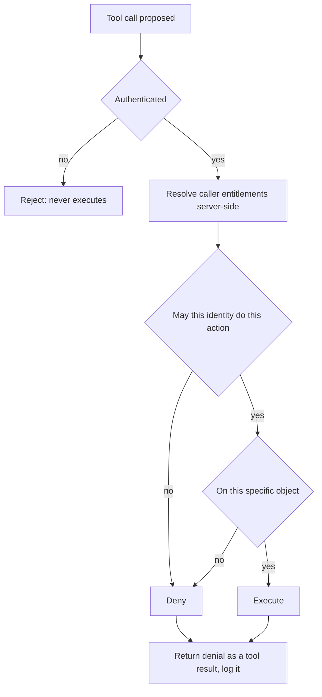
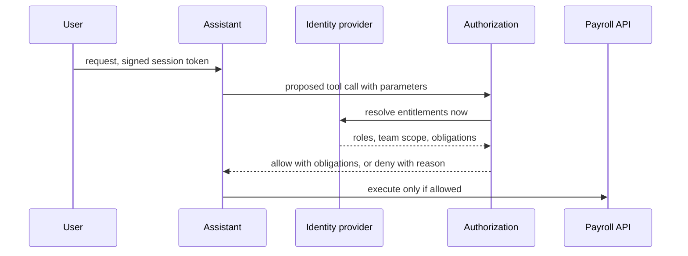

## What Problem Are We Solving?

An HR platform runs a payroll assistant. An employee asks about their payslip; a manager asks
about their team's overtime; a payroll administrator runs corrections. One agent, three very
different sets of things the caller is entitled to see.

Authentication was solid. Every request carried a signed session token, validated on arrival, and
the agent knew exactly who was asking.

Authorization was checked once, at the start of the session, and then the conversation proceeded.

A manager opened a session, asked about their own team, then — five turns later, quite
ordinarily — asked "and how does that compare to the other regional teams?" The agent called
`get_team_overtime` for teams the manager had no entitlement to, because the tool was available
and the session had been authorised at the start. Nothing was spoofed; the identity was correct
throughout. The *action* was not permitted, and nothing checked the action.

The audit log recorded all of it, faithfully, which is what audit logs do. It told the
investigation exactly what had been exposed and to whom. It prevented nothing.

Two questions were being conflated. **Authentication** answers *who are you* — identity, via a
login, API key or token. **Authorization** answers *what may you do* — whether a known identity
may perform a specific action. You can be perfectly authenticated and entirely unauthorised, and
in an agentic system that gap opens turn by turn, as the plan drifts into requests nobody
scoped.

> **🗣️ In plain English:** Authentication is showing your badge at the door. Authorization is the badge only opening the rooms it's programmed for — and it has to be checked at every door, not once in the lobby.

## Meet the Moving Parts

| Concept | What it means | Where it applies |
|---|---|---|
| **Authentication** | Verifying *who* — login, API key, signed token | Every tool call, before it runs |
| **Authorization** | Verifying *what this identity may do* | Before **every action**, not once per session |
| **Least privilege** | Only the minimum access needed | The policy behind authorization (3.3) |
| **Audit logging** | Recording who did what, and when | Compliance and forensics — detective, not preventive |

Three points that carry the topic.

**Re-check on every action, not at session start.** This is the architectural mistake. An agent's
plan evolves over many turns; what was in scope at turn one says nothing about turn six. Session-
time authorization is a snapshot used as a standing permit.

**Authorization needs the parameters, not just the tool name.** "May this manager call
`get_team_overtime`?" is the wrong question. "May this manager call it *for team 47*?" is the
right one — and it's the one the payroll incident failed. Object-level checks are where agentic
systems leak.

**Least privilege and authorization are the same idea at two layers.** 3.3 removes the tool at
design time; authorization enforces at call time. You want both, because a manifest mistake
shouldn't be sufficient on its own.

Audit logging complements all of it and substitutes for none of it. A system with excellent logs
and no enforcement produces a beautifully detailed record of an incident it did nothing to stop.

> **💡 Tip:** Write the authorization question with the object in it. If your check doesn't name *which* record, you have a role check pretending to be an authorization check.

## How It Works, Step by Step

1. **Authenticate the caller** and carry the verified identity through the whole turn — never
   re-derive it from model output.
2. **Authenticate the tool call itself.** An unauthenticated call never executes, full stop.
3. **Authorize per action, per object.** Tool name plus the actual parameters, against the
   caller's entitlements.
4. **Re-check every turn.** The plan at turn six was not scoped at turn one.
5. **Resolve entitlements server-side.** The agent may propose `team_id=47`; only your service
   decides whether this caller may have it.
6. **Deny with a tool result, not an exception.** The agent needs to know it was refused so it can
   respond sensibly rather than retry (CCAR-F 5.3).
7. **Log the decision, allow or deny**, with identity, action, object and reason.
8. **Alert on deny patterns.** Repeated denials on one object are either a broken workflow or
   someone probing.



## Minimal Working Implementation

The difference between a session check and a per-action check is easy to demonstrate. Save as
`authz.py` and run it — no API key needed.

```python
import dataclasses

@dataclasses.dataclass(frozen=True)
class Caller:
    user_id: str
    role: str
    own_teams: frozenset

ENTITLEMENTS = {
    "employee": {"get_payslip"},
    "manager": {"get_payslip", "get_team_overtime"},
    "payroll_admin": {"get_payslip", "get_team_overtime",
                      "post_correction"},
}

def session_check(caller: Caller, tool: str) -> bool:
    """The mistake: authorised once, by role, with no object."""
    return tool in ENTITLEMENTS[caller.role]

def action_check(caller: Caller, tool: str, params: dict) -> tuple[bool, str]:
    """Role AND object, evaluated on every call."""
    if tool not in ENTITLEMENTS[caller.role]:
        return False, f"role {caller.role} may not call {tool}"
    if tool == "get_team_overtime":
        team = params.get("team_id")
        if team not in caller.own_teams:
            return False, f"team {team} is not in the caller's scope"
    if tool == "get_payslip":
        if params.get("user_id") != caller.user_id:
            return False, "payslips are readable only by their owner"
    return True, "permitted"

MANAGER = Caller("u-8812", "manager", frozenset({"team-12"}))
CALLS = [("get_team_overtime", {"team_id": "team-12"}),
         ("get_team_overtime", {"team_id": "team-47"}),
         ("get_payslip", {"user_id": "u-9001"}),
         ("post_correction", {"run_id": "r-33"})]

for tool, params in CALLS:
    ok, why = action_check(MANAGER, tool, params)
    print(f"{tool:20} {str(params):32} "
          f"session={'ALLOW' if session_check(MANAGER, tool) else 'DENY ':5} "
          f"action={'ALLOW' if ok else 'DENY'}  ({why})")
```

Rows two and three are the whole point: the session check allows both, because the manager's role
does include those tools. Only the action check, which sees the parameters, catches a manager
reading another region's overtime and someone else's payslip.

## Production Implementation

Production resolves entitlements server-side and returns denials the agent can reason about.

```python
import dataclasses
import logging

log = logging.getLogger("authz")

@dataclasses.dataclass(frozen=True)
class Decision:
    allowed: bool
    reason: str
    obligations: tuple[str, ...] = ()   # e.g. redact_salary_bands

def authorize(identity: str, tool: str, params: dict,
              turn: int) -> Decision:
    """Entitlements are resolved from the identity provider on every
    call. Never from anything the model produced, and never cached
    across turns - a session-length cache is the original bug."""
    entitlements = fetch_entitlements(identity)      # authoritative
    if tool not in entitlements.tools:
        return Decision(False, f"{tool} not granted to {identity}")
    scope_error = check_object_scope(entitlements, tool, params)
    if scope_error:
        return Decision(False, scope_error)
    return Decision(True, "permitted", entitlements.obligations_for(tool))
```

A denial comes back as a tool result, so the agent can explain rather than retry:

```python
def run_tool(identity: str, block, turn: int) -> dict:
    decision = authorize(identity, block.name, block.input, turn)
    log.info("authz", extra={"identity": identity, "tool": block.name,
                             "object": block.input, "turn": turn,
                             "allowed": decision.allowed,
                             "reason": decision.reason})
    if not decision.allowed:
        return {"type": "tool_result", "tool_use_id": block.id,
                "is_error": True,
                "content": f"Not permitted: {decision.reason}. Do not "
                           f"retry; tell the user what they can access."}
    return {"type": "tool_result", "tool_use_id": block.id,
            "content": execute(block.name, block.input, decision)}
    # ...
```

**What changed, and why:**

- **Entitlements are fetched per call, never cached for the session.** A permission revoked at
  10:02 must take effect at 10:03, and a plan that drifts at turn six must be evaluated at turn
  six.
- **The check sees the parameters.** Object-level scope is where agentic systems leak, because
  role-level checks pass for exactly the calls that matter.
- **Identity comes from the authenticated session, never from the model.** If `user_id` can be set
  by anything the model produced, the authorization check is checking the attacker's input.
- **A denial is a tool result with `is_error`, plus an instruction not to retry.** A raised
  exception either kills the turn or, worse, gets caught and turned into a plausible answer — and
  an agent that doesn't know it was refused will try a different phrasing.

## In Production: A Payroll Assistant at an HR Platform

2,400 customer organisations, roughly 60,000 assistant sessions a month, three role types and
data that is regulated in every jurisdiction it touches.



**The incident.** A manager read overtime data for four teams outside their scope across a single
session. Authenticated correctly throughout; authorised once, at session start, by role. Detected
eleven days later during a routine access review — by reading the audit log, which had recorded
every access perfectly and stopped none of them.

**The fix.** Per-call, per-object authorization with entitlements resolved from the identity
provider on every call. Latency cost: about 12ms per tool call against a 40ms entitlement cache
with a 30-second TTL, which the team judged short enough that a revocation takes effect within
half a minute and long enough to matter under load.

**What it caught in the first month.** 0.4% of tool calls denied. About three-quarters were
benign — an agent proposing a lookup slightly outside scope and then explaining the limit to the
user, which is the system working. The remaining quarter clustered on two customer organisations
whose role mappings were misconfigured, exposing a data problem that had existed for a year and
produced no symptom because nothing had ever checked.

**Why the denial format mattered.** The first implementation raised an exception on denial, and
the agent's turn failed with an opaque error. Users retried, and about a third of the time a
reworded question produced a differently-scoped call that succeeded — so denials looked
intermittent. Returning the denial as a `tool_result` with an explicit "do not retry" instruction
made the behaviour deterministic and let the agent tell the user what they *could* see.

> **🌍 Real-world example:** The access review that found this was looking for something else. Nobody suspected a problem, because the assistant had never errored and no user had complained — the manager in question had no idea they were seeing data outside their entitlement, since the assistant presented it as an ordinary answer. That's the shape of an authorization gap in an agentic system: it doesn't look like an attack, it looks like a helpful response to a reasonable follow-up question.

## Where This Applies — and Where It Doesn't

| Situation | Use this | Use instead |
|---|---|---|
| Any tool call in an agentic system | Authenticate, then authorize per action | Session-start authorization |
| Multi-turn conversations | Re-check every turn | Trusting the session's initial scope |
| A tool that takes an object id | Check the identity *and* the object | A role check alone |
| Permissions may change mid-session | Resolve entitlements per call, short TTL | Caching for the session |
| An agent proposes an identity or scope | Take identity from the session only | Anything the model produced |
| Compliance requires a record | Audit logging, alongside enforcement | Audit logging instead of enforcement |
| A capability nothing legitimate needs | Remove the tool (3.3) | Authorizing it carefully |

Anti-patterns: authorizing once per session; role checks with no object scope; deriving the
caller's identity from model output; raising exceptions on denial so the agent retries blindly;
and treating audit logs as a preventive control.

## Failure Modes Seen in the Wild

### 1. The standing permit

**Symptom.** A correctly identified user accesses data outside their entitlement, mid-conversation.
**Cause.** Authorization evaluated at session start and treated as valid for the session.
**Fix.** Re-check on every action; resolve entitlements per call.

### 2. The role check wearing a badge

**Symptom.** The check passes for exactly the calls that matter.
**Cause.** It tests whether the role may call the tool, not whether this caller may touch this
object.
**Fix.** Put the parameters in the check. Object-level scope, every time.

### 3. Identity from the model

**Symptom.** A crafted message produces access as another user.
**Cause.** `user_id` was read from tool input rather than the authenticated session.
**Fix.** Identity flows from the session only; model output is a proposal, never a credential.

### 4. Logs instead of controls

**Symptom.** A perfect forensic record of an exposure nothing prevented.
**Cause.** Audit logging treated as the control rather than as detection.
**Fix.** Enforce first; log the decision — allow *and* deny — for compliance on top.

> **⚠️ Watch out:** Audit logging is reactive by construction. It tells you what happened; it stops nothing. A system with excellent audit logs and no least-privilege or authorization enforcement produces a beautifully detailed record of a security incident it did nothing to prevent — and the completeness of that record is often what makes teams believe they were in control.

## Exam Lens & Key Takeaway

> **📝 Exam focus:** Keep the two cleanly separated: **authentication answers "who are you?"** (login, API key, token) and **authorization answers "what are you allowed to do?"** — you can be authenticated and still unauthorised. The named architectural mistake is **authenticating once at session start and implicitly trusting every subsequent tool call as authorised**; correct architecture **re-checks authorization on every action**, because an agent's plan drifts over turns into requests nobody intended. Two supporting concepts complete the set: **least privilege** is the *policy* behind authorization — the minimum an identity should be permitted — and **audit logging** is a **detective control, essential for compliance and forensics but fundamentally reactive**, recording what happened without preventing it. Expect a stem where authentication is correct, a misconfiguration leaves an action over-permitted, and the audit log dutifully records the exposure: the fix is enforcing authorization on that action, not improving the logging.

> **🔑 Key takeaway:** Authentication establishes identity; authorization decides each action, and in an agentic system it must be checked on every call rather than once per session, because the plan at turn six was never scoped at turn one. Put the parameters in the check — a role check with no object is where these systems leak — take the caller's identity from the authenticated session and never from model output, and treat audit logs as the record of enforcement rather than a replacement for it.
